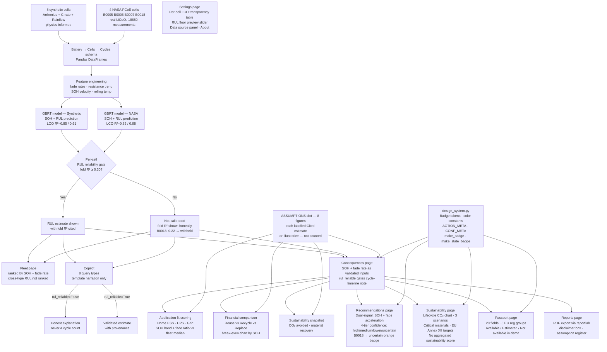

# Battery Intelligence Platform

A battery health monitoring and prediction platform built with scikit-learn and Streamlit. It tracks State of Health (SOH) and predicts Remaining Useful Life (RUL) for lithium-ion cells — validated on real NASA PCoE battery aging data — and includes an AI Copilot that explains every number it shows in plain language without inventing anything outside the validated model outputs.

Built as a portfolio project targeting the battery analytics / BMS tooling space. Not a production BMS — a demonstration of the full stack from raw cycle data to explainable, reliability-gated predictions, honest regulatory framing, and auditable sustainability figures.

**[Live demo →](https://battery-intelligence-platform-sszs92zbkfvfcda3ajtlk7.streamlit.app)**

---

## Phase structure

| Phase | What it does | Status |
|---|---|---|
| **Phase 1 — Core Loop** | SOH/RUL model, leave-cell-out validation, per-cell reliability gating, Overview/Health/Insights pages | Done |
| **Phase 2 — Fleet** | Multi-cell fleet ranking by SOH + fade rate, honest cross-type RUL copy, roadmap to unified model | Done |
| **Phase 3 — Copilot** | Template-based AI narration grounded strictly on bundle outputs — no LLM inference, no invented numbers | Done |
| **Phase 4 — Consequences** | Second-life economics: application fit scoring (Home ESS / UPS / Grid), financial comparison (reuse vs recycle vs replace) with sourced adjustable assumptions, break-even chart, CO₂ and material recovery snapshot. Every financial and environmental figure carries a badge at render time — "Cited estimate" (with source) or "Illustrative — not sourced" (engineering judgment only) — visually distinct from the green "Validated model output" badge on SOH/RUL outputs. | Done |
| **Phase 5 — Passport + Reports** | Battery Passport page structured around EU Battery Regulation (EU) 2023/1542 data fields: 20 fields across 5 groups (Identity, SOH, Lifecycle History, Carbon Footprint, Compliance Status), each tagged Available / Estimated / Not available in demo. Reports page exports a PDF (reportlab) with a disclaimer box up front, color-coded field tables, second-life recommendation if applicable, and the full assumption register. | Done |
| **Phase 6 — Recommendations** | Single hero-card decision (Continue / Inspect / Second-Life / Recycle) driven by dual-signal logic: SOH thresholds + fade acceleration ratio (fade_30cy / fade_50cy > 2.0). Four-tier auditable confidence system (high / medium / lower / uncertain) with named reasons for each downgrade. B0018 consistently shows "uncertain" orange badge (3 compounding factors); B0005/B0006/B0007 show higher confidence — the difference is visible and traceable to specific named flags. | Done |
| **Phase 7 — Sustainability** | Lifecycle carbon chart (three scenarios: recycle / reuse / new cell) with adjustable grid intensity and second-life extension sliders. Critical materials tracker (Co, Li, graphite per cell — scaled to actual cell Ah). EU Battery Regulation 2023/1542 Annex XII recycled-content targets with per-material industry estimates (Co: ~5–10%, Li: ~1–3%, Ni: N/A for LiCoO₂). EU Green Deal three-state alignment. No aggregated sustainability score — individual labeled figures only. | Done |
| **Phase 8 — Design System** | `src/design_system.py`: single source of truth for badge rendering, color tokens, three-state availability badges, section header HTML, and Recommendations metadata (ACTION_META, CONF_META). Removed three duplicate local `_badge()` definitions. Fixed badge label inconsistency ("Estimate" → "Cited estimate" in Consequences page). Documented Plotly 6 `legend`/`title` restriction in `base_layout()`. | Done |
| **Phase 9 — Settings** | Per-cell LCO fold R² transparency table for both model bundles. Interactive RUL reliability floor preview (drag slider to see which cells flip — active floor at 0.30 requires a code change). Data source panel explaining the two-model architecture. Phase status table and stack summary. | Done |

**Genuinely deferred (not scope-crept out, gated on real preconditions):**
- **Option B — unified fleet RUL model**: requires 8+ real cells with diverse operating conditions. Current 4 NASA cells were all tested at identical lab conditions, making a combined resistance signal meaningless. Gate documented in Fleet roadmap expander.
- **Deeper lifecycle carbon**: full audit (mining → manufacture → transport → use → EOL) requires real supply-chain data; use-phase CO₂ is illustrative and slider-adjustable. The gap is labeled, not papered over.
- **Actual regulatory submission**: a real EU 2023/1542 Battery Passport requires manufacturer-submitted identity records, third-party accredited carbon audit, repair/refurbishment history tracking, and notified-body sign-off. This platform demonstrates the data structure and honest field coverage — not a compliance claim.

---

## The debugging story (the part that's actually interesting)

**Data leakage, caught.** The first SOH model reported R²=0.96. That number came from a row-level train/test split on a concatenated multi-cell dataset. Because each cell contributes ~1000 rows in chronological order, "test" rows were just the tail end of cells the model had already seen. Leave-cell-out (LCO) cross-validation — train on N-1 cells, test on the held-out cell entirely — gives the honest number: R²=0.85 for synthetic, 0.83 for NASA. Both are real and defensible; the 0.96 was not.

**Dataset-average vs per-cell reliability gate.** The first implementation of the RUL reliability gate computed one boolean per dataset (NASA vs synthetic). B0018 inherited `rul_reliable=True` from the NASA group average (dataset LCO R²=0.68 > floor 0.30) despite its own fold R²=0.22. The fix: compute `per_cell_rul_reliable = {cell_id: fold_r2 >= floor}` as a dict keyed by cell ID, and look up by cell every time RUL is displayed anywhere in the UI. B0018 now shows "not calibrated" consistently across Overview, Fleet, Copilot, and Recommendations.

**Why two separate models exist.** The first attempt trained one GBRT model on all 12 cells (8 synthetic + 4 NASA). Combined R²=−0.49. The problem: synthetic cells have internal resistance in the 0.15–0.40 Ω range (a modelled bulk resistance), while NASA cells have Re (electrolyte resistance from EIS impedance spectroscopy) in the 0.04–0.07 Ω range. Same feature name, physically incompatible scales. The fix is two separate models, each trained and validated on its own data source. The Fleet page ranks by SOH (scale-invariant) rather than RUL (model-dependent) for exactly this reason.

**Assumption transparency audit, Phase 4.** The Consequences page is the first part of the platform that shows financial and environmental figures that are *not* model outputs — they're literature estimates and engineering judgment. The design intent was that every such figure should carry a visible badge at render time, distinct from the green badge on validated outputs. Two rounds of audit caught things the first pass missed:

- *The repack cost deduction was hidden.* The "Reuse" option card showed a "Cited estimate" badge for the $/kWh revenue figure, but `repack_cost` — marked "Illustrative — not sourced" — was deducted from that gross value without its badge appearing on the card. A reader saw one badge on a number produced by two assumptions with different provenance. Fix: the card now shows `after −$10/cell repack [Illustrative — not sourced]` below the main figure.

- *The CO₂ recycling credit had no badge.* `sustainability_snapshot()` computes `co2_recycling_credit = co2_per_cell × 0.15`, where the 15% factor comes from Dunn et al. (2015) and is hardcoded — no slider, no ASSUMPTIONS entry, no badge at render time. The inline text said "per Dunn et al. 2015" but that's prose, not a badge. Fix: added a "Cited estimate" badge inline and explicitly noted "hardcoded, no slider."

- *A datasheet spec got the wrong badge.* The nominal cell capacity (2.7 Wh for NASA cells) fed directly into the Wh-based financial calculations and was initially labelled with `BADGE_VALIDATED` — the green badge — on the reasoning that it came from the NASA PCoE datasheet. That's wrong. "Validated" in this platform means leave-cell-out tested by the pipeline. A datasheet spec is a different kind of trustworthy: authoritative, but not pipeline-validated. Using the same badge for both blurs the one distinction the whole transparency layer was built to protect. Fix: dropped the badge, kept the source citation in plain text.

**Silent zero from a wrong column name, Phase 5.** The Consequences page read fade rate as `latest.get("fade_30_mah_cy", 0.0)` — but the actual dataframe column is `fade_rate_30cy`. The `.get()` default meant the field always returned 0.0 without raising any error. The Consequences page appeared to work (numbers showed up, charts rendered), but every fade-rate display and application-fit score was computed against a silent zero instead of the real value. This looked like a data problem until building Phase 5's Passport module forced a careful read of the actual column names. Fix: one-line correction in the Consequences page, correct name used from the start in Passport.

**Insights metric tiles truncating long strings.** The "MODEL PERFORMANCE — MULTI-CELL TRAINING" section used Streamlit's native `st.metric()` widget for four values. Two of them — `"-0.679 R² — not calibrated"` and `"8 cells / 8,134 cycles"` — were too long for the narrow 4-column layout and got clipped with no visible overflow or warning. The widget just silently cut the text. Fix: shortened the displayed values to what fits (`"0.679*"` with reliability detail in the existing `help` tooltip; `"8 cells"` with cycle count in tooltip), plus a CSS override on `[data-testid="stMetricValue"]` to reduce font size and enable wrapping as a safety net for future values on the same page.

**Three Plotly 6 errors in a single page, Phase 7.** The Sustainability page hit three separate Plotly 6 incompatibilities in sequence. (1) `legend` and `title` passed as kwargs through `**base_layout(...)` — Plotly 6 strict validation rejects them; fix: separate `fig.update_layout(legend=..., title=...)` call. (2) `yaxis=dict(..., titlefont=dict(size=11))` — `titlefont` was removed in Plotly 6; fix: `yaxis=dict(..., title=dict(text="...", font=dict(size=11)))`. (3) Stale `.pyc` serving the old `consequences.py` after adding a new ASSUMPTIONS key — Streamlit Cloud needs an explicit reboot to clear. All three errors were fixed in separate commits so the traceback history is clean. The `base_layout()` function now has an explicit comment blocking the legend/title kwarg pattern that caused error (1).

**Badge label inconsistency, caught in Phase 8 audit.** The Consequences page defined `_badge("Estimate", "#b7791f")` locally while every other page used `"Cited estimate"`. A reader who looked at multiple pages would see different labels for the same category of figure. Caught during the Phase 8 design system pass. Fix: `src/design_system.py` defines `BADGE_ESTIMATE = make_badge("Cited estimate", C_AMBER)` as the single instance; all three local `_badge()` definitions removed.

---

## Architecture



---

## Tech stack

- **Model**: Gradient Boosting Regressor (scikit-learn) — two separate instances, one per data source
- **Validation**: Leave-cell-out cross-validation; `RUL_RELIABLE_FLOOR = 0.30` gates display per cell
- **Data (real)**: NASA PCoE Battery Aging Dataset — B0005/B0006/B0007/B0018, LiCoO₂ 18650, ~2 Ah, 24°C, 2A discharge (Saha & Goebel, 2007)
- **Data (synthetic)**: 8 cells with injected stress variation (T, C-rate, DoD) via Arrhenius SEI growth, empirical power-law C-rate factor, Rainflow DoD scaling
- **Dashboard**: Streamlit + Plotly
- **Copilot**: Template-based narration (`src/copilot.py`) — no LLM API, no external calls, no invented numbers. Every sentence traces to a value in the model bundle.
- **Consequences**: Literature-grounded assumption layer (`src/consequences.py`) — 8 financial/environmental figures, each sourced or flagged as engineering judgment, badged at render time and adjustable via sliders.
- **Recommendations**: Explicit threshold-based classification (`src/recommendations.py`) — all thresholds are named constants at the top of the file; no scoring function buries the logic.
- **Sustainability**: `src/sustainability.py` — material content per cell (Harper et al. 2019), EU 2023/1542 Annex XII recycled-content targets with per-material industry estimates.
- **Design System**: `src/design_system.py` — single source of truth for badge HTML, color tokens, state badges, and Recommendations metadata.
- **Passport**: EU Battery Regulation data-structure demonstration (`src/passport.py`) — single source of truth for field values, consumed by both the Passport page and the PDF so the two surfaces stay in sync.
- **Reports**: PDF generation (`src/report_pdf.py`) via reportlab — color-coded tables, disclaimer box, assumption register, second-life recommendation where applicable.

---

## Deliberate scope limits (not unfinished work)

- **No unified fleet RUL ranking**: Requires 8+ real cells with diverse operating conditions. The current 4 NASA cells were all tested at identical lab conditions (24°C, 2A discharge) — the only variation between them is cell-to-cell manufacturing spread, not the temperature/C-rate/DoD variation needed to make a combined resistance signal meaningful. Gate documented in Fleet roadmap expander. Trigger: add CALCE/Oxford cells with varied operating conditions.
- **No resistance normalisation**: `resistance_normalized = R / R_initial` would make synthetic and NASA resistance comparable. Deferred until the unified model gate is met.
- **No LLM in Copilot**: Deliberate. Template narration enforces the reliability gate mechanically — an LLM can generate confident-sounding text for B0018 even when told not to. The template cannot.
- **No regulatory compliance claim on the Passport**: Deliberate. The platform demonstrates the EU 2023/1542 field structure with honest coverage. Real compliance requires manufacturer identity records, accredited carbon audits, and notified-body sign-off that a portfolio project cannot provide. The gap acknowledgment is the point, not a limitation to apologise for.
- **No aggregated sustainability score**: Deliberate. A single green metric that aggregates lifecycle CO₂, material recovery, and regulatory alignment would mix figures with very different confidence levels (validated pipeline output vs cited estimate vs illustrative assumption). Individual labeled figures are more honest than any index.
- **RUL floor hardcoded, not a runtime setting**: The Settings page shows a read-only preview slider. Adjusting the reliability threshold is a model calibration decision that should leave a trace in git history, not be silently changed at runtime by any user.

---

## Run locally

```bash
pip install -r requirements.txt
streamlit run app/main.py
```

NASA data is included as pre-parsed CSVs in `data/raw/`. The raw `.mat` files and original ZIP are not committed (22 MB); re-download with `python src/nasa_loader.py` if needed.
