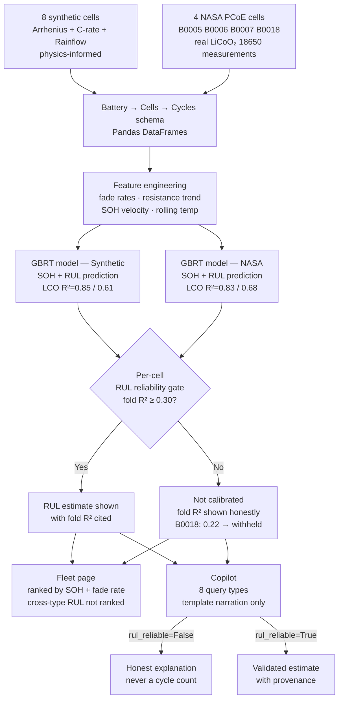

# Battery Intelligence Platform

A battery health monitoring and prediction platform built with scikit-learn and Streamlit. It tracks State of Health (SOH) and predicts Remaining Useful Life (RUL) for lithium-ion cells — validated on real NASA PCoE battery aging data — and includes an AI Copilot that explains every number it shows in plain language without inventing anything outside the validated model outputs.

Built as a portfolio project targeting the battery analytics / BMS tooling space. Not a production BMS — a demonstration of the full stack from raw cycle data to explainable, reliability-gated predictions.

**[Live demo →](https://battery-intelligence-platform-sszs92zbkfvfcda3ajtlk7.streamlit.app)**

---

## Phase structure

| Phase | What it does | Status |
|---|---|---|
| **Phase 1 — Core Loop** | SOH/RUL model, leave-cell-out validation, per-cell reliability gating, Overview/Health/Insights pages | Done |
| **Phase 2 — Fleet** | Multi-cell fleet ranking by SOH + fade rate, honest cross-type RUL copy, roadmap to unified model | Done |
| **Phase 3 — Copilot** | Template-based AI narration grounded strictly on bundle outputs — no LLM inference, no invented numbers | Done |
| **Phase 4 — Consequences** | Actionable recommendations, replacement cost modelling, second-life scoring | Done |

---

## The debugging story (the part that's actually interesting)

**Data leakage, caught.** The first SOH model reported R²=0.96. That number came from a row-level train/test split on a concatenated multi-cell dataset. Because each cell contributes ~1000 rows in chronological order, "test" rows were just the tail end of cells the model had already seen. Leave-cell-out (LCO) cross-validation — train on N-1 cells, test on the held-out cell entirely — gives the honest number: R²=0.85 for synthetic, 0.83 for NASA. Both are real and defensible; the 0.96 was not.

**Dataset-average vs per-cell reliability gate.** The first implementation of the RUL reliability gate computed one boolean per dataset (NASA vs synthetic). B0018 inherited `rul_reliable=True` from the NASA group average (dataset LCO R²=0.68 > floor 0.30) despite its own fold R²=0.22. The fix: compute `per_cell_rul_reliable = {cell_id: fold_r2 >= floor}` as a dict keyed by cell ID, and look up by cell every time RUL is displayed anywhere in the UI. B0018 now shows "not calibrated" consistently across Overview, Fleet, and Copilot.

**Why two separate models exist.** The first attempt trained one GBRT model on all 12 cells (8 synthetic + 4 NASA). Combined R²=−0.49. The problem: synthetic cells have internal resistance in the 0.15–0.40 Ω range (a modelled bulk resistance), while NASA cells have Re (electrolyte resistance from EIS impedance spectroscopy) in the 0.04–0.07 Ω range. Same feature name, physically incompatible scales. The fix is two separate models, each trained and validated on its own data source. The Fleet page ranks by SOH (scale-invariant) rather than RUL (model-dependent) for exactly this reason.

---

## Architecture



---

## Tech stack

- **Model**: Gradient Boosting Regressor (scikit-learn) — two separate instances, one per data source
- **Validation**: Leave-cell-out cross-validation; `RUL_RELIABLE_FLOOR = 0.30` gates display per cell
- **Data (real)**: NASA PCoE Battery Aging Dataset — B0005/B0006/B0007/B0018, LiCoO₂ 18650, ~2 Ah, 24°C, 2A discharge (Saha & Goebel, 2007)
- **Data (synthetic)**: 8 cells with injected stress variation (T, C-rate, DoD) via Arrhenius SEI growth, empirical power-law C-rate factor, Rainflow DoD scaling
- **Dashboard**: Streamlit + Plotly
- **Copilot**: Template-based narration (`src/copilot.py`) — no LLM API, no external calls, no invented numbers. Every sentence traces to a value in the model bundle.

---

## Deliberate scope limits (not unfinished work)

- **No unified fleet RUL ranking**: Requires 8+ real cells with diverse operating conditions to make a resistance-normalised combined model meaningful. Gate is documented in the Fleet roadmap expander. Trigger: add more NASA/CALCE/Oxford cells with temperature + C-rate variation.
- **No resistance normalisation**: `resistance_normalized = R / R_initial` would make synthetic and NASA resistance comparable. Deferred until the unified model gate is met.
- **Phase 4 (Consequences) not started**: Actionable maintenance recommendations, replacement cost modelling, second-life suitability scoring. Planned after Phase 3 is stable.
- **No LLM in Copilot**: Deliberate. Template narration enforces the reliability gate mechanically — an LLM can generate confident-sounding text for B0018 even when told not to. The template cannot.

---

## Run locally

```bash
pip install -r requirements.txt
streamlit run app/main.py
```

NASA data is included as pre-parsed CSVs in `data/raw/`. The raw `.mat` files and original ZIP are not committed (22 MB); re-download with `python src/nasa_loader.py` if needed.
