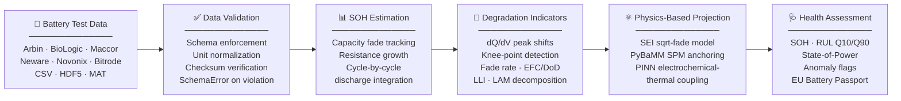

# Battery Intelligence Platform

**An open-source battery analytics platform for degradation analysis, state-of-health estimation, remaining useful life prediction, and lifecycle intelligence using public battery datasets.**

[](pyproject.toml)
[](LICENSE)
[](https://github.com/seyedali1996lb-svg/battery-intelligence-platform/actions/workflows/ci.yml)
[](https://seyedali1996lb-svg.github.io/battery-intelligence-platform/)

**Install:** `pip install battery-lab` — the import package is `batlab`. (PyPI's `batlab` is Lexcelon's unrelated Batlab V1.0 hardware library, so the distribution is named for what is actually free; see [API stability](docs/api_stability.md).) See the [changelog](CHANGELOG.md) for what each release changed.

---

## Why this project exists

A cycling battery — whether it's in a lab, a vehicle, or a stationary storage site — generates a lot of data over its life: voltage, current, capacity, temperature, cycle after cycle. The hard part isn't collecting that data. It's turning it into something useful: is this cell degrading faster than expected? How many cycles does it have left? Is it worth keeping in first-life service, or does the math favour replacement?

That translation is harder than it looks. A few specific problems come up repeatedly:

- Battery aging is nonlinear and varies between cells of the same chemistry and usage profile. There's no universal degradation curve you can just look up.
- A capacity fade curve by itself doesn't tell you much without a baseline. You need something to compare it against.
- SOH has to be reliable, because every downstream decision — dispatch, second-life routing, replacement scheduling — is built on it.
- RUL prediction is where errors are quietest and stakes are highest. A model can score well on paper and still fail on the next cell it sees, if the validation setup was wrong.
- The most common way that happens is data leakage. See [Validation](#validation) for a concrete, reproduced example using real data.
- Public battery datasets don't share a common format. NASA PCoE, the Severson et al. *Nature Energy* dataset, Oxford's path-dependent dataset, and CALCE's CS2 cells each come in a different file format with different column names. Every research group ends up writing the same brittle parsing code from scratch.

`batlab`, the research library at the core of this platform, addresses the last two of those directly: one standardized schema across all five supported datasets, and leave-cell-out validation applied by default to every model it trains.

## Why this project is relevant to battery testing

Battery testing — whether on a Neware or Maccor cycler in a research lab, during drive-cycle emulation in a vehicle integration facility, or logging BESS data in the field — produces the same fundamental artifacts: timestamped voltage, current, temperature, and capacity measurements accumulated across hundreds or thousands of cycles. The challenge is never the data collection itself. It's the chain of engineering steps that turns raw cycler output into a trustworthy statement about a cell's condition and future.

Every step in the pipeline below is implemented, tested, and documented. It's not a prototype that works on one hand-picked dataset — it runs across five public battery datasets from four independent labs.


```mermaid
flowchart LR
    A["🔋 Battery Test Data\n──────────────\nArbin · BioLogic · Maccor\nNeware · Novonix · Bitrode\nCSV · HDF5 · MAT"]
    B["✅ Data Validation\n──────────────\nSchema enforcement\nUnit normalization\nChecksum verification\nSchemaError on violation"]
    C["📊 SOH Estimation\n──────────────\nCapacity fade tracking\nResistance growth\nCycle-by-cycle\ndischarge integration"]
    D["🔬 Degradation Indicators\n──────────────\ndQ/dV peak shifts\nKnee-point detection\nFade rate · EFC/DoD\nLLI · LAM decomposition"]
    E["⚛️ Physics-Based Projection\n──────────────\nSEI sqrt-fade model\nPyBaMM SPM anchoring\nPINN electrochemical-\nthermal coupling"]
    F["🩺 Health Assessment\n──────────────\nSOH · RUL Q10/Q90\nState-of-Power\nAnomaly flags\nEU Battery Passport"]

    A --> B --> C --> D --> E --> F
```

### What each stage means in practice

**Battery Test Data → Data Validation**

Raw cycler files from different vendors use incompatible column names, unit conventions, and file formats. A capacity column might be called `Charge_Capacity(Ah)`, `Q_chg`, or `cap_mah` depending on the instrument. `batlab.datasets.cycler_mapper` handles auto-detection across Arbin, BioLogic, Maccor, Neware, Novonix, and Bitrode exports, normalizing units and column names on the way in. Every loaded DataFrame is then validated by `validate_schema()`, which raises a `SchemaError` with a specific message if any required field is missing or out of range. Downloads are SHA-256 checksum-verified, so a corrupted or partial file is caught before it contaminates anything downstream.

**Data Validation → State-of-Health Estimation**

SOH is derived deterministically: the ratio of a cycle's measured discharge capacity to the cell's own first measured capacity, with resistance growth tracked from the voltage response at the start of each discharge pulse. These are engineering formulas applied to validated measurements, not model outputs. Every derived quantity is documented in [`METHODOLOGY.md`](METHODOLOGY.md), so any number on the dashboard can be traced back to the raw cycler file without ambiguity.

**SOH → Degradation Indicators**

A SOH number tells you where a cell is. The degradation indicators tell you why it got there and how fast it's moving:

- **dQ/dV (differential capacity) analysis.** Peak positions in the differential capacity curve correspond to specific electrochemical phase transitions. Shifts in those peaks show which electrode is limiting capacity, separating cathode degradation from anode degradation without opening the cell.
- **Knee-point detection.** This identifies the inflection point where a fade curve moves from slow linear loss into rapid nonlinear decline — the most useful early-warning signal for end-of-life planning.
- **Equivalent Full Cycle (EFC) accumulation.** ASTM E1049-85 Rainflow Cycle Counting on irregular charge/discharge profiles, enabling fair cycle-count comparison across different duty cycles — lab cycling, EV driving, BESS dispatch.
- **LLI / LAM decomposition.** Per-cell decomposition of capacity loss into Loss of Lithium Inventory (SEI-driven) and Loss of Active Material (particle cracking), anchored against PyBaMM single-particle model discharge curves.

These indicators feed both the ML models and the physics projection. They're also what make the RUL number explainable rather than a black box.

**Degradation Indicators → Physics-Based Projection**

Two complementary approaches are available, both grounded in the indicators above:

- **SEI sqrt-fade model** (`src/digital_twin.py`): a classical electrochemical model where capacity loss from SEI growth scales as the square root of equivalent full cycles. It's mechanistically grounded, interpretable, and re-fit on each cell's own measured history on every update.
- **Physics-Informed Neural Network (PINN)** (`src/pinn_model.py`): a neural network whose loss function includes a physics residual — it must simultaneously fit the measured capacity fade data *and* satisfy the coupled SEI diffusion-limited LLI and mechanical particle cracking LAM differential equations. A monotonicity regularization term prevents the network from predicting capacity recovery, which is physically impossible under calendar or cycle aging.

Both are labeled as projections, not predictions. In the Cell Workbench's Health view, the SEI model's ±2σ fit band and the GBRT model's Q10/Q90 quantile interval appear on the same SOH axis. A testing engineer can see exactly where the data-driven and physics-based forecasts agree and where they diverge — and treat that divergence as diagnostic information in its own right.

**Physics-Based Projection → Health Assessment**

The health assessment packages everything above into outputs for the decisions testing engineers and operators actually face:

- RUL is reported as a Q10/Q90 quantile interval, not a bare point estimate, and only when the cell has enough cycling history for the per-cell reliability floor to be met. The interval is calibrated using conformal quantile recalibration (Romano et al. 2019) applied leave-cell-out, so the stated coverage is verified empirically rather than assumed.
- State-of-Power flags cells that have retained capacity but lost the ability to deliver rated power — important for pulse-power applications like UPS or high-rate EV discharge, where resistance growth matters as much as capacity.
- Two anomaly detection engines run in parallel: a CUSUM statistical change-point detector for rule-based threshold alarms (including IEC 62619:2022 Thermal Runaway Precursor), and a per-cell Isolation Forest that learns each cell's own normal operating region and flags cycles that are anomalous relative to that cell's own history.
- The EU Battery Passport is a W3C Verifiable Credential (EU 2023/1542) JSON-LD document with an Ed25519 cryptographic signature, carrying chemistry, R-code end-of-life routing, second-life application fit, and a traceable link to the leave-cell-out-validated model card behind the SOH/RUL numbers.

### Why the validation methodology matters for testing

A battery testing lab's core deliverable is a number someone else will make a high-stakes decision with. The [Validation](#validation) section of this README reproduces a concrete demonstration of why the *method* used to produce that number matters: the same GBRT model on the same 4 NASA cells reports **R² ≈ 1.00** with a naive random row-split and **R² = 0.745** with leave-cell-out on the production data path. The ≈ 1.00 is real, not a computation error, but it answers the wrong question. It measures how well the model interpolates between cycles of cells it has already partly seen, not how well it generalizes to a cell it has never seen before. The latter is what matters when the model gets applied to a new cell coming off a test stand.

The same discipline applies to *labels*, not just splits. A row whose cell never reaches end-of-life in the data carries an **extrapolated** RUL label — a closed-form projection, not a measurement. Training a model on such labels and scoring it against them measures formula recovery, not forecasting skill. An earlier evaluation setup did exactly that on the Severson fleet and reported RUL R² = 0.999; the fix (per-row label provenance, observed-only scoring, and a formula baseline the model must beat) is now part of the default evaluation described below.

`batlab.validation.run_lco` uses leave-cell-out by default, scores RUL only on rows with *observed* end-of-life labels, and reports the formula baseline alongside the model.

---

## Core philosophy

**Reliable battery intelligence requires honest validation.**

A model's reported accuracy is only meaningful if the test setup answers the question you actually care about. For SOH/RUL prediction, that question is: how will this model perform on a battery it has never seen? Not: how well does it interpolate between cycles of a battery it was partly trained on?

Random row-level train/test splits are misleading for cycling data, because consecutive cycles from the same cell are nearly identical. A model can memorize a cell's own trajectory and still score well on a held-out row from that same cell, without having learned anything that transfers to a new cell.

Leave-cell-out (LCO) validation holds out entire cells, never seen in training, and reports accuracy only on those. This is the harder, more honest question, and it's the platform's default rather than an opt-in.

Reproducibility also matters. A claimed R² is worthless if it can't be checked. Every number this platform reports traces back to a runnable notebook or a benchmark manifest. `batlab.validation.manifest.export_benchmark_results()` exports a machine-readable benchmark bundle (split manifest + reported metrics, `schema: "batlab-lco-benchmark"`) so other software can consume a result together with the conditions it was produced under. Since a leave-cell-out aggregate is a *mean over per-cell folds*, every headline R² on the Benchmark page also carries a fold-level bootstrap confidence interval (`batlab.validation.bootstrap`, cell-level resampling — the cell, not the correlated row, is the sampling unit) — on a 4-cell fleet the width of that bracket is part of the claim, not a footnote.

Four of the five datasets feed the trained-model benchmark: Severson (LFP — all 46 batch-1 records, up from the 12 the earlier loaders took: the five cells the original authors exclude for never reaching 80% are kept as right-censored observations rather than discarded, see [Validation](#validation)), NASA (LiCoO₂), **Zhu 2022 (NCM+NCA — the platform's third chemistry, and its first fleet where every cell reaches end-of-life in-window, so all ~8,700 RUL rows carry measured labels; leave-cell-out on those 9 real cells gives SOH R² = 1.000 against a 0.985 trivial baseline and RUL R² = 0.997)**, and **CALCE CS2 (a second real LiCoO₂ source, different form factor and cycler — it participates in the same-chemistry cross-source transfer study whenever its files are placed locally)**. Oxford is disclosed as a permanent "not evaluable" registry row (checkpoint-indexed schema) rather than silently omitted.

## Platform capabilities

The platform is organized into five engineering modules:

**Battery Data Standardization & Universal Ingestion**
- Unified cycle/summary schema across all five supported datasets (`batlab.datasets`)
- Fifth dataset: Zhu et al. 2022 voltage-relaxation NCM+NCA 18650s (`batlab.datasets.zhu2022`) — 9 dense-cycling cells (~900-1000 cycles each, 25°C, CC BY 4.0), auto-downloaded from Zenodo with SHA-256 verification; per-cycle capacity is derived from raw discharge-run charge transfer (a characterization-cycle guard, not a naive per-cycle max)
- Universal Battery Cycler Auto-Ingestion Wizard (`batlab.datasets.cycler_mapper`): instant heuristic schema detection and unit normalizer for **Arbin, BioLogic, Maccor, Neware, Novonix, Bitrode**, and custom CSVs
- Auto-downloading, checksum-verified dataset loaders with strict `SchemaError` integrity validation

**Battery Health Analytics & Field Telemetry Processing**
- State-of-health (SOH) estimation from measured capacity and resistance growth
- **Partial-Cycle & Field Telemetry Engine** (`batlab.features.partial_cycles`): ASTM E1049-85 compliant Rainflow Cycle Counting for irregular EV/BESS driving profiles, Equivalent Full Cycle (EFC) accumulation, and Open Circuit Voltage (OCV) relaxation curve reconstruction from resting intervals
- Vectorized high-performance feature extraction (`batlab.features.vectorized`) using columnar PyArrow structures for 10x-50x faster feature generation

**Machine Learning & Hybrid Physics Modeling**
- Literature-cited feature engineering (`batlab.features`) with Leave-Cell-Out (LCO) cross-validation by default
- GBRT point estimates with Quantile Regression confidence bounds (Q10/Q90)
- **Quantile-interval calibration** (`batlab.validation.calibration`): leave-cell-out empirical coverage of the Q10/Q90 RUL interval, plus conformal quantile recalibration (Romano et al. 2019) fit per fold on the other folds only — the recalibrator never sees the cell it is applied to
- **Per-prediction local attribution** (`batlab.models.attribution`): occlusion-based, SHAP-style feature attribution answering "why did THIS cell's RUL come out at X" — per-row/per-feature mean prediction change under counterfactual substitution, no `shap` dependency
- **Hybrid Physics-Informed Neural / Numerical Estimator (PINN)** (`src/pinn_model.py`): coupled electrochemical-thermal degradation tracking (SEI diffusion-limited LLI + mechanical particle cracking LAM) with monotonicity regularized physics loss
- Physics-informed calibration (`batlab.features.physics_calibration`, NASA + Severson): per-cell LLI/LAM decomposition anchored by PyBaMM SPM discharge
- Asynchronous task worker queue (`src/task_queue.py`) with Server-Sent Events (SSE) progress streaming for non-blocking LCO evaluation

**Battery Diagnostics & Real-Time Streaming**
- High-performance differential-capacity ($dQ/dV$) analysis and knee-point detection
- **Industrial Real-Time Streaming Backbone** (`src/streaming_analytics.py`): high-frequency sub-10ms anomaly detection using Cumulative Sum (CUSUM) statistical change-point detection, multivariate Mahalanobis Distance Z-scoring, and IEC 62619:2022 Thermal Runaway Precursor alarms
- **ML-based unsupervised anomaly scan** (`src/ml_anomaly.py`): a per-cell Isolation Forest learns the normal region of a cell's own feature space (capacity, fade rate, resistance growth, temperature) and flags cycles that are novel relative to that history — the complementary signal the named-rule engines can't provide (patterns no rule anticipated). Warmup cycles (no full 30-cycle rolling history) are honestly reported unscored rather than fitted on a fabricated feature; the contamination-based threshold, score-relative-per-cell caveat, and "novelty, not fault diagnosis" framing are all in the returned caveats. Exposed as `POST /analytics/ml-anomaly` and `detect_fleet_anomalies()` for fleet-wide scans
- A Battery Digital Knowledge Graph (`src/knowledge_graph.py`, NetworkX) linking cells to degradation mechanisms and literature DOIs

**Lifecycle Intelligence & Digital Passports**
- **Unified Operations Action Center** (`src/action_center.py`): centralized SLA-based triage inbox with one-click CMMS work order dispatch, manufacturer warranty claims, and circularity routing
- **Pluggable market-data adapter** (`src/market_data.py`): a `MarketDataAdapter` Protocol (the market-side sibling of `BMSAdapter`) with a deterministic offline **Synthetic** feed (the tested default), **EIA Open Data** hourly prices, and **ENTSO-E Transparency** day-ahead prices (both built against documented API shapes, untested against live accounts, registered with an honest "not configured" state until a key is supplied) — plus `to_eur_per_kwh()` currency normalization and `resolve_carbon_intensity()` which prefers a live feed and falls back to the static IEA/EEA table
- **Health-aware arbitrage dispatch** (`src/health_aware_dispatch.py`): price-arbitrage schedules constrained by the battery's *own* health signals — SoP-limited power caps (a cell at 50% State-of-Power delivers half its nominal C-rate power) and RUL/SOH-narrowed SOC bands (reduced depth-of-discharge for end-of-life-sensitive cells) — with EFC/DoD accounting via the platform's own rainflow engine and a `schedule_comparison()` that dispatches the same price window under the cohort's "assume healthy" behavior vs. real health constraints, making the differentiator measurable (revenue given up vs. stress avoided)
- **Grid-services revenue stack** (`src/grid_services.py`): per-site revenue potential across energy arbitrage, frequency regulation (ancillary), and capacity (reserve) — every rate in the same `{value, slider_range, unit, label, source}` ASSUMPTIONS shape as `src/consequences.py`, with an explicit arbitrage-vs-ancillary exclusivity note
- **Tariff-aware managed charging** (`src/managed_charging.py`): cheapest-hour EV charging plans over a price window with the cost delta vs unmanaged charging and the session's flexibility measured in rainflow EFC — an Optiwatt-adjacent use case built on this platform's own market adapter and partial-cycle engine (a recommendation, honestly not a control signal: the OCPP connector reads sessions but does not push commands)
- **Fleet dispatchable-capacity offers** (`src/fleet_aggregation.py`): per-cell SoH-limited energy + SoP-limited power + RUL/SOH-narrowed bands aggregated into a VPP-style `{energy_kwh, power_kw}` offer for a service window — the interface Anode/Deepgrid-style operators would consume, honestly labeled as a capability statement rather than a dispatch control
- **Dynamic LCA Carbon Footprint Accounting** (`src/dynamic_circularity.py`): cradle-to-grave CO2e accounting using dynamic regional grid carbon intensity (IEA/EEA) during charging, with an optional live `grid_intensity_g_kwh` override from a configured market adapter (`calculate_dynamic_lca()` accepts it additively); the REST endpoint's `use_live_carbon=true` opt-in resolves the live feed automatically via `resolve_carbon_intensity()` and reports its source
- **Health-as-a-service endpoint** (`GET /cells/{id}/health`): one JWT-gated response carrying LCO-validated SOH/RUL (Q10/Q90 only when the per-cell reliability floor is met), State-of-Power, fade rate, an explicit per-metric confidence map, EU-passport-facing fragments (chemistry, R-code, best second-life application), and the auto-generated model card of the run behind the model — reusing only existing plumbing, no new training
- **Auto-generated model cards** (`src/model_cards.py`): every logged experiment-registry run renders as a structured, honest model card (model identity, dataset + its real license via `batlab.cite`, LCO validation metrics, hyperparameters, the replay/hyperparams-divergence reproducibility contract, and platform-standard limitations) — shown per run on the Benchmark page with a JSON download, and embedded in the health-as-a-service response
- **Digital Twin architecture** (`src/digital_twin.py`): the Phase 3 CellTwin — one continuously-updated representation of a cell's measured history, derived health indicators (SOH, 30-cycle fade rate, knee, EOL), and a physics-based SEI sqrt-fade projection re-fit on every update batch. Exposed as `GET /cells/{id}/twin` and as a Live Monitor block that consumes the streamed telemetry; honestly labeled "projection, not prediction" and "not a live-synced digital twin" (fixed per-chemistry parameter set, no real BMS feed). On the Cell Workbench's Health view the projection is charted beside the GBRT-fade 12-month forecast — measured history, central SEI sqrt-fade projection, and ±2σ fit band on the same SOH axis, with a GBRT-vs-physics RUL comparison strip — so researchers can see where the data-driven and physics models diverge for a cell
- **Grid Services page** (`app/_pages/operations.py`): the Streamlit surface for the Lifecycle Intelligence layer — health-aware dispatch (with the healthy-vs-health-aware comparison), grid-services revenue, managed charging, fleet dispatchable-capacity offers, and the ML anomaly scan, all read-only estimates with the modules' own labels. The page imports `src/` package modules using bare imports (e.g. `from market_data import ...`), with path resolution handled by the centralized `_paths.py` module.
- **W3C Verifiable Credential Battery Passport** (`src/dynamic_circularity.py`): EU Battery Regulation (EU 2023/1542) JSON-LD digital product passport generator with cryptographic Ed25519 signatures
- Automated Second-Life Auction & Bid Matcher connecting certified cell health (SOH, SoP%, RUL) with buyer application profiles
- **Modern React 19 / TypeScript SPA Frontend** (`frontend/`): 60fps electrochemical cycle scrubber, real-time live telemetry canvas, and multi-view operations dashboard alongside the Streamlit application — designed with an energy-lab aesthetic (electrolyte-teal accent, Inter + JetBrains Mono type pairing, state-of-health-derived color ramp, Lucide SVG icons) that reads as an instrument panel rather than a generic dark dashboard — and shipped rather than aspirational: `uvicorn src.api:app` mounts its built `dist/` at `/app` with same-origin API calls, and a dedicated CI job builds it, lints it (oxlint + `jsx-a11y`) and verifies that `index.html`'s asset URLs resolve, so it cannot rot untested beside the Streamlit app


## Architecture

```
Data Layer                    batlab.datasets
    │                         standardized schema, checksum-verified downloads
    ▼
Feature Engineering           batlab.features
    │                         literature-cited stress/aging features, dQ/dV, knee detection
    ▼
ML Models                     batlab.models
    │                         GBRT + quantile regressors, leave-cell-out validated by default
    ▼
Analytics Engine              batlab.validation, src/*
    │                         SOH/RUL, anomaly thresholds, deployment sizing, second-life economics
    ▼
Visualization / Application   app/
                               Streamlit dashboard, battery passport, fleet view, live monitor
```

Each layer is independently usable — `batlab` runs standalone as a Python library (see [Installation](#installation)), and the Streamlit application in `app/` is a consumer of it, not the other way around.

The Streamlit app (`app/`) is split into focused modules:
- **`app/main.py`** — thin orchestrator (~300 lines): auth gate, data loading, training, and page dispatch
- **`app/_data.py`** — data loading and caching logic
- **`app/_sidebar.py`** — sidebar navigation, role switching, and data-mode switching
- **`app/_onboarding.py`** — guided tour, command palette, and first-run overlay dialogs
- **`app/_router.py`** — page routing/dispatch
- **`app/_session.py`** — session-state initialization, DB persistence hydration, cell partitioning, and data-mode resolution
- **`app/_design_tokens.py`** — constants, Plotly config, feature labels, card colours
- **`app/_pack_builder.py`** — pack builder widget (self-contained)
- **`app/_report_regen.py`** — report regeneration button widget
- **`app/_ui_helpers.py`** — small pure UI helpers (cards, metric tiles, sparkline, provenance)
- **`app/utils.py`** — cache helpers + backward-compatible re-exports from the above
- **`app/_pages/`** — individual page renderers (one per page)

A centralized **`_paths.py`** at the project root walks up from its own directory to find the repo root, ensuring `src/`, `app/`, and `scripts/` are importable from any working directory. A **`python -m app`** entry point is also provided.

The `src/` layer provides:
- **Dependency-injection protocols** (`src/protocols.py`) — `BMSAdapter`, `MarketDataAdapter`, `DataStore`, `ImportAdapter`, `NotificationSender`, `KnowledgeRetriever` Protocol interfaces defining subsystem boundaries
- **DI entry points** (`src/api.py`) — `get_store()`/`set_store()` and `get_market_adapter()`/`set_market_adapter()` let tests inject fakes without changing call sites
- **Shared API contracts** (`src/contracts.py`) — `TypedDict` definitions for every REST response shape (`CellSummary`, `HealthResponse`, `FleetSummary`, `DecisionRecord`, `TwinResponse`, `DispatchSchedule`, `PassportData`) consumed by both the Streamlit dashboard and React frontend
- **Domain groupings** (`src/__init__.py` + `src/_domain/`) — lazy re-exports via `__getattr__` so `from src import db` works alongside bare `import db`; the 69 `src/` modules organized into 8 named domains for IDE navigation
- **pyright CI gate** — type checking runs on every push/PR via `.github/workflows/ci.yml`, over `batlab/` (the installable library), `src/`, `app/` and `scripts/` (blocking: 0 errors enforced). CI runs bare `pyright`, so the checked paths come from `[tool.pyright]` in `pyproject.toml` rather than a second, drifting list in the workflow.
- **CI failures are machine-readable** — the test step writes JUnit XML and `scripts/annotate_pytest_failures.py` re-emits each failure as a check-run annotation, with every failing test named in a summary notice. A job **log** needs a signed-in browser even on a public repo (the REST logs endpoint answers `403`); annotations are in the public API, which is what lets tooling — and agents — triage a red build without one. pytest's exit code still decides the step, so the reporter cannot turn a red run green or the reverse.

## Methodology

Every result this platform produces falls into exactly one of five categories, and the intent is that it's never ambiguous which one you're looking at:

| Category | Examples here | How it's produced |
|---|---|---|
| **Measured** | Voltage, current, capacity, temperature, cycle count | Read directly from the five public datasets' raw files into the standardized schema — never modified |
| **Derived** | SOH, capacity fade rate, resistance growth, dQ/dV peaks, knee point | Deterministic engineering formulas applied to measured data — the exact formula behind each one is documented in [`METHODOLOGY.md`](METHODOLOGY.md) |
| **Predicted (ML)** | SOH "what happens next" forecast, RUL point estimate, RUL quantile interval | Regime-routed per cell: hierarchical partial-pooling (default forecaster — it extrapolates) or GBRT (interpolates, serves only where its folds prove it), with a per-cell `refuse` verdict when no model is proven for the cell's regime; always leave-cell-out validated |
| **Survival claim (non-parametric)** | Fleet-level EOL-probability bound | Kaplan–Meier over right-censored cell lifetimes + the rule of three — no model, no labels, just who died on camera and who didn't |
| **Simulated** | PVGIS-driven solar yield in the Solar + Storage Sizing calculator, PyBaMM-based physics capacity projection | Physics-based or third-party-API-driven simulation of a process, not a direct sensor reading |
| **Illustrative assumption** | Second-life resale value, install-cost presets used in payback/NPV calculations | Values with no citation are labeled `"Illustrative — not sourced"` in the UI, explicitly distinct from `"Cited estimate"` values that do have one |

## Validation

[`notebooks/02_data_leakage.ipynb`](notebooks/02_data_leakage.ipynb) reproduces this on real data, using the same 4 NASA PCoE cells and the same GBRT model:

| Validation method | SOH R² | What it actually measures |
|---|---|---|
| Naive random row-level split | **≈ 1.00** | How well the model interpolates within cells it has already partly seen |
| Leave-cell-out (the notebook's loader) | **0.947** | How well the model generalizes to a cell it has never seen |
| Trivial baseline (cycle number → SOH, no engineered features), same LCO folds | 0.603 | The floor — how much of the leave-cell-out R² is the smooth shape of aging curves, not the model |

The notebook's numbers come from its own loader — its preprocessing differs from the production app path (same data, different bytes; the Tier-4 comparability incident in `docs/history.md`). Through the production app path under the current v13 feature set, leave-cell-out on the same 4 cells reports **0.745 [0.56, 0.93]** against the same **0.603** baseline — a n=4 bracket that wide is part of the claim. The story is identical in both loaders either way.

The ≈ 1.00 is real and reproducible — and it's also the wrong number to report, because it doesn't answer the question that matters for a deployed model. The honest leave-cell-out number is what `batlab.validation.run_lco` reports by default: 0.745 on the production app path (0.947 through the library's own loader), against the 0.603 trivial-baseline floor under the identical fold structure — the engineered features are worth **+0.142** over that baseline on the production path, not the full R².

That denominator has to be as real as the model's number, which is why it now tolerates blank measurements instead of disappearing. Two Severson records (S-b1c0 cycle 11, S-b1c18 cycle 39) carry an empty capacity column in the source CSV, so `soh_pct` is blank with it; `run_lco` drops such a row from the model matrix, but a least-squares line raises on a blank *target* — so the fleet's trivial baseline came back as nothing at all, and every "+X over the baseline" claim on Severson had no number behind it. The baselines now set those rows aside and count them, and Severson's floor is **−0.328** (46/46 folds scored, two rows set aside) — negative on purpose: 46 LFP cells fade at very different rates, so one global straight line is worse than predicting the mean, and the GBRT's 0.992 sits **+1.32** above it. No published baseline moved (NASA's 0.603 is bit-identical, as is the CI fixture fleet's).

The same honesty rule is applied to RUL. RUL can only be *measured* for a cell whose data actually reaches the 80% end-of-life threshold; rows from cells that don't carry a closed-form **extrapolated** label instead. `run_lco` scores RUL only on the observed-label population and discloses its size — on NASA all 580 RUL rows carry observed labels; on all 46 Severson records **zero** rows qualify — under the platform's own-EOL convention (80% of the cell's first *measured* capacity, not the nameplate) the cyclers stop every batch-1 record near 0.88 Ah ≈ 81.5% of its own q0, so none of them crosses 80% in-window — and Severson RUL is reported as **not evaluable** rather than quoted from extrapolated labels. The earlier evaluation setup quoted Severson RUL R² = 0.999 from exactly that extrapolated pool, and `rul_formula_baseline_lco()` — the closed form that generates the labels, run under the identical folds — scores R² ≈ 1.0 on it, which is the proof. On the honest NASA pool the current pipeline reaches **0.412** against the formula's **0.677** — on this 4-cell fleet the GBRT does *not* beat the closed form, a real negative result published as-is (the same comparison on Zhu's 9-cell fully-observed fleet is **0.997 vs 0.510**, where data is abundant). `rul_reliable` additionally requires ≥50% observed coverage, and a fold with no observed rows shows "not evaluable" instead of a number.

This is public-data validation, not industrial validation — the leave-cell-out number describes generalization across 4 NASA cells, not across a manufacturer's fleet. Treat it as evidence the methodology is sound, not as a number that transfers directly to a different chemistry or duty cycle.

**The prospective split — forecasting, not curve-fitting.** Leave-cell-out holds out whole cells but still shows the model the held-out cell's *future*: its full recorded curve is in the evaluation pool. The deployment question is the opposite one — *this cell has produced 200 cycles, what happens next?* `batlab.validation.prospective` answers it by training only on the first half of each cell's cycles and scoring only the remainder, under the same RUL-honesty rules and with the trend/formula baselines under the identical split. The result is the most deflating table on the Benchmark page, and the most important one:

| Fleet | LCO SOH R² | Prospective SOH R² | Per-cell trend baseline |
|---|---|---|---|
| NASA (4 LiCoO₂) | 0.745 | 0.492 [−1.23, 0.57] | −0.241 |
| Zhu 2022 (9 NCM+NCA) | 1.000 | −3.176 [−3.58, −2.84] | 0.141 |
| Severson (46 LFP) | 0.992 | −0.203 [−2.01, 0.42] | −0.489 |

Denied the future, gradient-boosted trees — which interpolate within their training label range but cannot extrapolate beyond it — drop from near-perfect interpolation numbers to negative R² on two of three fleets, and fall below a per-cell straight line on Zhu; on the full 46-cell Severson fleet the GBRT still edges the straight line (−0.203 vs −0.489) but surrenders 1.2 R² of interpolation lift doing it. The prospective RUL number loses to the closed-form fade formula on every fleet where RUL is evaluable. The gap between the LCO column and this one is the amount of interpolation that was riding along in every held-out-cell number. Both evaluations are reported side by side on the Benchmark page, because they answer different questions: LCO is new-cell generalization, the prospective split is same-cell forecasting, and a deployment needs both to be stated separately.

*† The Severson fleet was expanded from 12 representative cells to all 46 batch-1 records in the 2026-09 expansion; the robustness cell quotes the last full robustness-grid measurement, taken on the 12-cell subset — the 46-cell robustness re-run lands in the same registry when it completes. A study row is only comparable to another when both come from the same cell population; mixing them in print is disclosed exactly like this rather than silently averaged.*

**Calibrated uncertainty — the interval's coverage is measured, not claimed.** The served RUL Q10/Q90 interval claims 80%; Tier 3 makes the platform *measure* that claim on cells the model never saw and serve the corrected interval. The quantile models run under the same leave-cell-out folds as the point models (`batlab.validation.calibration`), every row's conformity score comes from a model that never trained on its cell, and the pooled cross-cell conformal correction E* is stamped onto the production bundle — `predict()` widens the served Q10/Q90 by it, and the measured coverage is disclosed next to every interval the product shows (API confidence text, Overview, Decision, and a dedicated Benchmark calibration table; `calibration_meta` column in the experiment registry). Real fleets, measured:

| Fleet | Calibration rows | Raw coverage | E* (cycles) | Calibrated coverage |
|---|---|---|---|---|
| NASA (4 LiCoO₂) | 580 | 72.9% | 6.3 | **80.3%** |
| Zhu 2022 (9 NCM+NCA) | 8,726 | 90.5% | 0 (clamped) | 90.5% — served as-is |
| Severson (46 LFP) | 0 observed labels | — | — | **not evaluable** |

E* is clamped at zero — the platform widens an interval, it never narrows one — so Zhu's already-conservative interval ships unmodified while NASA's mildly overconfident one gets corrected to nominal. A fleet whose RUL labels are formula-extrapolated (Severson) reports *not evaluable* rather than a coverage number computed against the formula that generated the labels, and an uncalibrated fleet is flagged as such instead of silently quoting its nominal level.

**Censored RUL — "still alive at last cycle" is an observation, not a missing label.** The honesty rule above refuses to score Severson RUL against formula-generated labels, and its correct cost was that the platform had *nothing* to say about the one fleet whose cells outlast their recordings. Survival analysis turns that refusal into a claim: `batlab.validation.survival` treats a cell that never reaches the 80% threshold as a **right-censored observation** rather than a discarded row. With all 46 Severson records censored (zero in-window EOL events — the cyclers stop each cell at ~81.5% of its own first measured capacity), the Kaplan–Meier curve is flat at 1.0 by construction and the quantitative content is the **rule of three**: with 0 events in 46 cells, P(a same-protocol cell reaches EOL before its last recorded cycle) is at most **3/46 ≈ 6.5%** at one-sided 95% confidence. That is an honest, model-free RUL statement on exactly the fleet the label-provenance rule had silenced — a bound that *tightens* as censored fleets grow, and one no extrapolated-label R² could have produced. A per-cell AFT-style posterior check (the hierarchical fit's fade-rate posterior vs. the censoring fact) rides alongside it, so a posterior that placed most of its EOL mass before the cell's last recorded cycle would be visibly contradicted by the data rather than averaged away.

**Modeling candidates — every alternative runs the same folds, wins or loses.** The GBRT is not the only model the platform can be; the Benchmark page reports what happens when it isn't. Two candidates run through the identical leave-cell-out folds as the production GBRT (`batlab.validation.hierarchical_lco`, `batlab.validation.ensemble_lco`), with the honest numbers published either way:

| Fleet | GBRT SOH R² | Hierarchical | GBRT+PINN ensemble | Reads |
|---|---|---|---|---|
| NASA (4 LiCoO₂) | 0.745 | 0.695 | 0.745 | tie within fold noise — the inner CV keeps w<1 on 2 of 4 folds but the physics leg does not earn back the gap |
| Zhu 2022 (9 NCM+NCA) | 1.000 | 0.917 | 1.000 | inner CV collapses to pure GBRT where data is abundant — an honest tie |
| Severson (46 LFP) | 0.992 | 0.232 | 0.991 | the hierarchical linear-fade law cannot follow LFP knees, and says so — the failure deepens with more knee-heavy cells in the pool (0.318 on the 12-cell subset, 0.232 on all 46) |
| synth (8 LiCoO₂) | 0.998 | 0.982 | 0.998 | ties across the board |

The **hierarchical partial-pooling model** is the forecasting answer to the prospective split's finding: a held-out cell borrows fade-rate strength from its chemistry's fleet prior and contributes only its own early cycle window — the deployment-realistic information set. It lives in `batlab/models/hierarchical.py`, shared with the validation harness (`batlab.validation.hierarchical_lco` imports the same estimation math, so the validated estimator and the served estimator cannot drift apart), and since the 2026-09 routing change it is what the product serves by default for "what happens next" (below). It loses to the GBRT on knee-heavy LFP data (a linear fade law is a declared limitation, not a hidden one) and its Zhu RUL R² (0.993) shows the shrinkage estimator forecasting where trees cannot extrapolate.

**Regime-routed serving — the model is picked per cell, before the answer, not disclosed after it.** The prospective split's finding has a deployment consequence: an interpolator should not be the default answer to "what happens next." Since the 2026-09 routing change (`src/forecast_routing.py`), every served forecast is *routed*: `regime_reliability()`'s per-regime verdicts (reliable / thin / unvalidated per chemistry × temperature × SOH stage) decide which model answers each cell. A cell whose GBRT folds proved reliable keeps the GBRT; a cell whose GBRT RUL is not evaluable (the never-EOL fleets) gets the hierarchical forecaster, which extrapolates by construction; a cell in an unvalidated regime gets an explicit **refuse to predict** instead of a number wearing a caveat. The routing verdicts ride into the registry with every run (`validity_meta.forecast_routing`), so a historical prediction can be audited for *which* model produced it — and the Decision page shows the chosen model and its reason next to every forecast, rather than a one-size model with a footnote.

The **GBRT+PINN ensemble** blends the physics-regularized fade law into the GBRT with a weight chosen inside each fold by an inner leave-one-cell-out pass — the held-out cell never picks its own weight. On every real fleet the inner CV either collapses to pure GBRT or the blend nets out to a tie; **the honest headline is that the ensemble does not beat the production GBRT on these fleets** — and a comparability trap behind an earlier contrary claim is itself documented: run through a different NASA loader (different resistance preprocessing, 636 vs 580 feature rows for the same cells), the ensemble had shown +0.187; re-run through the app's exact data path, the delta vanished. Same dataset name is not same data — study rows are only comparable when the byte-identical loader produced them. Per-fold blend weights travel in the registry fold drill-down; w=1.0 folds (pure GBRT) are disclosed, not hidden.

**Robustness — accuracy under degraded input.** Laboratory records are clean; real fleet telemetry is not. `batlab.validation.robustness` degrades a copy of each fleet's raw cycles — dropped cycles (telemetry loss), BMS counter resets (contiguous blocks of life vanishing), resistance transients (electrical artefacts) — rebuilds features from the degraded data, and re-runs the identical leave-cell-out harness against a freshly computed clean baseline, so the deltas isolate the data effect rather than refit noise. Each scenario table carries the first severity at which SOH R² crosses a pre-declared failure floor (0.5). Measured on the real fleets, the worst-case SOH R² delta per fleet:

| Fleet | Clean SOH R² | Worst SOH R² delta | Worst mode | No scenario below floor |
|---|---|---|---|---|
| NASA (4 LiCoO₂) | 0.745 | −0.142 | 30 resistance-spike cycles | ✓ |
| Severson (46 LFP) | 0.992 | −0.001† | 7 BMS counter gaps | ✓ |
| Zhu 2022 (9 NCM+NCA) | 1.000 | −0.000002 | 1 BMS counter gap | ✓ |
| synth (8 LiCoO₂) | 0.998 | −0.0004 | 7 BMS counter gaps | ✓ |

The SOH head is remarkably robust: on every fleet with more than a handful of cells, no degradation mode moves SOH R² by more than a thousandth — the model's SOH accuracy degrades gracefully under telemetry loss, counter gaps, and resistance artefacts alike. The fragility is fleet *size*, not mode: NASA's 4-cell pool loses 0.142 under 30 spike cycles (a 1.5× resistance artefact is large relative to so little training data), and its RUL R² turns negative there. RUL degrades faster than SOH everywhere (synth RUL 0.625 → 0.436 at 3 counter gaps), and one degraded Severson scenario loses RUL evaluability entirely — a BMS reset can push a fold below the observed-label floor, which is exactly the honest disclosure the v12 rules exist for. These rows are excluded from every accuracy table (the `_robustness` registry suffix) — they are stress-test results, not accuracy claims.

**Input provenance — what the other inputs actually are.** Three audits on the Benchmark page scope the model's non-capacity inputs: the **condition-axis audit** (`batlab.features.condition_axes`) reports per fleet whether temperature and C-rate are *measured* (NASA's 31–34.5 °C column; the synthetic fleet's 20–40 °C spread — usable as modeling axes), *protocol-constant* (no cross-cell signal), or *absent* (Zhu's protocol-known 25 °C/1C is injected as an explicitly disclosed column; Severson's temperature arrived 0.0-sentinel-poisoned from the raw files and is now cleaned at load time); the **SoP audit** (`batlab.validation.sop_validation`) checks the served State-of-Power number against its own 100×R₀/R definition and attaches a ±25% uncertainty band with an explicit "proxy, not a measured power test" scoping label; and the **physics-parameter audit** (`batlab.validation.physics_scoping`) tiers each cell's SEI/LAM decomposition by fit quality and states what EIS/post-mortem validation would add — the parameters are model fits, not independently validated physical constants. One input used to depend on the *environment* rather than on the data: `build_features()` imported the physics-calibration feature block from the demo application's `src/`, so the same call reported SOH R² **0.9580** installed on its own and **0.9471** with the app's `src/` on the path (four NASA cells) — a library whose numbers move with the caller's import path. Since 0.2.0 that block ships **inside the library** (`batlab.features.physics_calibration`, gated on the frame's own declared `source`/`chemistry` attrs, with PyBaMM an optional extra that only affects a display-only column), so there is one number in every environment: measured identical to 1e-16 in a bare process and in an app-importable one, and `tests/test_feature_environment_inputs.py` pins it — including a subprocess run with no `src/` on the path. Every result still carries `physics_features` (true only when **every** cell was calibrated), two runs are comparable only when they agree on it, and the fold cache keys on it. The demo application was checked seam by seam when this moved — eligibility is identical per fleet, and its physics pages still run through the app's own module (see [`docs/performance.md`](docs/performance.md#did-any-of-this-cost-the-demo-application-anything)) — but the platform's capability is unchanged: it is the same code, in a different place. See [`docs/api_stability.md`](docs/api_stability.md#environment-dependent-inputs).

**Domain of validity — where the numbers apply (Tier 5).** Every accuracy number above was measured *somewhere*: specific chemistries, a temperature range, a C-rate regime, an SOH window, one cell format. `src/domain_validity.py` makes that boundary mechanical instead of narrative. `compute_envelope()` derives the training envelope from the fleet's own records — chemistry, cell format, measured temperature range, measured C-rate range (or an explicit "set-point only"/"absent" status, never a claimed range), and the SOH window — and every logged run carries it (`validity_meta` in the experiment registry). `check_cell_against_envelope()` answers the deployment question per cell: verdicts are *in*, *partial* (at a range edge within a stated tolerance, or differing only in a soft axis like cell format), or *outside* (different chemistry, temperature/C-rate beyond tolerance, SOH deeper than measured). The measured envelopes:

| Fleet | Envelope summary |
|---|---|
| NASA (4 LiCoO₂) | 30.1–34.5 °C measured · C-rate **not in records** · SOH 56.7–100% · n=4 |
| Severson (46 LFP) | 25.0–38.4 °C measured · C-rate **not in records** · SOH 80.5–100.9% · n=46 |
| Zhu 2022 (9 NCM+NCA) | 25.0 °C set-point only · 0.5C set-point only · SOH 66.2–100% · n=9 |
| synth (8 LiCoO₂) | 12.5–47.0 °C measured · 0.5–2.0C measured · SOH 66.2–100.5% · n=8 |

The second half of the item is **per-regime reliability**: `regime_reliability()` stratifies the per-cell leave-cell-out folds by chemistry × temperature band × SOH stage and verdicts each regime *reliable* / *thin* / *unvalidated* — the layer between per-cell gating and fleet averages, so a fleet-level R² can't hide a regime where the model doesn't work. Both halves surface wherever a decision is made: the Benchmark page renders the envelope and per-regime table per fleet; Overview, Health, Decision, and Fleet show a visible warning on any cell outside its model's envelope (naming the axes); Decision escalates it to an error-level banner at the point of recommendation; and the health API carries a machine-readable `validity` record (verdict, outside/partial axes, axes actually checked, envelope). A prediction outside the envelope is not forbidden — it is forbidden to read the accuracy numbers as if they covered it.

**Verification — the numbers defend themselves (Tier 6).** Every guard above *measures* honesty; this layer *enforces* it. Four pieces:

- **Accuracy regression gate in CI.** `batlab.validation.metric_gate` checks headline numbers against `tests/metric_gate_expectations.json`: a **floor/ceiling** is a promise (outside it fails, period); a **baseline** pins the measured value (movement beyond tolerance fails as an *unexplained change* until `scripts/update_metric_baselines.py` records it with a mandatory reason — an append-only change log, reviewable in the diff); a metric that **stopped being computable** fails too unless the expectation explicitly allows it. The gate runs two ways: on a deterministic fixture fleet (five stress-profile cells through the unmodified `run_lco`, ~1 minute, marked test + dedicated CI step) and on the registry's real logged runs (`scripts/check_metric_gate.py`, latest run per dataset). The fixture fleet's floors and baselines are measured, not aspirational: SOH R² 0.9959 baseline with a 0.95 floor, RUL R² 0.1415 baseline with a 0.0 floor, and the trivial-baseline denominator the SOH number is stated against (−1.7677 baseline, declared as a *ceiling* of −1.0, because the risk is that floor getting smarter and quietly shrinking the model's claimed advantage).
- **Continuous metric tracking with drift alerts.** `src/metric_history.py` reads the registry's history as a time series: movement beyond tolerance between consecutive runs of the same population and feature version is a **[DRIFT]** alert; movement across a feature-version boundary is reported separately as the expected consequence of the feature change. The Benchmark page renders the report; `scripts/check_metric_gate.py --drift` exits nonzero when alerts exist. Study populations (`_robustness`, `_prospective`, `_transfer`, and the `_to_` transfer naming) are excluded — they are stress results, not accuracy claims.
- **Dataset hashing + environment pinning.** Every `run_lco()` result now carries a **fingerprint**: a SHA-256 content digest per cell (holdout's normalization) plus a set-level hash, and an environment snapshot (python/platform/numpy/pandas/scikit-learn/scipy/pybamm versions), persisted in the registry (`fingerprint` column). "Same dataset" is now a string comparison — the mechanical retirement of the Tier-4 lesson that same dataset *name* is not same *data*. CI pins the numeric stack via `constraints.txt`, so an unpinned library bump can't masquerade as unexplained metric drift.
- **Independent replication.** `scripts/publish_replication_bundle.py` exports a **sealed bundle** for one dataset's LCO number: fold structure + reported metrics (benchmark.json), per-cell digests, environment, and the SHA-256 of every file in the bundle itself (the seal). A third party runs `python -m batlab.validation.replication <bundle-dir> --loader batlab.datasets.<mod>:<fn> --recompute` against their own copy of the public data and gets pass/fail per check: **seal** (files unmodified), **data-identity** (their copy digests byte-identically), **environment** (differences listed, warn-level), **recompute** (the number re-derives from the bundle's own seed/feature-version/folds within 1e-6). Verified end to end on the synthetic fleet: publish → seal → verify → recompute reproduces `soh_r2=0.9959` exactly.
- **Registry-verified cache hits.** A cached model bundle carries the `experiment_run_id` of the `log_run()` call that trained it — and the loader now verifies that row EXISTS in the deployment's database before serving the bundle. A cache hit whose registry row is missing (training ran while its writes went to an ephemeral DB, the 2026-09-13 incident that left zhu2022 with no GBRT row and every headline on pre-v12 rows) is discarded and retrained, so the benchmark can never silently present numbers the registry cannot back. The same guard covers the health API's disk-cache fallback.

- **Validated folds are replayed, not refitted — and the answer cannot change.** A leave-cell-out fold is a pure function of (the pool's cells, their feature frames, the model configuration, the seed) — the same property that lets folds run concurrently. `batlab.validation.fold_cache` writes each completed fold to disk and replays it when that configuration comes back, keyed on **per-cell content digests**, the held-out cell id, `FEATURE_VERSION`, `GBRT_PARAMS`, the seed, the tracked numeric-stack versions and a code version — deliberately **not** on a dataset *name*. Measured on the 46-cell Severson fleet (92 exact-splitter GBRT fits, ~710 s of fits): a repeated run replays **46/46 folds in 2.7 s**, and a run killed after fold 44 resumes with 44 reused and 2 fitted instead of discarding the 44 that had already produced their numbers. Writes are temp-file-then-rename and every filesystem error is a miss — a cache must never be able to fail a training run. The replayed result is indistinguishable from the refitted one (`tests/test_lco_fold_cache.py` asserts a warm run performs **zero** fits, field by field), while changed cell data, seed, params, feature version, numeric stack — or a different set of optional feature blocks (`physics_features`) — each produce a different key, so a stale fold is recomputed rather than served. Two seams opt out on purpose — the replication recompute and the metric regression gate both pass `use_fold_cache=False`, because a check that replays a stored answer is not a check. `BATLAB_LCO_CACHE=off` disables the cache; `refresh` recomputes and rewrites everything. See [`docs/performance.md`](docs/performance.md).

## Bringing your own model — the validation harness

Everything in [Validation](#validation) above is a statement about a *method*, not about the GBRT that happened to be welded to it. `batlab.harness` removes that weld: point it at any forecaster — a scikit-learn estimator, a PyTorch net, your own numerical fit — and it runs the same checks, in the same order, on your model.

```python
from batlab.harness import validate_forecaster

report = validate_forecaster(cells, model=my_model)   # model=None -> this platform's own GBRT
print(report["verdict"]["summary"])
for claim in report["verdict"]["claims"]:
    print("  supported:", claim)
for gap in report["verdict"]["withheld"]:
    print("  withheld: ", gap)
```

Six checks, each one a way for "is this number honest?" to come back *no*:

- **Leakage lint** — no quantity read by the RUL label's generating expression may also be a model feature (the defect behind this platform's former RUL R² = 0.9994, now mechanical rather than audited by hand).
- **Label provenance** — how many RUL rows carry a measured end-of-life label, and how many carry a closed-form extrapolation. Extrapolated rows are reported separately and can never set the headline.
- **Leave-cell-out** — new-cell generalization, beside the trivial per-cell trend baseline so "how much of this R² is the shape of aging curves?" is answerable. A tie is reported as a tie, not as a marginal win.
- **Interval calibration** — nominal vs *measured* coverage of an 80% interval, conformally recalibrated per fold on the other folds only. A point-only model still gets an interval: a distribution-free one built from its own out-of-fold residuals, and the report says which path produced the number.
- **Prospective split** — train on each cell's first half, score the second. The only check that separates forecasting from interpolating a curve whose end the model has already seen.
- **Metric gate** — declared floors/ceilings and baselines, enforced. Supplying none reports NOT CHECKED rather than passing.

Two contracts make it safe to point at someone else's model. The factory is called **once per fold and once per target**, so a fold can never be fitted on another fold's state; and a **pre-fitted estimator is refused** rather than deep-copied, because a model that already saw the held-out cell produces a beautiful, meaningless R².

Nothing is reported that could not be measured: on a fleet whose cells never reach end-of-life in-window, RUL is withheld entirely rather than quoted from formula-generated labels, and an interval whose measured coverage is 62% is shown at 62%. A result can be sealed into a bundle a third party re-derives from their own copy of the data:

```bash
python -m batlab.harness --loader batlab.datasets.nasa:load_nasa_cells --gate floors.json --seal out/bundle
python -m batlab.validation.replication out/bundle --loader batlab.datasets.nasa:load_nasa_cells --recompute
```

`model=None` (the default) reproduces this platform's own published numbers exactly — the point metrics *and* the conformal interval calibration — because the seam moved the model, not the methodology. See [the validation harness guide](docs/harness.md) for the adapters (sklearn, PyTorch, callables), the gate file format, and the honest limits behind each number.

A sealed bundle is only evidence if someone else can re-derive it, which means putting the two things the number depends on *in* the artifact when nobody else has them. For a model: `seal_bundle(..., model_source=...)` writes the module that was graded to `model/module.py`, seals it, and records the bundle-relative loader, so `--model batlab.harness.model_source:load_bundle_model --recompute` re-runs the exact configuration — after checking the file's bytes against its own recorded digest and **before** importing it, because importing a module executes it. For data nobody else can obtain: `seal_bundle(..., embed_data=True)` writes each cell's cycle table into `cells/`, seals those files alongside the report, and records the bundle-relative loader, so the number re-derives from the zip alone. The trade is stated, not implied: the data then travels with the bundle. Each file's own SHA-256 and the canonical `cell_digest()` it reloads to are both recorded in `cells/index.json`, and the loader pins round-trip float parsing, so a recompute agrees with the published metric at 1e-6 rather than merely looking close.

The same harness is a page in the app: **Analyse → Bring your own model** grades the platform's GBRT, a scaled Ridge, a random forest, a training-mean floor, or a `.py` model module you upload — **against a reference fleet this deployment can reload, or against the cells you uploaded yourself**, whose raw cycles the import pipeline now persists (`src/uploaded_store.py`) so they can be fingerprinted like any other fleet. It renders the verdict as two columns, the claims the run supports and the claims it *withholds*. Uploads are `.py` only (a serialized model executes on load, so it cannot be read first) and are shown in full before anything runs — and the module then runs in a separate sandbox process (`batlab.harness.sandbox`), never in the app's own: an audit hook refuses the imports and operations that reach outside it (socket, subprocess, ctypes, `os.system`), file writes are confined to its scratch directory, and wall-clock/CPU/memory caps stop a model that hangs or eats the box. What that does **not** buy is stated on the page as a table, not implied: containment is not a container, the child runs as the same OS user, and a compiled extension could bypass a Python-level control. The model can travel with the evidence the same way your data can: a bundle sealed for a non-default model now carries its source (yours, if you leave that box ticked) so a reviewer holding only the zip can re-derive the number, and the command the page prints is the command that actually runs — verified against the real CLI, including the reference-fleet loader that lives in this checkout's `src/`.

## Demo Application

`app/` is a Streamlit application, built on `batlab` — an engineering prototype demonstrating what the platform's analytics look like assembled into an engineer-facing tool, not a production deployment:

- A per-cell **battery health dashboard** — SOH/RUL, degradation trajectory, dQ/dV, anomaly flags
- A **fleet monitoring** concept view across multiple cells at once, plus a simulated live-telemetry Monitor page
- An **EU Battery Passport** generator, with a "regenerate this report" action that replays the exact recorded pipeline (dataset, feature set, hyperparameters, seed) behind any displayed result
- A **Benchmark** leaderboard across every logged training run — filterable by dataset/chemistry, sortable by any metric, with fold-level drill-down — including an honest transfer study over **every dataset pair**: cross-chemistry pairs (train on NASA, zero-shot evaluate on Severson) report the real failure, and same-chemistry cross-source pairs (NASA ↔ CALCE, both LiCoO₂ but different cyclers and form factors) test whether a model generalizes beyond its own dataset's cells
- A **Bring your own model page** — the validation harness above with a UI in front of it: grade the platform's GBRT, a scaled Ridge, a random forest, a training-mean floor, or a **model module you upload** against a reference fleet this deployment can reload — **or against your own uploaded cells**, which appear first in the fleet picker with their cell count and upload date, now that the raw cycles are persisted at import time. Read the result as two columns — the claims the run supports and the claims it *withholds* (no measured end-of-life rows means no RUL number at all, not a caveated one). Every section renders underneath: fold-level leave-cell-out beside its trivial baselines, conformal calibration raw→measured, the prospective split, label provenance, and the declared-floors gate with its UNTRACKED metrics. Uploads are `.py` only — a serialized model executes as part of loading, so it cannot be read first — and the source is shown in full before anything runs, above a checkbox that gates the run and a table of **what the sandbox actually enforces on this deployment** (it runs in a separate process with denied imports/operations, writes confined to its own scratch directory, and wall-clock/CPU/memory caps), including the row for what it does *not* enforce. A result downloads as a sealed bundle (per-cell digests, model identity, environment) plus the verify command a reviewer re-derives it with; for your own fleet the page asks, on screen, whether to put your raw cycles inside that bundle (verifiable by whoever you hand it to, and they receive the data) or to keep them here and record this deployment's store as the data path instead. Both halves the number depends on can now travel: a bundle sealed for a non-default model carries that model's **source** (your uploaded module, if you leave the box ticked), so `--model batlab.harness.model_source:load_bundle_model --recompute` re-runs the exact configuration from the zip — digest-checked before it is imported, never loaded implicitly, and with the recompute flag printed only when it can actually run
- A **second-life / Solar + Storage Sizing calculator** — a real hour-by-hour (8760 hours/year) dispatch simulation against PVGIS solar data, with temperature-aware battery derating cited to real cell documentation (BU-410), not a monthly approximation
- A **Copilot** with two honestly-distinct modes: topic-button questions always use a fixed template narrating values already computed by the pipeline; typed free-text questions, when a personal Anthropic API key is configured, use real Claude tool-calling (`src/copilot_agent.py`, Claude Sonnet 5) — the model decides which of a handful of read-only data-fetching tools to call, chaining calls across cells for compositional questions ("which of my degrading cells has the worst fade rate, and why") that no fixed keyword router could match, while every tool still returns only values the pipeline already computed, never a number the model invents itself
- **Multi-tenant accounts** (bcrypt-hashed passwords, per-org data isolation, `src/db.py`) with a session logout control, a per-username login lockout (5 failed attempts locks the account for 15 minutes), and real server-side role-based access control — admin-tier actions (org settings, integration credentials, teammate/site/fleet management) are refused in `src/db.py` itself for any caller without the admin role, not just hidden in the UI — see [Production Readiness Roadmap](docs/history.md#production-readiness-roadmap) for what's still demo-grade versus production-ready in the auth layer
- **Performance batch** — reference-dataset downloads now fan out concurrently (`batlab/datasets/_download.py`: `download_parallel()` / `download_all_reference_data()`, one flaky host can't abort the rest); the Parquet cell store reads memory-mapped with read-time column pruning (`cell_store.get_cell_df(columns=…)`); and opt-in perf regression guards (`RUN_PERF_TESTS=1 python -m pytest tests/test_perf_regressions.py -q`) put explicit timing budgets on the two hottest paths (LCO on the real NASA fleet, full-cell Parquet reads) plus always-on correctness smokes
- **Accessibility-audited UI** — a real heading structure (screen readers can navigate by section, not just one `<h1>` per page), `aria-live` regions on live-updating content, keyboard-reachable equivalents for every hover-only tooltip, and sitewide WCAG AA color contrast, all enforced going forward by structural guard tests in CI
- **State-of-Power-aware second-life fit** — `application_fit()` now checks a pulse-power application (UPS/backup) against the cell's actual peak-power capability (State-of-Power, derived from resistance growth), not just SOH/fade-rate, so a cell with healthy capacity but degraded power delivery is correctly flagged unfit for pulse duty; the same signal feeds the EU Passport's End-of-Life R-code recommendation
- **Trajectory-based pack imbalance detection** — the Virtual Pack Builder compares cell fade trajectories across their shared cycling history, not just today's SOH spread, flagging a pack that's still balanced now but actively diverging and naming whichever cell is fading fastest before it becomes today's bottleneck
- **Real XpYs pack builds with per-group current sharing** — the Virtual Pack Builder configures X cells in parallel per group strung over Y groups in series (the flat all-series/all-parallel topologies are the X=1 and Y=1 special cases, with identical numbers, pinned by tests). Cells are binned to balance group capacity — the determinant of a series string's usable energy — and the build reports which group gates the string, how current actually divides between the cells sharing each node (inverse to resistance, with each cell's load ratio against a fair 1/X split), and a 3D layout that draws the wiring: group ladders, the series links between groups, a boxed bottleneck group and a haloed most-loaded cell. The sharing model is first-order and resistance-only, and says so on the chart: no SOC-dependent OCV differences, no temperature feedback, and no contact resistance
- **Load-driven aging consequence for the pack's current imbalance** — the load ratio stops being an instant and becomes a projection: each cell is stepped forward over a scenario horizon twice, once with the loading feedback (a cell carrying more current fades faster, its resistance separates from its group-mates, and the shares move again) and once without, so the *difference* is attributable to loading rather than to the fade model. Both inputs are measured from each cell's own record — its SOH-vs-cycle fade slope by least squares (not the noisy 30-cycle rolling column) and its dR/dSOH — and both refuse rather than guess when the history doesn't support them. The one number the data can't supply (the current→fade exponent) is exposed as a slider and defaults to the same sub-linear `(C/1C)^0.7` term the platform's own `stress_index` already uses, rather than a second invented convention. The result is reported with its sign: the loaded cell often ends up *narrowing* the pack's spread, because low resistance goes with high SOH and the hardest-worked cell is usually the strong one — current sharing redistributes aging rather than simply adding it
- **A 3D cell you can look at (Analyse → Battery 3D)** — one cell drawn part by part, with every drawn part bound to a number the platform already computes and tagged *measured / derived / fitted / projected*. The SEI film is reported as a **thickness**, not an illustration: the fitted $\sqrt{n}$ lithium-inventory term is a quantity of lithium, so the scene converts it — through the modelled phase's molar volume, over the anode area its own declared winding implies — into nanometres (about 80 nm per 1% of initial capacity lost that way; 1647 nm on a cell at 20.8%), with every constant tagged and the whole chain reducing to one factor a reader can recompute. The layer *drawn* is a magnification of that number, disclosed separately and with the factor printed (the drawn band is fixed by the roll's clearance and by what is visible at a 65 mm scale, and its top is a fixed share of initial capacity so two cells' films stay comparable). Particle loss follows the linear term's share of fade, and both layers carry a number **only when the two fade channels are separable** — on a cell whose capacity history cannot tell $\sqrt{n}$ from $n$ (which is most of them) they become architecture with no number, the scene says so, and the disclosed mapping falls back to the *identified* total fade. Casing tint, tab colours and terminal cross-section follow measured temperature, resistance growth and power capability; an exploded view separates the coils without inventing a size — five concentric members (casing, mandrel, anode, separator, cathode) on independent radial offsets declared in the document, so the can and the mandrel hold their datum while the foils peel outward and the drawn outer radius stays inside the envelope by construction at every explode position; and a life cursor replays the measured record, then continues into the platform's own hierarchical forecast **gated by its existing per-cell routing** — a cell the platform refuses to forecast simply has no future on the timeline, and no part of the cell is invented forward. The drawing is dimensioned rather than decorated: the document declares the cell's own millimetres (an 18.4 × 65.0 mm envelope, a 0.25 mm wall, a 0.175 mm foil-to-foil stack) with the provenance of every field, and the renderer derives the winding from it — 38 turns filling 17.3 mm of a 17.5 mm envelope, implying a 1.27 m electrode — so the roll is drawn as the filled roll it is, with the exploded view un-winding it (×8 magnification for the price of fewer laps) rather than pushing it through the can. It is shaded as materials — steel, nickel, aluminium, copper, graphite, membrane, electrolyte — under filmic tone mapping and an environment map, not by one metalness rule. The top of the cell is formed rather than stacked: a declared `topAssembly` block (cap plate and boss, vent, terminal, crimp bead, heat-shrink wrap — typical format figures, provenance stated) drives lathed cap geometry with the vent seated in the boss, a crimp bead rolled proud of the wall, a jacket opened by the same cut-away as the can, and tabs drawn as leads that run from the coil's own end to the terminal they feed — 19 anatomy parts in all, from `can` to `sei_film` around a `mandrel` core, each card in plain language. Parts are annotated like a drafting sheet, not stamped on the drawing: each leader line leaves the part's own anchor and lands on a two-row callout badge pinned to the stage's left or right margin — the value on the first row, its provenance dot and unit on the second — and selecting a part opens a dossier the *document* carries (Latin and engineering name, subsystem, material, failure mode, camera focus, plus spec rows tagged typical / measured / derived / fitted and an honest refusal row wherever the platform has no number) as a card floating over the stage, so no label ever sits over the geometry. The stage wears one of two palettes, Codex and Obsidian, both carried in the document with the SOH band thresholds pinned identical between them — a palette repaints colour and lighting, never what counts as healthy — and a cockpit HUD along the bottom edge drives explode, peel (a view control whose default still draws the historic 285° cut), life playback, layout and camera presets, with hotkeys that act only while the stage has focus or hover. It is built as a portable capability, not a Streamlit widget: one framework-free renderer and one versioned JSON document (`docs/cell_scene.schema.json`) consumed by the Streamlit page, the React SPA's Cell 3D tab, a standalone HTML page served at `/scene/index.html`, and `GET /cells/{id}/scene` for anyone else. The hosts print no number the scene did not give them: every part's reading comes back from the renderer *at its own cursor*, so scrubbing the life cursor moves a host's cards with the cylinders beside them rather than leaving today's snapshot next to a cell drawn 150 cycles younger — with the renderer's geometry unit-tested headlessly by Node (108 tests) and the committed bundle guarded against being stale or hand-edited
- **Usage-profile-aware RUL** — cycling regime (EV-like / stationary-like / mixed duty cycle, classified from rolling C-rate/depth-of-discharge variability rather than raw instantaneous values) is now a real GBRT feature, not just a display-only diagnostic
- **Opt-in warm-start incremental model updating** — re-analysing a repeat upload can extend the existing model with new boosting estimators (`sklearn`'s `warm_start`) instead of always refitting from scratch, with a hard estimator cap and automatic fallback to a full refit when the feature set changes or the cap is reached
- **BMS connector coverage expanded** from Victron VRM/Orion Jr2 to Modbus TCP, CAN bus, and OCPP (EV charging Central System) — same never-raise, credential-guarded, untested-against-live-hardware pattern as the original two
- **Warranty-breach risk estimate** (Decide & Ask) — projects cycles/probability of crossing an illustrative warranty SOH floor, distinguishing an always-available linear extrapolation from a model-scaled estimate that reuses the LCO-validated RUL quantiles rather than presenting both as equally certain
- **Second-life buyer matching** — an org's own saved buyer profiles (application type, minimum SOH, offered price) are ranked against a cell using the same `application_fit()` scoring the rest of the platform trusts, and an accepted match becomes a trackable record — turning a scored recommendation into a closed-loop transaction within this platform's own data, since no real external marketplace API exists to source live buyers from
- **Cradle-to-grave carbon footprint** — a genuine per-cell CO₂e total (chemistry-specific manufacturing figures, real use-phase from this cell's own measured cumulative energy throughput, an optional recycling-avoided-emissions credit), still explicitly not a certified Art. 7 audit — see the Sustainability tab's own disclosure for why
- **Recycler routing recommendation** — a small, dated directory of real, currently-operating recyclers (chemistry- and region-matched), surfaced on the Passport only when the recommended End-of-Life pathway actually calls for recycling
- **Residual-value / bankability report** — a financing-grade PDF packaging SOH, leave-cell-out-validated RUL quantiles, second-life fit, and NPV comparison, with an explicit not-investment-advice/not-a-rating/not-a-guarantee disclaimer
- **Multi-jurisdiction compliance-shaped exports** — US IRA Section 30D and China's 2026 EV-battery-recycling Interim Measures, same field-structure-demonstration discipline as the EU Passport (real regulatory constants shown as available, anything requiring supply-chain-of-custody or platform-registration data honestly marked unavailable)
- **Shared multi-stakeholder fleet view** — the same cell sliced three genuinely different ways (OEM / operator / recycler), previewable on the Compliance page and reachable externally via 3 new REST endpoints (`GET /cells/{id}/view/{oem|operator|recycler}`) gated by the same JWT auth as every other API route — no new login system
- **Adapter plugin registry** — new integrations declare their config fields as data instead of new hand-written Settings UI each time; proved by adding a 6th BMS adapter (a configurable generic REST connector) with zero adapter-specific widget code
- **Multi-destination webhooks** — an org can fan the same events out to more than one destination (Slack *and* PagerDuty *and* a custom CRM webhook at once) on top of the original single-URL setting, which keeps working unchanged

- **One-screen first run, landed on a fleet whose RUL is real** — the old three-interstitial chain (role picker → use-case picker → five-step tour) is now a single "What are you here to do?" screen that sets both landing page and role, with a "Skip — show me the dashboard" escape and the tour available on demand from the sidebar and Settings. A fresh session also lands on the reference fleet where every cell reaches end-of-life in-window (Zhu 2022, falling through to Severson → NASA → synthetic for a deployment that lacks it), so the landing page shows a populated RUL and calibrated Q10/Q90 interval instead of the honest-but-empty withheld state on every cell.
- **Uncertainty is drawn, not narrated** — the Overview hero carries a Q10–Q90 band across the cell's life, with the observed outcome as a dashed line only where end-of-life was genuinely observed and an aria description for screen readers. On a cell already past the 80% threshold it says "Past 80% end of life" and quotes the interval at the cell's last *in-life* cycle instead of describing an interval that no longer means anything. The validation prose that used to fill the page now sits behind one "Why this number? — validation, provenance and caveats" disclosure, with the verdict still visible in its label.
- **The React SPA is served by the API, not a parallel universe** — `src/api.py` mounts the built frontend at `/app` (conditionally, so an unbuilt checkout still boots and 404s there), the SPA defaults to same-origin API calls, and CI builds it, lints it (oxlint + `jsx-a11y`) and checks that `index.html`'s asset URLs actually resolve.

Currently demonstrated using public datasets and simulated telemetry. Real BMS integration requires real hardware data.

Run it locally:

```bash
pip install -r requirements.txt
streamlit run app/main.py
# or, from anywhere:
python -m app
```

Path resolution is handled by `_paths.py`, which walks up from its own directory to find the repo root — so the app works when launched from any working directory. `app/main.py` also bootstraps that root before importing `_paths.py`, which is required when Streamlit Cloud executes the file directly rather than as a package module.

See [`docs/history.md`](docs/history.md) for its full build history and architecture, [`CHANGELOG.md`](CHANGELOG.md) for release notes, and [`docs/quickstart.md`](docs/quickstart.md) for the `pip install`-first walkthrough.

## Roadmap preview

The platform's formal product direction — why "Battery Research Platform"
is the near-term focus, and what's explicitly deferred — is written up in
[`docs/product_direction.md`](docs/product_direction.md).

**Phase 1 — Research foundation** *(current)*
The `batlab` library itself: standardized dataset loaders for all five datasets, literature-cited feature engineering, leave-cell-out-validated GBRT/quantile models, quantile-interval calibration, and reproducible benchmark manifests. This phase is what's installable and tested today.

**Phase 2 — Industrial analytics** *(partially delivered)*
Turning per-cell diagnostics into fleet- and deployment-level decision support — the demo app's fleet view, EU Battery Passport, and Solar + Storage Sizing / second-life economics calculator are working examples of this phase, built on public data and clearly labeled assumptions rather than a live industrial dataset.

**Lifecycle Intelligence layer** *(library + API, honestly gated)*
The market-data adapter, health-aware dispatch, grid-services revenue stack, managed charging, and fleet-aggregation modules above are the platform's answer to the battery-storage-software cohort (Capture Energy, Solship, Deepgrid — see the competitive comparison): none of them price degradation into dispatch. All of it is library-level and REST-exposed (`GET /market/prices`, `POST /analytics/dispatch-schedule`, `/analytics/dispatch-comparison`, `/analytics/grid-services-revenue`, `/analytics/managed-charge-plan`, `POST /fleet/dispatchable-capacity`, plus the P2 surface: `GET /cells/{id}/health` health-as-a-service and `POST /analytics/ml-anomaly`) with the same honest labels as the rest of the platform — and it does NOT claim the fleet-operator trigger is met; real BMS validation remains the gate ([`docs/lifecycle_intelligence_trigger.md`](docs/lifecycle_intelligence_trigger.md)).

**Phase 3 — Digital twin architecture** *(architecture delivered, deeper twin gated)*
`src/digital_twin.py` now defines the architecture: a `CellTwin` holds one cell's measured history, its derived health indicators, and a physics-based SEI sqrt-fade projection in one continuously-updated representation (`GET /cells/{id}/twin`, plus a Live Monitor block that re-fits it against streamed telemetry). The honest limits remain explicit: the parameter set is fixed per chemistry (not re-parameterized from telemetry), there is no real BMS feed, and the same real-BMS-validation trigger gates a deeper twin — so this is the architecture, honestly labeled, not the Siemens/ABB-grade twin.

**Platform & production hardening** *(delivered where testable, documented where it needs a real deployment)*
PostgreSQL is one `DATABASE_URL` away (`src/db.py` is SQLAlchemy with a dialect guard; `scripts/migrate_sqlite_to_postgres.py` copies SQLite → Postgres and applies the per-org row-level-security policies with `--apply-rls`) — **validated end-to-end against a local PostgreSQL 18.4** (`scripts/postgres_dev.py` provisions it; the full test suite passes on Postgres; repeatable via `PG_VALIDATE=1 python -m pytest tests/test_migration_e2e.py`). JWT signing keys support rotation (`JWT_PREVIOUS_SECRETS`, `kid`-tagged tokens, `src/secrets_store.py` with env/file/cloud store adapters). The REST layer has per-org rate limiting (`RATE_LIMIT_PER_ORG_PER_MINUTE`, disabled by default, `src/rate_limit.py`). Enterprise SSO is wired into the actual sign-in path: when an OIDC provider is configured (`SSO_OIDC_ISSUER`/`SSO_CLIENT_ID`/`SSO_CLIENT_SECRET`), the login page shows a "Continue with enterprise SSO" button (anti-CSRF state + replay nonce stashed in the session), and the callback route verifies the state, exchanges the code with nonce verification, and provisions or links the account against the existing User model — still untested against a live IdP tenant (`src/sso.py`, honest not-configured gate in Settings). Server-side write gating closes the last Enterprise Readiness gap: `src/rbac.py` holds the single role→capability registry — the write actions (`src/api.py`'s `require_action` enforces them: create & triage -> admin/engineer/fleet, external dispatch -> admin/engineer only, the read-only Compliance role denied every write) plus the rest of the org write surface now exposed at the REST boundary — `decision.log` (admin/engineer/fleet), `webhooks.manage` / `fleet-assets.manage` (site/fleet/pack CRUD) and `team.manage` (invite teammates, admin only), `cohort.manage` (cell cohort tags, admin/engineer/fleet), and `set_setting()` on org-wide config now gated by `settings.manage` — via `/decisions`, `/webhooks`, `/team/members`, `/cells/{id}/cohort-tag`, `/settings/{key}`, and `/sites`/`/fleets`/`/packs` endpoints — each passed as `caller_role` into `src/db.py`'s shared `_require_cap`, which checks the same registry (so even if a route is bypassed the db layer applies the identical policy). The UI affordances (the `settings.manage` capability behind the Settings page's admin-only sections, the granular `webhooks.manage`/`fleet-assets.manage` gates on those specific sections, and the `ui.nav.*`/`ui.frontload.*` capabilities that drive which sidebar nav groups a persona sees expanded) all read from the same object, so the app can't hardcode a role check that enforcement doesn't know about — no drift between what the UI lets a role do and what the server allows. And the Postgres backend is validated under real concurrent multi-user load, not just round-trip correctness: `tests/test_postgres_concurrency.py` (opt-in `PG_CONCURRENCY=1`) exercises parallel org creation on one pooled engine (gap-free ids under concurrent sequence `nextval`), many-org concurrent writes landing every row exactly once, row-lock contention on a shared row, and RLS isolation holding under concurrent readers — all passing against the local PostgreSQL 18.4. The extended RBAC write surface is covered by `tests/test_postgres_rbac_concurrency.py` (same opt-in gate): role-gated write endpoints (`/decisions`, `/webhooks`, `/sites-/fleets-/packs-`) driven through TestClient by many concurrent orgs, asserting per-tenant isolation holds, and a fresh `--apply-rls` migrate confirms RLS policies cover every row-scoped table the surface touches.

**Phase 4 — Real-time battery integration** *(formalized, not yet validated)*
The Victron VRM and Orion Jr2 adapters (`src/bms_connectors.py`) now share one formal `BMSAdapter` protocol, and the MQTT ingestion path (`src/mqtt_stream.py`) has explicit fault detection for malformed/corrupted telemetry (missing fields, bad timestamps, dropped packets, unit mixups — exercised by a synthetic fault-injection harness replaying real public cycling data, `tests/synthetic_ingestion/`). What remains is the actual prerequisite this phase was always about: validating the adapters against a real, live account, and pointing the Live Monitor page's MQTT stream at real telemetry instead of its current simulated replay feed. Formalizing the interface is not the same as proving it against real hardware — that step hasn't happened yet.

## Limitations

Being explicit about what this platform is not, as of today:

**Currently:**
- No proprietary factory or manufacturer data — only the five public datasets listed above
- No real vehicle or stationary-storage fleet — fleet views operate on the same public-dataset cells or an honestly-labelled synthetic fleet
- No validated live BMS connection — the Victron/Orion adapters (now unified under one formal `BMSAdapter` protocol) exist in code but have never been run against a live account, and Live Monitor's telemetry stream is a simulated replay, not a real one

**Future, contingent on real access:**
- Industrial or research partnerships providing real operational data
- Real telemetry replacing the current simulated Live Monitor feed
- Hardware validation of the existing BMS connector adapters against actual devices

See [`docs/history.md`](docs/history.md) for the fuller production-readiness roadmap this summary is drawn from.

## Installation & Setup

### Developer Quickstart (Git Clone)

If you are setting up the project from scratch on a new machine or after cloning:

```bash
# 1. Clone the repository
git clone https://github.com/seyedali1996lb-svg/battery-intelligence-platform.git
cd battery-intelligence-platform

# 2. Create and activate a Python virtual environment
python -m venv .venv

# On Windows (PowerShell):
.venv\Scripts\Activate.ps1
# On Windows (Command Prompt):
.venv\Scripts\activate.bat
# On macOS / Linux:
source .venv/bin/activate

# 3. Install the project in editable mode with development dependencies
pip install -e ".[dev]"

# 4. Verify installation by running test suite
pytest tests/ -v
```

---

### Running the Applications Locally

#### 1. Interactive Streamlit Dashboard (Default)
```bash
streamlit run app/main.py
```
Opens in your browser at `http://localhost:8501`.

#### 2. FastAPI REST Backend
```bash
uvicorn src.api:app --reload --port 8000
```
Interactive API documentation available at `http://localhost:8000/docs`.

#### 3. React Frontend (Optional — its built output is served by the API at `/app`)

`npm run build` writes `frontend/dist`, which `uvicorn src.api:app` mounts at `http://localhost:8000/app`; the SPA calls the API same-origin by default. `npm run dev` runs the Vite dev server (port 5173) against the same API — for a dev server on another origin, set `VITE_API_BASE_URL` (see `frontend/.env.example`) and the API's CORS allow-list covers it. CI builds, lints and a11y-checks the SPA on every push.
```bash
cd frontend
npm install
npm run dev
```

---

### Non-developer Setup (No Git Required)

This gets the Streamlit dashboard open in your web browser with minimal steps:

1. **Install Python:** Go to [python.org/downloads](https://www.python.org/downloads/) and click "Download Python".
   - **Windows:** on the very first screen, tick **"Add Python to PATH"** before clicking Install.
   - **Mac:** run the installer normally.
2. **Download this project:** Click the green **`Code`** button near the top of this GitHub page, then **`Download ZIP`**. Extract the ZIP to a known folder (e.g. Desktop).
3. **Open a terminal in that folder:**
   - **Windows:** open the unzipped folder in File Explorer, click the address bar, type `cmd`, and press Enter.
   - **Mac:** open Finder, right-click the folder → "New Terminal at Folder".
4. **Run the following commands:**
   ```bash
   pip install -r requirements.txt
   streamlit run app/main.py
   ```
5. The browser will open automatically at `http://localhost:8501`.

---

### Using `batlab` as a Python library

```bash
pip install battery-lab                       # import package: batlab
pip install "battery-lab[severson,oxford,calce]"   # extras: those loaders' parsers only

# from a clone instead:
pip install -e ".[severson,oxford,calce]"
```

Three entry points cover the common path, so a first result does not require knowing the module layout:

```python
import batlab

cells = batlab.load("nasa")                 # {cell_id: DataFrame}, one standardized schema
lco   = batlab.benchmark(cells)             # leave-cell-out metrics (see LcoResult)
report = batlab.validate(cells)             # the six harness checks, model=None -> this platform's GBRT
```

And from a shell, so a CI job or Makefile does not need Python at all:

```bash
batlab benchmark --dataset nasa --out report.json
batlab datasets --load
batlab cite
```
The full walkthrough, starting from the wheel rather than a clone, is [`docs/quickstart.md`](docs/quickstart.md); every verb is documented in [`docs/cli.md`](docs/cli.md); what you may depend on, and how breaking changes are announced, is [`docs/api_stability.md`](docs/api_stability.md). The ten-minute tour with plots is [`notebooks/01_quickstart.ipynb`](notebooks/01_quickstart.ipynb).

Core `batlab` depends only on `pandas`, `numpy`, `scikit-learn`, `scipy`, and `requests`.

```python
import batlab
from batlab.datasets import load_nasa_cells, validate_schema
from batlab.features import build_features, get_model_matrix
from batlab.models import train_models, predict
from batlab.validation import run_lco

cells = load_nasa_cells()                       # {cell_id: DataFrame}, one standardized schema
validate_schema(cells["B0005"], kind="cycle")    # raises SchemaError with a specific message on any violation

lco = run_lco(cells)                             # leave-cell-out, not a row-level split
print(lco["rul_reliable"], lco["rul_r2"])

print(batlab.cite())                             # BibTeX for the library
print(batlab.cite(dataset="nasa"))               # + license, for whichever dataset you used
```


*Real output from `notebooks/01_quickstart.ipynb`, not a mockup — GBRT trained on the 4 committed NASA PCoE cells.*

See [`docs/datasets/`](docs/datasets/index.md) for each dataset's schema, citation, and license, and [`batlab/datasets/CONTRIBUTING.md`](batlab/datasets/CONTRIBUTING.md) for adding a fifth loader. What you may depend on — and how breaking changes are announced — is written down in [`docs/api_stability.md`](docs/api_stability.md); the typed result schemas behind every returned dict are in [`batlab/results.py`](batlab/results.py).

---

## Deployment Guide

### Option 1: Streamlit Community Cloud (Fastest for Dashboard)

To host the interactive dashboard for free on Streamlit Cloud:

1. Push or fork this repository to your GitHub account.
2. Visit [share.streamlit.io](https://share.streamlit.io/) and log in with GitHub.
3. Click **"New app"**, select your repository, branch (`master`), and set:
   - **Main file path:** `app/main.py`
4. *(Optional)* Under **Advanced settings**, add environment secrets such as:
   ```toml
   ANTHROPIC_API_KEY = "your-claude-api-key"
   ```
5. Click **Deploy**.

The configured entry point must remain `app/main.py`. The file bootstraps the repository root before importing `_paths.py`, so it works with Streamlit Cloud's script execution model (where only `app/` is initially on `sys.path`) as well as local launches from any working directory. The shared UI helpers load widget re-exports only after their helper definitions, preventing a circular import during Cloud startup. If an older deployment reports `ModuleNotFoundError: No module named '_paths'` or an import traceback ending in `_ui_helpers.py`/`_pack_builder.py`, redeploy the latest revision and verify that the main file path is exactly `app/main.py`. Streamlit Cloud may keep an old process alive briefly; use **Manage app → Reboot app** after confirming the deployment points to the latest `master` revision.

**What a cold deploy costs.** Streamlit Cloud's filesystem is ephemeral, so every redeploy starts with no trained-model cache and an empty experiment registry. The reference fleets (synthetic, NASA, Severson, Zhu 2022) fit their models on first load, and since the 2026-09 boot-layer split that fit is divided by what the first paint actually needs: the **core layer** (features + GBRT + predictions) is what a boot waits for, while the leave-cell-out validation layer, the forecasting layer and the quantile-calibration layer finish on a daemon thread (`BATLAB_BOOT_LAYERS=background`, the default) against a shared fit budget (`BATLAB_FOLD_WORKERS`). Until they land they are disclosed as *pending* — the hero says validation is still computing rather than reporting a missing measurement as a bad one — and the bundle, its registry row and its cache entry are written only when the layers complete, so a process killed mid-layer leaves no half-validated bundle behind. `eager` restores the old inline behaviour for scripts that need a complete bundle when `load_everything()` returns; `off` computes nothing. The five Benchmark-page studies run the same way (`BATLAB_BOOT_STUDIES=background`): the app is usable as soon as the reference models exist, and the Benchmark page states which studies are still computing until they land. Before 2026-09-13 those studies ran inline and a cold deploy could sit on the spinner for the better part of an hour — and before the boot-layer split, so could every leave-cell-out refit an ephemeral filesystem could not keep.

---

### Option 2: Docker Container (REST API Backend)

The project includes a production `Dockerfile.api` for running the FastAPI service in a containerized environment (AWS ECS, Google Cloud Run, Azure Container Apps, or Docker Swarm):

```bash
# 1. Build the Docker container image
docker build -f Dockerfile.api -t battery-intelligence-api:latest .

# 2. Run the container
docker run -d -p 8000:8000 \
  -e PORT=8000 \
  -e JWT_SECRET="your-jwt-secret" \
  --name battery-api \
  battery-intelligence-api:latest

# 3. Test endpoint health
curl http://localhost:8000/health
```

---

### Option 3: Production Linux VM (Ubuntu / Debian / AWS EC2)

To deploy as a resilient background service with automatic restarts:

1. **Clone and setup repository on the server:**
   ```bash
   sudo git clone https://github.com/seyedali1996lb-svg/battery-intelligence-platform.git /opt/battery-platform
   cd /opt/battery-platform
   sudo python3 -m venv .venv
   sudo .venv/bin/pip install -r requirements.txt
   ```

2. **Create a systemd service file** (`/etc/systemd/system/battery-platform.service`):
   ```ini
   [Unit]
   Description=Battery Intelligence Platform Streamlit Service
   After=network.target

   [Service]
   Type=simple
   User=www-data
   WorkingDirectory=/opt/battery-platform
   ExecStart=/opt/battery-platform/.venv/bin/streamlit run app/main.py --server.port 8501 --server.address 0.0.0.0 --server.headless true
   Restart=always
   RestartSec=5

   [Install]
   WantedBy=multi-user.target
   ```

3. **Start and enable the service:**
   ```bash
   sudo systemctl daemon-reload
   sudo systemctl enable battery-platform
   sudo systemctl start battery-platform
   sudo systemctl status battery-platform
   ```

4. **Configure Nginx as a reverse proxy with SSL (HTTPS):**
   ```nginx
   server {
       listen 80;
       server_name battery.yourdomain.com;

       location / {
           proxy_pass http://127.0.0.1:8501;
           proxy_http_version 1.1;
           proxy_set_header Upgrade $http_upgrade;
           proxy_set_header Connection "upgrade";
           proxy_set_header Host $host;
           proxy_set_header X-Real-IP $remote_addr;
           proxy_read_timeout 86400;
       }
   }
   ```

---

### Configuration & Environment Variables

| Variable | Required | Default | Description |
| :--- | :--- | :--- | :--- |
| `ANTHROPIC_API_KEY` | Optional | *None* | Enables Claude Sonnet 5 tool-calling agent in the Copilot tab. |
| `JWT_SECRET` | Optional | *Demo secret* | Secret key used to sign and verify multi-tenant JWT authentication tokens. |
| `PORT` | Optional | `8000` / `8501` | Service binding port for FastAPI or Streamlit. |
| `BATLAB_BOOT_STUDIES` | Optional | `background` | Where the five Benchmark-page studies (cross-chemistry transfer, PINN, prospective split, modeling candidates, robustness) run after the reference fleets train on a cold registry: `background` (a daemon thread — the app renders as soon as the reference models are ready and the Benchmark page says which studies are still computing), `eager` (inline, the pre-2026-09-13 behaviour, for scripts that need a complete registry when `load_everything()` returns), or `off`. |
| `BATLAB_FOLD_WORKERS` | Optional | `min(cpu_count, 8)` | Process-wide cap on concurrent model fits (leave-cell-out folds and `train_models()`'s four estimators run on a shared thread budget; fits are seeded per fold so results are identical at any setting). Set `1` to force serial fits. |
| `BATLAB_BOOT_LAYERS` | Optional | `background` | Where a fleet's validation / forecasting / calibration layers run. `background` — the boot serves the core bundle (features + GBRT + predictions) and finishes the layers on a daemon thread, disclosing them as *pending* until they land; `eager` — inline, for scripts that need a complete bundle when `load_everything()` returns; `off` — compute nothing. |
| `BATLAB_LCO_CACHE` | Optional | `on` | Per-fold leave-cell-out result cache (`batlab.validation.fold_cache`): `on` replays a completed fold instead of refitting it, `off` neither reads nor writes, `refresh` ignores existing entries and rewrites them. |
| `BATLAB_LCO_CACHE_DIR` | Optional | `<checkout>/.cache/lco` (or the user cache dir for a pip-installed `batlab`) | Override for the fold-cache root. |
| `BATLAB_DATA_DIR` | Optional | `<checkout>/data/raw`, else a per-user cache (`%LOCALAPPDATA%/batlab/data/raw`, `$XDG_CACHE_HOME/batlab/data/raw`, `~/.cache/batlab/data/raw`) | Where dataset loaders look for — and download — raw files. Set it to keep datasets on another volume; a pip-installed `batlab` uses the user cache rather than writing into `site-packages`. |

Boot and validation-cache behaviour, with the measured numbers and the profiling scripts, is documented in [`docs/performance.md`](docs/performance.md).

## Citation

```python
import batlab
print(batlab.cite())
```

Or see [`CITATION.cff`](CITATION.cff) for the full academic citation metadata, including a registered ORCID and a Zenodo-archived DOI for the current release. A JOSS paper draft is at [`paper/paper.md`](paper/paper.md) (not yet submitted — see its TODOs).

## License

MIT for this repository's code — see [`LICENSE`](LICENSE). Each dataset loader interoperates with a third-party public dataset that carries its own separate license; see [`docs/datasets/`](docs/datasets/index.md) or `batlab.cite(dataset=...)` before redistributing any dataset's data.
