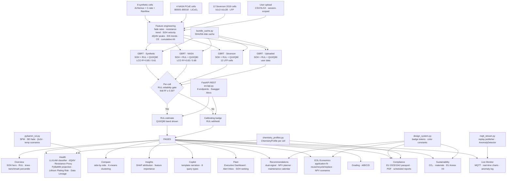

# Battery Intelligence Platform

A battery health monitoring and prediction platform built with scikit-learn and Streamlit. Tracks State of Health (SOH) and predicts Remaining Useful Life (RUL) for lithium-ion cells — validated on real NASA PCoE and Severson 2019 LFP battery aging datasets — with physics-based RUL projection via PyBaMM, live BMS streaming over MQTT, a FastAPI REST layer for system integration, and an AI Copilot that explains every number without inventing anything outside the validated model outputs. Role-aware interface (Engineer / Fleet Manager / Executive) surfaces the right depth for each audience, including a one-screen Executive Summary with CAPEX outlook and PDF export.

**[Live demo →](https://battery-intelligence-platform-sszs92zbkfvfcda3ajtlk7.streamlit.app)**

---

## What it does

Sixteen pages across four workflow groups:

| Group | Pages | What it covers |
|---|---|---|
| **Analyse** | Import, Overview, Health, Compare, Insights, Copilot | Upload data; SOH hero card, RUL with Q10/Q90 band, knee detection; degradation curves, LLI/LAM classifier, dQ/dV, resistance proxy, PyBaMM projection; side-by-side comparison, clustering; SHAP attribution; plain-English + business-language Copilot (11 query types) |
| **Operate** | Executive Summary, Fleet, Recommendations, EOL Economics, Grading, Live Monitor | Single-screen business view (fleet health score, CAPEX outlook, top alerts, PDF export); executive dashboard + alert inbox; maintenance calendar, NPV scenario planner; second-life economics; A/B/C/D grading; real-time MQTT telemetry with anomaly detection |
| **Comply** | Compliance, Sustainability | EU Battery Regulation 2023/1542 passport, PDF export, scheduled reports; lifecycle CO₂, critical material tracker |
| **Configure** | Settings | Application profile (EV/Stationary/UPS/Second-Life), EOL threshold, cost-of-delay multiplier, CRM wt% values, LCO fold R² table |

---

## Data sources

Three real-data modes plus user upload — selectable at runtime:

| Mode | Cells | Chemistry | Source |
|---|---|---|---|
| **NASA Research** | B0005 · B0006 · B0007 · B0018 | LiCoO₂ NCA 18650 | NASA PCoE Battery Aging Dataset, Saha & Goebel 2007 |
| **Severson 2019** | 12 LFP cells (b1c2–b1c28) | LFP | Severson et al., Nature Energy 2019, 4 cycle-life bands |
| **Synthetic Fleet** | Cell1–Cell8 | LiCoO₂ | Physics-informed (Arrhenius SEI, C-rate, Rainflow DoD) |
| **My Data** | User upload | Any | CSV/XLSX — session-scoped, trains fresh model |

Severson CSVs (~700 KB, 12 files) are committed to `data/raw/severson/` so Streamlit Cloud loads them instantly without downloading the 115 MB MATLAB source file.

---

## ML pipeline

1. **Feature engineering** (`src/features.py`): fade rate at 10/30/50-cycle windows, fade acceleration, SOH velocity, resistance normalised (first non-zero as reference), resistance trend, temperature rolling mean, dQ/dV peak features (value, SOC, area, FWHM), Coulombic Efficiency trend, cumulative Ah/kWh, EIS component trends (r_sei, r_ct)
2. **Models**: GradientBoostingRegressor (200 trees, depth 4, lr=0.05) — one per data source. Four models per source: SOH, RUL, Q10 quantile, Q90 quantile.
3. **Validation**: Leave-Cell-Out cross-validation. Per-cell reliability floor: fold R² ≥ 0.30 gates RUL display. Below floor → "Calibrating" badge, RUL withheld.
4. **Uncertainty**: Q10/Q90 prediction interval shown as a shaded band on all RUL charts.
5. **Cache**: SHA256 disk cache (`src/bundle_cache.py`) keyed by cell IDs + cycle counts + `FEATURE_VERSION`. Invalidates automatically when engineering changes.
6. **SHAP**: TreeExplainer cached via `@st.cache_resource` — recomputes only when data source changes.

---

## Phase build history

| Phase | What was built |
|---|---|
| 1 — Core loop | SOH/RUL GBRT, LCO cross-validation, per-cell reliability gate, Overview/Health/Insights pages |
| 2 — Fleet | Multi-cell SOH ranking, fade rate comparison, honest cross-type RUL copy |
| 3 — Copilot | Template-based AI narration grounded strictly on bundle outputs — no LLM API, no invented numbers |
| 4 — Consequences | Second-life economics: application fit scoring, financial comparison (reuse/recycle/replace), break-even chart, CO₂ snapshot. Every figure badged as Cited estimate or Illustrative |
| 5 — Passport + Reports | EU Battery Regulation 2023/1542 data passport: 20 fields across 5 groups. PDF export via reportlab with disclaimer box and full assumption register |
| 6 — Recommendations | Hero-card decision (Continue / Inspect / Second-Life / Recycle) via dual-signal logic: SOH threshold + fade acceleration ratio. Four-tier confidence system (high / medium / lower / uncertain) |
| 7 — Sustainability | Lifecycle CO₂ chart (3 scenarios), critical materials tracker (Co/Ni/Li), EU 2023/1542 Annex XII recycled-content targets |
| 8 — Design system | `src/design_system.py`: single source of truth for badge HTML, color tokens, state badges, Recommendations metadata |
| 9 — Settings | Per-cell LCO fold R² transparency table, RUL floor preview, data source panel |
| 10 — Advanced features | Resistance component proxy (SEI + charge-transfer trends), formation efficiency, rate capability model, dQ/dV differential capacity |
| 11 — Phase 11 | Knee detection, anomaly flags, SoP%, calendar aging, pack spread, cell grading (A/B/C/D), Compare page, Q10/Q90 confidence band, EU passport CRM fields |
| 12 — Severson integration | h5py-based MATLAB v7.3 parser, 12 LFP cell CSVs extracted and committed, Severson mode routed through full pipeline, SHAP caching, Streamlit Cloud crash fixes |
| 13 — Robustness audit | Full crash audit across all pages; 5 KeyError/ValueError bugs fixed; `build_features()` produces all columns needed by every page; `dqdv.add_dqdv_features()` vectorized (~30× faster) |
| 14 — Credibility audit | Honest labelling: dQ/dV LFP warning; "EIS Impedance Analysis" → "Resistance Component Proxy (simulated)"; Li-S / SSB fake chemistry removed; GDPR banner; Severson provenance corrected |
| 15 — Design review (medium items) | Green token consolidation; startup progress bar; CRM reads from `ChemistryProfile.for_cell()`; 3-tier cache (full bundle → features-only → cold); `ChemistryProfile` class hierarchy |
| 16 — Accessibility + Visual Hierarchy | WCAG AA contrast fix (`#8896a8`, 5.2:1); ARIA roles on hero/metrics/sparklines; Overview metric row cut to 3 primary chips + "Cell Details" expander |
| 17 — Nav restructure + UX | 4 labelled nav groups; "EOL Economics" rename; Passport + Reports merged under Compliance tab; `PAGE_ACTIONS` contextual jump buttons; Fleet cell-ID quick-jump row |
| 18 — Decision support + Scalability + Enterprise | Application Profile selectbox auto-sets EOL threshold; Cost-of-Delay multiplier; Log Decision button with CSV export; `_resample_df()` chart downsampler (max 500 pts); Demo Mode banner |
| 19 — Cross-fleet degradation clustering | K-means on last-cycle feature vectors (SOH, fade, resistance, CE); silhouette-optimised k=2–4; scatter + similar-cell cards on Compare page; Fleet risk matrix "ACT" → "INSPECT / REPLACE" |
| 20 — PyBaMM physics-based RUL projection | SPM single-cycle discharge for nominal capacity (Chen2020/NCA_Kim2011/Marquis2019); SEI fade `SOH(n)=1−β·√n` fitted + projected; 3-section diagnostic card (PyBaMM vs GBRT vs Why They Disagree); session-cached |
| 21 — MQTT live BMS streaming | `src/mqtt_stream.py` — replay publisher + subscriber + `AnomalyDetector` (voltage bounds, IEC 62619 temperature, rolling Z-score); Live Monitor page: broker config, real-time Plotly charts, anomaly log with CSV export, 1 s auto-refresh |
| 22 — Expert panel batch 1 (C1–C4, L2–L4, M1, M4–M6, H3, H5) | CSS `:root` spacing/radius/colour tokens; type ramp formalised; `_empty_state()` helper; radar axes → IEC nomenclature; demo banner → corner chip; Fleet as default home; IEC 62619:2022 anomaly flags (`THERMAL_RUNAWAY_PRECURSOR`, `UNDERTEMPERATURE`, `CAPACITY_PLUNGE`); fleet benchmark percentile; Lithium Plating Risk Score (CE dip + consecutive-run classifier, 0–100); PyBaMM `β±2σ` uncertainty band + 15/25/35°C Arrhenius traces; Health page progressive-disclosure tier labels |
| 23 — Expert panel batch 2 (T1, T2, T4, H1, H2, H4, M2) | **Executive Fleet Dashboard** (Fleet Health Index, accelerated-degradation count, CAPEX outlook grid: 3/6/12-month + CO₂ liability); **Proactive Alert Inbox** (critical/high/medium sorted alerts on Fleet page); **LLI vs LAM Classifier** (standalone Health expander — CE slope + fade nonlinearity + resistance rise, works for all chemistries including LFP); **NPV Scenario Planner** (Replace/Wait/Repurpose 5-year NPV with cumulative chart); **Data Lineage** (Health expander — formula, source, valid-cycle count per metric); **Scheduled Report UI** (Reports page — frequency/email/content, production-ready no-op in demo) |
| 24 — FastAPI REST layer + Icon system | **`src/api.py`**: 8 REST endpoints — `GET /cells`, `GET /cells/{id}` (latest SOH/RUL/CE/resistance), `/history`, `/rul` (Q10/Q90 + reliability flag), `/lineage`, `GET /fleet/summary`, `GET /fleet/alerts`; Swagger at `/docs`; `Dockerfile.api` for containerised deployment; `fastapi[standard]` + `uvicorn` in requirements. **L1**: emoji stripped from all `.section-header` divs and page `h1` titles for typographic consistency; expander titles retain emoji as category markers |
| 25 — Business surface | **Role selector** in sidebar (Engineer / Fleet Manager / Executive) — Executive role auto-navigates to Executive Summary. **Executive Summary page**: fleet health score (72pt number), KPIs (cells at risk, CAPEX 3/12-month, CO₂ liability), top 5 alerts, recommended actions, PDF export via reportlab. **Business Copilot queries** (Row 3 in Copilot): "What will replacement cost over the next 12 months?" (12-month budget with best/worst case), "What is the business risk in my fleet?" (risk rating + cost exposure), "Should I replace or repurpose these cells?" (cell-specific Replace/Wait/Repurpose decision with NPV framing) — all in plain English, no battery jargon |

---

## The debugging story (the part that's actually interesting)

**Data leakage, caught.** The first SOH model reported R²=0.96. That number came from a row-level train/test split on a concatenated multi-cell dataset — "test" rows were just the tail of cells the model had already seen. Leave-cell-out validation gives the honest number: R²=0.85 (synthetic) and 0.83 (NASA). Both are real and defensible; the 0.96 was not.

**Per-cell vs dataset-average reliability gate.** The first RUL gate computed one boolean per dataset. B0018 inherited `rul_reliable=True` from the NASA group average (R²=0.68 > floor 0.30) despite its own fold R²=0.22. Fix: `per_cell_rul_reliable = {cell_id: fold_r2 >= floor}` — B0018 now shows "not calibrated" consistently across Overview, Fleet, Copilot, and Recommendations.

**Why two separate models exist.** Training one GBRT on all 12 cells produced R²=−0.49. Synthetic cells have bulk resistance in 0.15–0.40 Ω; NASA cells have EIS electrolyte resistance in 0.04–0.07 Ω. Same feature name, physically incompatible scales. The fix is one model per data source; Fleet ranks by SOH (scale-invariant) not RUL (model-dependent).

**Severson zero-cells bug.** After integrating the Severson dataset, the cloud showed "0 cells · real measured" despite the CSVs being committed. Root cause: `load_cached("severson", {"source": "severson_batch1"})` passed a plain dict as the battery dict. The `_signature()` function iterates `len(cell["cycles"])` over every item — `"severson_batch1"["cycles"]` raises `TypeError`. The outer `try/except` silently caught it and skipped Severson on every boot. Fix: load cells first, then pass the actual `{cell_id: {"cycles": df}}` dict to `load_cached` so the SHA256 signature is computed correctly.

**Streamlit Cloud OOM kill from a 115 MB download.** The first Severson integration auto-downloaded the MATLAB batch file at startup. On Streamlit Cloud (free tier, ~512 MB RAM) this blocked for 2+ minutes then got OOM-killed. Fix: added an `any_cached()` guard — the loader only runs if local CSVs exist. The 12 extracted CSVs (~700 KB) are committed to the repo so cloud always has them.

**MATLAB v7.3 format.** `scipy.io.loadmat` only handles MATLAB v5. Severson Batch 1 is v7.3 (HDF5-based). Error: "Please use HDF reader for matlab v7.3 files, e.g. h5py." Fix: full rewrite using `h5py`. MATLAB struct arrays in HDF5 are `(N, 1)` datasets of object references; `batch["summary"][idx, 0]` dereferences cell `b1cN` at 0-based index `N-1`.

**Severson resistance zero-division.** Severson cycle 1 stores `resistance_ohm=0.0` as a missing-data marker. `initial_r = df["resistance_ohm"].iloc[0]` was 0. Division produced all-inf `resistance_normalized` → `get_model_matrix()` dropped all rows → "Training dataset is empty." Fix: use `df["resistance_ohm"][df["resistance_ohm"] > 0].iloc[0]` as the reference — first non-zero value.

**Assumption transparency audit.** The Consequences page was the first to show financial figures not derived from the model. Three provenance gaps caught in audit: (1) repack cost deducted from the reuse card without its own badge showing; (2) a CO₂ recycling credit (`co2 × 0.15`) had no badge despite being a hardcoded literature factor; (3) a datasheet cell capacity spec was labelled with the same green "Validated" badge as pipeline-tested outputs — wrong, because "validated" in this platform means LCO-tested by the pipeline, not datasheet-authoritative. All three fixed; the distinction is now the point, not a limitation.

**Silent zero from a wrong column name.** The Consequences page read fade rate as `latest.get("fade_30_mah_cy", 0.0)` — but the actual column is `fade_rate_30cy`. The `.get()` default silently returned 0.0 on every render. Every application-fit score and fade-rate display was wrong for weeks. Caught only when Phase 5 passport forced a careful read of the actual DataFrame schema.

**Three Plotly 6 errors in one page.** (1) `legend` and `title` as kwargs through `**base_layout()` — Plotly 6 strict validation rejects them. (2) `yaxis=dict(titlefont=dict(...))` — `titlefont` removed in Plotly 6. (3) Stale `.pyc` on Streamlit Cloud serving old code after adding a new ASSUMPTIONS key. All three in separate commits so the traceback history is clean. `base_layout()` now has an explicit comment blocking the legend/title kwarg pattern.

**Columns missing from Severson cells.** `data_loader.enrich_cycles()` adds `capacity_fade_ah`, `soh_rolling_avg`, `is_eol`, `capacity_fade_rate`, and `cumulative_days`. Synthetic and NASA cells go through that function; Severson cells load from CSVs and go straight into `build_features()`, bypassing it entirely. Pages hard-accessed these columns and crashed on every Severson cell switch. Fix: `build_features()` now computes all five as fallbacks when the column isn't already present.

**`dqdv.add_dqdv_features()` Python row loop.** The original implementation called `df.apply(axis=1)` — a Python-level loop — running `extract_dqdv_features()` once per cycle row. For Severson's 12 cells × ~1177 cycles each, that's ~14,000 Python calls. Rewritten with NumPy broadcasting: compute the OCV derivative once on a `(200,)` array, broadcast across `(n_rows, 200)`. Feature engineering time dropped from ~30 s to <1 s.

**dQ/dV simulation on LFP cells.** The dQ/dV expander ran the LiCoO₂ OCV polynomial on every cell regardless of chemistry. LFP has a flat ≈3.2 V plateau — no distinct dQ/dV peak exists. Applying a LiCoO₂ model to LFP data produces a physically meaningless peak artifact. Fix: check `cell_id.startswith("S-")` and replace the chart with an explicit warning explaining why the simulation is inapplicable for LFP.

**"EIS Impedance Analysis" was not EIS.** The expander labelled "EIS Impedance Analysis" decomposed DC resistance into SEI and charge-transfer components using a circuit model fit to synthetic resistance trends — not an actual electrochemical impedance spectrum. Renamed to "Resistance Component Proxy (simulated)."

**Li-S / SSB chemistry selector was a fake feature.** A selectbox let users choose Li-S or SSB. Selecting either ran the same LiCoO₂ GBRT model regardless — only the visualisation changed. A user selecting Li-S got SOH and RUL numbers from a model trained on LiCoO₂ data with no warning. Removed entirely. Chemistry is now a read-only label derived from the active data source.

**Severson cells labelled SYNTHETIC.** `_cell_provenance()` returned `"measured"` only for `NASA_CELL_IDS` and fell through to `"synthetic"` for everything else. Severson cells (real LFP measurements from a Nature Energy paper) displayed `"○ SYNTHETIC — no physical measurements underlie any value"`. Fix: both provenance functions now check `cell_id.startswith("S-")` alongside the NASA check.

**Unguarded column accesses found in audit.** Six unsafe patterns identified: `latest["resistance_ohm"]` in the sidebar alert loop; dot-notation `df.fade_rate_50cy`; unguarded `df_a["resistance_ohm"]` in Compare page; `min()` over a potentially empty generator in Fleet spread chart. All six fixed — resistance metrics show "N/A" when the column is absent, charts show info messages instead of crashing.

---

## Architecture


```mermaid
flowchart TD
    A1[8 synthetic cells\nArrhenius + C-rate + Rainflow] --> F
    A2[4 NASA PCoE cells\nB0005–B0018 · LiCoO₂] --> F
    A3[12 Severson 2019 cells\nb1c2–b1c28 · LFP] --> F
    A4[User upload\nCSV/XLSX · session-scoped] --> F

    F[Feature engineering\nfade rates · resistance trend · SOH velocity\ndQ/dV peaks · EIS trends · CE · cumulative Ah]

    F --> M1[GBRT · Synthetic\nSOH + RUL + Q10/Q90\nLCO R²=0.85 / 0.61]
    F --> M2[GBRT · NASA\nSOH + RUL + Q10/Q90\nLCO R²=0.83 / 0.68]
    F --> M3[GBRT · Severson\nSOH + RUL + Q10/Q90\n12 LFP cells]
    F --> M4[GBRT · Uploaded\nSOH + RUL + Q10/Q90\nuser data]

    M1 & M2 & M3 & M4 --> G{Per-cell\nRUL reliability gate\nfold R² ≥ 0.30?}

    G -->|Yes| RUL[RUL estimate\nQ10/Q90 band shown]
    G -->|No| NC[Calibrating badge\nRUL withheld]

    RUL & NC --> PAGES

    PAGES --> OV[Overview\nSOH hero · RUL · knee · benchmark percentile]
    PAGES --> HL[Health\nLLI/LAM classifier · dQ/dV · Resistance Proxy\nPyBaMM projection · Lithium Plating Risk · Data Lineage]
    PAGES --> CP[Compare\nside-by-side · K-means clustering]
    PAGES --> IN[Insights\nSHAP attribution · feature importance]
    PAGES --> CO[Copilot\ntemplate narration · 8 query types]
    PAGES --> FL[Fleet\nExecutive Dashboard · Alert Inbox · SOH ranking]
    PAGES --> RC[Recommendations\ndual-signal · NPV planner · maintenance calendar]
    PAGES --> EC[EOL Economics\napplication fit · reuse/recycle/replace · NPV scenarios]
    PAGES --> GR[Grading · A/B/C/D]
    PAGES --> CL[Compliance\nEU 2023/1542 passport · PDF · scheduled reports]
    PAGES --> SU[Sustainability\nCO₂ · materials · EU Annex XII]
    PAGES --> LM[Live Monitor\nMQTT · real-time charts · anomaly log]

    API[FastAPI REST\nsrc/api.py\n8 endpoints · Swagger /docs] --> RUL & NC

    DS[design_system.py\nbadge tokens · color constants] --> RC & EC & CL & SU
    CACHE[bundle_cache.py\nSHA256 disk cache] --> M1 & M2 & M3 & M4
    CP2[chemistry_profiles.py\nChemistryProfile per cell] --> CL & HL
    MQTT[mqtt_stream.py\nreplay publisher · AnomalyDetector] --> LM
    PYBAMM[pybamm_rul.py\nSPM · SEI fade · β±2σ · temp scenarios] --> HL
```

---

## Tech stack

- **Model**: GradientBoostingRegressor (scikit-learn) — one instance per data source, four models each (SOH, RUL, Q10, Q90)
- **Validation**: Leave-cell-out cross-validation; `RUL_RELIABLE_FLOOR = 0.30` gates display per cell
- **Uncertainty**: Q10/Q90 quantile regression intervals on all RUL charts
- **Explainability**: SHAP TreeExplainer (`src/insights.py`), cached per data source
- **Data — real**: NASA PCoE B0005–B0018 (LiCoO₂ 18650, 24°C, 2A) + Severson 2019 batch 1 (LFP, 4 cycle-life bands, Nature Energy)
- **Data — synthetic**: 8 cells with stress variation (T, C-rate, DoD) via Arrhenius SEI, power-law C-rate factor, Rainflow DoD scaling
- **Feature engineering**: `src/features.py` — 17-column feature matrix including dQ/dV peaks, EIS component trends, Coulombic Efficiency, SoP%, calendar aging
- **Dashboard**: Streamlit + Plotly dark theme — all pages in `app/main.py`
- **Cache**: `src/bundle_cache.py` — SHA256 keyed by cell IDs + cycle counts + `FEATURE_VERSION`; joblib compression level 3; two tiers: full bundle + separate features cache so model retrains skip feature engineering
- **Chemistry profiles**: `src/chemistry_profiles.py` — `ChemistryProfile.for_cell(cell_id)` factory dispatches to `LFPSeversonProfile` / `LiCoO2NASAProfile` / `LiCoO2SyntheticProfile` / `UserDefinedProfile`; each subclass owns CRM fields and health section list
- **Physics-based RUL**: `src/pybamm_rul.py` — PyBaMM SPM single-cycle discharge sets nominal capacity; SEI growth equation `SOH(n) = 1 − β·√n` fitted + projected; `β±2σ` uncertainty band; temperature scenarios at 15/25/35°C via Arrhenius correction `β(T)=β₀·exp(−Ea/RT)`, Ea=50 kJ/mol
- **Degradation mechanism classifier**: CE slope + fade nonlinearity (linear vs quadratic) + resistance rise rate → LLI vs LAM verdict with confidence indicator; works for all chemistries
- **Degradation clustering**: K-means on last-cycle feature vectors (SOH, fade rate, resistance, CE); silhouette-optimised k=2–4; shown on Compare page
- **MQTT streaming**: `src/mqtt_stream.py` — `paho-mqtt` publisher/subscriber + `AnomalyDetector` (voltage bounds, IEC 62619:2022 temperature limits, rolling Z-score window=20); replay publisher replays historical cell data as live telemetry
- **IEC 62619:2022 safety limits**: `UNDERTEMPERATURE` (−20°C), `THERMAL_RUNAWAY_PRECURSOR` (5°C/step, §8.2), `TEMP_RATE_HIGH` (2°C/step warning), `CAPACITY_PLUNGE` (>5% SOC drop per reading)
- **Executive dashboard**: Fleet Health Index, accelerated-degradation count, CAPEX grid (3/6/12-month horizons + CO₂ liability), proactive alert inbox (critical/high/medium severity)
- **NPV scenario planner**: 3-strategy comparison (Replace Now / Wait to EOL / Repurpose) over 5-year horizon with adjustable discount rate, energy price, and replacement cost
- **FastAPI REST layer**: `src/api.py` — 8 endpoints exposing validated bundle data; Swagger UI at `/docs`; `Dockerfile.api` for containerised deployment; `fastapi[standard]` + `uvicorn`
- **Copilot**: Template narration (`src/copilot.py`) — no LLM, no external calls; every sentence traces to a bundle value
- **EOL Economics**: Literature-grounded assumption layer — 8 financial/environmental figures, each sourced or flagged as engineering judgment, badged at render time
- **Design system**: `src/design_system.py` — single source of truth for badge HTML, color tokens, Recommendations metadata; CSS `:root` tokens (`--sp-1`–`--sp-4`, `--r-chip`, `--r-card`); WCAG AA contrast throughout (`#8896a8`, 5.2:1 on `#1a202c`)
- **Compliance**: EU Battery Regulation 2023/1542 field structure (`src/passport.py`) — single source consumed by both Passport page and PDF
- **Reports**: PDF via reportlab — disclaimer box, color-coded tables, assumption register; scheduled report configuration UI

---

## Production Readiness Roadmap

This platform runs as a portfolio demo with intentional constraints. The table below documents the credible path to production deployment.

| Gap | Demo behaviour | Production path |
|-----|---------------|-----------------|
| **Authentication** | No auth — all sessions share the same data | [`streamlit-authenticator`](https://github.com/mkhorasani/Streamlit-Authenticator) (JWT, OAuth2 via Okta/LDAP) |
| **Multi-tenancy** | `st.cache_resource` shared across all users | Tenant-scoped caches; per-org cell namespace in SQLite/PostgreSQL |
| **Upload persistence** | Uploads are session-scoped and lost on refresh | Store processed bundles in SQLite locally, PostgreSQL in cloud |
| **REST API** | `src/api.py` — 8 endpoints, Swagger UI, Dockerfile | Connect to live database; add JWT auth middleware; deploy via `Dockerfile.api` to Cloud Run / ECS |
| **Scheduled reports** | UI configuration only (no-op in demo) | Wire to APScheduler / Celery worker; SMTP for delivery; S3 for PDF storage |
| **MQTT production** | Connects to public test.mosquitto.org broker | Point `MQTT_HOST` / `MQTT_PORT` at BMS broker; add TLS + broker auth credentials |
| **RBAC** | No role separation | Engineer / Fleet-ops / Read-only roles; action gating on `Recommendations` write |
| **Audit logging** | `audit.py` logs page views to local CSV | Forward to structured log store (Datadog / CloudWatch); immutable audit trail per EU 2023/1542 |
| **Model retraining** | Blocking call on server start | Background worker (Celery / APScheduler); re-train nightly on new uploads, push updated bundle |
| **Scalability** | All cells loaded into RAM as full DataFrames | Per-cell lazy load from Parquet/SQLite; summary metrics pre-computed and cached |
| **Secrets management** | Anthropic API key in `.streamlit/secrets.toml` | AWS Secrets Manager / GCP Secret Manager; never in source |
| **CI/CD** | Manual `streamlit run` | GitHub Actions: lint → pytest → Docker build → deploy to Cloud Run or ECS |

Estimated effort to reach internal-fleet MVP: 3–4 sprints (auth + persistence + MQTT production broker + Docker deployment pipeline).

---

## Deliberate scope limits

- **No unified cross-source RUL model**: requires cells with diverse operating conditions at the same resistance scale. NASA cells were all tested identically (24°C, 2A) — the only variation is manufacturing spread, not the T/C-rate/DoD needed to make a combined resistance signal meaningful. Gate documented in Settings.
- **No LLM in Copilot**: deliberate. Template narration enforces the reliability gate mechanically — an LLM generates confident text for B0018 even when told not to. The template cannot.
- **No regulatory compliance claim**: the platform demonstrates EU 2023/1542 field structure with honest coverage. Real compliance requires manufacturer identity records, accredited carbon audits, and notified-body sign-off that a portfolio project cannot provide. The gap acknowledgment is the point.
- **No aggregated sustainability score**: a single green metric mixing lifecycle CO₂, material recovery, and regulatory alignment would aggregate figures with very different confidence levels. Individual labelled figures are more honest than any index.
- **RUL floor hardcoded**: the Settings page shows a read-only preview. Adjusting the reliability threshold is a model calibration decision that belongs in git history, not a runtime toggle.

---

## Run locally

```bash
pip install -r requirements.txt
streamlit run app/main.py
```

NASA and Severson cell CSVs are pre-committed to `data/raw/`. The Severson source MATLAB file (115 MB) is gitignored — to re-extract locally:

```bash
python src/severson_loader.py
```

The NASA raw `.mat` files and ZIP are also gitignored (22 MB); re-download with:

```bash
python src/nasa_loader.py
```

**FastAPI REST layer** (separate process, optional):

```bash
uvicorn src.api:app --reload --port 8000
# Swagger UI → http://localhost:8000/docs
```

Or via Docker:

```bash
docker build -f Dockerfile.api -t battery-api .
docker run -p 8000:8000 battery-api
```
