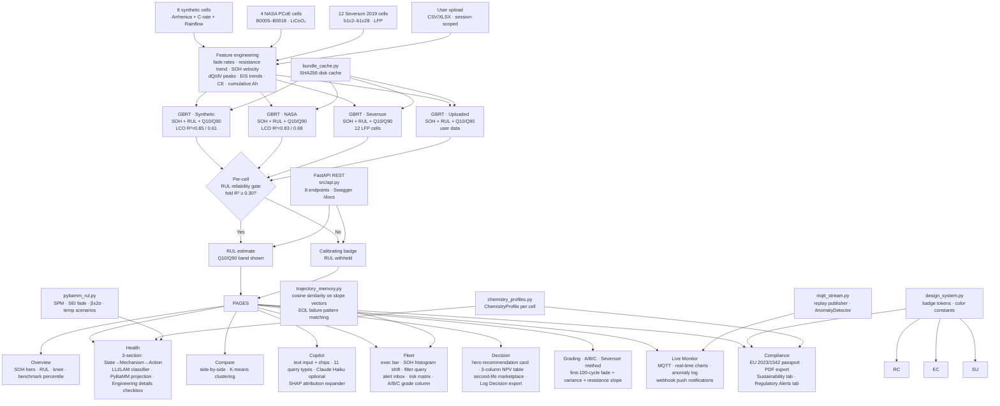

# Battery Intelligence Platform

A battery health monitoring and prediction platform built with scikit-learn and Streamlit. Tracks State of Health (SOH) and predicts Remaining Useful Life (RUL) for lithium-ion cells — validated on real NASA PCoE and Severson 2019 LFP battery aging datasets — with physics-based RUL projection via PyBaMM, live BMS streaming over MQTT, a FastAPI REST layer for system integration, and an AI Copilot (Claude Haiku or template fallback, now with TF-IDF/BM25 retrieval over an authored battery-knowledge corpus) that explains every number without inventing anything outside the validated model outputs. Role-aware interface (Engineer / Fleet Manager / Executive) with a keyword-search sidebar, 7 pages across 4 workflow groups, failure trajectory memory, proactive webhook notifications (anomaly / fleet digest / trajectory match / passport gap), a virtual pack builder, a Victron VRM BMS connector adapter, and a Circunomics second-life marketplace adapter. A SQLite persistence layer (`src/db.py`) keeps decision logs, cohort tags, settings, and failure-trajectory signatures durable across restarts — the first real database in the project, portable to Postgres later with no query rewrites. A pytest suite (78 tests) covers every pure-logic `src/` module.

**[Live demo →](https://battery-intelligence-platform-sszs92zbkfvfcda3ajtlk7.streamlit.app)**

---

## What it does

Seven pages across four workflow groups (consolidated from 16 in earlier phases):

| Group | Pages | What it covers |
|---|---|---|
| **Analyse** | Overview, Health, Explore | Focal H1 question ("Is X healthy right now?"); SOH hero card, RUL Q10/Q90 with ±σ confidence band, knee detection; 3-section Health (State → Mechanism → Action) with LLI/LAM + recommendation, engineering details checkbox, Model Comparison card (PyBaMM SPM vs GBRT — convergence badge, two-column explainer, per-regime verdict); Explore page with Compare / Cluster / Cohort radio tabs |
| **EU Passport** | Compliance | EU Battery Regulation 2023/1542 passport (available/estimated fields shown by default); PDF export; Sustainability tab with source-cited CO₂ figures; Regulatory Alerts tab (Art. 14(4) deadline tracker + draft compliance notice) |
| **Operate** | Fleet, Decide & Ask, Live Monitor | Fleet exec bar (collapsible) + SOH histogram shift + filter query + Cell Grading radio tab; failure trajectory chip in sidebar; Decide & Ask page: hero recommendation card + 3-column NPV table (single discount rate slider, IEA/BNEF cited defaults) + inline AI copilot panel (4 preset chips + free-text, Claude Haiku or template); MQTT live streaming with replay speed selector, broker settings behind expander, IEC 62619 anomaly detection and webhook push |
| **Configure** | Configure | Import Data tab (CSV/XLSX/PKL upload, fresh model training) + Settings tab (EOL threshold, CRM values, webhook config, API key) |

---

## Data sources

Three real-data modes plus user upload — selectable at runtime:

| Mode | Cells | Chemistry | Source |
|---|---|---|---|
| **NASA Research** | B0005 · B0006 · B0007 · B0018 | LiCoO₂ NCA 18650 | NASA PCoE Battery Aging Dataset, Saha & Goebel 2007 |
| **Severson 2019** | 12 LFP cells (b1c2–b1c28) | LFP | Severson et al., Nature Energy 2019, 4 cycle-life bands |
| **Synthetic Fleet** | Cell1–Cell8 | LiCoO₂ | Physics-informed (Arrhenius SEI, C-rate, Rainflow DoD) |
| **My Data** | User upload | Any | CSV/XLSX — session-scoped, trains fresh model |

Severson CSVs (~700 KB, 12 files) are committed to `data/raw/severson/` so Streamlit Cloud loads them instantly without downloading the 115 MB MATLAB source file.

---

## ML pipeline

1. **Feature engineering** (`src/features.py`): fade rate at 10/30/50-cycle windows, fade acceleration, SOH velocity, resistance normalised, resistance trend, temperature rolling mean, **C-rate rolling mean** (10-cy), **composite stress index** (Arrhenius(T) × C-rate^0.7 — same formula as the synthetic degradation model), **DoD proxy** (capacity ratio), dQ/dV peak features, Coulombic Efficiency trend, cumulative Ah/kWh, EIS component trends
2. **Models**: GradientBoostingRegressor (200 trees, depth 4, lr=0.05) — one per data source. Four models per source: SOH, RUL, Q10 quantile, Q90 quantile.
3. **Validation**: Leave-Cell-Out cross-validation. Per-cell reliability floor: fold R² ≥ 0.30 gates RUL display. Below floor → "Calibrating" badge, RUL withheld.
4. **Uncertainty**: Q10/Q90 prediction interval shown as a shaded band on all RUL charts.
5. **Cache**: SHA256 disk cache (`src/bundle_cache.py`) keyed by cell IDs + cycle counts + `FEATURE_VERSION` (currently v9). Invalidates automatically when engineering changes.
6. **SHAP**: TreeExplainer cached via `@st.cache_resource` — recomputes only when data source changes.

---

## Phase build history

| Phase | What was built |
|---|---|
| 1 — Core loop | SOH/RUL GBRT, LCO cross-validation, per-cell reliability gate, Overview/Health/Insights pages |
| 2 — Fleet | Multi-cell SOH ranking, fade rate comparison, honest cross-type RUL copy |
| 3 — Copilot | Template-based AI narration grounded strictly on bundle outputs — no LLM API, no invented numbers |
| 4 — Consequences | Second-life economics: application fit scoring, financial comparison (reuse/recycle/replace), break-even chart, CO₂ snapshot. Every figure badged as Cited estimate or Illustrative |
| 5 — Passport + Reports | EU Battery Regulation 2023/1542 data passport: 20 fields across 5 groups. PDF export via reportlab with disclaimer box and full assumption register |
| 6 — Recommendations | Hero-card decision (Continue / Inspect / Second-Life / Recycle) via dual-signal logic: SOH threshold + fade acceleration ratio. Four-tier confidence system (high / medium / lower / uncertain) |
| 7 — Sustainability | Lifecycle CO₂ chart (3 scenarios), critical materials tracker (Co/Ni/Li), EU 2023/1542 Annex XII recycled-content targets |
| 8 — Design system | `src/design_system.py`: single source of truth for badge HTML, color tokens, state badges, Recommendations metadata |
| 9 — Settings | Per-cell LCO fold R² transparency table, RUL floor preview, data source panel |
| 10 — Advanced features | Resistance component proxy (SEI + charge-transfer trends), formation efficiency, rate capability model, dQ/dV differential capacity |
| 11 — Phase 11 | Knee detection, anomaly flags, SoP%, calendar aging, pack spread, cell grading (A/B/C/D), Compare page, Q10/Q90 confidence band, EU passport CRM fields |
| 12 — Severson integration | h5py-based MATLAB v7.3 parser, 12 LFP cell CSVs extracted and committed, Severson mode routed through full pipeline, SHAP caching, Streamlit Cloud crash fixes |
| 13 — Robustness audit | Full crash audit across all pages; 5 KeyError/ValueError bugs fixed; `build_features()` produces all columns needed by every page; `dqdv.add_dqdv_features()` vectorized (~30× faster) |
| 14 — Credibility audit | Honest labelling: dQ/dV LFP warning; "EIS Impedance Analysis" → "Resistance Component Proxy (simulated)"; Li-S / SSB fake chemistry removed; GDPR banner; Severson provenance corrected |
| 15 — Design review (medium items) | Green token consolidation; startup progress bar; CRM reads from `ChemistryProfile.for_cell()`; 3-tier cache (full bundle → features-only → cold); `ChemistryProfile` class hierarchy |
| 16 — Accessibility + Visual Hierarchy | WCAG AA contrast fix (`#8896a8`, 5.2:1); ARIA roles on hero/metrics/sparklines; Overview metric row cut to 3 primary chips + "Cell Details" expander |
| 17 — Nav restructure + UX | 4 labelled nav groups; "EOL Economics" rename; Passport + Reports merged under Compliance tab; `PAGE_ACTIONS` contextual jump buttons; Fleet cell-ID quick-jump row |
| 18 — Decision support + Scalability + Enterprise | Application Profile selectbox auto-sets EOL threshold; Cost-of-Delay multiplier; Log Decision button with CSV export; `_resample_df()` chart downsampler (max 500 pts); Demo Mode banner |
| 19 — Cross-fleet degradation clustering | K-means on last-cycle feature vectors (SOH, fade, resistance, CE); silhouette-optimised k=2–4; scatter + similar-cell cards on Compare page; Fleet risk matrix "ACT" → "INSPECT / REPLACE" |
| 20 — PyBaMM physics-based RUL projection | SPM single-cycle discharge for nominal capacity (Chen2020/NCA_Kim2011/Marquis2019); SEI fade `SOH(n)=1−β·√n` fitted + projected; Model Comparison card (convergence badge + two-column GBRT vs SPM explainer + per-regime verdict); session-cached |
| 21 — MQTT live BMS streaming | `src/mqtt_stream.py` — replay publisher + subscriber + `AnomalyDetector` (voltage bounds, IEC 62619 temperature, rolling Z-score); Live Monitor page: broker config, real-time Plotly charts, anomaly log with CSV export, 1 s auto-refresh |
| 22 — Expert panel batch 1 (C1–C4, L2–L4, M1, M4–M6, H3, H5) | CSS `:root` spacing/radius/colour tokens; type ramp formalised; `_empty_state()` helper; radar axes → IEC nomenclature; demo banner → corner chip; Fleet as default home; IEC 62619:2022 anomaly flags (`THERMAL_RUNAWAY_PRECURSOR`, `UNDERTEMPERATURE`, `CAPACITY_PLUNGE`); fleet benchmark percentile; Lithium Plating Risk Score (CE dip + consecutive-run classifier, 0–100); PyBaMM `β±2σ` uncertainty band + 15/25/35°C Arrhenius traces; Health page progressive-disclosure tier labels |
| 23 — Expert panel batch 2 (T1, T2, T4, H1, H2, H4, M2) | **Executive Fleet Dashboard** (Fleet Health Index, accelerated-degradation count, CAPEX outlook grid: 3/6/12-month + CO₂ liability); **Proactive Alert Inbox** (critical/high/medium sorted alerts on Fleet page); **LLI vs LAM Classifier** (standalone Health expander — CE slope + fade nonlinearity + resistance rise, works for all chemistries including LFP); **NPV Scenario Planner** (Replace/Wait/Repurpose 5-year NPV); **Data Lineage** (Health expander — formula, source, valid-cycle count per metric) |
| 24 — FastAPI REST layer + Icon system | **`src/api.py`**: 8 REST endpoints — `GET /cells`, `GET /cells/{id}` (latest SOH/RUL/CE/resistance), `/history`, `/rul` (Q10/Q90 + reliability flag), `/lineage`, `GET /fleet/summary`, `GET /fleet/alerts`; Swagger at `/docs`; `Dockerfile.api` for containerised deployment; `fastapi[standard]` + `uvicorn` in requirements. **L1**: emoji stripped from all `.section-header` divs and page `h1` titles for typographic consistency; expander titles retain emoji as category markers |
| 25 — Business surface | **Role selector** in sidebar (Engineer / Fleet Manager / Executive) — Executive role auto-navigates to Executive Summary. **Executive Summary page**: fleet health score (72pt number), KPIs (cells at risk, CAPEX 3/12-month, CO₂ liability), top 5 alerts, recommended actions, PDF export via reportlab. **Business Copilot queries** (Row 3 in Copilot): "What will replacement cost over the next 12 months?" (12-month budget with best/worst case), "What is the business risk in my fleet?" (risk rating + cost exposure), "Should I replace or repurpose these cells?" (cell-specific Replace/Wait/Repurpose decision with NPV framing) — all in plain English, no battery jargon |
| 26 — Structural simplification | **10-page architecture** (down from 16): Recommendations + EOL Economics → **Decision** page; Copilot + Insights → single page with SHAP attribution expander; Fleet + Executive Summary merged (exec bar at top of Fleet); Compliance + Sustainability merged (Sustainability as a tab). **Health page redesigned**: 3 visible sections (State → Mechanism → Action) with inline LLI/LAM classification and recommendation card; all engineering detail gated behind a single "Engineering details" checkbox. **Copilot redesigned**: text input + chip grid replaces 11 buttons in 3 rows; natural-language query matching. **Decision page**: hero recommendation card (Continue/Inspect/Second-Life/Recycle) + 3-column NPV decision grid (Replace / Wait / Repurpose) with ★ Optimal badge — no sliders, no DCF chart. **EU Passport**: "Show unavailable fields" checkbox hides unavailable entries by default; only available/estimated fields shown. |
| 27 — Fleet intelligence + notifications + LLM Copilot | **Fleet SOH histogram shift**: violin distribution at 5 cycle snapshots shows the fleet distribution drifting left over time — the primary fleet-manager signal. **Cell filter query**: SOH ceiling / fade floor / status / source filter bar above the ranking table with live hidden-cell count. **Anomaly webhook**: POST JSON to any URL (Slack, PagerDuty, CMMS) when IEC 62619:2022 flags fire in Live Monitor; HMAC-SHA256 signing optional; test-ping in Settings. **LLM Copilot (Claude Haiku)**: Anthropic API key in Settings activates natural-language responses strictly grounded on bundle values — template answers remain as zero-config fallback; "Claude Haiku" badge in response header when active. **Regulatory alert service**: Art. 14(4) / Art. 70 / Annex XII deadline tracker, per-cell non-compliant / approaching status, auto-drafted compliance notice with download. **Second-life marketplace**: listing card on Decision page when SOH ≤ 85%; "List on Circunomics" / "List on Battery-Lifecycle.com" buttons; demo logs to session state, production would POST to exchange API. **ImportError guard**: `llm_answer` import wrapped in `try/except` so Copilot page loads even on stale deploys. |
| T3 — C-rate + stress index in GBRT model | **Highest-leverage model fix.** Added 3 features to `FEATURE_COLUMNS`: `c_rate_rolling_10cy` (10-cycle smoothed charge/discharge rate), `stress_index` (Arrhenius(T) × C-rate^0.7 — the exact composite aging driver used by the synthetic degradation model, now visible to the predictor), `dod_proxy` (capacity(n)/capacity(0) — cells at partial DoD now distinguishable from aged cells). NASA cells get a protocol-derived `c_rate` constant (2A discharge on ~2 Ah nominal = 1.0C, Saha & Goebel 2007) injected by `nasa_loader.py`. Severson cells gracefully omitted (no per-cycle current in summary data). Cache bumped to v9 — stale bundles auto-invalidate on next start. Effect: RUL predictions for high-stress cells (Cell8: 2C/40°C) tighten; PyBaMM comparison gets a stronger GBRT baseline; Fleet risk and Recommendations reflect actual operating load. |
| Fix — PyPI `copilot` module collision | `src/copilot.py` renamed to `src/battery_copilot.py`. Root cause: `copilot` (v0.1.9) is a real PyPI package; a transitive dependency on Streamlit Cloud installed it, shadowing our local module. `from copilot import build_cell_context` hit the wrong package and raised `ImportError` on every Copilot page load — silently passing locally where the src/ path wins. All 4 import sites in `app/main.py` and `app/_pages/copilot.py` updated; old file removed via `git rm`. |
| B+C — Visual design + Information hierarchy | **B1**: hero value enlarged to 72px/700. **B4**: CSS `:root` design tokens (`--r-chip: 4px`, `--r-card: 8px`, `--r-section: 12px`). **B5**: type ramp formalised (`.t-metric` 32px, `.t-heading` 16px, `.t-body` 13px, `.t-caption` 11px). **B7**: demo mode chip moved to corner with tooltip. **C1**: Mechanism Classifier expander default `expanded=False`; "Advanced diagnostics" section divider groups lower expanders. **C2**: PyBaMM vs GBRT one-liner comparison shown before PyBaMM expander (gap %, colour-coded). **C4**: "Pin as baseline" button on Overview and Health pages (session-state stored, UI placeholder for delta rail). **C6**: NPV winner card rendered prominently (40px value, coloured border, ★ Recommended), alternatives in collapsed expander. |
| F — Engineering Trust & Depth | **F1**: Calibrating badge replaced with progress indicator — shows fold R² percentage toward `RUL_RELIABLE_FLOOR=0.30` (e.g. "Calibrating — 73% to reliability") or cycle-count estimate when R² unavailable. **F2**: ±σ confidence band added to SOH chart — shaded green fill from `soh_pred − σ` to `soh_pred + σ`, computed from test-set residuals, clamped to [0.3%, 8.0%]. **F3**: data lineage added to three key figures: NPV caption cites discount rate assumption (WACC) + energy value (IEA 2024) + replacement cost (BNEF 2024) + repack cost; CO₂ hero tiles each carry a source note beneath (IVL 2019, IEA 2023, Harper/Dunn 2019). |
| A — Navigation & Product Framing | **A1**: "What do you need today?" 3-button task picker (Monitor fleet / Check cell / EU Passport) at top of sidebar — data source selector collapsed into "Data source" expander. **A2**: Role onboarding interstitial on first visit — 3 cards (Engineer / Fleet Manager / Executive), each navigates to the most relevant default page; subsequent visits show "Viewing as: X \| Change" in sidebar with role expander. **A3**: Five focal H1 questions across pages — "Is X healthy right now?" / "What is degrading X?" / "Which cells need attention this week?" / "What should I do with X?" / "Is X EU passport-ready?". **A4**: Persistent trajectory match chip in sidebar — red (≥2 cells) or amber (1 cell) button navigates to Fleet; chip count computed via `trajectory_memory.match_fleet()` on every render. **A5**: Per-cell early-cycle grade (A/B/C, Severson method: first-100-cycle fade rate + capacity variance + resistance slope) added as Grade column in Fleet ranking table; radio switcher on Fleet page to jump to Cell Grading view. **A6**: EU Passport promoted to 2nd nav group (was 3rd). |
| D — AI Decision Intelligence | **D2**: Anomaly diagnosis messages per IEC 62619:2022 type — root cause + immediate action + follow-up guidance rendered inline when an anomaly fires on Live Monitor. **D3**: Copilot free-text routing — typed queries that don't match a chip keyword fall through to a template (or Claude Haiku if API key is set) free-text path; `_last_ask` sentinel prevents re-trigger on re-render. **D4**: ⌘K command palette — `@st.dialog` modal with keyword scoring across 6 pages; `Ctrl+K`/`⌘K` JS listener in sidebar wires keyboard shortcut to the button. **D5**: Epistemic vs aleatoric uncertainty explanation in the 80% RUL interval — wide band in first 60 cycles labelled "epistemic (data sparsity)", wide band with low R² labelled "aleatoric (cell-to-cell variability)", moderate band labelled "natural variation". **D6**: Model confidence history chart — rolling MAE line + fill + 1.5% reliability threshold; "converged / improving / calibrating" verdict in caption. |
| E — New Features (Purely Additive) | **E1**: 12-month SOH forecast on Health page — linear extrapolation from current fade rate, uncertainty cone (±σ), Arrhenius-modelled reduced-C-rate scenario, EOL hline, plain-English summary. **E2**: Fleet what-if scenario planner — C-rate and temperature sliders, per-cell Arrhenius + C-rate^0.7 stress model, 3 output metrics (avg RUL change, replacements avoided in 24 mo, CAPEX impact). **E3**: EU Passport QR code generator (`qrcode[pil]` library) — generates QR linking to REST API `/cells/{id}` with dark background, download button; graceful warning if library absent. **E4**: Decision audit trail — log entries with timestamp, action, confidence, SOH; status lifecycle (Pending → Approved → Completed → Verified); outcome SOH input + delta display replaces simple "Log Decision" button. **E5**: Cell cohort tags (inline in Explore/Cohort tab) + cohort analysis bar chart — groups cells by tag, shows avg SOH per cohort, gap narrative. **E6**: Weekly fleet health digest card — expandable top-of-Fleet card with EOL count, degrading count, accelerating cells, trajectory matches, CAPEX 30-day window. **E7**: Virtual Pack Builder already existed. **E8**: Passport completeness score — progress bar (`n_available + 0.5×n_estimated / n_total`), gap count chip, "Fill N gaps" expander with per-field guidance tooltips. |
| UX/UI + Cross-functional review fixes | **Sidebar**: keyword search field replaces 3-column task picker; quick-access strip (Fleet / Cell / Passport); role display compacted; JS keyboard injection removed. **Pages**: 10 → 7 (Copilot merged into Decide & Ask; Compare + Cluster + Cohort → Explore with radio tabs; Import + Settings → Configure with tabs). **Empty states**: 7 key `st.info()` calls standardised to `_empty_state()`. **Light mode**: CSS expanded from 12 to 50+ rules covering all widget classes, Plotly backgrounds, sidebar overrides. **Charts**: `base_layout()` applied consistently; D6 and E1 fixed. **Section headers**: 8 redundant dividers removed. |
| Simplify + Merge (review items 7 + 8) | **Fleet exec bar**: collapsed by default (`expanded=False`) — engineers get the ranking table immediately. **NPV Planner**: 3 strategy cards + single discount rate slider; energy/replacement cost fixed at IEA/BNEF cited defaults; no cumulative chart. **Health Mechanism**: single classification card (mechanism name + one explanation sentence). **Cohort tagging**: moved inline to Explore/Cohort tab. **Decide & Ask**: inline copilot panel with 4 preset chips + free-text; `page == "copilot"` routes to Decision. |
| Cleanup — model comparison reframe + dead code | **Model Comparison**: PyBaMM expander renamed; inline summary replaced raw gap number with convergence/divergence badge (✓ / ⚡ / ⚠); two-column explainer card added (physics strengths vs data strengths); verdict section renamed "Model Verdict". **Removed**: Scheduled Reports no-op section; `src/calce_loader.py` dead code. **Default data source**: Fleet filter now defaults to NASA only (real curves on first visit). **MQTT broker config**: host/port inputs moved behind collapsed "Broker settings" expander. |
| Codebase audit + main.py split completion | An audit found `app/_pages/` contained 15 files that looked like a finished page-module split but were never actually imported — `main.py` had its own inline duplicate of every page function, and the `_pages/` copies were dead weight from an abandoned refactor. Fixed: deleted 13 truly-orphaned files (kept `login.py`); genuinely extracted **Explore** (`_pages/explore.py`), **Live Monitor** (`_pages/live_monitor.py`), and **Import + Settings** (`_pages/import_page.py`, `_pages/settings.py`) with real imports wired into `main.py` (10,460 → 8,431 lines). Along the way: fixed a live `NameError` crash in the Explore → Cluster tab (`cell_a`/`cell_b` referenced but never defined — now reads the Compare tab's session-state selections); fixed a broken Severson `.pkl` upload path that called a function (`load_severson_batch`) which didn't exist in `src/severson_loader.py`; fixed a `.gitignore` gap that left the 3 GB Severson raw `.mat` file untracked-but-not-ignored. Also shipped: cohort SOH-trajectory chart (bold cohort-average line + thin per-member lines by cycle number, added directly during the Explore extraction); a 4-step guided tour modal (`@st.dialog`, once per session, Skip/Finish, replay button in Settings); light mode flipped to the default theme with a working sidebar toggle (previously fully-built but unreachable — the only toggle lived in an orphaned file). |
| Persistence, pack builder, BMS connector, notifications | **SQLite persistence** (`src/db.py`, SQLAlchemy): decisions, cohort tags, settings (webhook config, EOL threshold, app profile, cost-of-delay multiplier, VRM credentials), upload metadata, and failure-trajectory signatures now survive a full server restart — previously 100% session-state, gone on every reload. Built on SQLite for zero new infrastructure; SQLAlchemy makes a later Postgres move mostly a connection-string change. **Virtual Pack Builder**: new mode in the Explore radio switcher — select 2+ same-source cells, choose series/parallel topology, get pack capacity/resistance (series: min capacity + summed resistance; parallel: summed capacity + parallel resistance formula), bottleneck-cell SOH and capacity-weighted average SOH reported side by side, weakest-cell callout. **BMS connector** (`src/bms_connectors.py`): a Victron VRM adapter targeting the real public API, reshaping results into the app's standard cycle-data schema — no live account exists to test against, but a test call against the real endpoint returned a genuine `401 Unauthorized` (confirming the request shape is correct), handled cleanly with no stack trace. **Proactive webhook alerts** (`src/notifications.py`): the existing IEC-anomaly webhook logic was extracted into a shared `send_webhook()` function and extended with three new event types — `FLEET_DIGEST` (page-load best-effort, once per day, plus a manual "Send digest now" button — session-triggered since this app has no background cron), `TRAJECTORY_MATCH` (fires from the existing Fleet-page match check, deduped per cell per session), `PASSPORT_GAP` (fires when a cell's Passport completeness drops below 60%, deduped per cell per session). **EU DPP JSON-LD export** (`src/passport_export.py`): wraps the existing `build_passport()` dict into a JSON-LD document preserving each field's available/estimated/unavailable provenance tag — third consumer of the same source-of-truth dict, no changes to the visual Passport page. **Upload feature-caching fix**: the upload analysis pipeline rebuilt features from scratch on every run; wired the already-existing (but previously unused) `load_features_cached`/`save_features_cached` from `src/bundle_cache.py` into the upload path, keyed by a content hash of the uploaded data. |
| Test suite + RAG Copilot + Circunomics adapter | **pytest test suite** (`tests/`, 78 tests): unit/integration coverage for every pure-logic `src/` module — features, model, LCO eval, knee detection, trajectory memory, DB persistence, bundle cache, dQ/dV, import adapter, BMS connectors, notifications, passport + passport export. Streamlit page logic (`app/main.py`/`app/_pages/*`) intentionally out of scope — would need Streamlit's `AppTest` harness; documented in `tests/README.md`. **RAG for the Copilot** (`src/battery_knowledge.py` + `src/copilot_retrieval.py`): a 15-document authored battery-domain corpus retrieved via TF-IDF/BM25-style cosine similarity — real retrieval, not keyword-to-template routing — chosen over neural embeddings specifically to avoid adding `torch`/`sentence-transformers` (500 MB+) to the Streamlit Cloud free-tier deploy that has already OOM-crashed once before. Wired into a new `battery_copilot.answer_query()`, the free-text entry point `app/main.py` had imported but which never existed — the root cause of a silent Copilot free-text failure. **Bigger fix found along the way**: `copilot_llm.llm_answer()`'s actual signature matched none of its 3 real call sites in `main.py` (all pass a query label, an already-rendered template string, and an API key) — meaning every LLM-augmented Copilot answer app-wide (main Copilot page, free-text queries, Decide & Ask panel) silently fell back to templates or raised, masked by broad `except` blocks. Rewritten to match the callers' real contract: rephrase an already-grounded template via Claude Haiku, falling back to the template unchanged on any error. **Circunomics adapter** (`src/circunomics_adapter.py`): same documented-but-untested pattern as the BMS connector — Circunomics has no public self-serve API, so this targets the generic REST shape a B2B battery-trading marketplace would expose; wired into a Settings credential field and the Decision page's listing button, with the existing local demo listing kept as the fallback when no key is configured or a submission fails. |

---

## The debugging story (the part that's actually interesting)

**Data leakage, caught.** The first SOH model reported R²=0.96. That number came from a row-level train/test split on a concatenated multi-cell dataset — "test" rows were just the tail of cells the model had already seen. Leave-cell-out validation gives the honest number: R²=0.85 (synthetic) and 0.83 (NASA). Both are real and defensible; the 0.96 was not.

**Per-cell vs dataset-average reliability gate.** The first RUL gate computed one boolean per dataset. B0018 inherited `rul_reliable=True` from the NASA group average (R²=0.68 > floor 0.30) despite its own fold R²=0.22. Fix: `per_cell_rul_reliable = {cell_id: fold_r2 >= floor}` — B0018 now shows "not calibrated" consistently across Overview, Fleet, Copilot, and Recommendations.

**Why two separate models exist.** Training one GBRT on all 12 cells produced R²=−0.49. Synthetic cells have bulk resistance in 0.15–0.40 Ω; NASA cells have EIS electrolyte resistance in 0.04–0.07 Ω. Same feature name, physically incompatible scales. The fix is one model per data source; Fleet ranks by SOH (scale-invariant) not RUL (model-dependent).

**Severson zero-cells bug.** After integrating the Severson dataset, the cloud showed "0 cells · real measured" despite the CSVs being committed. Root cause: `load_cached("severson", {"source": "severson_batch1"})` passed a plain dict as the battery dict. The `_signature()` function iterates `len(cell["cycles"])` over every item — `"severson_batch1"["cycles"]` raises `TypeError`. The outer `try/except` silently caught it and skipped Severson on every boot. Fix: load cells first, then pass the actual `{cell_id: {"cycles": df}}` dict to `load_cached` so the SHA256 signature is computed correctly.

**Streamlit Cloud OOM kill from a 115 MB download.** The first Severson integration auto-downloaded the MATLAB batch file at startup. On Streamlit Cloud (free tier, ~512 MB RAM) this blocked for 2+ minutes then got OOM-killed. Fix: added an `any_cached()` guard — the loader only runs if local CSVs exist. The 12 extracted CSVs (~700 KB) are committed to the repo so cloud always has them.

**MATLAB v7.3 format.** `scipy.io.loadmat` only handles MATLAB v5. Severson Batch 1 is v7.3 (HDF5-based). Error: "Please use HDF reader for matlab v7.3 files, e.g. h5py." Fix: full rewrite using `h5py`. MATLAB struct arrays in HDF5 are `(N, 1)` datasets of object references; `batch["summary"][idx, 0]` dereferences cell `b1cN` at 0-based index `N-1`.

**Severson resistance zero-division.** Severson cycle 1 stores `resistance_ohm=0.0` as a missing-data marker. `initial_r = df["resistance_ohm"].iloc[0]` was 0. Division produced all-inf `resistance_normalized` → `get_model_matrix()` dropped all rows → "Training dataset is empty." Fix: use `df["resistance_ohm"][df["resistance_ohm"] > 0].iloc[0]` as the reference — first non-zero value.

**Assumption transparency audit.** The Consequences page was the first to show financial figures not derived from the model. Three provenance gaps caught in audit: (1) repack cost deducted from the reuse card without its own badge showing; (2) a CO₂ recycling credit (`co2 × 0.15`) had no badge despite being a hardcoded literature factor; (3) a datasheet cell capacity spec was labelled with the same green "Validated" badge as pipeline-tested outputs — wrong, because "validated" in this platform means LCO-tested by the pipeline, not datasheet-authoritative. All three fixed; the distinction is now the point, not a limitation.

**PyPI package name collision masked by local path resolution.** The Copilot page crashed on Streamlit Cloud with `ImportError: cannot import name 'build_cell_context' from 'copilot'` — but worked fine locally. Root cause: `copilot` (v0.1.9) is a real PyPI package. On Streamlit Cloud a transitive dependency pulled it in; Python's import resolution found the installed package before `src/copilot.py`. `from copilot import build_cell_context` hit the wrong module every time. Locally, `src/` is on `sys.path` first so the local file wins — making the bug invisible in development. The initial hypothesis (missing `llm_answer` export) was wrong; wrapping the import in `try/except` confirmed the failure was on `build_cell_context` itself. Fix: renamed `src/copilot.py` → `src/battery_copilot.py`; an obscure package name is sufficient protection, no `__init__.py` games needed.

**Silent zero from a wrong column name.** The Consequences page read fade rate as `latest.get("fade_30_mah_cy", 0.0)` — but the actual column is `fade_rate_30cy`. The `.get()` default silently returned 0.0 on every render. Every application-fit score and fade-rate display was wrong for weeks. Caught only when Phase 5 passport forced a careful read of the actual DataFrame schema.

**Three Plotly 6 errors in one page.** (1) `legend` and `title` as kwargs through `**base_layout()` — Plotly 6 strict validation rejects them. (2) `yaxis=dict(titlefont=dict(...))` — `titlefont` removed in Plotly 6. (3) Stale `.pyc` on Streamlit Cloud serving old code after adding a new ASSUMPTIONS key. All three in separate commits so the traceback history is clean. `base_layout()` now has an explicit comment blocking the legend/title kwarg pattern.

**Columns missing from Severson cells.** `data_loader.enrich_cycles()` adds `capacity_fade_ah`, `soh_rolling_avg`, `is_eol`, `capacity_fade_rate`, and `cumulative_days`. Synthetic and NASA cells go through that function; Severson cells load from CSVs and go straight into `build_features()`, bypassing it entirely. Pages hard-accessed these columns and crashed on every Severson cell switch. Fix: `build_features()` now computes all five as fallbacks when the column isn't already present.

**`dqdv.add_dqdv_features()` Python row loop.** The original implementation called `df.apply(axis=1)` — a Python-level loop — running `extract_dqdv_features()` once per cycle row. For Severson's 12 cells × ~1177 cycles each, that's ~14,000 Python calls. Rewritten with NumPy broadcasting: compute the OCV derivative once on a `(200,)` array, broadcast across `(n_rows, 200)`. Feature engineering time dropped from ~30 s to <1 s.

**dQ/dV simulation on LFP cells.** The dQ/dV expander ran the LiCoO₂ OCV polynomial on every cell regardless of chemistry. LFP has a flat ≈3.2 V plateau — no distinct dQ/dV peak exists. Applying a LiCoO₂ model to LFP data produces a physically meaningless peak artifact. Fix: check `cell_id.startswith("S-")` and replace the chart with an explicit warning explaining why the simulation is inapplicable for LFP.

**"EIS Impedance Analysis" was not EIS.** The expander labelled "EIS Impedance Analysis" decomposed DC resistance into SEI and charge-transfer components using a circuit model fit to synthetic resistance trends — not an actual electrochemical impedance spectrum. Renamed to "Resistance Component Proxy (simulated)."

**Li-S / SSB chemistry selector was a fake feature.** A selectbox let users choose Li-S or SSB. Selecting either ran the same LiCoO₂ GBRT model regardless — only the visualisation changed. A user selecting Li-S got SOH and RUL numbers from a model trained on LiCoO₂ data with no warning. Removed entirely. Chemistry is now a read-only label derived from the active data source.

**Severson cells labelled SYNTHETIC.** `_cell_provenance()` returned `"measured"` only for `NASA_CELL_IDS` and fell through to `"synthetic"` for everything else. Severson cells (real LFP measurements from a Nature Energy paper) displayed `"○ SYNTHETIC — no physical measurements underlie any value"`. Fix: both provenance functions now check `cell_id.startswith("S-")` alongside the NASA check.

**Unguarded column accesses found in audit.** Six unsafe patterns identified: `latest["resistance_ohm"]` in the sidebar alert loop; dot-notation `df.fade_rate_50cy`; unguarded `df_a["resistance_ohm"]` in Compare page; `min()` over a potentially empty generator in Fleet spread chart. All six fixed — resistance metrics show "N/A" when the column is absent, charts show info messages instead of crashing.

---

## Architecture


```mermaid
flowchart TD
    A1[8 synthetic cells\nArrhenius + C-rate + Rainflow] --> F
    A2[4 NASA PCoE cells\nB0005–B0018 · LiCoO₂] --> F
    A3[12 Severson 2019 cells\nb1c2–b1c28 · LFP] --> F
    A4[User upload\nCSV/XLSX · session-scoped] --> F

    F[Feature engineering\nfade rates · resistance trend · SOH velocity\ndQ/dV peaks · EIS trends · CE · cumulative Ah]

    F --> M1[GBRT · Synthetic\nSOH + RUL + Q10/Q90\nLCO R²=0.85 / 0.61]
    F --> M2[GBRT · NASA\nSOH + RUL + Q10/Q90\nLCO R²=0.83 / 0.68]
    F --> M3[GBRT · Severson\nSOH + RUL + Q10/Q90\n12 LFP cells]
    F --> M4[GBRT · Uploaded\nSOH + RUL + Q10/Q90\nuser data]

    M1 & M2 & M3 & M4 --> G{Per-cell\nRUL reliability gate\nfold R² ≥ 0.30?}

    G -->|Yes| RUL[RUL estimate\nQ10/Q90 band shown]
    G -->|No| NC[Calibrating badge\nRUL withheld]

    RUL & NC --> PAGES

    PAGES --> OV[Overview\nSOH hero · RUL · knee · benchmark percentile]
    PAGES --> HL[Health\n3-section: State→Mechanism→Action\nLLI/LAM classifier · PyBaMM projection · Engineering details checkbox]
    PAGES --> CP[Compare\nside-by-side · K-means clustering]
    PAGES --> CO[Copilot\ntext input + chips · 11 query types · Claude Haiku optional\nSHAP attribution expander]
    PAGES --> FL[Fleet\nexec bar · SOH histogram shift · filter query\nalert inbox · risk matrix · A/B/C grade column]
    PAGES --> DC[Decision\nhero recommendation card · 3-column NPV table\nsecond-life marketplace · Log Decision export]
    PAGES --> GR[Grading · A/B/C · Severson method\nfirst-100-cycle fade + variance + resistance slope]
    PAGES --> LM[Live Monitor\nMQTT · real-time charts · anomaly log\nwebhook push notifications]
    PAGES --> CL[Compliance\nEU 2023/1542 passport · PDF export\nSustainability tab · Regulatory Alerts tab]

    API[FastAPI REST\nsrc/api.py\n8 endpoints · Swagger /docs] --> RUL & NC

    TM[trajectory_memory.py\ncosine similarity on slope vectors\nEOL failure pattern matching] --> FL
    DS[design_system.py\nbadge tokens · color constants] --> RC & EC & CL & SU
    CACHE[bundle_cache.py\nSHA256 disk cache] --> M1 & M2 & M3 & M4
    CP2[chemistry_profiles.py\nChemistryProfile per cell] --> CL & HL
    MQTT[mqtt_stream.py\nreplay publisher · AnomalyDetector] --> LM
    PYBAMM[pybamm_rul.py\nSPM · SEI fade · β±2σ · temp scenarios] --> HL
```

---

## Tech stack

- **Model**: GradientBoostingRegressor (scikit-learn) — one instance per data source, four models each (SOH, RUL, Q10, Q90)
- **Validation**: Leave-cell-out cross-validation; `RUL_RELIABLE_FLOOR = 0.30` gates display per cell
- **Uncertainty**: Q10/Q90 quantile regression intervals on all RUL charts
- **Explainability**: SHAP TreeExplainer, cached per data source via `@st.cache_resource`; attribution bar chart in Copilot page expander
- **Data — real**: NASA PCoE B0005–B0018 (LiCoO₂ 18650, 24°C, 2A) + Severson 2019 batch 1 (LFP, 4 cycle-life bands, Nature Energy)
- **Data — synthetic**: 8 cells with stress variation (T, C-rate, DoD) via Arrhenius SEI, power-law C-rate factor, Rainflow DoD scaling
- **Feature engineering**: `src/features.py` — 20-column feature matrix (`FEATURE_VERSION` v9) including fade rates, SOH velocity, resistance trend, temperature, C-rate rolling mean, composite stress index (Arrhenius × C-rate^0.7), DoD proxy, dQ/dV peaks, Coulombic Efficiency, SoP%
- **Dashboard**: Streamlit + Plotly dark theme — all pages in `app/main.py`
- **Cache**: `src/bundle_cache.py` — SHA256 keyed by cell IDs + cycle counts + `FEATURE_VERSION`; joblib compression level 3; two tiers: full bundle + separate features cache so model retrains skip feature engineering
- **Chemistry profiles**: `src/chemistry_profiles.py` — `ChemistryProfile.for_cell(cell_id)` factory dispatches to `LFPSeversonProfile` / `LiCoO2NASAProfile` / `LiCoO2SyntheticProfile` / `UserDefinedProfile`; each subclass owns CRM fields and health section list
- **Physics-based RUL**: `src/pybamm_rul.py` — PyBaMM SPM single-cycle discharge sets nominal capacity; SEI growth equation `SOH(n) = 1 − β·√n` fitted + projected; `β±2σ` uncertainty band; temperature scenarios at 15/25/35°C via Arrhenius correction `β(T)=β₀·exp(−Ea/RT)`, Ea=50 kJ/mol
- **Degradation mechanism classifier**: CE slope + fade nonlinearity (linear vs quadratic) + resistance rise rate → LLI vs LAM verdict with confidence indicator; works for all chemistries
- **Degradation clustering**: K-means on last-cycle feature vectors (SOH, fade rate, resistance, CE); silhouette-optimised k=2–4; shown on Compare page
- **MQTT streaming**: `src/mqtt_stream.py` — `paho-mqtt` publisher/subscriber + `AnomalyDetector` (voltage bounds, IEC 62619:2022 temperature limits, rolling Z-score window=20); replay publisher replays historical cell data as live telemetry
- **IEC 62619:2022 safety limits**: `UNDERTEMPERATURE` (−20°C), `THERMAL_RUNAWAY_PRECURSOR` (5°C/step, §8.2), `TEMP_RATE_HIGH` (2°C/step warning), `CAPACITY_PLUNGE` (>5% SOC drop per reading)
- **Executive dashboard**: Fleet Health Index, accelerated-degradation count, CAPEX grid (3/6/12-month horizons + CO₂ liability), proactive alert inbox (critical/high/medium severity)
- **NPV scenario planner**: 3-strategy comparison (Replace Now / Wait to EOL / Repurpose) over 5-year horizon with adjustable discount rate, energy price, and replacement cost
- **FastAPI REST layer**: `src/api.py` — 8 endpoints exposing validated bundle data; Swagger UI at `/docs`; `Dockerfile.api` for containerised deployment; `fastapi[standard]` + `uvicorn`
- **Failure trajectory memory**: `src/trajectory_memory.py` — cosine similarity on normalised slope vectors (scale-invariant trend signatures over `WINDOW_CYCLES=50` pre-EOL); `SIMILARITY_THRESHOLD=0.65`; fleet-wide `match_fleet()` drives the sidebar warning chip and Fleet page flags
- **Role onboarding**: first-visit 3-card interstitial (Engineer / Fleet Manager / Executive); role stored in `st.session_state["user_role"]`; task-picker in sidebar routes to the most relevant page per role
- **SOH confidence band**: ±σ shaded fill on SOH chart; σ from test-set residuals (`soh_pct − soh_pred`), clamped to [0.3%, 8.0%] — visualises model uncertainty without overstating precision
- **Copilot**: Template narration (`src/battery_copilot.py`) + optional Claude Haiku LLM pass (API key in Settings); every sentence traces to a bundle value; `llm_answer()` is a transparent rephrasing wrapper — template output is the fallback when no key is set or the API call fails
- **Copilot RAG**: `src/battery_knowledge.py` (15 authored documents) + `src/copilot_retrieval.py` (TF-IDF cosine similarity) — free-text queries (`answer_query()`) are grounded in the cell's own bundle values and augmented with retrieved background on the relevant concept (IEC 62619, LLI/LAM, dQ/dV, second-life criteria, dataset methodology, etc.)
- **EOL Economics**: Literature-grounded assumption layer — 8 financial/environmental figures, each sourced or flagged as engineering judgment, badged at render time
- **Design system**: `src/design_system.py` — single source of truth for badge HTML, color tokens, Recommendations metadata; CSS `:root` tokens (`--sp-1`–`--sp-4`, `--r-chip`, `--r-card`); WCAG AA contrast throughout (`#8896a8`, 5.2:1 on `#1a202c`)
- **Compliance**: EU Battery Regulation 2023/1542 field structure (`src/passport.py`) — single source consumed by both Passport page and PDF
- **Reports**: PDF via reportlab — disclaimer box, color-coded tables, assumption register; download button on Compliance page
- **Machine-readable DPP export**: `src/passport_export.py` — JSON-LD document wrapping `build_passport()`'s existing dict, preserving field-level provenance tags; download button on the Passport page
- **Persistence**: `src/db.py` — SQLAlchemy against a local SQLite file (`data/app.db`, gitignored); tables for decisions, cohort tags, settings (key-value), upload metadata, and failure-trajectory signatures. Shared fleet-team state (the app's 4 logins are shared demo-role accounts, not per-user), no `user_id` scoping needed
- **Virtual Pack Builder**: series/parallel N-cell simulation in the Explore radio switcher — pack capacity/resistance, bottleneck-cell SOH vs capacity-weighted average SOH, single-data-source validation (capacity/resistance scales aren't comparable across NASA/Severson/synthetic)
- **BMS connector**: `src/bms_connectors.py` — Victron VRM adapter (public API shape, user-supplied credentials only, never hardcoded); reshapes results into the standard cycle-data schema so a connector's output can feed the existing upload pipeline unchanged
- **Proactive notifications**: `src/notifications.py` — shared `send_webhook()` (HMAC-SHA256 signed) used by IEC anomaly alerts, `FLEET_DIGEST` (daily, page-load-triggered best-effort), `TRAJECTORY_MATCH`, and `PASSPORT_GAP` (both deduped per cell per session)
- **Second-life marketplace**: `src/circunomics_adapter.py` — Circunomics listing adapter (partner API key in Settings, generic REST shape since no public API docs exist); falls back to the local demo listing when unconfigured or on submission failure
- **Testing**: `tests/` — 78 pytest tests covering every pure-logic `src/` module (features, model, LCO eval, knee detection, trajectory memory, DB, bundle cache, dQ/dV, import adapter, BMS connectors, notifications, passport + export); Streamlit page logic explicitly out of scope (see `tests/README.md`)

---

## Production Readiness Roadmap

This platform runs as a portfolio demo with intentional constraints. The table below documents the credible path to production deployment.

| Gap | Demo behaviour | Production path |
|-----|---------------|-----------------|
| **Authentication** | No auth — all sessions share the same data | [`streamlit-authenticator`](https://github.com/mkhorasani/Streamlit-Authenticator) (JWT, OAuth2 via Okta/LDAP) |
| **Multi-tenancy** | `st.cache_resource` shared across all users | Tenant-scoped caches; per-org cell namespace in SQLite/PostgreSQL |
| **Upload persistence** | Decision logs, cohort tags, settings, and trajectory signatures persist in SQLite (`src/db.py`) across restarts. Uploaded cell DataFrames/model bundles are still session-scoped and lost on refresh — only their metadata (cell count, upload date, feature-cache key) is persisted | Persist processed bundles themselves (joblib, keyed by content hash) so an upload survives a refresh; PostgreSQL in cloud for concurrent multi-user access |
| **Real BMS integration** | `src/bms_connectors.py` has a Victron VRM adapter targeting the real public API — untested against a live account, credential UI in Settings | User supplies a real VRM token to validate end-to-end; add Orion BMS REST or generic CAN-over-IP as a second connector |
| **Second-life marketplace** | `src/circunomics_adapter.py` targets the generic REST shape a B2B marketplace API would expose — Circunomics has no public self-serve API docs, untested against a live partner account, credential UI in Settings | User supplies a real Circunomics partner API key to validate end-to-end and adjust the request shape to match their actual docs |
| **REST API** | `src/api.py` — 8 endpoints, Swagger UI, Dockerfile | Connect to live database; add JWT auth middleware; deploy via `Dockerfile.api` to Cloud Run / ECS |
| **Scheduled reports** | UI configuration only (no-op in demo) | Wire to APScheduler / Celery worker; SMTP for delivery; S3 for PDF storage |
| **MQTT production** | Connects to public test.mosquitto.org broker | Point `MQTT_HOST` / `MQTT_PORT` at BMS broker; add TLS + broker auth credentials |
| **RBAC** | No role separation | Engineer / Fleet-ops / Read-only roles; action gating on `Recommendations` write |
| **Audit logging** | `audit.py` logs page views to local CSV | Forward to structured log store (Datadog / CloudWatch); immutable audit trail per EU 2023/1542 |
| **Model retraining** | Blocking call on server start | Background worker (Celery / APScheduler); re-train nightly on new uploads, push updated bundle |
| **Scalability** | All cells loaded into RAM as full DataFrames | Per-cell lazy load from Parquet/SQLite; summary metrics pre-computed and cached |
| **Secrets management** | Anthropic API key in `.streamlit/secrets.toml` | AWS Secrets Manager / GCP Secret Manager; never in source |
| **CI/CD** | Manual `streamlit run` | GitHub Actions: lint → pytest → Docker build → deploy to Cloud Run or ECS |

Estimated effort to reach internal-fleet MVP: 3–4 sprints (auth + persistence + MQTT production broker + Docker deployment pipeline).

---

## Deliberate scope limits

- **No unified cross-source RUL model**: requires cells with diverse operating conditions at the same resistance scale. NASA cells were all tested identically (24°C, 2A) — the only variation is manufacturing spread, not the T/C-rate/DoD needed to make a combined resistance signal meaningful. Gate documented in Settings.
- **LLM in Copilot is a rephrasing pass, not a reasoning engine**: deliberate. Template narration enforces the reliability gate mechanically — an LLM given free rein could generate confident text for a "Calibrating" cell even when told not to. Claude Haiku (optional, API key in Settings) only rephrases an already-computed, already-gated template for clarity; it is instructed not to add any fact or number the template doesn't already contain, and falls back to the raw template on any error.
- **No regulatory compliance claim**: the platform demonstrates EU 2023/1542 field structure with honest coverage. Real compliance requires manufacturer identity records, accredited carbon audits, and notified-body sign-off that a portfolio project cannot provide. The gap acknowledgment is the point.
- **No aggregated sustainability score**: a single green metric mixing lifecycle CO₂, material recovery, and regulatory alignment would aggregate figures with very different confidence levels. Individual labelled figures are more honest than any index.
- **RUL floor hardcoded**: the Settings page shows a read-only preview. Adjusting the reliability threshold is a model calibration decision that belongs in git history, not a runtime toggle.

---

## Run locally

```bash
pip install -r requirements.txt
streamlit run app/main.py
```

NASA and Severson cell CSVs are pre-committed to `data/raw/`. The Severson source MATLAB file (115 MB) is gitignored — to re-extract locally:

```bash
python src/severson_loader.py
```

The NASA raw `.mat` files and ZIP are also gitignored (22 MB); re-download with:

```bash
python src/nasa_loader.py
```

**FastAPI REST layer** (separate process, optional):

```bash
uvicorn src.api:app --reload --port 8000
# Swagger UI → http://localhost:8000/docs
```

Or via Docker:

```bash
docker build -f Dockerfile.api -t battery-api .
docker run -p 8000:8000 battery-api
```

**Tests**:

```bash
python -m pytest tests/ -v
```
