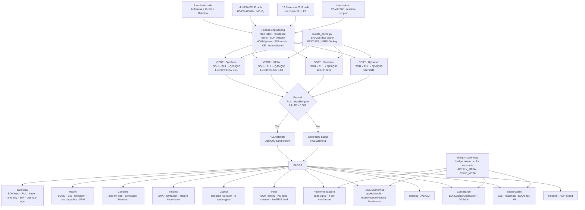

# Battery Intelligence Platform

A battery health monitoring and prediction platform built with scikit-learn and Streamlit. It tracks State of Health (SOH) and predicts Remaining Useful Life (RUL) for lithium-ion cells — validated on real NASA PCoE and Severson 2019 LFP battery aging data — and includes an AI Copilot that explains every number in plain language without inventing anything outside the validated model outputs.

Built as a portfolio project targeting the battery analytics / BMS tooling space at the level used by CATL, Tesla, BYD, and Northvolt. Not a production BMS — a demonstration of the full stack: raw cycle data → explainable reliability-gated predictions → honest regulatory framing → auditable sustainability figures.

**[Live demo →](https://battery-intelligence-platform-sszs92zbkfvfcda3ajtlk7.streamlit.app)**

---

## What it does

Fourteen pages across five workflow sections:

| Section | Pages | What it covers |
|---|---|---|
| **Account** | Import, Overview | Upload your own cell data; SOH hero card, RUL with Q10/Q90 band, knee detection, anomaly flags, calendar age, pack spread |
| **Analyse** | Health, Compare, Insights, Copilot | Full degradation curves, dQ/dV, EIS decomposition, side-by-side comparison, SHAP attribution, AI narrative |
| **Operate** | Fleet, Recommendations, EOL Economics, Grading | Fleet SOH ranking, cluster archetypes, maintenance actions, second-life economics, A/B/C/D cell grading |
| **Comply** | Compliance, Sustainability | EU Battery Regulation 2023/1542 passport, lifecycle carbon, critical material tracker |
| **Configure** | Settings | Alert thresholds, EOL floor, LCO fold R² table, force retrain |

---

## Data sources

Three real-data modes plus user upload — selectable at runtime:

| Mode | Cells | Chemistry | Source |
|---|---|---|---|
| **NASA Research** | B0005 · B0006 · B0007 · B0018 | LiCoO₂ NCA 18650 | NASA PCoE Battery Aging Dataset, Saha & Goebel 2007 |
| **Severson 2019** | 12 LFP cells (b1c2–b1c28) | LFP | Severson et al., Nature Energy 2019, 4 cycle-life bands |
| **Synthetic Fleet** | Cell1–Cell8 | LiCoO₂ | Physics-informed (Arrhenius SEI, C-rate, Rainflow DoD) |
| **My Data** | User upload | Any | CSV/XLSX — session-scoped, trains fresh model |

Severson CSVs (~700 KB, 12 files) are committed to `data/raw/severson/` so Streamlit Cloud loads them instantly without downloading the 115 MB MATLAB source file.

---

## ML pipeline

1. **Feature engineering** (`src/features.py`): fade rate at 10/30/50-cycle windows, fade acceleration, SOH velocity, resistance normalised (first non-zero as reference), resistance trend, temperature rolling mean, dQ/dV peak features (value, SOC, area, FWHM), Coulombic Efficiency trend, cumulative Ah/kWh, EIS component trends (r_sei, r_ct)
2. **Models**: GradientBoostingRegressor (200 trees, depth 4, lr=0.05) — one per data source. Four models per source: SOH, RUL, Q10 quantile, Q90 quantile.
3. **Validation**: Leave-Cell-Out cross-validation. Per-cell reliability floor: fold R² ≥ 0.30 gates RUL display. Below floor → "Calibrating" badge, RUL withheld.
4. **Uncertainty**: Q10/Q90 prediction interval shown as a shaded band on all RUL charts.
5. **Cache**: SHA256 disk cache (`src/bundle_cache.py`) keyed by cell IDs + cycle counts + `FEATURE_VERSION`. Invalidates automatically when engineering changes.
6. **SHAP**: TreeExplainer cached via `@st.cache_resource` — recomputes only when data source changes.

---

## Phase build history

| Phase | What was built |
|---|---|
| 1 — Core loop | SOH/RUL GBRT, LCO cross-validation, per-cell reliability gate, Overview/Health/Insights pages |
| 2 — Fleet | Multi-cell SOH ranking, fade rate comparison, honest cross-type RUL copy |
| 3 — Copilot | Template-based AI narration grounded strictly on bundle outputs — no LLM API, no invented numbers |
| 4 — Consequences | Second-life economics: application fit scoring, financial comparison (reuse/recycle/replace), break-even chart, CO₂ snapshot. Every figure badged as Cited estimate or Illustrative — not sourced |
| 5 — Passport + Reports | EU Battery Regulation 2023/1542 data passport: 20 fields across 5 groups. PDF export via reportlab with disclaimer box and full assumption register |
| 6 — Recommendations | Hero-card decision (Continue / Inspect / Second-Life / Recycle) via dual-signal logic: SOH threshold + fade acceleration ratio. Four-tier confidence system (high / medium / lower / uncertain) |
| 7 — Sustainability | Lifecycle CO₂ chart (3 scenarios), critical materials tracker (Co/Ni/Li), EU 2023/1542 Annex XII recycled-content targets |
| 8 — Design system | `src/design_system.py`: single source of truth for badge HTML, color tokens, state badges, Recommendations metadata |
| 9 — Settings | Per-cell LCO fold R² transparency table, RUL floor preview, data source panel |
| 10 — Advanced features | EIS decomposition (SEI + charge-transfer resistance trends), formation efficiency, rate capability model, dQ/dV differential capacity, Li-S module, SSB chemistry |
| 11 — Phase 11 | Knee detection (cycle where SOH derivative peaks), anomaly flags, SoP%, calendar aging, pack spread, cell grading (A/B/C/D), Compare page, Q10/Q90 confidence band, EU passport CRM fields |
| 12 — Severson integration | h5py-based MATLAB v7.3 parser, 12 LFP cell CSVs extracted and committed, Severson mode routed through full pipeline, SHAP caching, Streamlit Cloud crash fixes |

---

## The debugging story (the part that's actually interesting)

**Data leakage, caught.** The first SOH model reported R²=0.96. That number came from a row-level train/test split on a concatenated multi-cell dataset — "test" rows were just the tail of cells the model had already seen. Leave-cell-out validation gives the honest number: R²=0.85 (synthetic) and 0.83 (NASA). Both are real and defensible; the 0.96 was not.

**Per-cell vs dataset-average reliability gate.** The first RUL gate computed one boolean per dataset. B0018 inherited `rul_reliable=True` from the NASA group average (R²=0.68 > floor 0.30) despite its own fold R²=0.22. Fix: `per_cell_rul_reliable = {cell_id: fold_r2 >= floor}` — B0018 now shows "not calibrated" consistently across Overview, Fleet, Copilot, and Recommendations.

**Why two separate models exist.** Training one GBRT on all 12 cells produced R²=−0.49. Synthetic cells have bulk resistance in 0.15–0.40 Ω; NASA cells have EIS electrolyte resistance in 0.04–0.07 Ω. Same feature name, physically incompatible scales. The fix is one model per data source; Fleet ranks by SOH (scale-invariant) not RUL (model-dependent).

**Severson zero-cells bug.** After integrating the Severson dataset, the cloud showed "0 cells · real measured" despite the CSVs being committed. Root cause: `load_cached("severson", {"source": "severson_batch1"})` passed a plain dict as the battery dict. The `_signature()` function iterates `len(cell["cycles"])` over every item — `"severson_batch1"["cycles"]` raises `TypeError`. The outer `try/except` silently caught it and skipped Severson on every boot. Fix: load cells first, then pass the actual `{cell_id: {"cycles": df}}` dict to `load_cached` so the SHA256 signature is computed correctly.

**Streamlit Cloud OOM kill from a 115 MB download.** The first Severson integration auto-downloaded the MATLAB batch file at startup. On Streamlit Cloud (free tier, ~512 MB RAM) this blocked for 2+ minutes then got OOM-killed. Fix: added an `any_cached()` guard — the loader only runs if local CSVs exist. The 12 extracted CSVs (~700 KB) are committed to the repo so cloud always has them.

**MATLAB v7.3 format.** `scipy.io.loadmat` only handles MATLAB v5. Severson Batch 1 is v7.3 (HDF5-based). Error: "Please use HDF reader for matlab v7.3 files, e.g. h5py." Fix: full rewrite using `h5py`. MATLAB struct arrays in HDF5 are `(N, 1)` datasets of object references; `batch["summary"][idx, 0]` dereferences cell `b1cN` at 0-based index `N-1`.

**Severson resistance zero-division.** Severson cycle 1 stores `resistance_ohm=0.0` as a missing-data marker. `initial_r = df["resistance_ohm"].iloc[0]` was 0. Division produced all-inf `resistance_normalized` → `get_model_matrix()` dropped all rows → "Training dataset is empty." Fix: use `df["resistance_ohm"][df["resistance_ohm"] > 0].iloc[0]` as the reference — first non-zero value.

**Assumption transparency audit.** The Consequences page was the first to show financial figures not derived from the model. Three provenance gaps caught in audit: (1) repack cost deducted from the reuse card without its own badge showing; (2) a CO₂ recycling credit (`co2 × 0.15`) had no badge despite being a hardcoded literature factor; (3) a datasheet cell capacity spec was labelled with the same green "Validated" badge as pipeline-tested outputs — wrong, because "validated" in this platform means LCO-tested by the pipeline, not datasheet-authoritative. All three fixed; the distinction is now the point, not a limitation.

**Silent zero from a wrong column name.** The Consequences page read fade rate as `latest.get("fade_30_mah_cy", 0.0)` — but the actual column is `fade_rate_30cy`. The `.get()` default silently returned 0.0 on every render. Every application-fit score and fade-rate display was wrong for weeks. Caught only when Phase 5 passport forced a careful read of the actual DataFrame schema.

**Three Plotly 6 errors in one page.** (1) `legend` and `title` as kwargs through `**base_layout()` — Plotly 6 strict validation rejects them. (2) `yaxis=dict(titlefont=dict(...))` — `titlefont` removed in Plotly 6. (3) Stale `.pyc` on Streamlit Cloud serving old code after adding a new ASSUMPTIONS key. All three in separate commits so the traceback history is clean. `base_layout()` now has an explicit comment blocking the legend/title kwarg pattern.

---

## Architecture


```mermaid
flowchart TD
    A1[8 synthetic cells\nArrhenius + C-rate + Rainflow] --> F
    A2[4 NASA PCoE cells\nB0005–B0018 · LiCoO₂] --> F
    A3[12 Severson 2019 cells\nb1c2–b1c28 · LFP] --> F
    A4[User upload\nCSV/XLSX · session-scoped] --> F

    F[Feature engineering\nfade rates · resistance trend · SOH velocity\ndQ/dV peaks · EIS trends · CE · cumulative Ah]

    F --> M1[GBRT · Synthetic\nSOH + RUL + Q10/Q90\nLCO R²=0.85 / 0.61]
    F --> M2[GBRT · NASA\nSOH + RUL + Q10/Q90\nLCO R²=0.83 / 0.68]
    F --> M3[GBRT · Severson\nSOH + RUL + Q10/Q90\n12 LFP cells]
    F --> M4[GBRT · Uploaded\nSOH + RUL + Q10/Q90\nuser data]

    M1 & M2 & M3 & M4 --> G{Per-cell\nRUL reliability gate\nfold R² ≥ 0.30?}

    G -->|Yes| RUL[RUL estimate\nQ10/Q90 band shown]
    G -->|No| NC[Calibrating badge\nRUL withheld]

    RUL & NC --> PAGES

    PAGES --> OV[Overview\nSOH hero · RUL · knee · anomaly · SoP · calendar age]
    PAGES --> HL[Health\ndQ/dV · EIS · formation · rate capability · SPM]
    PAGES --> CP[Compare\nside-by-side · correlation heatmap]
    PAGES --> IN[Insights\nSHAP attribution · feature importance]
    PAGES --> CO[Copilot\ntemplate narration · 8 query types]
    PAGES --> FL[Fleet\nSOH ranking · KMeans clusters · live BMS feed]
    PAGES --> RC[Recommendations\ndual-signal · 4-tier confidence]
    PAGES --> EC[EOL Economics\napplication fit · reuse/recycle/replace · break-even]
    PAGES --> GR[Grading · A/B/C/D]
    PAGES --> CL[Compliance\nEU 2023/1542 passport · 20 fields]
    PAGES --> SU[Sustainability\nCO₂ · materials · EU Annex XII]
    PAGES --> RE[Reports · PDF export]

    DS[design_system.py\nbadge tokens · color constants\nACTION_META · CONF_META] --> RC & EC & CL & SU

    CACHE[bundle_cache.py\nSHA256 disk cache\nFEATURE_VERSION key] --> M1 & M2 & M3 & M4
```

---

## Tech stack

- **Model**: GradientBoostingRegressor (scikit-learn) — one instance per data source, four models each (SOH, RUL, Q10, Q90)
- **Validation**: Leave-cell-out cross-validation; `RUL_RELIABLE_FLOOR = 0.30` gates display per cell
- **Uncertainty**: Q10/Q90 quantile regression intervals on all RUL charts
- **Explainability**: SHAP TreeExplainer (`src/insights.py`), cached per data source
- **Data — real**: NASA PCoE B0005–B0018 (LiCoO₂ 18650, 24°C, 2A) + Severson 2019 batch 1 (LFP, 4 cycle-life bands, Nature Energy)
- **Data — synthetic**: 8 cells with stress variation (T, C-rate, DoD) via Arrhenius SEI, power-law C-rate factor, Rainflow DoD scaling
- **Feature engineering**: `src/features.py` — 17-column feature matrix including dQ/dV peaks, EIS component trends, Coulombic Efficiency, SoP%, calendar aging
- **Dashboard**: Streamlit + Plotly dark theme — all pages in `app/main.py`
- **Cache**: `src/bundle_cache.py` — SHA256 keyed by cell IDs + cycle counts + `FEATURE_VERSION`; joblib compression level 3
- **Copilot**: Template narration (`src/copilot.py`) — no LLM, no external calls; every sentence traces to a bundle value
- **EOL Economics**: Literature-grounded assumption layer — 8 financial/environmental figures, each sourced or flagged as engineering judgment, badged at render time
- **Recommendations**: Threshold-based classification — all thresholds are named constants; no scoring function buries the logic
- **Design system**: `src/design_system.py` — single source of truth for badge HTML, color tokens, Recommendations metadata
- **Compliance**: EU Battery Regulation 2023/1542 field structure (`src/passport.py`) — single source consumed by both Passport page and PDF
- **Reports**: PDF via reportlab — disclaimer box, color-coded tables, assumption register

---

## Deliberate scope limits

- **No unified cross-source RUL model**: requires cells with diverse operating conditions at the same resistance scale. NASA cells were all tested identically (24°C, 2A) — the only variation is manufacturing spread, not the T/C-rate/DoD needed to make a combined resistance signal meaningful. Gate documented in Settings.
- **No LLM in Copilot**: deliberate. Template narration enforces the reliability gate mechanically — an LLM generates confident text for B0018 even when told not to. The template cannot.
- **No regulatory compliance claim**: the platform demonstrates EU 2023/1542 field structure with honest coverage. Real compliance requires manufacturer identity records, accredited carbon audits, and notified-body sign-off that a portfolio project cannot provide. The gap acknowledgment is the point.
- **No aggregated sustainability score**: a single green metric mixing lifecycle CO₂, material recovery, and regulatory alignment would aggregate figures with very different confidence levels. Individual labelled figures are more honest than any index.
- **RUL floor hardcoded**: the Settings page shows a read-only preview. Adjusting the reliability threshold is a model calibration decision that belongs in git history, not a runtime toggle.

---

## Run locally

```bash
pip install -r requirements.txt
streamlit run app/main.py
```

NASA and Severson cell CSVs are pre-committed to `data/raw/`. The Severson source MATLAB file (115 MB) is gitignored — to re-extract locally:

```bash
python src/severson_loader.py
```

The NASA raw `.mat` files and ZIP are also gitignored (22 MB); re-download with:

```bash
python src/nasa_loader.py
```
