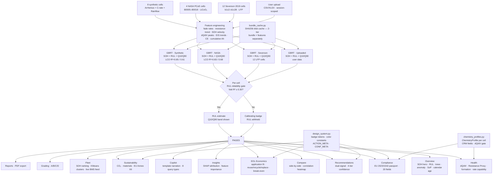

# Battery Intelligence Platform

A battery health monitoring and prediction platform built with scikit-learn and Streamlit. It tracks State of Health (SOH) and predicts Remaining Useful Life (RUL) for lithium-ion cells — validated on real NASA PCoE and Severson 2019 LFP battery aging data — and includes an AI Copilot that explains every number in plain language without inventing anything outside the validated model outputs.

Built as a portfolio project targeting the battery analytics / BMS tooling space at the level used by CATL, Tesla, BYD, and Northvolt. Not a production BMS — a demonstration of the full stack: raw cycle data → explainable reliability-gated predictions → honest regulatory framing → auditable sustainability figures.

**[Live demo →](https://battery-intelligence-platform-sszs92zbkfvfcda3ajtlk7.streamlit.app)**

---

## What it does

Fourteen pages across five workflow sections:

| Section | Pages | What it covers |
|---|---|---|
| **Account** | Import, Overview | Upload your own cell data; SOH hero card, RUL with Q10/Q90 band, knee detection, anomaly flags, calendar age, pack spread |
| **Analyse** | Health, Compare, Insights, Copilot | Full degradation curves, dQ/dV, EIS decomposition, side-by-side comparison, SHAP attribution, AI narrative |
| **Operate** | Fleet, Recommendations, EOL Economics, Grading | Fleet SOH ranking, cluster archetypes, maintenance actions, second-life economics, A/B/C/D cell grading |
| **Comply** | Compliance, Sustainability | EU Battery Regulation 2023/1542 passport, lifecycle carbon, critical material tracker |
| **Configure** | Settings | Alert thresholds, EOL floor, LCO fold R² table, force retrain |

---

## Data sources

Three real-data modes plus user upload — selectable at runtime:

| Mode | Cells | Chemistry | Source |
|---|---|---|---|
| **NASA Research** | B0005 · B0006 · B0007 · B0018 | LiCoO₂ NCA 18650 | NASA PCoE Battery Aging Dataset, Saha & Goebel 2007 |
| **Severson 2019** | 12 LFP cells (b1c2–b1c28) | LFP | Severson et al., Nature Energy 2019, 4 cycle-life bands |
| **Synthetic Fleet** | Cell1–Cell8 | LiCoO₂ | Physics-informed (Arrhenius SEI, C-rate, Rainflow DoD) |
| **My Data** | User upload | Any | CSV/XLSX — session-scoped, trains fresh model |

Severson CSVs (~700 KB, 12 files) are committed to `data/raw/severson/` so Streamlit Cloud loads them instantly without downloading the 115 MB MATLAB source file.

---

## ML pipeline

1. **Feature engineering** (`src/features.py`): fade rate at 10/30/50-cycle windows, fade acceleration, SOH velocity, resistance normalised (first non-zero as reference), resistance trend, temperature rolling mean, dQ/dV peak features (value, SOC, area, FWHM), Coulombic Efficiency trend, cumulative Ah/kWh, EIS component trends (r_sei, r_ct)
2. **Models**: GradientBoostingRegressor (200 trees, depth 4, lr=0.05) — one per data source. Four models per source: SOH, RUL, Q10 quantile, Q90 quantile.
3. **Validation**: Leave-Cell-Out cross-validation. Per-cell reliability floor: fold R² ≥ 0.30 gates RUL display. Below floor → "Calibrating" badge, RUL withheld.
4. **Uncertainty**: Q10/Q90 prediction interval shown as a shaded band on all RUL charts.
5. **Cache**: SHA256 disk cache (`src/bundle_cache.py`) keyed by cell IDs + cycle counts + `FEATURE_VERSION`. Invalidates automatically when engineering changes.
6. **SHAP**: TreeExplainer cached via `@st.cache_resource` — recomputes only when data source changes.

---

## Phase build history

| Phase | What was built |
|---|---|
| 1 — Core loop | SOH/RUL GBRT, LCO cross-validation, per-cell reliability gate, Overview/Health/Insights pages |
| 2 — Fleet | Multi-cell SOH ranking, fade rate comparison, honest cross-type RUL copy |
| 3 — Copilot | Template-based AI narration grounded strictly on bundle outputs — no LLM API, no invented numbers |
| 4 — Consequences | Second-life economics: application fit scoring, financial comparison (reuse/recycle/replace), break-even chart, CO₂ snapshot. Every figure badged as Cited estimate or Illustrative — not sourced |
| 5 — Passport + Reports | EU Battery Regulation 2023/1542 data passport: 20 fields across 5 groups. PDF export via reportlab with disclaimer box and full assumption register |
| 6 — Recommendations | Hero-card decision (Continue / Inspect / Second-Life / Recycle) via dual-signal logic: SOH threshold + fade acceleration ratio. Four-tier confidence system (high / medium / lower / uncertain) |
| 7 — Sustainability | Lifecycle CO₂ chart (3 scenarios), critical materials tracker (Co/Ni/Li), EU 2023/1542 Annex XII recycled-content targets |
| 8 — Design system | `src/design_system.py`: single source of truth for badge HTML, color tokens, state badges, Recommendations metadata |
| 9 — Settings | Per-cell LCO fold R² transparency table, RUL floor preview, data source panel |
| 10 — Advanced features | Resistance component proxy (SEI + charge-transfer trends), formation efficiency, rate capability model, dQ/dV differential capacity |
| 11 — Phase 11 | Knee detection (cycle where SOH derivative peaks), anomaly flags, SoP%, calendar aging, pack spread, cell grading (A/B/C/D), Compare page, Q10/Q90 confidence band, EU passport CRM fields |
| 12 — Severson integration | h5py-based MATLAB v7.3 parser, 12 LFP cell CSVs extracted and committed, Severson mode routed through full pipeline, SHAP caching, Streamlit Cloud crash fixes |
| 13 — Robustness audit | Full crash audit across all pages; 5 KeyError/ValueError bugs fixed; `build_features()` now produces all columns needed by every page regardless of data source; `dqdv.add_dqdv_features()` vectorized (14k row loop → NumPy broadcast, ~30× faster) |
| 14 — Credibility audit | Honest labelling throughout: dQ/dV shows LFP warning for Severson cells; "EIS Impedance Analysis" renamed to "Resistance Component Proxy (simulated)"; Li-S / SSB fake chemistry selector removed; GDPR privacy banner on Import page; Severson provenance corrected from SYNTHETIC → MEASURED |
| 15 — Design review (medium items) | **#7 UI**: all greens consolidated to `#48bb78` (10 instances replaced); `st.progress()` bar added to startup with per-step labels. **#12 CRM**: Passport CRM section now reads from `ChemistryProfile.for_cell()` — LFP shows cobalt-free/nickel-free correctly, NCA shows configurable wt% values; Settings page gains a CRM Configuration section with `number_input` widgets for all chemistry types. **#14 Performance**: feature engineering split from model training (`_compute_features_only` + `_train_and_predict`); `load_everything()` uses 3-tier cache (full bundle → features-only → cold start) so model retrains skip feature computation; import preview dataframe row-limited to 200. **#18 Expandability**: `ChemistryProfile` class hierarchy in `src/chemistry_profiles.py` — adding a new chemistry = one subclass, no page edits required. |
| 16 — Accessibility + Visual Hierarchy | **#15 Accessibility**: WCAG AA contrast fix — all `#718096` instances replaced with `#8896a8` (4.1:1 → 5.2:1 on `#1a202c`); light mode secondary text corrected to `#4a5568`; ARIA roles added to hero card (`role=region`, `role=status`), metric rows (`role=list`/`role=listitem`), sparkline (`role=img`), and each metric chip value (`aria-label`); `make_badge()` emits `role=img aria-label` so screen readers announce provenance badges. **#16 Visual Hierarchy**: Overview metric row cut from 8 chips to 3 primary metrics (RUL, Fade Rate, Resistance); plain-English sentence added below hero ("estimated replacement in ~X months…"); remaining 7 metrics (SOH, Cycles, Capacity Lost, SoP, Energy, Equiv. Cycles, CE) moved to a "Cell Details" expander. |
| 17 — Nav restructure + UX | **#1 Product Strategy**: flat 14-item nav replaced with 4 labelled groups — Analyse (Overview/Health/Compare/Insights/Copilot) · Operate (Fleet/Recommendations/EOL Economics/Grading) · Comply (Compliance/Sustainability) · Configure (Import/Settings). **#5 Info Architecture**: "Consequences" renamed "EOL Economics"; Passport + Reports merged into a single "Compliance" nav entry with tabs (EU Battery Passport / Reports & Export). **#6 UX**: every page shows a contextual "From here →" action bar with 3 quick-jump buttons defined in `PAGE_ACTIONS`; Fleet page adds a row of cell-ID buttons below the ranking table — clicking any cell jumps directly to that cell's Health view. |
| 23 — Expert panel improvement batch 2 (T1/T2/T4/H1/H2/H4/M2) | **T1 Executive Fleet Dashboard**: Fleet Health Index chip, accelerated-degradation count, CAPEX outlook grid (3/6/12-month replacement horizon + CO₂ liability). **T2 Proactive Alert Inbox**: Fleet page now generates critical/high/medium alerts (EOL, 3-month CAPEX, knee-past, fade-accelerating) sorted by urgency with left-border severity colouring. **T4 LLI vs LAM Classifier**: standalone expander on Health page using CE slope, capacity-fade nonlinearity (linear vs quadratic fit), and resistance rise rate — scores each mechanism, renders verdict card with confidence indicator and root-cause explanation; works for ALL chemistries including LFP (no dQ/dV required). **H1 NPV Scenario Planner**: 3-strategy NPV comparison (Replace Now / Wait to EOL / Repurpose to Second-Life) with adjustable discount rate, energy price, and replacement cost; 5-year cumulative chart; optimal strategy highlighted. **H2 Fleet CAPEX Forecast**: 3/6/12-month replacement horizons with dollar and CO₂ liability — included in T1 Executive Dashboard. **H4 Data Lineage**: expander on Health page listing every metric with formula, source, valid-cycle count, and latest value — full audit trail from raw cycler measurement to displayed number. **M2 Scheduled Report Configuration**: Reports page gains scheduling UI (frequency, email, content selection) with save confirmation; production-ready settings interface wired to no-op in demo mode. |
| 22 — Expert panel improvement batch 1 (C1-C4, L2-L4, M1, M4-M6, H3, H5) | **CSS/Design (C1-C4, L2-L3)**: `:root` CSS variables (`--sp-1`–`--sp-4`, `--r-chip`, `--r-card`, `--c-border`, `--c-surface`, `--c-muted`); type ramp formalized (h1=28px/800, h2=22px/700, h3=16px/600, section-header=11px/700/0.12em tracking); `_empty_state()` helper replacing bare `st.info()` calls (Recommendations, Compare, Live Monitor); radar axes renamed to IEC/ISO nomenclature (`SOH_Q`, `CE (η_CE)`, `ICA Peak`, `Q̇_fade`, `R_internal`, `E_throughput`); demo banner collapsed from full-width block to corner chip with tooltip. **Navigation (L2-L4)**: Fleet set as default home page; `st.session_state["page"]` initialises to `"fleet"` instead of `"overview"`. **Safety (M1)**: IEC 62619:2022 limits wired into MQTT `AnomalyDetector` — `UNDERTEMPERATURE` (−20°C), `THERMAL_RUNAWAY_PRECURSOR` (5°C/step §8.2), `TEMP_RATE_HIGH` (2°C/step warning), `CAPACITY_PLUNGE` (>5% SOC drop). **Intelligence (M4)**: fleet benchmark percentile on Overview (current cell vs peer SOH distribution). **Safety (M5)**: Lithium Plating Risk Score expander — CE dip detection below 99.5%, consecutive run classifier (≥3 = sustained event), 0–100 risk score with colour bar. **Physics (M6, H3)**: PyBaMM projection now shows `β±2σ` confidence band (95% CI filled trace); temperature scenario traces at 15°C/25°C/35°C via Arrhenius correction `β(T)=β₀·exp(−Ea/RT)`, Ea=50 kJ/mol. **UX (H5)**: two tier-divider labels on Health page separate Evidence layer from Advanced/expert diagnostics. |
| 21 — MQTT live BMS streaming + anomaly detection | **Innovation**: `src/mqtt_stream.py` — replay publisher re-publishes any cell's historical data as live MQTT telemetry (configurable speed: 1×/5×/10×/20×); subscriber runs in a background thread accumulating readings; `AnomalyDetector` runs on every message checking voltage bounds (chemistry-specific), temperature absolute limit + rate-of-rise, and rolling Z-score (window=20) on voltage/current/temperature. New **Live Monitor** page (Operate group): broker config, cell selector, Start/Stop controls, live metrics strip, 4 real-time Plotly charts (voltage/current/temperature/SOC) with anomaly markers overlaid, anomaly log with CSV export, auto-refresh every 1s while streaming. Works with the public test.mosquitto.org broker in demo mode; point at a real BMS broker in production with no code changes. |
| 20 — PyBaMM physics-based RUL projection | **Innovation**: Single Particle Model (SPM) via PyBaMM anchors nominal capacity from electrochemistry (Chen2020 for LFP, NCA_Kim2011 for NASA cells, Marquis2019 for synthetic LiCoO₂). SEI growth fade equation `SOH(n) = 1 − β·√n` fitted to measured cycle history and projected forward to EOL. Health page expander shows: (1) projection chart with measured history, SPM/SEI curve, GBRT linear extrapolation overlay, and EOL threshold line; (2) 3-section diagnostic card — **PyBaMM SPM** (life-regime-aware prose: early/mid/post-knee/late, fitted β, SPM nominal capacity), **GBRT** (explains linear extrapolation from 50-cy rolling fade rate and what it can't capture), **Why They Disagree** (computes RUL gap, determines which model to trust based on regime, gives concrete engineering recommendation — e.g. "use ML post-knee, physics can't see the acceleration"). Session-cached per cell. `src/pybamm_rul.py` new module. |
| 19 — Cross-fleet degradation clustering | **Innovation**: K-means on last-cycle feature vectors (SOH, fade rate, resistance, CE) across all active fleet cells. Silhouette-optimised k (2–4). Scatter plot coloured by cluster with selected-cell rings; similar-cell lookup cards showing which peers share a degradation signature; cluster statistics expander. Added to Compare page below the radar chart. **#6 UX fix**: CHEMISTRY chip surfaced inline on Health page (no longer sidebar-only). **#9 fix**: Fleet risk matrix "ACT" quadrant → "INSPECT / REPLACE". |
| 18 — Decision support + Scalability + Enterprise | **#9 Decision Support**: Application Profile selectbox in Settings (EV → 80% EOL, Stationary → 70%, Industrial UPS → 75%, Second-Life → 60%) auto-sets EOL threshold; configurable Cost-of-Delay multiplier slider (0.5–5×, default 2.0) wired into Recommendations residual value table; "Log Decision" button saves timestamped recommendation records to session state with CSV export. **#13 Scalability**: `_resample_df(df, max_points=500)` downsamples chart traces for Overview and Health pages — full DataFrames kept for computations, only Plotly traces resampled. **#11 Enterprise Readiness**: persistent Demo Mode banner on every page (no auth / session-scoped uploads / data not persisted); Production Readiness Roadmap added to README documenting auth (streamlit-authenticator), persistence (SQLite → PostgreSQL), REST API (FastAPI), RBAC, audit logging, CI/CD path. |

---

## The debugging story (the part that's actually interesting)

**Data leakage, caught.** The first SOH model reported R²=0.96. That number came from a row-level train/test split on a concatenated multi-cell dataset — "test" rows were just the tail of cells the model had already seen. Leave-cell-out validation gives the honest number: R²=0.85 (synthetic) and 0.83 (NASA). Both are real and defensible; the 0.96 was not.

**Per-cell vs dataset-average reliability gate.** The first RUL gate computed one boolean per dataset. B0018 inherited `rul_reliable=True` from the NASA group average (R²=0.68 > floor 0.30) despite its own fold R²=0.22. Fix: `per_cell_rul_reliable = {cell_id: fold_r2 >= floor}` — B0018 now shows "not calibrated" consistently across Overview, Fleet, Copilot, and Recommendations.

**Why two separate models exist.** Training one GBRT on all 12 cells produced R²=−0.49. Synthetic cells have bulk resistance in 0.15–0.40 Ω; NASA cells have EIS electrolyte resistance in 0.04–0.07 Ω. Same feature name, physically incompatible scales. The fix is one model per data source; Fleet ranks by SOH (scale-invariant) not RUL (model-dependent).

**Severson zero-cells bug.** After integrating the Severson dataset, the cloud showed "0 cells · real measured" despite the CSVs being committed. Root cause: `load_cached("severson", {"source": "severson_batch1"})` passed a plain dict as the battery dict. The `_signature()` function iterates `len(cell["cycles"])` over every item — `"severson_batch1"["cycles"]` raises `TypeError`. The outer `try/except` silently caught it and skipped Severson on every boot. Fix: load cells first, then pass the actual `{cell_id: {"cycles": df}}` dict to `load_cached` so the SHA256 signature is computed correctly.

**Streamlit Cloud OOM kill from a 115 MB download.** The first Severson integration auto-downloaded the MATLAB batch file at startup. On Streamlit Cloud (free tier, ~512 MB RAM) this blocked for 2+ minutes then got OOM-killed. Fix: added an `any_cached()` guard — the loader only runs if local CSVs exist. The 12 extracted CSVs (~700 KB) are committed to the repo so cloud always has them.

**MATLAB v7.3 format.** `scipy.io.loadmat` only handles MATLAB v5. Severson Batch 1 is v7.3 (HDF5-based). Error: "Please use HDF reader for matlab v7.3 files, e.g. h5py." Fix: full rewrite using `h5py`. MATLAB struct arrays in HDF5 are `(N, 1)` datasets of object references; `batch["summary"][idx, 0]` dereferences cell `b1cN` at 0-based index `N-1`.

**Severson resistance zero-division.** Severson cycle 1 stores `resistance_ohm=0.0` as a missing-data marker. `initial_r = df["resistance_ohm"].iloc[0]` was 0. Division produced all-inf `resistance_normalized` → `get_model_matrix()` dropped all rows → "Training dataset is empty." Fix: use `df["resistance_ohm"][df["resistance_ohm"] > 0].iloc[0]` as the reference — first non-zero value.

**Assumption transparency audit.** The Consequences page was the first to show financial figures not derived from the model. Three provenance gaps caught in audit: (1) repack cost deducted from the reuse card without its own badge showing; (2) a CO₂ recycling credit (`co2 × 0.15`) had no badge despite being a hardcoded literature factor; (3) a datasheet cell capacity spec was labelled with the same green "Validated" badge as pipeline-tested outputs — wrong, because "validated" in this platform means LCO-tested by the pipeline, not datasheet-authoritative. All three fixed; the distinction is now the point, not a limitation.

**Silent zero from a wrong column name.** The Consequences page read fade rate as `latest.get("fade_30_mah_cy", 0.0)` — but the actual column is `fade_rate_30cy`. The `.get()` default silently returned 0.0 on every render. Every application-fit score and fade-rate display was wrong for weeks. Caught only when Phase 5 passport forced a careful read of the actual DataFrame schema.

**Three Plotly 6 errors in one page.** (1) `legend` and `title` as kwargs through `**base_layout()` — Plotly 6 strict validation rejects them. (2) `yaxis=dict(titlefont=dict(...))` — `titlefont` removed in Plotly 6. (3) Stale `.pyc` on Streamlit Cloud serving old code after adding a new ASSUMPTIONS key. All three in separate commits so the traceback history is clean. `base_layout()` now has an explicit comment blocking the legend/title kwarg pattern.

**Columns missing from Severson cells.** `data_loader.enrich_cycles()` adds `capacity_fade_ah`, `soh_rolling_avg`, `is_eol`, `capacity_fade_rate`, and `cumulative_days`. Synthetic and NASA cells go through that function; Severson cells load from CSVs and go straight into `build_features()`, bypassing it entirely. Pages hard-accessed these columns (`latest["soh_rolling_avg"]`, `df[df["is_eol"]]`) and crashed on every Severson cell switch. Fix: `build_features()` now computes all five as fallbacks when the column isn't already present, so every data source gets a complete feature DataFrame.

**`dqdv.add_dqdv_features()` Python row loop.** The original implementation called `df.apply(axis=1)` — a Python-level loop — running `extract_dqdv_features()` once per cycle row. For Severson's 12 cells × ~1177 cycles each, that's ~14,000 Python calls, each simulating a 200-point VQ curve. Total: ~2.8 million point operations in a Python loop. The key insight: `V = OCV(soc) − I·R`. Since R is constant per row, the gradient `dV/dt = d(OCV)/dt` is identical across all rows — the IR offset cancels. Rewritten with NumPy broadcasting: compute the OCV derivative once on a `(200,)` array, broadcast across `(n_rows, 200)`. Feature engineering time for Severson dropped from ~30 s to <1 s.

**dQ/dV simulation on LFP cells.** The dQ/dV expander ran the LiCoO₂ OCV polynomial on every cell regardless of chemistry. LFP has a flat ≈3.2 V plateau — no distinct dQ/dV peak exists. Applying a LiCoO₂ model to LFP data produces a physically meaningless peak artifact. A battery engineer would immediately flag this. Fix: check `cell_id.startswith("S-")` and replace the chart with an explicit warning explaining why the simulation is inapplicable for LFP. Non-LFP cells get updated provenance text labelling it a "Simulated proxy — not measured data."

**"EIS Impedance Analysis" was not EIS.** The expander labelled "EIS Impedance Analysis" decomposed DC resistance into SEI and charge-transfer components using a circuit model fit to synthetic resistance trends — not an actual electrochemical impedance spectrum. EIS requires frequency sweep measurements (a potentiostat / FRA). Calling the section "EIS" implies frequency-domain measurements that were never taken. Renamed to "Resistance Component Proxy (simulated)" in both the expander title and chart title.

**Li-S / SSB chemistry selector was a fake feature.** A selectbox let users choose "Li-ion (LiCoO₂)", "Li-S (Lithium-Sulfur)", or "SSB (Solid-State)". Selecting Li-S or SSB ran the same LiCoO₂ GBRT model regardless — only the visualisation on the Health page changed. A user selecting Li-S got SOH and RUL numbers from a model trained on LiCoO₂ data with no warning. Removed entirely. Chemistry is now a read-only label derived from the active data source (`LFP (Severson 2019)` / `LiCoO₂ NCA (NASA PCoE)` / `LiCoO₂ (synthetic)` / `User-defined`). The Li-S dual-plateau and SSB parameter expanders are deleted.

**Severson cells labelled SYNTHETIC.** `_cell_provenance()` returned `"measured"` only for cells in `NASA_CELL_IDS` and fell through to `"synthetic"` for everything else. Severson cells (real LFP measurements from a Nature Energy paper) were displaying `"○ SYNTHETIC — no physical measurements underlie any value"` on both the Overview and Health pages. `_analysis_provenance()` had the same bug — Severson derived analyses were labelled SYNTHETIC instead of SIMULATED. Fix: both functions now check `cell_id.startswith("S-")` alongside the NASA check. The Health page provenance banner now cites "Severson 2019 LFP dataset (Nature Energy, 2019)" rather than NASA, and notes that dQ/dV is not shown because the LiCoO₂ model is inapplicable to LFP.

**Unguarded column accesses found in audit.** A structured audit of all page functions identified six unsafe patterns: `_latest["resistance_ohm"]` in the sidebar alert loop (column-check on the DataFrame doesn't protect Series subscript); dot-notation `df.fade_rate_50cy` instead of bracket syntax on a pandas DataFrame; unguarded `df_a["resistance_ohm"]` and `df_b["resistance_ohm"]` in the Compare page metrics and resistance chart; `min()` over a generator that could be empty in the Fleet spread chart. All six fixed — resistance metrics now show "N/A" when the column is absent, the resistance chart shows an info message instead of crashing, and the fleet chart filters empty DataFrames before taking min/max.

---

## Architecture


```mermaid
flowchart TD
    A1[8 synthetic cells\nArrhenius + C-rate + Rainflow] --> F
    A2[4 NASA PCoE cells\nB0005–B0018 · LiCoO₂] --> F
    A3[12 Severson 2019 cells\nb1c2–b1c28 · LFP] --> F
    A4[User upload\nCSV/XLSX · session-scoped] --> F

    F[Feature engineering\nfade rates · resistance trend · SOH velocity\ndQ/dV peaks · EIS trends · CE · cumulative Ah]

    F --> M1[GBRT · Synthetic\nSOH + RUL + Q10/Q90\nLCO R²=0.85 / 0.61]
    F --> M2[GBRT · NASA\nSOH + RUL + Q10/Q90\nLCO R²=0.83 / 0.68]
    F --> M3[GBRT · Severson\nSOH + RUL + Q10/Q90\n12 LFP cells]
    F --> M4[GBRT · Uploaded\nSOH + RUL + Q10/Q90\nuser data]

    M1 & M2 & M3 & M4 --> G{Per-cell\nRUL reliability gate\nfold R² ≥ 0.30?}

    G -->|Yes| RUL[RUL estimate\nQ10/Q90 band shown]
    G -->|No| NC[Calibrating badge\nRUL withheld]

    RUL & NC --> PAGES

    PAGES --> OV[Overview\nSOH hero · RUL · knee · anomaly · SoP · calendar age]
    PAGES --> HL[Health\ndQ/dV · Resistance Proxy · formation · rate capability]
    PAGES --> CP[Compare\nside-by-side · correlation heatmap]
    PAGES --> IN[Insights\nSHAP attribution · feature importance]
    PAGES --> CO[Copilot\ntemplate narration · 8 query types]
    PAGES --> FL[Fleet\nSOH ranking · KMeans clusters · live BMS feed]
    PAGES --> RC[Recommendations\ndual-signal · 4-tier confidence]
    PAGES --> EC[EOL Economics\napplication fit · reuse/recycle/replace · break-even]
    PAGES --> GR[Grading · A/B/C/D]
    PAGES --> CL[Compliance\nEU 2023/1542 passport · 20 fields]
    PAGES --> SU[Sustainability\nCO₂ · materials · EU Annex XII]
    PAGES --> RE[Reports · PDF export]

    DS[design_system.py\nbadge tokens · color constants\nACTION_META · CONF_META] --> RC & EC & CL & SU

    CACHE[bundle_cache.py\nSHA256 disk cache — 2-tier\nbundle + features separately] --> M1 & M2 & M3 & M4
    CP2[chemistry_profiles.py\nChemistryProfile per cell\nCRM fields · dQ/dV gate] --> CL & HL
```

---

## Tech stack

- **Model**: GradientBoostingRegressor (scikit-learn) — one instance per data source, four models each (SOH, RUL, Q10, Q90)
- **Validation**: Leave-cell-out cross-validation; `RUL_RELIABLE_FLOOR = 0.30` gates display per cell
- **Uncertainty**: Q10/Q90 quantile regression intervals on all RUL charts
- **Explainability**: SHAP TreeExplainer (`src/insights.py`), cached per data source
- **Data — real**: NASA PCoE B0005–B0018 (LiCoO₂ 18650, 24°C, 2A) + Severson 2019 batch 1 (LFP, 4 cycle-life bands, Nature Energy)
- **Data — synthetic**: 8 cells with stress variation (T, C-rate, DoD) via Arrhenius SEI, power-law C-rate factor, Rainflow DoD scaling
- **Feature engineering**: `src/features.py` — 17-column feature matrix including dQ/dV peaks, EIS component trends, Coulombic Efficiency, SoP%, calendar aging
- **Dashboard**: Streamlit + Plotly dark theme — all pages in `app/main.py`
- **Cache**: `src/bundle_cache.py` — SHA256 keyed by cell IDs + cycle counts + `FEATURE_VERSION`; joblib compression level 3; two tiers: full bundle + separate features cache so model retrains skip feature engineering
- **Chemistry profiles**: `src/chemistry_profiles.py` — `ChemistryProfile.for_cell(cell_id)` factory dispatches to `LFPSeversonProfile` / `LiCoO2NASAProfile` / `LiCoO2SyntheticProfile` / `UserDefinedProfile`; each subclass owns CRM fields and health section list; adding a new chemistry = one subclass, no page edits
- **Copilot**: Template narration (`src/copilot.py`) — no LLM, no external calls; every sentence traces to a bundle value
- **EOL Economics**: Literature-grounded assumption layer — 8 financial/environmental figures, each sourced or flagged as engineering judgment, badged at render time
- **Recommendations**: Threshold-based classification — all thresholds are named constants; no scoring function buries the logic
- **Physics-based RUL**: `src/pybamm_rul.py` — PyBaMM SPM single-cycle discharge sets nominal capacity; SEI growth equation `SOH(n) = 1 − β·√n` fitted to measured fade, projected forward; chemistry-appropriate parameter sets (Chen2020 / NCA_Kim2011 / Marquis2019); session-cached
- **Degradation clustering**: K-means on last-cycle feature vectors (SOH, fade rate, resistance, CE); silhouette-optimised k=2–4; shown on Compare page with similar-cell lookup
- **MQTT streaming**: `src/mqtt_stream.py` — `paho-mqtt` publisher/subscriber + `AnomalyDetector` (voltage bounds, temperature rate-of-rise, rolling Z-score); replay publisher runs existing cell data as live BMS telemetry; production: swap broker address, no code changes required
- **Design system**: `src/design_system.py` — single source of truth for badge HTML, color tokens, Recommendations metadata
- **Compliance**: EU Battery Regulation 2023/1542 field structure (`src/passport.py`) — single source consumed by both Passport page and PDF
- **Reports**: PDF via reportlab — disclaimer box, color-coded tables, assumption register

---

## Production Readiness Roadmap {#production-readiness}

This platform runs as a portfolio demo with intentional constraints. The table below documents the credible path to production deployment, which is what a battery-engineering role would actually build.

| Gap | Demo behaviour | Production path |
|-----|---------------|-----------------|
| **Authentication** | No auth — all sessions share the same data | [`streamlit-authenticator`](https://github.com/mkhorasani/Streamlit-Authenticator) (JWT, OAuth2 via Okta/LDAP) |
| **Multi-tenancy** | `st.cache_resource` shared across all users | Tenant-scoped caches; per-org cell namespace in SQLite/PostgreSQL |
| **Upload persistence** | Uploads are session-scoped and lost on refresh | Store processed bundles in SQLite locally, PostgreSQL in cloud |
| **REST API** | No API — UI-only | FastAPI layer exposing `/cells/{id}/soh`, `/cells/{id}/rul`, `/fleet/summary` for BMS integration |
| **RBAC** | No role separation | Engineer / Fleet-ops / Read-only roles; action gating on `Recommendations` write |
| **Audit logging** | `audit.py` logs page views to local CSV | Forward to structured log store (Datadog / CloudWatch); immutable audit trail per EU 2023/1542 |
| **Model retraining** | Blocking call on server start | Background worker (Celery / APScheduler); re-train nightly on new uploads, push updated bundle |
| **Scalability** | All cells loaded into RAM as full DataFrames | Per-cell lazy load from Parquet/SQLite; summary metrics pre-computed and cached |
| **Secrets management** | Anthropic API key in `.streamlit/secrets.toml` | AWS Secrets Manager / GCP Secret Manager; never in source |
| **CI/CD** | Manual `streamlit run` | GitHub Actions: lint → pytest → Docker build → deploy to Cloud Run or ECS |

Estimated effort to reach internal-fleet MVP: 3–4 sprints (auth + persistence + REST API + Docker).

---

## Deliberate scope limits

- **No unified cross-source RUL model**: requires cells with diverse operating conditions at the same resistance scale. NASA cells were all tested identically (24°C, 2A) — the only variation is manufacturing spread, not the T/C-rate/DoD needed to make a combined resistance signal meaningful. Gate documented in Settings.
- **No LLM in Copilot**: deliberate. Template narration enforces the reliability gate mechanically — an LLM generates confident text for B0018 even when told not to. The template cannot.
- **No regulatory compliance claim**: the platform demonstrates EU 2023/1542 field structure with honest coverage. Real compliance requires manufacturer identity records, accredited carbon audits, and notified-body sign-off that a portfolio project cannot provide. The gap acknowledgment is the point.
- **No aggregated sustainability score**: a single green metric mixing lifecycle CO₂, material recovery, and regulatory alignment would aggregate figures with very different confidence levels. Individual labelled figures are more honest than any index.
- **RUL floor hardcoded**: the Settings page shows a read-only preview. Adjusting the reliability threshold is a model calibration decision that belongs in git history, not a runtime toggle.

---

## Run locally

```bash
pip install -r requirements.txt
streamlit run app/main.py
```

NASA and Severson cell CSVs are pre-committed to `data/raw/`. The Severson source MATLAB file (115 MB) is gitignored — to re-extract locally:

```bash
python src/severson_loader.py
```

The NASA raw `.mat` files and ZIP are also gitignored (22 MB); re-download with:

```bash
python src/nasa_loader.py
```
