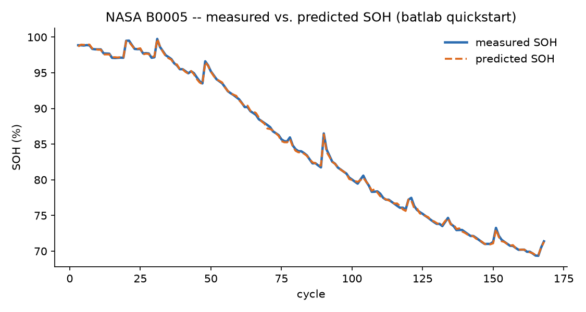

# Battery Intelligence Platform

**An open-source battery analytics platform for degradation analysis, state-of-health estimation, remaining useful life prediction, and lifecycle intelligence using public battery datasets.**

[](pyproject.toml)
[](LICENSE)
[](https://github.com/seyedali1996lb-svg/battery-intelligence-platform/actions/workflows/ci.yml)
[](https://seyedali1996lb-svg.github.io/battery-intelligence-platform/)

---

## Why this project exists

A cycling battery — in a lab, a vehicle, or a stationary storage installation — produces a large amount of voltage, current, capacity, and temperature data over its life. The engineering problem is not collecting that data; it's converting it into decisions: is this cell degrading faster than expected, how many cycles does it have left, is it safe to keep in first-life service, and what is a second-life or replacement plan worth in real currency.

This is harder than it looks, for reasons this platform is built specifically to confront:

- **Battery aging is nonlinear and cell-specific** — degradation doesn't follow one universal curve across chemistries or usage profiles.
- **Capacity degradation is the physical symptom, but it isn't self-explanatory** — a fade curve alone doesn't tell you whether it's on-track or accelerating without a baseline to compare it against.
- **SOH estimation needs to be trustworthy at the point it's produced** — it's the number every downstream decision (dispatch, second-life, replacement) is built on.
- **RUL prediction is where the stakes are highest and the failure modes are quietest** — a model can report an excellent R² and still fail on the next cell it sees, if validated the wrong way.
- **Data leakage in ML validation is the single most common way that happens** — see [Validation](#validation) below for a real, reproduced example.
- **There is no standard schema across public battery datasets** — NASA PCoE, the Severson et al. *Nature Energy* dataset, Oxford's path-dependent dataset, and CALCE's CS2 cells each ship in a different file format with different column conventions, which means every research group re-writes the same brittle parsing code.

`batlab`, the research framework underneath this platform, exists to fix the last two problems directly: one standardized schema across all four datasets, and one validation methodology (leave-cell-out) applied by default to every model it trains.

## Core philosophy

**Reliable battery intelligence requires honest validation.**

A model's reported accuracy is only meaningful if the test setup answers the question you actually care about. For SOH/RUL prediction, that question is "how will this model perform on a battery it has never seen?" — not "how well does it interpolate between cycles of a battery it was partly trained on."

- **Random row-level train/test splits are misleading** for cycling data, because consecutive cycles from the same cell are nearly identical to each other. A model can memorize a cell's own trajectory and still score well on a held-out *row* from that same cell, without having learned anything that transfers to a new cell.
- **Leave-cell-out (LCO) validation** holds out entire cells, never seen in training, and reports accuracy only on those. This is the harder, more honest question, and it's the platform's default — not an opt-in mode.
- **Reproducibility matters** because a claimed R² is worthless if it can't be checked. Every number this platform reports traces back to a runnable notebook or a benchmark manifest, not a number typed into a table.

## Platform capabilities

The platform is organized into five engineering modules:

**Battery Data Standardization**
- Unified cycle/summary schema across all four supported datasets
- Auto-downloading, checksum-verified dataset loaders (`batlab.datasets`)
- Schema validation that raises a specific `SchemaError` on any violation, rather than silently passing malformed data downstream

**Battery Health Analytics**
- State-of-health (SOH) estimation from measured capacity
- Capacity fade analysis and fade-rate characterization
- Internal-resistance growth tracking
- Degradation trajectory analysis across a cell's full cycle life

**Machine Learning**
- Literature-cited feature engineering (`batlab.features`)
- A trivial cycle-count baseline model, kept as an honesty check, not just a headline model
- Gradient-boosted regression tree (GBRT) models for point estimates
- Remaining useful life (RUL) prediction
- Quantile regression for uncertainty estimation around each RUL prediction
- An experiment registry (`src/experiment_registry.py`) that logs every training run automatically — dataset, feature set, hyperparameters, seed, fold metrics, git commit — with reproducible one-click replay of any past run, backed by a single GBRT hyperparameter constant shared by both the live training pipeline and leave-cell-out replay (not two independently-tunable copies that could silently drift apart)
- Physics-informed calibration (`src/physics_calibration.py`, NASA + Severson only): per-cell `scipy.optimize` decomposition of degradation into an SEI/lithium-inventory-loss channel and an active-material-loss channel, anchored by a PyBaMM SPM discharge and fed back into the GBRT feature set — cross-checked against the ML mechanism classifier, with any disagreement surfaced explicitly rather than hidden

**Battery Diagnostics**
- dQ/dV differential-capacity analysis
- Knee-point and other aging-indicator detection
- Anomaly-threshold flagging against expected degradation behavior
- A Battery Digital Knowledge Graph (`src/knowledge_graph.py`, NetworkX) linking cells to their chemistry, dataset, degradation-mechanism verdict, and the literature that corroborates it — every edge requires a traceable source function or DOI, audited in CI. A cell's mechanism verdict is computed once and shared as one graph edge across Health, Decide & Ask, and the Copilot, and a "cells like this one" query in Explore ranks by shared chemistry, mechanism, and SOH

**Lifecycle Intelligence**
- Second-life viability evaluation, with cited and illustrative-assumption economics kept explicitly separate, and a shared fit-scoring function (`consequences.application_fit()`) behind every disposition surface — the recommendation engine, the EU Passport's End-of-Life R-code, and the fleet-level second-life screen — so a cell can't be told "second-life" on one page and "recycle" on another; a mechanism-aware caution additionally flags when a cell's degradation mode (active-material loss) makes its fit score less predictable than the SOH/fade-rate numbers alone suggest
- A synthesized per-cell narrative on Decide & Ask, tying SOH, the recommended action, the degradation mechanism, second-life fit, and the NPV financial comparison into one plain-English paragraph instead of four disconnected cards — reads only already-computed values, so it can never state something the cards above it don't already show
- A Critical Materials Tracker (Sustainability tab) with real chemistry-specific figures, not one shared LiCoO2 table — LiCoO2 uses directly measured teardown data (Harper et al. 2019), while LFP/NCA use a transparent stoichiometric derivation (real cathode chemistry applied to real manufacturer datasheet cell masses) that states its own provenance and limits per material, distinct "Verified" / "Cited estimate" / "Estimated — stoichiometric" badges
- An EU Battery Passport (Regulation 2023/1542 field structure) generator
- Fleet-level lifecycle tracking across multiple cells
- A `FleetAsset` hierarchy (Organization → Site → Fleet → Pack → Cell, `src/db.py`) for organizing cells by physical deployment, and a formal `BMSAdapter` protocol (`src/bms_connectors.py`) that the Victron VRM and Orion Jr2 adapters both implement — structural readiness for a real BMS integration, not a claim that one has happened (see [Limitations](#limitations))
- A Spine Toolbox-compatible second-life data export (`src/spine_export.py`) — a cell's SOH, RUL (with p10/p50/p90 mapped onto SpineDB's native "alternatives"), degradation mechanism, and second-life economics as JSON in the same entity/parameter format `spinedb_api`'s `import_data()` consumes, so a grid-storage modeling team (e.g. running SpineOpt/FlexTool) can import this platform's health data directly instead of hand-transcribing it. One-way export only — no live database connection, no historical cycle-indexed trajectory (would misrepresent cycle count as calendar time in SpineDB's time-series type)

## Architecture

```
Data Layer                    batlab.datasets
    │                         standardized schema, checksum-verified downloads
    ▼
Feature Engineering           batlab.features
    │                         literature-cited stress/aging features, dQ/dV, knee detection
    ▼
ML Models                     batlab.models
    │                         GBRT + quantile regressors, leave-cell-out validated by default
    ▼
Analytics Engine              batlab.validation, src/*
    │                         SOH/RUL, anomaly thresholds, deployment sizing, second-life economics
    ▼
Visualization / Application   app/
                               Streamlit dashboard, battery passport, fleet view, live monitor
```

Each layer is independently usable — `batlab` runs standalone as a Python library (see [Installation](#installation)), and the Streamlit application in `app/` is a consumer of it, not the other way around.

## Methodology

Every result this platform produces falls into exactly one of five categories, and the intent is that it's never ambiguous which one you're looking at:

| Category | Examples here | How it's produced |
|---|---|---|
| **Measured** | Voltage, current, capacity, temperature, cycle count | Read directly from the four public datasets' raw files into the standardized schema — never modified |
| **Derived** | SOH, capacity fade rate, resistance growth, dQ/dV peaks, knee point | Deterministic engineering formulas applied to measured data — the exact formula behind each one is documented in [`METHODOLOGY.md`](METHODOLOGY.md) |
| **Predicted (ML)** | RUL point estimate, RUL quantile interval | GBRT / quantile models trained on engineered features, always leave-cell-out validated |
| **Simulated** | PVGIS-driven solar yield in the Solar + Storage Sizing calculator, PyBaMM-based physics capacity projection | Physics-based or third-party-API-driven simulation of a process, not a direct sensor reading |
| **Illustrative assumption** | Second-life resale value, install-cost presets used in payback/NPV calculations | Values with no citation are labeled `"Illustrative — not sourced"` in the UI, explicitly distinct from `"Cited estimate"` values that do have one |

## Validation

[`notebooks/02_data_leakage.ipynb`](notebooks/02_data_leakage.ipynb) reproduces this on real data, using the same 4 NASA PCoE cells and the same GBRT model:

| Validation method | SOH R² | What it actually measures |
|---|---|---|
| Naive random row-level split | **0.998** | How well the model interpolates within cells it has already partly seen |
| Leave-cell-out (this platform's default) | **0.806** | How well the model generalizes to a cell it has never seen |
| Trivial baseline (cycle number → SOH, no engineered features), same LCO folds | 0.603 | The floor — how much of the 0.806 is the smooth shape of aging curves, not the model |

The 0.998 is real and reproducible — and it's also the wrong number to report, because it doesn't answer the question that matters for a deployed model. The honest 0.806 is what `batlab.validation.run_lco` reports by default. Comparing it against the 0.603 trivial-baseline floor under the identical fold structure shows the engineered features are worth a real **+0.203** — not the full 0.806.

This is public-data validation, not industrial validation — the 0.806 describes generalization across 4 NASA cells, not across a manufacturer's fleet. Treat it as evidence the methodology is sound, not as a number that transfers directly to a different chemistry or duty cycle.

## Demo Application

`app/` is a Streamlit application, built on `batlab` — an engineering prototype demonstrating what the platform's analytics look like assembled into an engineer-facing tool, not a production deployment:

- A per-cell **battery health dashboard** — SOH/RUL, degradation trajectory, dQ/dV, anomaly flags
- A **fleet monitoring** concept view across multiple cells at once, plus a simulated live-telemetry Monitor page
- An **EU Battery Passport** generator, with a "regenerate this report" action that replays the exact recorded pipeline (dataset, feature set, hyperparameters, seed) behind any displayed result
- A **Benchmark** leaderboard across every logged training run — filterable by dataset/chemistry, sortable by any metric, with fold-level drill-down — including an honest cross-chemistry generalization study (train on NASA, zero-shot evaluate on Severson) reporting the real transfer error, not a flattering one
- A **second-life / Solar + Storage Sizing calculator** — a real hour-by-hour (8760 hours/year) dispatch simulation against PVGIS solar data, with temperature-aware battery derating cited to real cell documentation (BU-410), not a monthly approximation
- A **Copilot** with two honestly-distinct modes: topic-button questions always use a fixed template narrating values already computed by the pipeline; typed free-text questions, when a personal Anthropic API key is configured, use real Claude tool-calling (`src/copilot_agent.py`, Claude Sonnet 5) — the model decides which of a handful of read-only data-fetching tools to call, chaining calls across cells for compositional questions ("which of my degrading cells has the worst fade rate, and why") that no fixed keyword router could match, while every tool still returns only values the pipeline already computed, never a number the model invents itself
- **Multi-tenant accounts** (bcrypt-hashed passwords, per-org data isolation, `src/db.py`) with a session logout control, a per-username login lockout (5 failed attempts locks the account for 15 minutes), and real server-side role-based access control — admin-tier actions (org settings, integration credentials, teammate/site/fleet management) are refused in `src/db.py` itself for any caller without the admin role, not just hidden in the UI — see [Production Readiness Roadmap](docs/history.md#production-readiness-roadmap) for what's still demo-grade versus production-ready in the auth layer
- **Accessibility-audited UI** — a real heading structure (screen readers can navigate by section, not just one `<h1>` per page), `aria-live` regions on live-updating content, keyboard-reachable equivalents for every hover-only tooltip, and sitewide WCAG AA color contrast, all enforced going forward by structural guard tests in CI

Currently demonstrated using public datasets and simulated telemetry. Real BMS integration requires real hardware data.

Run it locally:

```bash
pip install -r requirements.txt
streamlit run app/main.py
```

See [`docs/history.md`](docs/history.md) for its full build history and architecture.

## Roadmap preview

The platform's formal product direction — why "Battery Research Platform"
is the near-term focus, and what's explicitly deferred — is written up in
[`docs/product_direction.md`](docs/product_direction.md).

**Phase 1 — Research foundation** *(current)*
The `batlab` library itself: standardized dataset loaders for all four datasets, literature-cited feature engineering, leave-cell-out-validated GBRT/quantile models, and reproducible benchmark manifests. This phase is what's installable and tested today.

**Phase 2 — Industrial analytics** *(partially delivered)*
Turning per-cell diagnostics into fleet- and deployment-level decision support — the demo app's fleet view, EU Battery Passport, and Solar + Storage Sizing / second-life economics calculator are working examples of this phase, built on public data and clearly labeled assumptions rather than a live industrial dataset.

**Phase 3 — Digital twin architecture** *(not started)*
A defined architecture connecting a cell's measured history, its derived health indicators, and a physics-based degradation model (an early PyBaMM-based capacity projection exists as one candidate building block) into a single continuously-updated representation. No such architecture exists yet — a physics projection module is not a digital twin.

**Phase 4 — Real-time battery integration** *(formalized, not yet validated)*
The Victron VRM and Orion Jr2 adapters (`src/bms_connectors.py`) now share one formal `BMSAdapter` protocol, and the MQTT ingestion path (`src/mqtt_stream.py`) has explicit fault detection for malformed/corrupted telemetry (missing fields, bad timestamps, dropped packets, unit mixups — exercised by a synthetic fault-injection harness replaying real public cycling data, `tests/synthetic_ingestion/`). What remains is the actual prerequisite this phase was always about: validating the adapters against a real, live account, and pointing the Live Monitor page's MQTT stream at real telemetry instead of its current simulated replay feed. Formalizing the interface is not the same as proving it against real hardware — that step hasn't happened yet.

## Limitations

Being explicit about what this platform is not, as of today:

**Currently:**
- No proprietary factory or manufacturer data — only the four public datasets listed above
- No real vehicle or stationary-storage fleet — fleet views operate on the same public-dataset cells or an honestly-labelled synthetic fleet
- No validated live BMS connection — the Victron/Orion adapters (now unified under one formal `BMSAdapter` protocol) exist in code but have never been run against a live account, and Live Monitor's telemetry stream is a simulated replay, not a real one

**Future, contingent on real access:**
- Industrial or research partnerships providing real operational data
- Real telemetry replacing the current simulated Live Monitor feed
- Hardware validation of the existing BMS connector adapters against actual devices

See [`docs/history.md`](docs/history.md) for the fuller production-readiness roadmap this summary is drawn from.

## Installation

### Just want to see the app? (no programming experience needed)

This gets the Streamlit dashboard open in your web browser. It takes about 10 minutes the first time.

1. **Install Python.** Go to [python.org/downloads](https://www.python.org/downloads/) and click the big yellow "Download Python" button. Run the installer.
   - **Windows:** on the very first install screen, tick the box that says **"Add Python to PATH"** before clicking Install — this step is easy to miss and everything below depends on it.
   - **Mac:** just run the installer normally.
2. **Download this project.** On this page, click the green **`Code`** button near the top, then **`Download ZIP`**. Once it's downloaded, unzip it (double-click it, or right-click → "Extract All" on Windows) to a folder you can find, e.g. your Desktop.
3. **Open a terminal in that folder.** A terminal is just a window where you type commands instead of clicking things.
   - **Windows:** open the unzipped folder in File Explorer, click once in the empty address bar at the top, type `cmd`, and press Enter.
   - **Mac:** open the unzipped folder in Finder, then Finder menu → Services → "New Terminal at Folder" (or open the Terminal app and type `cd ` followed by dragging the folder into the window, then press Enter).
4. **Type these two lines into that window, pressing Enter after each one, and wait for each to finish** (the first one downloads everything the app needs and can take a few minutes):
   ```bash
   pip install -r requirements.txt
   streamlit run app/main.py
   ```
5. A new tab should open automatically in your web browser with the app running. If it doesn't, the terminal will print a line like `Local URL: http://localhost:8501` — copy that address into your browser.

To stop the app later, go back to that terminal window and press `Ctrl+C`. To run it again another day, you only need step 4's second command (`streamlit run app/main.py`) from inside that same folder.

### Using `batlab` as a Python library

```bash
pip install -e ".[severson,oxford,calce]"   # extras are only needed for those loaders' parsers
```

Core `batlab` depends only on `pandas`, `numpy`, `scikit-learn`, `scipy`, and `requests`.

```python
import batlab
from batlab.datasets import load_nasa_cells, validate_schema
from batlab.features import build_features, get_model_matrix
from batlab.models import train_models, predict
from batlab.validation import run_lco

cells = load_nasa_cells()                       # {cell_id: DataFrame}, one standardized schema
validate_schema(cells["B0005"], kind="cycle")    # raises SchemaError with a specific message on any violation

lco = run_lco(cells)                             # leave-cell-out, not a row-level split
print(lco["rul_reliable"], lco["rul_r2"])

print(batlab.cite())                             # BibTeX for the library
print(batlab.cite(dataset="nasa"))               # + license, for whichever dataset you used
```



*Real output from `notebooks/01_quickstart.ipynb`, not a mockup — GBRT trained on the 4 committed NASA PCoE cells.*

The full ten-minute tour is [`notebooks/01_quickstart.ipynb`](notebooks/01_quickstart.ipynb). See [`docs/datasets/`](docs/datasets/index.md) for each dataset's schema, citation, and license, and [`batlab/datasets/CONTRIBUTING.md`](batlab/datasets/CONTRIBUTING.md) for adding a fifth loader.

For development (`pytest` plus every loader/notebook/docs extra):

```bash
pip install -e ".[dev]"
pytest tests/ -v
```

## Citation

```python
import batlab
print(batlab.cite())
```

Or see [`CITATION.cff`](CITATION.cff) for the full academic citation metadata, including a registered ORCID and a Zenodo-archived DOI for the current release. A JOSS paper draft is at [`paper/paper.md`](paper/paper.md) (not yet submitted — see its TODOs).

## License

MIT for this repository's code — see [`LICENSE`](LICENSE). Each dataset loader interoperates with a third-party public dataset that carries its own separate license; see [`docs/datasets/`](docs/datasets/index.md) or `batlab.cite(dataset=...)` before redistributing any dataset's data.
