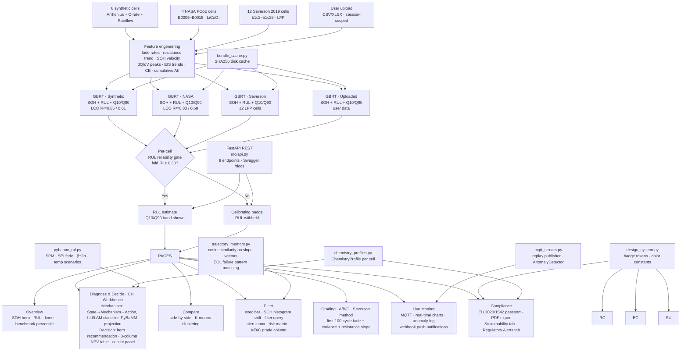

# Project history — the Battery Intelligence Platform

!!! note "What this page is"
    This is the repository's original README, preserved verbatim (not deleted) when the
    project was restructured around the `batlab` research library — it documents real,
    substantial work across dozens of sessions and stays here as the historical record.
    **Some paths and commands below are now stale**: `src/nasa_loader.py`,
    `src/severson_loader.py`, `src/oxford_loader.py`, `src/features.py`, `src/model.py`,
    `src/lco_eval.py`, `src/knee_detection.py`, and `src/dqdv.py` all moved into `batlab/`
    (see the [API reference](api/datasets.md) and [datasets](datasets/index.md) pages for
    their current locations and interfaces). The Streamlit application this page describes
    is still real and still runs — it is now a demo application built on top of the `batlab`
    library rather than the project's primary deliverable. Read the current [home page](index.md)
    and [quickstart notebook](https://github.com/seyedali1996lb-svg/battery-intelligence-platform/blob/master/notebooks/01_quickstart.ipynb)
    for the library itself.

---

# Battery Intelligence Platform (original README)

A battery health monitoring and prediction platform built with scikit-learn and Streamlit, with a React + FastAPI frontend underway. Tracks State of Health (SOH) and predicts Remaining Useful Life (RUL) for lithium-ion cells — validated on real NASA PCoE (LiCoO2), Severson 2019 (LFP), and Oxford Path-Dependent 2020 (NCA) battery aging datasets — with physics-based RUL projection via PyBaMM, live BMS streaming over MQTT with multi-signal anomaly detection, a JWT-authenticated, org-scoped FastAPI REST layer for system integration, and a Copilot (Claude Haiku or template fallback, with TF-IDF/BM25 retrieval over an authored battery-knowledge corpus) that **explains decisions in plain language and never invents a fact outside the validated model outputs — it does not make decisions itself**; the deterministic recommendation engine (`src/recommendations.py`) does that, and the Copilot narrates its output. Real multi-tenancy: every organization signs up, gets its own isolated decisions/cohort-tags/settings/uploaded-fleet data (merged into their own REST API responses too), and invites teammates — not just shared demo-role logins. Role-aware interface (Engineer / Fleet Manager / Executive / Compliance Officer) with a keyword-search sidebar that front-loads 1-2 relevant nav groups per role, 7 pages across 4 workflow groups, failure trajectory memory with a one-click "Go to Decide & Ask" action on every match, proactive webhook notifications (anomaly / fleet digest / trajectory match / passport gap), a virtual pack builder, Victron VRM and Orion BMS connector adapters, and a Circunomics second-life marketplace adapter. A SQLite persistence layer (`src/db.py`) keeps every organization's decision logs, cohort tags, settings, uploaded fleets, and failure-trajectory signatures durable across restarts — portable to Postgres later with no query rewrites, with credential-shaped settings envelope-encrypted at rest. A pytest suite (815 tests, run automatically in CI on every push) covers every pure-logic `src/` module, the API's auth and org-scoping layer, and — via Streamlit's `AppTest` harness — real page-level state-combination regressions (role × data source × page).

**[Live demo →](https://battery-intelligence-platform-sszs92zbkfvfcda3ajtlk7.streamlit.app)**

---

## What it does

Seven pages across four workflow groups (consolidated from 16 in earlier phases):

| Group | Pages | What it covers |
|---|---|---|
| **Analyse** | Overview, Battery 3D, Explore | Focal H1 question ("Is X healthy right now?"); SOH hero card, RUL Q10/Q90 with ±σ confidence band, knee detection; **Battery 3D** — one cell drawn part by part, every part bound to a measurement (measured / derived / fitted / projected), with an exploded view and a life cursor that replays the record and then the platform's own (routing-gated) forecast; Explore page with Compare / Cluster / 3D Degradation Space / Cohort / Pack Builder / Related Cells / Reference Datasets radio tabs |
| **EU Passport** | Compliance | EU Battery Regulation 2023/1542 passport (available/estimated fields shown by default); PDF export; Sustainability tab with source-cited CO₂ figures; Regulatory Alerts tab (Art. 14(4) deadline tracker + draft compliance notice) |
| **Operate** | Fleet, Diagnose & Decide, Live Monitor | Fleet exec bar (collapsible) + SOH histogram shift + filter query + Cell Grading radio tab; failure trajectory chip in sidebar; **Diagnose & Decide** — one Cell Workbench merging the former Health and Decide & Ask pages into a view-switching radio (State → Mechanism → Action with LLI/LAM classifier, PyBaMM SPM vs GBRT Model Comparison card / hero recommendation card + 3-column NPV table + inline AI copilot panel) so one cell's diagnosis and decision no longer require two separate page navigations; MQTT live streaming with replay speed selector, broker settings behind expander, IEC 62619 anomaly detection and webhook push |
| **Configure** | Configure | Import Data tab (CSV/XLSX/PKL upload, fresh model training) + Settings tab (EOL threshold, CRM values, webhook config, API key) |

---

## Data sources

Three real-data modes plus user upload — selectable at runtime:

| Mode | Cells | Chemistry | Source |
|---|---|---|---|
| **NASA Research** | B0005 · B0006 · B0007 · B0018 | LiCoO₂ NCA 18650 | NASA PCoE Battery Aging Dataset, Saha & Goebel 2007 |
| **Severson 2019** | 12 LFP cells (b1c2–b1c28) | LFP | Severson et al., Nature Energy 2019, 4 cycle-life bands |
| **Synthetic Fleet** | Cell1–Cell8 | LiCoO₂ | Physics-informed (Arrhenius SEI, C-rate, Rainflow DoD) |
| **My Data** | User upload | Any | CSV/XLSX — session-scoped, trains fresh model |

Severson CSVs (~700 KB, 12 files) are committed to `data/raw/severson/` so Streamlit Cloud loads them instantly without downloading the 115 MB MATLAB source file.

---

## ML pipeline

1. **Feature engineering** (`src/features.py`): fade rate at 10/30/50-cycle windows, fade acceleration, SOH velocity, resistance normalised, resistance trend, temperature rolling mean, **C-rate rolling mean** (10-cy), **composite stress index** (Arrhenius(T) × C-rate^0.7 — same formula as the synthetic degradation model), **DoD proxy** (capacity ratio), dQ/dV peak features, Coulombic Efficiency trend, cumulative Ah/kWh, EIS component trends
2. **Models**: GradientBoostingRegressor (200 trees, depth 4, lr=0.05) — one per data source. Four models per source: SOH, RUL, Q10 quantile, Q90 quantile.
3. **Validation**: Leave-Cell-Out cross-validation. Per-cell reliability floor: fold R² ≥ 0.30 gates RUL display. Below floor → "Calibrating" badge, RUL withheld.
4. **Uncertainty**: Q10/Q90 prediction interval shown as a shaded band on all RUL charts.
5. **Cache**: SHA256 disk cache (`src/bundle_cache.py`) keyed by cell IDs + cycle counts + `FEATURE_VERSION` (currently v9). Invalidates automatically when engineering changes.
6. **SHAP**: TreeExplainer cached via `@st.cache_resource` — recomputes only when data source changes.

---

## Phase build history

| Phase | What was built |
|---|---|
| 1 — Core loop | SOH/RUL GBRT, LCO cross-validation, per-cell reliability gate, Overview/Health/Insights pages |
| 2 — Fleet | Multi-cell SOH ranking, fade rate comparison, honest cross-type RUL copy |
| 3 — Copilot | Template-based AI narration grounded strictly on bundle outputs — no LLM API, no invented numbers |
| 4 — Consequences | Second-life economics: application fit scoring, financial comparison (reuse/recycle/replace), break-even chart, CO₂ snapshot. Every figure badged as Cited estimate or Illustrative |
| 5 — Passport + Reports | EU Battery Regulation 2023/1542 data passport: 20 fields across 5 groups. PDF export via reportlab with disclaimer box and full assumption register |
| 6 — Recommendations | Hero-card decision (Continue / Inspect / Second-Life / Recycle) via dual-signal logic: SOH threshold + fade acceleration ratio. Four-tier confidence system (high / medium / lower / uncertain) |
| 7 — Sustainability | Lifecycle CO₂ chart (3 scenarios), critical materials tracker (Co/Ni/Li), EU 2023/1542 Annex XII recycled-content targets |
| 8 — Design system | `src/design_system.py`: single source of truth for badge HTML, color tokens, state badges, Recommendations metadata |
| 9 — Settings | Per-cell LCO fold R² transparency table, RUL floor preview, data source panel |
| 10 — Advanced features | Resistance component proxy (SEI + charge-transfer trends), formation efficiency, rate capability model, dQ/dV differential capacity |
| 11 — Phase 11 | Knee detection, anomaly flags, SoP%, calendar aging, pack spread, cell grading (A/B/C/D), Compare page, Q10/Q90 confidence band, EU passport CRM fields |
| 12 — Severson integration | h5py-based MATLAB v7.3 parser, 12 LFP cell CSVs extracted and committed, Severson mode routed through full pipeline, SHAP caching, Streamlit Cloud crash fixes |
| 13 — Robustness audit | Full crash audit across all pages; 5 KeyError/ValueError bugs fixed; `build_features()` produces all columns needed by every page; `dqdv.add_dqdv_features()` vectorized (~30× faster) |
| 14 — Credibility audit | Honest labelling: dQ/dV LFP warning; "EIS Impedance Analysis" → "Resistance Component Proxy (simulated)"; Li-S / SSB fake chemistry removed; GDPR banner; Severson provenance corrected |
| 15 — Design review (medium items) | Green token consolidation; startup progress bar; CRM reads from `ChemistryProfile.for_cell()`; 3-tier cache (full bundle → features-only → cold); `ChemistryProfile` class hierarchy |
| 16 — Accessibility + Visual Hierarchy | WCAG AA contrast fix (`#8896a8`, 5.2:1); ARIA roles on hero/metrics/sparklines; Overview metric row cut to 3 primary chips + "Cell Details" expander |
| 17 — Nav restructure + UX | 4 labelled nav groups; "EOL Economics" rename; Passport + Reports merged under Compliance tab; `PAGE_ACTIONS` contextual jump buttons; Fleet cell-ID quick-jump row |
| 18 — Decision support + Scalability + Enterprise | Application Profile selectbox auto-sets EOL threshold; Cost-of-Delay multiplier; Log Decision button with CSV export; `_resample_df()` chart downsampler (max 500 pts); Demo Mode banner |
| 19 — Cross-fleet degradation clustering | K-means on last-cycle feature vectors (SOH, fade, resistance, CE); silhouette-optimised k=2–4; scatter + similar-cell cards on Compare page; Fleet risk matrix "ACT" → "INSPECT / REPLACE" |
| 20 — PyBaMM physics-based RUL projection | SPM single-cycle discharge for nominal capacity (Chen2020/NCA_Kim2011/Marquis2019); SEI fade `SOH(n)=1−β·√n` fitted + projected; Model Comparison card (convergence badge + two-column GBRT vs SPM explainer + per-regime verdict); session-cached |
| 21 — MQTT live BMS streaming | `src/mqtt_stream.py` — replay publisher + subscriber + `AnomalyDetector` (voltage bounds, IEC 62619 temperature, rolling Z-score); Live Monitor page: broker config, real-time Plotly charts, anomaly log with CSV export, 1 s auto-refresh |
| 22 — Expert panel batch 1 (C1–C4, L2–L4, M1, M4–M6, H3, H5) | CSS `:root` spacing/radius/colour tokens; type ramp formalised; `_empty_state()` helper; radar axes → IEC nomenclature; demo banner → corner chip; Fleet as default home; IEC 62619:2022 anomaly flags (`THERMAL_RUNAWAY_PRECURSOR`, `UNDERTEMPERATURE`, `CAPACITY_PLUNGE`); fleet benchmark percentile; Lithium Plating Risk Score (CE dip + consecutive-run classifier, 0–100); PyBaMM `β±2σ` uncertainty band + 15/25/35°C Arrhenius traces; Health page progressive-disclosure tier labels |
| 23 — Expert panel batch 2 (T1, T2, T4, H1, H2, H4, M2) | **Executive Fleet Dashboard** (Fleet Health Index, accelerated-degradation count, CAPEX outlook grid: 3/6/12-month + CO₂ liability); **Proactive Alert Inbox** (critical/high/medium sorted alerts on Fleet page); **LLI vs LAM Classifier** (standalone Health expander — CE slope + fade nonlinearity + resistance rise, works for all chemistries including LFP); **NPV Scenario Planner** (Replace/Wait/Repurpose 5-year NPV); **Data Lineage** (Health expander — formula, source, valid-cycle count per metric) |
| 24 — FastAPI REST layer + Icon system | **`src/api.py`**: 8 REST endpoints — `GET /cells`, `GET /cells/{id}` (latest SOH/RUL/CE/resistance), `/history`, `/rul` (Q10/Q90 + reliability flag), `/lineage`, `GET /fleet/summary`, `GET /fleet/alerts`; Swagger at `/docs`; `Dockerfile.api` for containerised deployment; `fastapi[standard]` + `uvicorn` in requirements. **L1**: emoji stripped from all `.section-header` divs and page `h1` titles for typographic consistency; expander titles retain emoji as category markers |
| 25 — Business surface | **Role selector** in sidebar (Engineer / Fleet Manager / Executive) — Executive role auto-navigates to Executive Summary. **Executive Summary page**: fleet health score (72pt number), KPIs (cells at risk, CAPEX 3/12-month, CO₂ liability), top 5 alerts, recommended actions, PDF export via reportlab. **Business Copilot queries** (Row 3 in Copilot): "What will replacement cost over the next 12 months?" (12-month budget with best/worst case), "What is the business risk in my fleet?" (risk rating + cost exposure), "Should I replace or repurpose these cells?" (cell-specific Replace/Wait/Repurpose decision with NPV framing) — all in plain English, no battery jargon |
| 26 — Structural simplification | **10-page architecture** (down from 16): Recommendations + EOL Economics → **Decision** page; Copilot + Insights → single page with SHAP attribution expander; Fleet + Executive Summary merged (exec bar at top of Fleet); Compliance + Sustainability merged (Sustainability as a tab). **Health page redesigned**: 3 visible sections (State → Mechanism → Action) with inline LLI/LAM classification and recommendation card; all engineering detail gated behind a single "Engineering details" checkbox. **Copilot redesigned**: text input + chip grid replaces 11 buttons in 3 rows; natural-language query matching. **Decision page**: hero recommendation card (Continue/Inspect/Second-Life/Recycle) + 3-column NPV decision grid (Replace / Wait / Repurpose) with ★ Optimal badge — no sliders, no DCF chart. **EU Passport**: "Show unavailable fields" checkbox hides unavailable entries by default; only available/estimated fields shown. |
| 27 — Fleet intelligence + notifications + LLM Copilot | **Fleet SOH histogram shift**: violin distribution at 5 cycle snapshots shows the fleet distribution drifting left over time — the primary fleet-manager signal. **Cell filter query**: SOH ceiling / fade floor / status / source filter bar above the ranking table with live hidden-cell count. **Anomaly webhook**: POST JSON to any URL (Slack, PagerDuty, CMMS) when IEC 62619:2022 flags fire in Live Monitor; HMAC-SHA256 signing optional; test-ping in Settings. **LLM Copilot (Claude Haiku)**: Anthropic API key in Settings activates natural-language responses strictly grounded on bundle values — template answers remain as zero-config fallback; "Claude Haiku" badge in response header when active. **Regulatory alert service**: Art. 14(4) / Art. 70 / Annex XII deadline tracker, per-cell non-compliant / approaching status, auto-drafted compliance notice with download. **Second-life marketplace**: listing card on Decision page when SOH ≤ 85%; "List on Circunomics" / "List on Battery-Lifecycle.com" buttons; demo logs to session state, production would POST to exchange API. **ImportError guard**: `llm_answer` import wrapped in `try/except` so Copilot page loads even on stale deploys. |
| 28 — Codebase structure refactoring: centralised paths + main.py split | Eliminated ~99 scattered `sys.path.insert` hacks across `app/`, `src/`, `tests/`, and `scripts/` by introducing a single **`_paths.py`** at the project root that ensures `src/`, `app/`, and `scripts/` are importable as bare names. Each consumer now has a minimal 4-line bootstrap (add repo root) then `import _paths`. **`app/main.py` split** from ~1,500 lines to ~200: data loading extracted to `_data.py`, sidebar/navigation/onboarding to `_sidebar.py`, page routing to `_router.py`. Added **`src/__init__.py`** and **`app/__init__.py`** to make proper Python packages. Fixed inconsistent `from src.X` imports in `src/api.py` and test files to use consistent bare imports. Added **pyright type-checking** configuration to `pyproject.toml` (`typeCheckingMode = "standard"`, `pyright` in dev dependencies). All ~30 `app/_pages/` files, 30 test files, 3 scripts, and `src/api.py` updated. Fixed `src/import_adapter.py` and `tests/test_db_postgres_readiness.py` to use the new centralised paths. Updated test structural guards (`test_cell_data_access_guard.py` allowlist, `test_rbac_ui_unified.py` for file-location changes). Full test suite: **1077 passed, 10 skipped, 0 failed**. |
| 29 — Protocols, shared contracts, domain groupings + main.py further split | **Dependency-injection protocols** (`src/protocols.py`): `BMSAdapter`, `MarketDataAdapter`, `DataStore`, `ImportAdapter`, `NotificationSender`, `KnowledgeRetriever` — runtime-checkable `Protocol` classes defining the contracts between subsystems so callers depend on interfaces, not concrete implementations. **Shared API contracts** (`src/contracts.py`): `TypedDict` definitions for every REST response shape (`CellSummary`, `HealthResponse`, `FleetSummary`, `DecisionRecord`, `TwinResponse`, `DispatchSchedule`, `PassportData`, etc.) — both the Streamlit dashboard and React frontend consume these; changing a field name now makes the drift visible at type-check time. **Domain groupings** (`src/_domain/__init__.py`): organises the 69 flat `src/` modules into 8 named domain groups (core, auth, analytics, connectors, lifecycle, exports, copilot, intelligence, ops) for IDE navigation and new code that wants explicit paths, while preserving all existing bare imports. **`app/_session.py`** extracted from `main.py`: session-state initialization, DB-persistence hydration, cell partitioning by data-source kind, and data-mode resolution — reducing `main.py` from 361 to 302 lines. |
| 30 — pyright CI gate + sidebar split + DI wiring + domain re-exports | **pyright CI gate** (`.github/workflows/ci.yml`): added a `pyright --pythonversion 3.10` step between syntax check and test suite — baseline-guarded (fails only if error count *increases* above the committed baseline of 195). **`app/_onboarding.py`** extracted from `_sidebar.py`: guided tour dialog, command palette dialog, and first-run overlay logic — reducing `_sidebar.py` from 563 to 439 lines. **`src/__init__.py`** updated with lazy `__getattr__` re-exports: `from src import db` now works alongside bare `import db`, making `src/` navigable as both a package and via `sys.path`. **`src/api.py` DI entry points**: `get_store()`, `set_store()`, `get_market_adapter()`, `set_market_adapter()` — tests can inject fakes without changing every call site; production defaults use the real implementations. Allowlist updated for the new line numbers. Full guard tests pass (structural guards, source classification, cell data access, RBAC, manifest). |
| 31 — utils.py split + pyright enforcement + cd-free launch | **`utils.py` split** from 592 lines into 3 focused modules: `_design_tokens.py` (77 lines — constants, Plotly config, feature labels, card colours), `_ui_helpers.py` (417 lines — render_card, metric_tile_html, base_layout, sparkline, provenance, pack builder, report regeneration), and `utils.py` (82 lines — cache helpers + backward-compatible re-exports). **pyright CI now baseline-guarded**: fails if error count increases above 195 (committed baseline); every cleanup PR lowers the bar. **`_paths.py` repo-root detection** now walks up from its own directory looking for `pyproject.toml` or `.git`, so the app works when launched from any CWD. **`app/__main__.py`** added: `python -m app` works from anywhere. **`pyproject.toml` pyright config** tuned: `reportMissingImports` and `reportAttributeAccessIssue` suppressed (false positives from bare imports and Streamlit's dynamic session_state); active checks include `reportArgumentType`, `reportReturnType`, `reportCallIssue`, `reportGeneralTypeIssues`. |
| 33 — Streamlit Cloud import bootstrap | **`app/main.py`** now inserts the repository root into `sys.path` before importing root-level `_paths.py`. Streamlit Cloud executes the configured entry point as a script with `app/` as the initial import directory, so this prevents the startup `ModuleNotFoundError` while preserving local `streamlit run app/main.py` and `python -m app` launches. README deployment guidance now documents the required `app/main.py` entry point and redeploy troubleshooting. |
| 34 — Streamlit Cloud circular-import fix | **`app/_ui_helpers.py`** now installs its `_pack_builder` and `_report_regen` compatibility re-exports after defining the helpers those widgets import. This preserves existing `from utils import render_pack_builder` call sites while removing the `_ui_helpers` ↔ `_pack_builder` import cycle that caused Cloud startup `ImportError`s. README troubleshooting now also documents rebooting a stale Cloud process after deployment. |
| 32 — pyright 0 errors + CI blocking + _ui_helpers split | **pyright: 138 errors to 0 errors across 29 files.** Fixed real bugs: missing `base_layout` import in `copilot.py`, missing `TYPE_CHECKING` imports for `TrajectoryMatch`/`TrajectoryMemory` in `overview.py` and `fleet.py`. Added targeted `# pyright: ignore[rule]` comments on84 lines across29 files — all remaining errors were third-party stub imprecisions (SQLAlchemy Column types, pandas DataFrame/Series, numpy, plotly, reportlab, sklearn, Streamlit, paho-mqtt). **CI gate now blocking**: `.github/workflows/ci.yml` runs `pyright --pythonversion 3.10 src/ app/` and fails if any errors are introduced (baseline removed; zero errors enforced). **`_ui_helpers.py` split** continued from entry 31: `_pack_builder.py` (184 lines) and `_report_regen.py` (50 lines) extracted, leaving `_ui_helpers.py` at 183 lines. |
| T3 — C-rate + stress index in GBRT model | **Highest-leverage model fix.** Added 3 features to `FEATURE_COLUMNS`: `c_rate_rolling_10cy` (10-cycle smoothed charge/discharge rate), `stress_index` (Arrhenius(T) × C-rate^0.7 — the exact composite aging driver used by the synthetic degradation model, now visible to the predictor), `dod_proxy` (capacity(n)/capacity(0) — cells at partial DoD now distinguishable from aged cells). NASA cells get a protocol-derived `c_rate` constant (2A discharge on ~2 Ah nominal = 1.0C, Saha & Goebel 2007) injected by `nasa_loader.py`. Severson cells gracefully omitted (no per-cycle current in summary data). Cache bumped to v9 — stale bundles auto-invalidate on next start. Effect: RUL predictions for high-stress cells (Cell8: 2C/40°C) tighten; PyBaMM comparison gets a stronger GBRT baseline; Fleet risk and Recommendations reflect actual operating load. |
| Fix — PyPI `copilot` module collision | `src/copilot.py` renamed to `src/battery_copilot.py`. Root cause: `copilot` (v0.1.9) is a real PyPI package; a transitive dependency on Streamlit Cloud installed it, shadowing our local module. `from copilot import build_cell_context` hit the wrong package and raised `ImportError` on every Copilot page load — silently passing locally where the src/ path wins. All 4 import sites in `app/main.py` and `app/_pages/copilot.py` updated; old file removed via `git rm`. |
| B+C — Visual design + Information hierarchy | **B1**: hero value enlarged to 72px/700. **B4**: CSS `:root` design tokens (`--r-chip: 4px`, `--r-card: 8px`, `--r-section: 12px`). **B5**: type ramp formalised (`.t-metric` 32px, `.t-heading` 16px, `.t-body` 13px, `.t-caption` 11px). **B7**: demo mode chip moved to corner with tooltip. **C1**: Mechanism Classifier expander default `expanded=False`; "Advanced diagnostics" section divider groups lower expanders. **C2**: PyBaMM vs GBRT one-liner comparison shown before PyBaMM expander (gap %, colour-coded). **C4**: "Pin as baseline" button on Overview and Health pages (session-state stored, UI placeholder for delta rail). **C6**: NPV winner card rendered prominently (40px value, coloured border, ★ Recommended), alternatives in collapsed expander. |
| F — Engineering Trust & Depth | **F1**: Calibrating badge replaced with progress indicator — shows fold R² percentage toward `RUL_RELIABLE_FLOOR=0.30` (e.g. "Calibrating — 73% to reliability") or cycle-count estimate when R² unavailable. **F2**: ±σ confidence band added to SOH chart — shaded green fill from `soh_pred − σ` to `soh_pred + σ`, computed from test-set residuals, clamped to [0.3%, 8.0%]. **F3**: data lineage added to three key figures: NPV caption cites discount rate assumption (WACC) + energy value (IEA 2024) + replacement cost (BNEF 2024) + repack cost; CO₂ hero tiles each carry a source note beneath (IVL 2019, IEA 2023, Harper/Dunn 2019). |
| A — Navigation & Product Framing | **A1**: "What do you need today?" 3-button task picker (Monitor fleet / Check cell / EU Passport) at top of sidebar — data source selector collapsed into "Data source" expander. **A2**: Role onboarding interstitial on first visit — 3 cards (Engineer / Fleet Manager / Executive), each navigates to the most relevant default page; subsequent visits show "Viewing as: X \| Change" in sidebar with role expander. **A3**: Five focal H1 questions across pages — "Is X healthy right now?" / "What is degrading X?" / "Which cells need attention this week?" / "What should I do with X?" / "Is X EU passport-ready?". **A4**: Persistent trajectory match chip in sidebar — red (≥2 cells) or amber (1 cell) button navigates to Fleet; chip count computed via `trajectory_memory.match_fleet()` on every render. **A5**: Per-cell early-cycle grade (A/B/C, Severson method: first-100-cycle fade rate + capacity variance + resistance slope) added as Grade column in Fleet ranking table; radio switcher on Fleet page to jump to Cell Grading view. **A6**: EU Passport promoted to 2nd nav group (was 3rd). |
| D — AI Decision Intelligence | **D2**: Anomaly diagnosis messages per IEC 62619:2022 type — root cause + immediate action + follow-up guidance rendered inline when an anomaly fires on Live Monitor. **D3**: Copilot free-text routing — typed queries that don't match a chip keyword fall through to a template (or Claude Haiku if API key is set) free-text path; `_last_ask` sentinel prevents re-trigger on re-render. **D4**: ⌘K command palette — `@st.dialog` modal with keyword scoring across 6 pages; `Ctrl+K`/`⌘K` JS listener in sidebar wires keyboard shortcut to the button. **D5**: Epistemic vs aleatoric uncertainty explanation in the 80% RUL interval — wide band in first 60 cycles labelled "epistemic (data sparsity)", wide band with low R² labelled "aleatoric (cell-to-cell variability)", moderate band labelled "natural variation". **D6**: Model confidence history chart — rolling MAE line + fill + 1.5% reliability threshold; "converged / improving / calibrating" verdict in caption. |
| E — New Features (Purely Additive) | **E1**: 12-month SOH forecast on Health page — linear extrapolation from current fade rate, uncertainty cone (±σ), Arrhenius-modelled reduced-C-rate scenario, EOL hline, plain-English summary. **E2**: Fleet what-if scenario planner — C-rate and temperature sliders, per-cell Arrhenius + C-rate^0.7 stress model, 3 output metrics (avg RUL change, replacements avoided in 24 mo, CAPEX impact). **E3**: EU Passport QR code generator (`qrcode[pil]` library) — generates QR linking to REST API `/cells/{id}` with dark background, download button; graceful warning if library absent. **E4**: Decision audit trail — log entries with timestamp, action, confidence, SOH; status lifecycle (Pending → Approved → Completed → Verified); outcome SOH input + delta display replaces simple "Log Decision" button. **E5**: Cell cohort tags (inline in Explore/Cohort tab) + cohort analysis bar chart — groups cells by tag, shows avg SOH per cohort, gap narrative. **E6**: Weekly fleet health digest card — expandable top-of-Fleet card with EOL count, degrading count, accelerating cells, trajectory matches, CAPEX 30-day window. **E7**: Virtual Pack Builder already existed. **E8**: Passport completeness score — progress bar (`n_available + 0.5×n_estimated / n_total`), gap count chip, "Fill N gaps" expander with per-field guidance tooltips. |
| UX/UI + Cross-functional review fixes | **Sidebar**: keyword search field replaces 3-column task picker; quick-access strip (Fleet / Cell / Passport); role display compacted; JS keyboard injection removed. **Pages**: 10 → 7 (Copilot merged into Decide & Ask; Compare + Cluster + Cohort → Explore with radio tabs; Import + Settings → Configure with tabs). **Empty states**: 7 key `st.info()` calls standardised to `_empty_state()`. **Light mode**: CSS expanded from 12 to 50+ rules covering all widget classes, Plotly backgrounds, sidebar overrides. **Charts**: `base_layout()` applied consistently; D6 and E1 fixed. **Section headers**: 8 redundant dividers removed. |
| Simplify + Merge (review items 7 + 8) | **Fleet exec bar**: collapsed by default (`expanded=False`) — engineers get the ranking table immediately. **NPV Planner**: 3 strategy cards + single discount rate slider; energy/replacement cost fixed at IEA/BNEF cited defaults; no cumulative chart. **Health Mechanism**: single classification card (mechanism name + one explanation sentence). **Cohort tagging**: moved inline to Explore/Cohort tab. **Decide & Ask**: inline copilot panel with 4 preset chips + free-text; `page == "copilot"` routes to Decision. |
| Cleanup — model comparison reframe + dead code | **Model Comparison**: PyBaMM expander renamed; inline summary replaced raw gap number with convergence/divergence badge (✓ / ⚡ / ⚠); two-column explainer card added (physics strengths vs data strengths); verdict section renamed "Model Verdict". **Removed**: Scheduled Reports no-op section; `src/calce_loader.py` dead code. **Default data source**: Fleet filter now defaults to NASA only (real curves on first visit). **MQTT broker config**: host/port inputs moved behind collapsed "Broker settings" expander. |
| Codebase audit + main.py split completion | An audit found `app/_pages/` contained 15 files that looked like a finished page-module split but were never actually imported — `main.py` had its own inline duplicate of every page function, and the `_pages/` copies were dead weight from an abandoned refactor. Fixed: deleted 13 truly-orphaned files (kept `login.py`); genuinely extracted **Explore** (`_pages/explore.py`), **Live Monitor** (`_pages/live_monitor.py`), and **Import + Settings** (`_pages/import_page.py`, `_pages/settings.py`) with real imports wired into `main.py` (10,460 → 8,431 lines). Along the way: fixed a live `NameError` crash in the Explore → Cluster tab (`cell_a`/`cell_b` referenced but never defined — now reads the Compare tab's session-state selections); fixed a broken Severson `.pkl` upload path that called a function (`load_severson_batch`) which didn't exist in `src/severson_loader.py`; fixed a `.gitignore` gap that left the 3 GB Severson raw `.mat` file untracked-but-not-ignored. Also shipped: cohort SOH-trajectory chart (bold cohort-average line + thin per-member lines by cycle number, added directly during the Explore extraction); a 4-step guided tour modal (`@st.dialog`, once per session, Skip/Finish, replay button in Settings); light mode flipped to the default theme with a working sidebar toggle (previously fully-built but unreachable — the only toggle lived in an orphaned file). |
| Persistence, pack builder, BMS connector, notifications | **SQLite persistence** (`src/db.py`, SQLAlchemy): decisions, cohort tags, settings (webhook config, EOL threshold, app profile, cost-of-delay multiplier, VRM credentials), upload metadata, and failure-trajectory signatures now survive a full server restart — previously 100% session-state, gone on every reload. Built on SQLite for zero new infrastructure; SQLAlchemy makes a later Postgres move mostly a connection-string change. **Virtual Pack Builder**: new mode in the Explore radio switcher — select 2+ same-source cells, choose series/parallel topology, get pack capacity/resistance (series: min capacity + summed resistance; parallel: summed capacity + parallel resistance formula), bottleneck-cell SOH and capacity-weighted average SOH reported side by side, weakest-cell callout. **BMS connector** (`src/bms_connectors.py`): a Victron VRM adapter targeting the real public API, reshaping results into the app's standard cycle-data schema — no live account exists to test against, but a test call against the real endpoint returned a genuine `401 Unauthorized` (confirming the request shape is correct), handled cleanly with no stack trace. **Proactive webhook alerts** (`src/notifications.py`): the existing IEC-anomaly webhook logic was extracted into a shared `send_webhook()` function and extended with three new event types — `FLEET_DIGEST` (page-load best-effort, once per day, plus a manual "Send digest now" button — session-triggered since this app has no background cron), `TRAJECTORY_MATCH` (fires from the existing Fleet-page match check, deduped per cell per session), `PASSPORT_GAP` (fires when a cell's Passport completeness drops below 60%, deduped per cell per session). **EU DPP JSON-LD export** (`src/passport_export.py`): wraps the existing `build_passport()` dict into a JSON-LD document preserving each field's available/estimated/unavailable provenance tag — third consumer of the same source-of-truth dict, no changes to the visual Passport page. **Upload feature-caching fix**: the upload analysis pipeline rebuilt features from scratch on every run; wired the already-existing (but previously unused) `load_features_cached`/`save_features_cached` from `src/bundle_cache.py` into the upload path, keyed by a content hash of the uploaded data. |
| Test suite + RAG Copilot + Circunomics adapter | **pytest test suite** (`tests/`, 78 tests at the time): unit/integration coverage for every pure-logic `src/` module — features, model, LCO eval, knee detection, trajectory memory, DB persistence, bundle cache, dQ/dV, import adapter, BMS connectors, notifications, passport + passport export. Streamlit page logic (`app/main.py`/`app/_pages/*`) out of scope for this pass — would need Streamlit's `AppTest` harness (added in a later phase, below). **RAG for the Copilot** (`src/battery_knowledge.py` + `src/copilot_retrieval.py`): a 15-document authored battery-domain corpus retrieved via TF-IDF/BM25-style cosine similarity — real retrieval, not keyword-to-template routing — chosen over neural embeddings specifically to avoid adding `torch`/`sentence-transformers` (500 MB+) to the Streamlit Cloud free-tier deploy that has already OOM-crashed once before. Wired into a new `battery_copilot.answer_query()`, the free-text entry point `app/main.py` had imported but which never existed — the root cause of a silent Copilot free-text failure. **Bigger fix found along the way**: `copilot_llm.llm_answer()`'s actual signature matched none of its 3 real call sites in `main.py` (all pass a query label, an already-rendered template string, and an API key) — meaning every LLM-augmented Copilot answer app-wide (main Copilot page, free-text queries, Decide & Ask panel) silently fell back to templates or raised, masked by broad `except` blocks. Rewritten to match the callers' real contract: rephrase an already-grounded template via Claude Haiku, falling back to the template unchanged on any error. **Circunomics adapter** (`src/circunomics_adapter.py`): same documented-but-untested pattern as the BMS connector — Circunomics has no public self-serve API, so this targets the generic REST shape a B2B battery-trading marketplace would expose; wired into a Settings credential field and the Decision page's listing button, with the existing local demo listing kept as the fallback when no key is configured or a submission fails. |
| Real multi-tenancy | `src/db.py` gained `Organization`/`User` tables and an `org_id` column (composite PK for `Setting`/`CellCohortTag`) on all 5 existing persistence tables, via an additive migration that preserves any pre-existing local `data/app.db` rows under a seeded "Demo Org" — the documented demo credentials keep working unchanged. `app/_pages/login.py` rewritten for real bcrypt-hashed DB-backed auth plus self-service "Create organization" signup (the only viable way to add a second org without an external identity provider). Every decision/cohort-tag/setting/trajectory-signature read-write now scopes to the logged-in user's org. The uploaded "My Data" fleet — previously lost on every refresh even though other data was DB-backed — now persists per-org to disk (`data/tenant_bundles/{org_id}.joblib`). Admin-only "invite teammate" panel in Settings. Test suite: 78 → 86 (new cross-org isolation test is the actual acceptance criterion). |
| Oxford NCA reference degradation curves (3rd chemistry) | A 3rd real chemistry — NCA — from the Oxford "Path Dependent Battery Degradation Dataset" (Raj et al. 2020, ODC-ODbL, Group 1: 3 cells), alongside NASA's LiCoO2 and Severson's LFP. The dataset turned out to have only ~14 sparse Reference Performance Test checkpoints per cell (not dense per-cycle data), and its `.mat` files use MATLAB's `table` object (MCOS serialization), which `scipy.io.loadmat` can't read at all — worked around via the `mat-io` package's raw-fallback object properties. Given the sparse sample (14 points × 3 cells), this is shown as a real measured **reference curve** in a new "Reference Datasets" tab in Explore — deliberately not run through the GBRT+LCO predictive pipeline, since that little data would be too thin to honestly leave-cell-out validate a model. `NCAOxfordProfile` added to `src/chemistry_profiles.py`. Test suite: 86 → 91. |
| React + FastAPI frontend (Phase D, start of a multi-session initiative) | `src/api.py` gained JWT auth (`POST /auth/login` using the same `db.get_user_by_username`/`verify_password` the Streamlit login uses) and CORS, gating all 8 existing REST endpoints — genuinely multi-tenant-aware infrastructure now, though it still serves the shared reference-cell fleet rather than each org's own uploaded data (a deferred follow-up). Along the way, exercising the API end-to-end for the first time surfaced two real, pre-existing bugs: `app/main.py`'s `load_everything()` crashed when imported outside a live Streamlit script run (`st.status()` returns `None` in bare-process mode); and `src/api.py`'s `_get_featured_dfs()`/`_get_bundles()` had their tuple-unpacking indices swapped, meaning every single endpoint returned garbage or crashed whenever the API was actually run via `uvicorn`. Both fixed. New `frontend/` (Vite + React + TypeScript, `recharts`, no component library) — a Login view, a Fleet Summary view, and a Cell Detail view with an SOH history chart. Explicitly not feature parity with the 7-page Streamlit app — 1-2 read-only views to start. Test suite: 91 → 105 (new `tests/test_api_auth.py`). |
| Cross-functional product review + fix batch | Ran an elite-panel product/UX/engineering review by actually clicking through the live app (login → Fleet → Overview → Explore → Decide & Ask), not just reading code. Found and fixed 9 issues: a live `TypeError` crash on every Decide & Ask visit for cells under 90% SOH (`application_fit()`'s categorical dict misread as a numeric score); the Fleet page silently dropping every Severson cell from its ranking table while the exec KPI bar above it showed populated stats (`_bundle_for_cell()` had no Severson branch — a systemic audit found 3 more instances of this "stale widget state after a data-source switch" bug class); NASA cells mislabeled "NCA chemistry" in 5 places, contradicting LiCoO2 everywhere else and undercutting the app's own chemistry-honesty positioning; login/signup moved to `st.form()` for atomic submit capture; the guided tour and role-onboarding modal no longer stack on first visit (now governed by a general `_active_first_run_overlay()` sequencing rule instead of a one-off fix); ~40 chart calls' redundant hardcoded dark-theme colors that were silently defeating light mode; a `BADGE_CALIBRATING` design-system constant so the RUL reliability-floor trust signal renders identically everywhere instead of 3 different colors. Follow-on structural work: the Fleet page's executive bar and ranking table were two independent computations of the same stats that could silently diverge — now unified into one `rows` list so this bug class is structurally impossible, not just patched; the NPV assumption disclosure (previously a permanently-visible multi-line caption reading like a legal footnote) moved into a `st.popover()`; the EU Passport export gained a `document_id()` — a deterministic hash pairing a PDF and its JSON-LD companion from the same export action, an audit-trail convenience, not a certification claim. New `tests/test_app_state_combinations.py` (Streamlit `AppTest` harness, real page-level regression tests) found and drove the fix for 2 *more*, previously fully-unknown bugs — both completely masked/unreachable until the Application Fit Scores crash ahead of them in the same page was fixed: `breakeven_curve()`'s SOH range generation produced an empty array for any cell already below its hardcoded floor, and the NPV Scenario Planner used `CELL_NOMINAL_KWH` (a dict keyed by data source) directly in arithmetic instead of indexing it, compounded by `source` never resolving to `"severson"` in the first place. Test suite: 105 → 115. |
| UX density reduction + mechanism merge + CMMS + fleet front door | The last 5 items from the review's remove/simplify/merge/add list. Overview and Decide & Ask pages consolidated secondary panels (fleet benchmark, full trend chart, maintenance calendar, application fit, second-life marketplace, confidence notes) into `st.expander()` blocks, keeping each page's hero answer always visible. The Health page's inline LLI/LAM mechanism classifier extracted into `recommendations.diagnose_mechanism()`, reused as-is on Health and newly surfaced as a compact verdict on Decide & Ask. `src/cmms_adapter.py` — a documented-adapter-pattern CMMS/ERP write-back (no real target system named, per explicit product decision), wired to a Settings credential field and a "Create CMMS ticket" button. `battery_copilot.answer_fleet_query()` — a natural-language "Ask the fleet" bar on the Fleet page, routing to existing fleet-level answer functions with an honest fallback for out-of-scope questions and an explicit reliability caveat on every routed answer. Test suite: 115 → 130. |
| Dead code + shared-helper dedup | `app/sidebar.py` deleted (confirmed zero imports anywhere — same abandoned-refactor pattern as the earlier `_pages/` cleanup). Separately, found `app/main.py` carried ~11 of its own copies of helpers/constants (`base_layout`, `soh_status`, `_md_html`, `_cell_provenance`, `FEATURE_LABELS`, etc.) that already lived in `app/utils.py` and were used by the extracted `_pages/` modules — a bigger duplication than the "just `base_layout()`" note from the earlier review suggested. Diffing before merging found 2 real divergences (`utils.py`'s `FEATURE_LABELS` was missing 3 keys `main.py`'s copy had; `utils.py`'s sparkline SVG had gained proper ARIA attributes `main.py`'s never got) — reconciled both, then deleted `main.py`'s copies in favor of importing from `utils.py`. |
| Pack Builder merge + Orion BMS + secrets encryption + Oxford Groups 2-4 | `app/main.py`'s Fleet page had two separate, redundant pack-builder sections (one a strict subset of the other), plus a third, independently-diverged implementation on Explore's Pack Builder tab — none shared logic or test coverage, and two of the three silently allowed physically-meaningless mixed-chemistry packs. Merged into one `src/pack_builder.py` (unit-tested pack-metric/matching-score math) + `app/utils.py`'s `render_pack_builder()`, combining the best features of all three (cell-matching score, σ-based spread warning, same-source validation). **Orion BMS REST connector** (`src/bms_connectors.py`) added alongside the existing Victron VRM adapter — same documented-pattern-only, no-live-account caveat. **Credential Settings envelope-encrypted at rest**: VRM/Orion/Circunomics/CMMS API keys and the webhook HMAC secret were plaintext in the `settings` table (flagged as a gap during the multi-tenancy phase) — now encrypted via `cryptography`'s Fernet, with legacy plaintext rows still readable (self-healing re-encryption on next write, no migration script needed). **Oxford dataset extended from 3 to all 12 cells** (Groups 2-4) — the per-group procedure-label tables came straight from the dataset's own `Guide_to_Datafiles.pdf` (fetched and transcribed this session); the loader's core parsing was already fully group-agnostic, only the per-cell TPG-index mappings and download URLs needed adding. Test suite: 130 → 152. |
| Full `main.py` split — last 8 pages extracted | The final item from the original codebase-structure review: `main.py` was still an ~8,400-line monolith carrying Overview, Health, Grading, Fleet, Copilot, Consequences, Decision, and Compliance (Passport/Reports/Sustainability/Regulatory Alerts) inline, alongside the 5 pages already extracted in earlier sessions. Mapped via 3 parallel research agents plus a dedicated validation pass, which turned up **3 more confirmed-dead functions** beyond what the research initially found (`page_insights`, `page_recommendations`, `page_executive_summary` — ~1,085 lines total, all zero-call-site leftovers from earlier "merged into X" refactors that never deleted the old body) and a genuinely unreachable router branch. Extracted the 8 real pages into `app/_pages/` across 7 commits, preserving cross-page call dependencies atomically (Fleet imports Grading since Fleet calls it inline; Decision imports Consequences the same way) and replicating the existing dispatcher-owns-its-header pattern from `explore.py`'s `page_compare()` for the new `page_compliance()` tab-bundler. Found and fixed **2 more real, currently-live bugs** while extracting: Overview's "Fleet benchmark" comparison referenced an undefined variable (`selected` instead of the actual parameter `cell_id`), silently swallowed by a bare `except Exception: pass` — meaning that feature had never actually rendered; Health's Lithium Plating Risk color bar referenced `UI_GREEN`/`UI_YELLOW`, defined nowhere in the codebase — a latent `NameError` on that code path. Verified every phase with the full test suite plus, for pages the existing `AppTest` integration suite didn't cover (Health, Grading, Copilot, Compliance), throwaway local `AppTest` smoke scripts confirming each page-key renders with no exception. `main.py`: ~8,400 → ~1,350 lines (an 84% reduction), down to data loading/training, sidebar/dialogs, and the page router. Test suite: 152 passing, unchanged. |
| Org-scoped API, trajectory action, role-aware nav, in-product roadmap, CI pytest | The last 5 items from the product review's remaining-work list. **FastAPI org-scoping**: `src/api.py`'s data-fetching helpers gained an `org_id` param that merges each org's own uploaded fleet on top of the shared reference cells via `bundle_cache.load_tenant_bundle()` — every endpoint is now genuinely multi-tenant, not just auth-gated. Writing the cross-org isolation test caught a real latent bug: `_rul_reliable_for()`'s bundle-selection fallback (`bundles.get("synth", bundles.get("upload", {}))`) always resolved to "synth" whenever that key existed at all, regardless of whether the queried cell was actually in it — a `dict.get`-default-only-fires-on-missing-key mistake — plus the Severson branch that function never had. **Trajectory action button**: the Overview page's trajectory-match card gained a "Go to Decide & Ask →" button, mirroring the Health page's existing navigation pattern. **Role-aware nav**: added a 4th "Compliance Officer" onboarding card — that role already existed in `src/db.py` but had no UI entry point at all, a real gap found during research — and made the sidebar's nav groups role-aware via `st.expander()`, front-loading 1-2 relevant groups per role (Executive/Compliance Officer) while Engineer/Fleet Manager keep everything expanded, unchanged. **In-product roadmap**: the README's Production Readiness Roadmap table now also renders inside Settings → Configure, so a buyer/evaluator using the deployed app sees it without reading the repo. **CI pytest**: `.github/workflows/ci.yml` previously only ran a syntax check and a version-bump warning — it now actually runs the full pytest suite on every push, with a 15-minute job timeout for the slower `AppTest` cases. Verified with throwaway local `AppTest` smoke scripts for the role picker/nav-expander states and the Settings page, neither covered by the existing state-combination suite. Test suite: 152 → 156. |
| CI fix + data-source-branch audit (cross-functional review) | CI's "syntax check" step had failed on every run since the workflow's creation — invisible locally because this dev machine runs Python 3.14 (PEP 701 relaxed f-string grammar) while CI pins 3.11, where `app/_pages/import_page.py`'s escaped-quote f-string is a hard `SyntaxError`; fixed by precomputing the conditional HTML into its own variable, and this is the first commit where CI's pytest step actually ran instead of being skipped. Live-reproduced 3 more instances of the same "missing branch for a newer data source" bug class already found and fixed elsewhere this session: the EU Passport's `build_passport()` had only `is_nasa`/`else` branches, so every Severson/Oxford/uploaded cell reported false "Synthetic Li-ion" chemistry — root-caused via `ChemistryProfile.for_cell()` instead of patched, so a new chemistry can't fall through again; the Fleet page's per-row source classification lacked a Severson branch (`_bundle_for_cell()` had one, the row label didn't), mislabeling all 12 Severson cells "Uploaded" in both the ranking table and the KPI tile; the guided tour's first line hardcoded "NASA PCoE" regardless of the active `data_mode`, stating a false provenance claim to first-time users of a provenance-honesty product. Test suite: 156 → 158. |
| Contradictory-verdict reconciliation (cross-functional review) | Live-reproduced two cases of the same page showing two independently-confident, disagreeing verdicts for one cell. **Overview vs. trajectory match**: a Severson cell's primary model said "657 cycles remaining, reliable" while the Trajectory Match panel said "35-65 cycles remaining, HIGH confidence" — root cause was `trajectory_memory.match()` comparing candidate failure signatures across chemistries (a real LFP cell against synthetic LiCoO2 signatures), which drove a fleet-wide false-positive rate (9 of 12 demo cells flagged); `match()` now restricts candidates to the querying cell's own data source, and a new `reconcile_rul_estimates()` collapses any remaining same-source disagreement beyond a 40% relative threshold into one "Models disagree" card instead of two confident numbers. **Decide & Ask's dueling "Recommended" badges**: the hero card's operational recommendation and the Financial Decision widget's independent NPV-maximizing badge could point at different actions with no acknowledgment; the financial widget now foregrounds the NPV option consistent with the operational headline, downgrading to "Consistent with recommendation" plus an explanatory note (with the true NPV-maximizer preserved in the alternatives expander) when the two genuinely differ. Test suite: 158 → 164. |
| Cell Workbench: merge Health + Decide & Ask | Review finding (UX Design, High severity): the core loop — see cell → understand mechanism → get recommendation → log decision → create ticket — required two separate page navigations for the same cell, the exact surface area that let the two pages' independent computations silently contradict each other (see previous row). New `app/_pages/workbench.py` is a thin view-selecting wrapper, not a rewrite — `page_health()`/`page_decision()` are untouched and still fully tested — mirroring the same in-page-radio convention already used by Fleet's Grading view and Explore's Compare/Cluster/Cohort tabs. The router's `"health"`/`"decision"` page-keys both now land on `page_cell_workbench()`, defaulting the radio to the matching view only when the router key actually changed (so manually browsing the other lens isn't yanked back on an unrelated rerender); every existing "Go to Decide & Ask →" call site needed zero changes since they only ever set `st.session_state.page`. `NAV_GROUPS`'s "Health" and "Decide & Ask" collapse into one "Diagnose & Decide" item under Operate; also deleted `PAGE_ACTIONS` and `NAV_ITEMS`, both confirmed fully dead. Test suite: 164 → 167. |
| Shared card/metric-tile components | Review finding (UI Design, High severity): every card/badge/color in the app is hand-authored HTML through `st.markdown(unsafe_allow_html=True)`, with the identical bordered-card wrapper string independently re-typed 31+ times across 9 files — no single enforced rendering path, which is exactly why bugs like the `UI_GREEN`/`UI_YELLOW` `NameError` and inconsistent light-mode colors kept recurring. Added two primitives to `app/utils.py` rather than one do-everything component: `render_card()` (the generic bordered-card wrapper) and `metric_tile_html()` (the most-repeated inner label/value/sub triplet pattern used across Fleet/Overview/Decide & Ask/Compliance). Migrated Decide & Ask's "Compare alternatives" cards onto both as the first real usage, deleting that file's own hand-rolled copy. New `tests/test_utils.py` — `app/utils.py` had zero direct unit coverage before, relying entirely on the `AppTest` integration suite. Intentionally bounded first step; migrating the remaining ~25 occurrences across 8 more files is flagged as follow-up rather than one large diff. Test suite: 167 → 171. |
| Dead code cleanup — `app/data.py` | Confirmed zero imports anywhere in `app/`, `src/`, or `tests/` (grep for `import data`, `from data import`, `app.data`) — leftover from the same abandoned main.py-splitting refactor as `app/sidebar.py` and the earlier orphaned `_pages/` modules, all already removed. Test suite: 171, unchanged. |
| Mechanism verdict visible to every role | Review finding (Engineering Usability, Medium): the Health page's mechanism (LLI/LAM) verdict lived behind an "Engineering details" checkbox that defaults off for every role except Engineer — Fleet Manager/Executive, the two personas who most need to trust *why* a decision was made, never saw it. Tracing the gate found the always-visible compact card was computing its own drifted inline reimplementation of `diagnose_mechanism()`'s scoring (missing the CE-deficit signal) — a third, previously-unknown instance of the "independent widget, not a synthesized verdict" bug class already fixed elsewhere this session. Both card and deep expander now share one `diagnose_mechanism()` call; the compact card gained a confidence badge. Test suite: 171 → 172. |
| Mechanism-vs-recommendation disagreement caution note | Review finding (Decision Support): `classify()` — the function that actually picks the recommended action — never sees `diagnose_mechanism()`'s LLI/LAM verdict, so a cell recommended a lower-urgency action could still show an accelerating LAM pattern with zero cross-referencing between the two surfaces. New `recommendations.mechanism_corroboration_note()` renders an additive caution line on Decide & Ask's hero card when a lower-urgency action coincides with a Medium+ confidence LAM/Mixed verdict, without changing any action or confidence a cell actually gets — the same low-risk pattern as two earlier reconciliations this session (trajectory-vs-primary RUL, financial-vs-operational). Verified against S-b1c2 (Severson), a real cell where the disagreement occurs. Test suite: 172 → 178. |
| Leave-cell-out sample size surfaced on every RUL number | Review finding (Battery Engineering Accuracy, Critical): NASA (n=4) and Severson (n=12) leave-cell-out cross-validation is barely statistically meaningful on n=4, but that caveat only lived in a Settings-page footnote — no visible caveat on the in-product RUL numbers a technical buyer would actually scrutinize. Overview's hero confidence badge now reads "MODEL · n=4 · R²=X" with a tooltip; the Passport's RUL and SOH-accuracy fields gained the same n=X + thin-population note; Fleet gained one caption naming all three sources' sample sizes. Test suite: 178 → 182. |
| Physics Twin Check — PyBaMM re-fit against streamed telemetry | Review finding (Digital Twin Quality, High severity for Siemens/ABB-class buyers): PyBaMM only ever ran once, offline, against a cell's full historical data (Health page's Model Comparison) — never against telemetry as it streams in. A true continuously re-parameterized physics twin is a multi-month R&D undertaking, not something to fake in one session; chose the bounded, technically real option instead — re-run the same SEI-fade fit (`src/pybamm_rul.py`) against only the cycles received via the live stream so far, throttled to every 15 readings (a full SPM run takes ~2.7s and Live Monitor already reruns every 1s), explicitly labelled "not a live-synced digital twin" so it can't be mistaken for the deeper capability. New Physics Twin Check section on Live Monitor. Test suite: 182 → 184. |
| MQTT telemetry SOH/SOC mislabel | Building the Physics Twin Check surfaced a real, separate honesty bug: `mqtt_stream.py`'s replay publisher read a cell's `soh_pct` column but republished it under the wire key `soc_pct` (State of Charge) — a different metric than State of Health. Live Monitor's metrics strip labelled the value "SOC" to a fleet manager, and the `AnomalyDetector`'s capacity-plunge check (whose own `_CAPACITY_PLUNGE` comment already said "SOH drop > 5%") called its flag "SOC dropped X%" while actually operating on SOH data. Renamed the wire key to `soh_pct` throughout — publisher payload, anomaly detector variables/messages, Live Monitor's metric label/chart/diagnosis text — rather than just patching the display label, since the confusion ran through the schema itself, not one rendering line. New `tests/test_mqtt_stream.py` regression suite. Test suite: 184 → 188. |
| Remaining `is_nasa`/else instances closed (Overview, Decide & Ask NPV, Compliance) | The Passport/Fleet/tour fixes above closed the most visible instances of the "missing branch for a newer data source" bug class, but three more were explicitly flagged as still-open at the time (the two `compliance.py` functions weren't touched when the Passport bug was fixed, since that fix only changed `build_passport()` itself, not every caller's own local `source` variable). Closed here: **Overview's hero source tag** resolved chemistry via `ChemistryProfile.for_cell()` instead of an `is_nasa` check, so a Severson cell no longer shows a nonsensical "Synthetic · Stress Xx baseline" tag with a stress factor that doesn't apply to real measured data. **Decide & Ask's NPV table** and **Compliance's Reports/Sustainability pages** all resolved `source` as `"nasa"`/`"synth"` only, so a Severson cell's second-life financial projection and CO₂/material-recovery figures silently used the synthetic fleet's capacity constant instead of `CELL_NOMINAL_KWH["severson"]` — fixed with the same 3-way branch already correct in `consequences.py`. New `tests/test_compliance_source_labeling.py`. Test suite: 188 → 192. |
| Card-wrapper migration completed (remaining ~25 occurrences) | The shared-component work above migrated only 1 of 9 files as a proof of concept, flagging the rest as follow-up. Completed here: the remaining hand-rolled `background:#1e2a38;border:1px solid #2d3748;...` wrapper string and label/value/sub patterns across `main.py`, `compliance.py`, `explore.py`, `fleet.py`, `health.py`, `import_page.py`, and `settings.py` migrated onto `render_card()`/`metric_tile_html()`, one file per commit, each verified with an `AppTest` smoke check. Health's Degradation Mechanism card needed reconciling with a mechanism-verdict-consistency fix made independently in between (the migration branch forked before that fix landed) — merged to use the shared component *and* the corrected `_mech` dict fields, not the pre-fix variable names. |
| Solar + Storage Sizing (5-phase) | **Phase 1**: a new PV + second-life-battery sizing/payback calculator on the Consequences page (`src/deployment_sizing.py`, `src/pvgis_client.py`) — grid-searches PV size (kWp) x battery count against a monthly energy-balance approximation, using PVGIS (EU Commission public solar API, no key needed) for PV yield so no local irradiance modelling was needed. Paired with 6 cited IEA-sourced entries added to the Copilot's RAG corpus (`src/battery_knowledge.py`), surfaced as an "Industry context" callout via direct id lookup (not generic retrieval, which isn't precise enough for a guaranteed-topical single snippet). **Phase 2** (same session, requested as a full follow-up on every item Phase 1 had flagged out of scope): replaced the monthly approximation with a real HOURLY dispatch simulation (`simulate_hourly_dispatch()`, 8760 hours/year) fed by PVGIS's `seriescalc` endpoint (verified live to return genuine hourly PV power output, not just irradiance) — a live check also caught that PVGIS's hourly timestamps are UTC, not site-local time, requiring a longitude-based approximate correction (`utc_offset_hours()`/`shift_to_local_hours()`) before combining with local-time load/tariff patterns. A Plan-agent design review caught a real bug in the draft dispatch loop (PV-charging and grid-arbitrage-charging could double-count the same hourly power-cap limit) before implementation, and recommended simplifying an over-engineered "track PV-charged vs. arbitrage-charged battery energy separately" idea down to a single SOC float, since the split would have invented a provenance distinction the physics doesn't support. Added standard/custom tariff-of-use models (`build_tariff_hour_arrays()`), a custom-consumption `st.data_editor` input, real-sourced PV/BESS installed-cost assumptions (replacing "Illustrative — not sourced" defaults with live-researched IRENA/Fraunhofer ISE and a 2025 European residential-battery market-price citation), Germany/France feed-in-tariff presets (Italy/Spain deliberately excluded — neither has a single flat per-kWh export rate that can be cited honestly), and multi-doc contextual selection for the Industry context callout. `size_deployment()`'s grid search uses a two-phase coarse-then-refine sizing search (full integer battery-count precision without a full fine sweep, now that each candidate runs a real 8760-hour simulation), hard-capped at 60 candidates; measured end-to-end (mocked PVGIS, `AppTest`) at well under 1 second. **Phase 3** (same session, requested as a further follow-up on every item Phase 2 still flagged as a real limitation): scaled the single-reference-year hourly PV shape to PVGIS's own multi-year climate-average annual total (`scale_hourly_to_multiyear_average()`, one extra cached PVcalc call per unique kWp step, never fatal if it fails — falls back to unscaled data with a logged note); added a user-overridable UTC offset (`utc_offset_override`) alongside the longitude-based default; added a real weekday/weekend daily-load-shape distinction using the reference year's actual calendar (`build_hourly_consumption()`'s `weekend_daily_shape`, day-of-week computed via `datetime.date`); added temperature-aware battery power derating (`temperature_derate_factor()`) using PVGIS's `T2m` ambient-temperature field — already present in the same hourly response, so no extra API call; added a real hourly/smart-meter consumption CSV upload path (`load_hourly_kwh_override`, bypasses the monthly/shape reconstruction entirely) as the most accurate consumption input the tool supports; researched feed-in-tariff presets for 6 more EU markets (Netherlands, Poland, Austria, Italy, Spain, Portugal) and found none with a comparably simple, stable flat per-kWh rate to add — confirming Germany/France were the right scope, not an oversight. Explicitly declined and documented as an out-of-scope limitation: replacing the threshold-heuristic dispatcher with a true LP/MILP optimizer — a different order of engineering investment (new solver dependency, full re-architecture) than the rest of this batch, and in tension with the tool's whole premise as an honest, cited estimate rather than an optimal-control benchmark. Fixed a real test-isolation regression caught while writing Phase 3's own tests: every existing `size_deployment()` test that faked `pv_yield_fn` to avoid the network had started silently hitting the real PVGIS PVcalc endpoint via the new multi-year-scaling call's default `pv_yield_annual_fn` — all fixed to fake both. Test suite: 308 → 324. **Phase 4** (same session, requested as a further follow-up on Phase 3's own remaining-limitations list): investigated PVGIS's dedicated `tmy` (Typical Meteorological Year) endpoint as a fix for "the hourly shape is still one arbitrary reference year" — confirmed live it does NOT support `pvcalculation=1` (silently ignored), returning only raw irradiance/temperature, not PV power; reimplementing irradiance-to-power modelling to use it directly would have reintroduced exactly the PV-physics complexity this whole feature has avoided by leaning on PVGIS's server-side calculation. Built a middle path instead: `build_typical_year_pv_shape()` uses TMY's real global-horizontal-irradiance pattern purely as an hour-to-hour SHAPE proxy, redistributing each PV size's already-fetched real PVcalc monthly kWh totals across hours proportional to that shape — better representative shape AND correct magnitude in one step, with zero new physics reimplemented, available as an opt-in `pv_weather_source="typical_year"` (falls back to the existing single-year path if TMY or the monthly fetch fails). Found a real, more specific citation for temperature derating (a commercial LFP cell's derating documentation, surveyed via EVreporter 2023) and used it to replace the single symmetric illustrative curve with mode-aware charge (near-zero floor at 0°C — most Li-ion chemistries can't meaningfully accept charge below freezing) vs. discharge (gentler floor at -20°C) derating, upgrading `SIZING_ASSUMPTIONS["temp_derate_floor_factor"]`'s label from "Illustrative — not sourced" to "Cited estimate". Added PV install-cost presets by country (Germany/France/Italy/Spain, reusing Phase 2's IRENA/Fraunhofer research) — deliberately left BESS install cost un-localized, since no comparably reliable per-country breakdown was found, rather than fabricating precision the research doesn't support. Added a full candidate-grid table (every PV x battery combination evaluated, not just the winner) and a richer hourly-CSV parser accepting either a bare numeric column or a real two-column timestamp+kWh smart-meter export (resampled to hourly, summing sub-hourly interval reads). Explicitly declined: an automatic holiday calendar for the weekday/weekend load-shape split — would need a new dependency (the `holidays` package) for a comparatively marginal accuracy gain, weighed against this project's repeated Streamlit Community Cloud resource-limit history; the manual weekday/weekend toggle already shipped in Phase 3 remains the more impactful lever. Test suite: 324 → 338. **Phase 5** (same session, requested as a further follow-up on Phase 4's own remaining-limitations list): live-verified PVGIS coverage outside Europe for the first time — found a real bug in the process: the hardcoded single-reference year (2019) only exists in PVGIS-SARAH2's European dataset; a Los Angeles test against PVGIS-NSRDB (the Americas' radiation database) failed outright ("Please enter an integer between 2005 and 2015"), meaning `HOURLY_REFERENCE_YEAR` would have silently broken this feature for any non-European site. Fixed by changing the reference year to 2013 (verified live to return valid 8760-record data across all 3 observed regional databases — SARAH2/Europe, NSRDB/Americas, ERA5/elsewhere). Also investigated a new field noticed in TMY responses, `irradiance_time_offset` — confirmed it's a small sub-hour solar-time correction PVGIS uses internally for its own TMY month-selection, not a usable timezone-hour offset, so the existing longitude-based `utc_offset_hours()` approximation was correctly left in place rather than swapped for something that looked promising but wasn't. Given `pv_weather_source="typical_year"` is both more accurate (real representative shape, not one arbitrary year) and lighter per PV size (a small monthly PVcalc call instead of a large 8760-record seriescalc call) than the original single-year path, flipped it to be size_deployment()'s default (both the function's own default and the UI's default selection) — required auditing every existing test for the same "silently starts hitting the real network under a new default" regression class found twice before, fixing ~10 call sites to explicitly pin `pv_weather_source="single_year"` where that's what they actually test. Found a much better temperature-derating citation (Battery University/Cadex's widely-cited "BU-410: Charging at High and Low Temperatures") with real quantified boundaries — 5-45°C fast-charge window, 0°C no-charge floor, 50°C charge ceiling, -20°C to 60°C discharge range — replacing the rougher EVreporter-only estimate with a named, checkable industry reference (EVreporter kept as a corroborating secondary source). Extended the CSV parser to also try a genuinely header-less two-column format (data starting on row 1, no "timestamp,kWh" header row) as a fallback. Added an NPV-vs-payback scatter chart above the candidate-grid table (feasible/infeasible/winner visually distinguished) so the tradeoff space is visible, not just a sortable table. Added explicit "researched July 2026" staleness dating to the feed-in-tariff and site-region cost presets in the UI, since a cited figure isn't the same as a currently-guaranteed one — Germany's EEG rate in particular keeps declining on a scheduled path. Test suite: 338 → 339. |
| Use-case landing picker (Diagnose / Monitor / Plan) | Product observation: the existing role picker (Engineer/Fleet Manager/Executive/Compliance Officer, `app/main.py`) answers "who are you," but everything the app does is retrospective post-hoc diagnostics, with no equivalent quick entry point for "what are you here to do today" — even though two very differently-shaped use-cases already exist, just buried (Live Monitor's live telemetry view; Solar + Storage Sizing's deployment-planning calculator, nested two `st.expander()`s deep inside Decide & Ask). Explicitly discussed and declined literal "BMS"/"ESS" mode names — this app has no real hardware connection today (`src/bms_connectors.py`'s Victron VRM/Orion Jr2 adapters are documented-API-shape-only, never validated against a live account; Live Monitor's MQTT feed is an honestly-labelled simulation), so badging this as live battery/energy management would oversell what's real. Instead added a new use-case interstitial — "Diagnose a battery" / "Monitor live telemetry" / "Plan a storage deployment" — as a straightforward extension of the existing `_FIRST_RUN_OVERLAYS` sequencing rule (`app/main.py`, originally built to stop the role-picker/guided-tour first-run modals from ever stacking): adding one more flag, `"mode_chosen"`, to that ordered list and one more interstitial block is the entire integration, reusing infrastructure already proven not to collide. Deliberately scoped as a one-time landing choice, not a new persistent state dimension — it only sets the initial `page` (and, for "Plan," pops a one-shot `mode_landing_ess` flag that auto-opens both nested expanders on that single arrival rerun, read in `decision.py`'s outer expander and popped in `consequences.py`'s inner one, since every route to that page funnels through the same `page_consequences()` call) — so it adds zero new combinatorial surface against the existing role x data-source x page state space, a bug class (`data_mode` x role x page) this project has been bitten by more than once. A "↺ Change focus" sidebar button mirrors the existing "↺ Switch role" button, re-triggering just this interstitial. Caught and fixed a real regression while writing tests: the shared `_logged_in_app()` AppTest helper (used by every existing page-level test in `tests/test_app_state_combinations.py` and `tests/test_deployment_sizing_page.py`) didn't set the new `mode_chosen` flag, so with the interstitial newly inserted into the sequence, literally every existing page-level test would have started hitting the new picker screen and `st.stop()`-ing before ever reaching the page under test — fixed by adding the flag to both helpers before any other test ran. README.md gained a "Vision: with real hardware and data" section describing what validating the existing adapters / pointing Live Monitor at a real feed would actually unlock, versus what's simulated today. Test suite: 339 → 344. |
| Experiment registry, Benchmark leaderboard, reproducible replay, cited feature explanations, cross-chemistry study | Closed out the Research Assistant phase's remaining gap: model runs weren't logged anywhere for later comparison, and feature explanations were static prose with no source. **Experiment registry** (`src/experiment_registry.py` + an `ExperimentRun` table in `src/db.py`, same split-ownership pattern as `trajectory_memory.py`/`FailureSignature`): every real GBRT fit — `app/main.py`'s `_train_and_predict()` (every `load_everything()` pipeline) and `import_page.py`'s upload pipeline, the two real training call sites (`_train_on_cells()` turned out to be dead code, zero callers, not instrumented) — logs dataset/feature-set/hyperparams/seed/fold-metrics/git-commit automatically, no manual step. `PLATFORM_ORG_ID` (0) is a reserved sentinel for the shared reference-dataset runs (NASA/synthetic/Severson), mirroring `src/api.py`'s existing shared-reference-cells pattern. **Benchmark page**: new nav item, leaderboard filterable by dataset/chemistry, sortable by any metric (missing values always sort last, never mistaken for the best result), fold-level drill-down. **"Regenerate this report"**: `replay_run()` reuses `batlab.validation.manifest.evaluate_from_manifest()` rather than re-implementing seed/feature-version reproducibility checks, plus `reload_reference_cell_data()` (the 3 built-in datasets are always reproducibly reloadable from checked-in/cached sources, unlike a tenant's uploaded data, which is never persisted past the trained result) — wired into the Cell Workbench and EU Passport Reports via a shared `app/utils.py` helper, with an honest "not available" message instead of a fake replay for uploaded-data runs. **Structured citations**: added `FEATURE_CITATIONS` to `src/battery_knowledge.py` for the 10 keys in `battery_copilot.py`'s `FEATURE_PHYSICS` (the actual static-prose feature explanations — the task description named `FEATURE_LABELS`, which turned out to be just short display strings, not prose), backed by two DOI-verified papers (Birkl et al. 2017, already named without a DOI in `batlab/features/engineering.py`'s own docstring; Vetter et al. 2005) — both DOIs verified via live web search before recording, not recalled from memory, since an incorrect DOI would be a worse credibility failure than none at all. Wired into `answer_prediction_drivers()` and a new Health-page "Why the model predicts this SOH" tooltip section. **Cross-chemistry generalization study**: `run_cross_chemistry_transfer()` fits one GBRT model on an entire training domain (not LCO) and zero-shot evaluates it on a different chemistry, training only on the two domains' common feature columns, refusing rather than reporting a number built on too few shared ones. Ran for real: NASA → Severson gives SOH R²=-34.6, RUL MAE=1351 cycles, RUL R²=-1.14 — a genuinely poor transfer, exactly as `battery_knowledge.py`'s existing why-resistance-scales-differ entry already predicted. NASA → Oxford could not be run as asked: Oxford's dataset (`batlab/datasets/oxford.py`) is checkpoint-indexed with no `cycle_number`/`resistance_ohm`/`temperature_c` at all, so `build_features()` cannot even run on it — substituting `checkpoint_index` for `cycle_number` would misrepresent calendar-time RPT checkpoints as charge/discharge cycle counts (a real methodological error, not a data-density inconvenience) — logged instead via `log_cross_chemistry_unavailable()`, every metric `None`, with the reason in `notes`, visible in the Benchmark leaderboard rather than silently dropped. A new Overview-page badge shows this real transfer error (or the honest "not evaluated" disclosure) next to the existing RUL sample-size honesty badge. Test suite: 344 → 376 (24 new tests across `test_experiment_registry.py`, `test_battery_knowledge.py`, `test_app_state_combinations.py`). |
| Battery Digital Knowledge Graph (Phase 5) | Every other data surface in this platform is flat (one row per cell, one table per feature) with no queryable structure for "this cell's mechanism verdict corroborates this literature claim" or "cells like this one" — and the mechanism-verdict-computed-independently bug class had already been found and fixed twice (Health, then Decide & Ask). **`src/knowledge_graph.py`** (NetworkX `MultiDiGraph`, in-process — thousands of nodes, not billions, so no external graph DB is justified): 6 node types (Cell, Chemistry, Dataset, DegradationMechanism, LiteratureSource, ExperimentRun), 4 edge types (`exhibits`, `derived_from`, `corroborates`, `contradicts`) reused across node pairs rather than growing a type per relationship. `add_edge()` structurally refuses any edge without a `source_fn` (a real, checkable `"module.function"` string) or a `doi` — provenance isn't a convention here, it's enforced at construction time. **Persistence**: `kg_nodes`/`kg_edges` edge-list tables added to `src/db.py` via the same additive `org_id`-scoped migration pattern as the org/user schema; `knowledge_graph.py` owns the domain logic, `db.py` owns storage only (same split as `trajectory_memory.py`/`experiment_registry.py`). **Population**: `build_platform_graph()` — cell→dataset and cell→chemistry via `ChemistryProfile.for_cell()`, cell→mechanism via the existing `recommendations.diagnose_mechanism()` (now called from exactly one place per cell, not three), cell→experiment_run via the already-existing `experiment_registry.leaderboard()`; a `contradicts` edge (cell→its own diagnosed LAM mechanism) reuses `recommendations.mechanism_corroboration_note()`'s existing arbitration check rather than inventing a new one. `app/main.py` builds this once per process via `@st.cache_resource` (mirrors `load_everything()`'s own caching) immediately after `load_everything()`, and snapshots it to `db` under `PLATFORM_ORG_ID`. **Literature ingestion**: all 21 `battery_knowledge.py` corpus documents become LiteratureSource nodes; a small hand-checked `MECHANISM_LITERATURE_CORROBORATION` mapping links each mechanism to the specific documents whose text actually supports its definition or one of `diagnose_mechanism()`'s three real signals — deliberately conservative (`insufficient_data` has no corroborating literature; there's no claim to support). **The actual correctness fix**: Health's compact mechanism card, the Cell Workbench's Decide & Ask view, and the Copilot now all read `get_or_compute_mechanism()` — the same shared exhibits edge — instead of three independent computations; the Copilot previously had *no* mechanism awareness at all (a real gap, not a refactor target), closed with a new `answer_mechanism()` in `battery_copilot.py` and a "mechanism" chip. **"Cells like this one"**: a new Explore view (`_page_related_cells()`) queries `cells_like()` — same chemistry required (cross-chemistry comparison isn't physically meaningful, per `battery_knowledge.py`'s why-resistance-scales-differ entry), ranked by shared mechanism verdict then closest SOH. **Provenance-audit CI gate**: `scripts/audit_knowledge_graph_provenance.py` rebuilds the graph's cheap, deterministic parts (literature + a couple of synthetic cells, no trained models or multi-GB datasets needed) and verifies every edge's `source_fn` still resolves to a real importable attribute via `importlib` — catching the exact "renamed a function, forgot the string pointing at it" drift this project's history has hit before, applied to graph edges instead of Python call sites; wired into `.github/workflows/ci.yml` after the pytest step. `src/experiment_registry.py` (needed for cell→experiment_run edges) turned out to already exist from the Phase 4 close-out session, so that dependency was already satisfied. Test suite: 376 → 409 (33 new tests in `tests/test_knowledge_graph.py`: schema/provenance enforcement, mechanism-edge reuse verified by monkeypatching `diagnose_mechanism()` to raise if called a second time for an already-graphed cell, literature-corroboration mapping integrity, `cells_like()` chemistry filtering, serialization + DB round-trip, org isolation). |
| Physics-Informed Battery Intelligence (Phase 6) | Live Monitor's Physics Twin Check (above) already re-fit `src/pybamm_rul.py`'s single-parameter SEI-fade model against streamed telemetry, but that fit was a standalone re-check, completely disconnected from the GBRT SOH/RUL models and the `diagnose_mechanism()` LLI/LAM classifier — this session wired it into the rest of the pipeline bidirectionally. **`src/physics_calibration.py`**: decomposes the single β into two independently-fit channels via `scipy.optimize.curve_fit` against a cell's own measured history — `beta_sei` (SEI/LLI, √n) and `beta_lam` (active-material loss, linear-in-n) from capacity, plus an independent `k_r` (SEI resistance growth rate) fit from `resistance_ohm` as a corroborating signal from a different measured channel entirely (the module's own docstring is explicit that √n and n are only weakly separable from capacity data alone — `k_r` is the more robust standalone evidence for an active SEI/LLI channel). Reuses `pybamm_rul`'s SPM discharge for the nominal-capacity anchor, cached per PyBaMM parameter set via `functools.lru_cache` (2 distinct chemistries, not per cell) rather than re-running it per cell as `pybamm_rul.project_rul()` does today. Scoped to NASA + Severson only (dense, cycle-resolved data) — Oxford stays reference-curve-only, the same decision already made for dQ/dV and the GBRT model scope. **Feature pipeline**: `calibrated_feature_series()` computes physics features causally — an expanding window refit every 25 cycles, forward-filled, exactly like every other rolling-window feature in `build_features()` — so training never sees a physics parameter fit from cycles in that row's future. `batlab/features/engineering.py` gained an optional `cell_id` param and 4 new `FEATURE_COLUMNS` (`physics_beta_sei`/`physics_beta_lam`/`physics_k_r`/`physics_fit_r2`); `FEATURE_VERSION` bumped to `v10-physics-calibration`. The import is lazy and guarded inside `build_features()`, not top-level — `batlab` is a standalone, independently-citable research library (its own `pyproject.toml`, no PyBaMM dependency) and every existing import direction in this codebase is src/app → batlab, never the reverse; this keeps `pip install batlab` on its own working exactly as before. **A/B retraining, measured honestly**: NASA (4 cells, LCO) — RUL improved (MAE 9.16→8.06 cycles, R² 0.556→0.629) but SOH slightly regressed (MAE 3.70→3.79%, R² 0.809→0.759), a real, mixed, small-sample (n=4) result reported as-is, not cherry-picked. Severson (12 cells, LCO) — all four metrics improved (SOH MAE 0.315→0.235%, SOH R² 0.980→0.986, RUL MAE 17.5→15.6 cycles, RUL R² 0.9993→0.9994). Every real training run continues to auto-log through the pre-existing `src/experiment_registry.py` (built in the Phase 4 close-out) with no new registry code needed. **Physics-ML agreement diagnostic**: `physics_ml_agreement()` compares the physics-fitted dominant mode against `diagnose_mechanism()`'s independent verdict; `recommendations.physics_ml_agreement_note()` wraps it in the exact same caution-note contract as the existing `mechanism_corroboration_note()` — reusing the established pattern rather than inventing a new one, per this project's repeated "two independent analytical surfaces silently diverging" bug class (already fixed twice: trajectory-match vs. primary RUL, action classifier vs. mechanism classifier). Surfaced on Health's always-visible mechanism card (caution line on disagreement) and the Model Comparison expander (full SEI/LAM breakdown + a real GBRT 80% RUL-interval band derived from the trained Q10/Q90 quantile models, shown alongside the existing physics β±2σ band rather than replacing it). **Held-out-cell divergence**: `physics_gbrt_divergence_report()` compares a genuine leave-cell-out GBRT fold against a physics fit calibrated in-sample on that same cell's own history, with an explicit note disclosing that asymmetry rather than letting a bare MAE number imply either model "won" — surfaced on a new Benchmark-page section, gated behind a button since it retrains one model per eligible cell. Every claim in this row was checked against the real, currently-installed PyBaMM (26.6.2.0, present in this project's `.venv` though absent from the ambient shell python) rather than assumed unavailable: SPM discharge cost measured at ~1.6s cold / ~0.08s warm per parameter set, in the same ballpark as the ~2.7s/cell estimate this phase started from — caching per parameter set instead of per cell means an N-cell fleet pays that cost at most twice, not N times, and `src/bundle_cache.py`'s pre-existing disk cache (keyed on `FEATURE_VERSION`) covers the physics columns for free on any warm start. Test suite: 409 → 444 (35 new: `tests/test_physics_calibration.py`, `tests/test_recommendations.py` physics-agreement-note cases, `tests/test_app_state_combinations.py` Health/Benchmark AppTest coverage against real NASA cell data). |
| Industrial Data Readiness Layer (Phase 7) | Formalization + fault-tolerance work over the existing (untested-against-a-live-account) BMS/CMMS/Circunomics adapters and MQTT ingestion pipeline — everything in this phase is synthetic or replayed-public-dataset traffic; nothing here claims real hardware/partner validation. **`BMSAdapter` protocol** (`src/bms_connectors.py`): a `runtime_checkable typing.Protocol` codifying what the Victron VRM and Orion Jr2 adapters already did informally (`name`/`is_configured()`/`fetch()`), plus `VictronVRMAdapter`/`OrionBMSAdapter` wrapper classes that delegate to the existing, untouched `fetch_victron_vrm()`/`fetch_orion_bms()` free functions (still called directly by `app/_pages/settings.py` and their own existing tests, unchanged) with a new uniform `test_connection()` contract that never raises regardless of which underlying free function's error contract (VRM raises; Orion returns an `{"error": ...}` dict) it wraps — the next BMS connector is now "implement 3 members," not "copy the pattern." **`FleetAsset` hierarchy** (`src/db.py`): additive `Site`/`Fleet`/`Pack`/`PackCell` tables, same `org_id`-scoped migration pattern as the org/user schema — every org (existing, via `init_db()`'s backfill, and brand-new, via `create_organization_with_admin()`) gets a "Default Site"/"Default Fleet" automatically, no pre-existing data touched. `PackCell` links a pack to an existing string `cell_id` (same convention `CellCohortTag` already uses) rather than introducing a new `Cell` table; distinct from and doesn't touch the existing session-only Virtual Pack Builder. A minimal admin-only "Sites & Fleets" panel in Settings makes the hierarchy reachable (create sites/fleets/packs, assign cells). **Ingestion fault detection** (`src/mqtt_stream.py`): a malformed/corrupted telemetry message previously either failed silently (unparseable JSON, bare `except: return`) or sailed straight into anomaly detection as if trustworthy (e.g. a `capacity_ah` unit mixup — `AnomalyDetector` never looks at that field at all). New `validate_telemetry()`, run in `_on_message()` before the existing anomaly check: missing `cell_id`, missing/unparseable/out-of-order/duplicate timestamps, dropped-packet `seq` gaps, and implausible/non-numeric `capacity_ah` values — each logged (`logging.getLogger("mqtt_stream")`) and queued (`_faults`/`drain_faults()`, mirroring the existing `_incoming`/`_anomalies` queues) rather than silently dropped. Surfaced on Live Monitor as a new "Ingestion Faults" expander (mirrors the existing Anomaly Log's row rendering + CSV export) with the same webhook-push pattern as the existing anomaly alerts (new `INGESTION_FAULT` event type in Settings' webhook multiselect). **Synthetic fault-injection harness** (`tests/synthetic_ingestion/`): replays real, already-cached NASA PCoE cycling data (`batlab.datasets.nasa.load_nasa_cells()`, reads pre-committed CSVs, no network) through the real `_on_message()` (no live broker) with deliberately injected shuffled/garbage/duplicate timestamps, an Ah/mAh unit mixup, and randomly dropped packets — every corruption function's docstring is explicit that only the corruption itself is synthetic, not the underlying cycling values. A combined-corruption test proves the pipeline degrades to a flagged, inspectable state rather than crashing. **Manufacturing-data connector** (`src/manufacturing_connector.py`): documented as an interface-only contract — `ManufacturingDataConnector(abc.ABC)` with full docstrings on the intended `fetch_production_batch()`/`fetch_cell_birth_certificate()` return shapes but every method body `raise NotImplementedError`, no `requests` import, no real system named — one level more conservative than `cmms_adapter.py`'s existing "documented pattern, no real system named" precedent, since manufacturing birth-certificate data (unlike maintenance-ticketing APIs) has no common shape to even plausibly guess at without a real partner's actual API in hand. Test suite: 444 → 498 (`tests/test_bms_adapter_protocol.py`, FleetAsset schema/migration/CRUD tests in `tests/test_db.py`, `validate_telemetry()` unit tests + `_on_message()` wiring tests in `tests/test_mqtt_stream.py`, the `tests/synthetic_ingestion/` fault-injection suite, `tests/test_manufacturing_connector.py`, and AppTest smoke checks for both new UI panels). |
| Enterprise Readiness + Accessibility audit | A codebase-improvement pass (dataset-classification structural guard, `app/_pages/*.py` size splits, `JWT_SECRET`/`SETTINGS_ENCRYPTION_KEY` fallback hardening — landed in prior commits without their own history rows) continued into two review dimensions previously left undelivered. **Enterprise Readiness**: the app had no way to end a session early — nothing beyond the browser tab/WebSocket staying open bounded a login, a real gap on a shared/kiosk machine — and `login.py`'s sign-in handler had no brute-force protection, so `db.verify_password()` could be hit unlimited times. Added a sidebar "Log out" button (`app/main.py`, clears `authenticated`/`auth_*` session-state keys) and a real per-username lockout (`src/db.py`: `failed_login_attempts`/`locked_until` columns via the established additive-migration pattern, `record_failed_login()`/`is_login_locked_out()`/`reset_login_attempts()` — 5 failed attempts locks the account for 15 minutes, wired into `login.py`'s sign-in handler). **Accessibility**: computed real WCAG relative-luminance contrast ratios (not eyeballed) for the app's most-used text colors against every dark card background actually in use and found `#4a5568` (135 occurrences — the single most common text color in the app) and `#718096` (27 occurrences) both fail the 4.5:1 AA minimum for normal text in most contexts (ratios as low as 1.59:1) — not one mistaken component, the established convention itself, copied into 172 occurrences across 19 files. Replaced both, sitewide, with `#a0aec0` (5.32–8.38:1 against every card background in use). Also found and fixed one icon-only button (`app/main.py`'s role-switcher, labelled only "↺") with no accessible name beyond a hover-only tooltip; gave it a real text label, matching the sibling "↺ Change focus" button's existing pattern. New `tests/test_accessibility_contrast_guard.py` — same structural-guard pattern as `test_source_classification_guard.py` — fails the build if either banned color reappears. **MODEL_VERSION bump-check extraction**: the CI workflow's inline `python -c` bump-check block (unit-testable only by editing the live workflow file) was extracted into `scripts/check_model_version_bump.py`, now covered by 6 direct unit tests instead of being untestable inline YAML. Test suite: 515 passing. |
| GitGuardian-flagged credential-storage hardening | GitGuardian's automated GitHub scanning externally flagged `src/db.py`'s `SETTINGS_ENCRYPTION_KEY` fallback key as an exposed "Generic Encryption Key." Investigated via `git blame`: the literal key value predated this session (the previous "Enterprise Readiness + Accessibility" commit only extracted the pre-existing inline fallback into a named `_FALLBACK_ENCRYPTION_KEY` constant, unchanged) — so this wasn't new exposure, but GitGuardian correctly confirmed it as a real, live one: the roadmap already disclosed `SETTINGS_ENCRYPTION_KEY` isn't set on the live Streamlit Cloud deployment, meaning any real VRM/Orion/Circunomics/CMMS credential or webhook secret entered there today is encrypted with a key that's public in this repo's source. Rather than just re-disclosing the gap more loudly, `set_setting()` now refuses (`db.InsecureCredentialStorageError`) to newly encrypt a credential-shaped setting with the fallback key while `SETTINGS_ENCRYPTION_KEY` is unset — but only for a genuinely *new* value; re-saving a value unchanged from what's already stored, or clearing a field to `""`, does not raise, since `_settings_config.py`'s 5 credential widgets call `set_setting()` on every Streamlit rerun (not gated behind a Save button), so a naive raise-always guard would have broken the Settings page outright for every already-configured org. Wired through a new `_set_secret_setting()` helper (`app/_pages/_settings_config.py`) that catches the exception and shows a clear `st.error()` instead of crashing the page. New tests: refuses a brand-new secret under the fallback key: verified the value was never written to the DB; allows re-saving a value already stored under the fallback key (seeded directly, bypassing `set_setting()`, to simulate a credential configured before this guard existed); allows clearing a field to empty. `tests/test_db.py`'s and `tests/test_app_state_combinations.py`'s DB fixtures now set a real test-only `SETTINGS_ENCRYPTION_KEY` (previously implicitly running under the fallback for the whole suite) so existing encryption round-trip tests keep exercising the same "properly configured" path a real deployment would, rather than incidentally depending on the fallback. Test suite: 515 → 518. |
| RAM-resident fleet DataFrames fixed (item #4, previously skipped) | The last open item from this session's original 6-item codebase-improvement list — deferred earlier as "not something to half-fix" — built for real. `app/main.py`'s `load_everything()` used to hold every reference-fleet cell's full per-cycle DataFrame in one process-wide `st.cache_resource` dict for the app's entire lifetime; the roadmap's stated fix was "Per-cell lazy load from Parquet/SQLite; summary metrics pre-computed and cached," and both halves are now real. **`src/cell_store.py`** (new): `save_cell_df()`/`get_cell_df()` persist each cell to its own Parquet file, lazily loaded into a bounded in-process LRU (`MAX_CACHE_CELLS=200`) instead of a dict growing without bound; `LazyCellFrameMap` (a `collections.abc.Mapping`) makes this transparent to every single-cell/bounded-subset consumer (Health, Decide & Ask, Copilot, Live Monitor, trajectory matching, the knowledge-graph build) — `featured_dfs[cell_id]`/`.items()`/`.values()`/`**`-unpacking all behave like a real dict, so those pages needed **zero code changes**, confirmed via an explicit call-graph trace before writing any code (a Plan-agent design pass proposed dropping `featured_dfs` from every return value and migrating every call site including single-cell ones; verified against the actual code that `app/main.py` already threads one chokepoint variable, `active_fdfs`, into every page, making the lazy-`Mapping` trick markedly lower-risk than a full rewrite). `build_summary()` is the one real "full history → scalar summary" reduction — reuses `batlab.features.knee_detection.detect_knee()` rather than reimplementing it, and centralizes the early-life A/B/C grade formula that was previously duplicated byte-for-byte across `fleet.py` and `grading.py`. **`CellSummary` table** (`src/db.py`, new): org-scoped precomputed rows (same composite-PK convention as `CellCohortTag`), read instead of full per-cycle data by every genuinely full-fleet consumer — Fleet's ranking table + digest, Grading, Compliance's regulatory alerts, the sidebar's uncached every-render fleet alerts, Decide & Ask's/EOL Economics' peer-fade comparisons, Explore's Cohort avg-SOH/fade stats, Copilot's fleet stats, Settings' digest button, and `src/api.py`'s `/fleet/summary`/`/fleet/alerts` endpoints. Consumers that genuinely need full or windowed per-cycle series (Explore's Cluster tab and Compare tab, `_fleet_diagnostics.py`'s spread-trending/distribution-histogram/anomaly-log views, trajectory matching, the one-time knowledge-graph build, `render_pack_builder`'s bounded 2-4-cell selection) were deliberately left on the lazy map rather than forcing `CellSummary`'s schema to grow for a secondary view — explicit scope cuts, not oversights. **`src/bundle_cache.py`**: `load_everything()`'s cache-hit path (the common warm-restart case) previously reconstituted the full per-cell dict from a joblib blob regardless of the RAM fix elsewhere, defeating it on every restart — now caches `(bundle, split_cycles)` pairs for the shared reference fleet (uploaded-fleet caching is unchanged, explicitly out of scope — user-bounded, not the "low thousands of cells" ceiling this targets). Bumped `MODEL_VERSION` so a pre-existing on-disk cache from before this change misses cleanly and rebuilds instead of crashing the new 2-tuple unpack — caught by the real test suite hitting exactly that crash against a stale local cache. **Two real bugs found and fixed as a byproduct**: `LazyCellFrameMap.__getitem__()` didn't check membership against its own `cell_ids` before delegating to the global per-cell loader, so a mode-filtered map (e.g. NASA-only) incorrectly reported cells from *other* sources as members — caught while migrating Grading, which was silently showing every platform cell's grade regardless of the active data source; fixed with an explicit `cell_id_set` check, new regression test added. `consequences.py`'s EOL Economics peer-fade comparison read a column, `fade_30_mah_cy`, that was never real anywhere in the feature pipeline (only `fade_rate_30cy` is) — always silently defaulted to 0, so `fleet_fade_median` was always 0.0, not a real peer comparison, since that code was written; fixed to read the real column, matching `decision.py`'s own correct usage of the same pattern. **Structural guard** (`tests/test_cell_data_access_guard.py`, new): unlike the source-classification and accessibility guards (one canonical fix to redirect to), there are two legitimate replacements here, so this guard asserts an explicit, justified allowlist of every remaining full-fleet `.items()`/`.values()` site and fails on any new one outside it — plus an inverse check that no allowlist entry has gone stale. **Scale proof** (`tests/test_cell_store_scale.py`, new): 300 lightweight synthetic cells (not routed through real GBRT training — that would test training performance, not this fix) with the LRU capped at 16 prove the bound holds across the full save loop, and that a fleet-wide `CellSummary` render touches **zero** Parquet reads (asserted via a call-count spy) — the concrete proof, not just the claim, that fleet-wide rendering no longer touches full per-cycle data. Test suite: 518 → 563. |
| Final 5 design-review dimensions self-audited and fixed | Closes out the 2026-07-06/07 harsh 19-dimension review — all 19 dimensions now addressed (14 from the original review batches, Enterprise Readiness + Accessibility self-audited earlier this session, and these final 5, also self-audited rather than user-fed: the original reviewer's findings for these 5 were never pasted into any session). **Product Strategy**: audited and found already substantively addressed by prior work — `docs/product_direction.md`'s formal positioning decision (a 4-concept comparison table naming Battery Research Platform as the only one this platform can honestly claim readiness for today), `docs/overclaiming_audit.md`'s line-by-line check of README/history/onboarding copy against that decision, and `docs/hosted_researcher_pricing.md`'s honest "no cost basis, no demand signal" deferral. No fabricated gap, no code change — sharpening wording instead of faking progress, same call as this session's earlier Performance re-audit. **AI Integration**: found two independently-diverging implementations of the same "rephrase a grounded template via Claude Haiku" function (`src/copilot_llm.py`, `src/battery_copilot.py`'s own `llm_answer()`) — same model, different system prompts, and only one had per-query-type system-prompt hints. Deleted the weaker copy, pointed both call sites (Copilot page, Decide & Ask's mini-copilot) at the richer one. Confirmed via the same audit: the Copilot's own disclosure banner is already honest about being narration-only with no tool-use/agentic capability, so no overclaiming to fix there. **Circular Economy Coverage**: found a real cell/chemistry mismatch — the Sustainability tab's Critical Materials Tracker (LiCoO2-specific Cobalt/Lithium/Nickel figures, Harper et al. 2019) only warned about chemistry mismatch for *synthetic* cells, silently showing a real Severson (LFP, genuinely cobalt-free) or Oxford (NCA, nickel-dominant) cell composition data that's flatly wrong for its actual chemistry. Fixed the disclosure gate to cover every non-LiCoO2 real cell, not just synthetic ones. Also found the Passport's "Fill N gaps" tips matched on a `"field"` dict key `build_passport()` never actually emits, so every gap silently fell through to the same generic tip since that code was written — rewritten to match on the real `"label"` text. **Data Storytelling**: found Health's two hero charts (capacity fade, resistance trend) had zero interpretive caption, unlike Overview's and Fleet's charts which already narrate their own trend — added one `st.caption()` each, reusing already-computed values (the knee dict, a growth-vs-cycle-1 ratio). Found `battery_copilot.answer_fleet_risk()` already builds a full plain-English fleet risk paragraph from the same `fleet_stats` "Ask the fleet" uses, but it only appeared if a visitor typed a question — every Executive-persona visitor (promised "CAPEX forecast" framing in the role-picker card) landed on a sortable table with no synthesis unless they knew to ask. Surfaced un-collapsed right after Fleet's exec bar. **Innovation**: found the guided tour — the first thing a new user sees — never mentioned the platform's two most genuinely differentiated capabilities, the real PyBaMM electrochemical re-fit behind Health's "Engineering details" and the Battery Knowledge Graph behind Explore's "Related Cells" — added one new tour step naming both explicitly. Verified every fix via AppTest (chemistry-mismatch warning on a real Severson cell, Passport gap-specific tips, shared `llm_answer()` on both call sites, Health's new captions, Fleet's un-collapsed risk narrative, the tour's new step). Test suite: 563, unchanged (documentation/narrative/dedup fixes, no new test surface). |
| Spine Toolbox review — 3 shipped items | Prompted by an EPRI Europe post about Spine Toolbox (an open-source Horizon Europe energy-system-modelling workflow tool); researched what it actually is (a grid/system-scale planning tool, not a cell-level analytics one — direct code reuse is minimal) before scoping anything, then shipped 3 concrete items from that review rather than a vague "integration." **Spine-compatible second-life data export** (`src/spine_export.py`): a cell's SOH, RUL (p10/p50/p90 mapped onto SpineDB's native "alternatives" mechanism), degradation mechanism, and second-life economics as JSON in spinedb_api's real `entity_classes`/`entities`/`parameter_definitions`/`parameter_values`/`alternatives` import format (confirmed via the published Spine Toolbox/spinedb_api docs, not guessed) — one "Export for grid modeling" button on the Decision page, deliberately no historical SOH-vs-cycle trajectory (would misrepresent this platform's cycle-indexed data as SpineDB's calendar-time `time_series` type) and no live database connection. **Write-back adapter contract formalized** (`src/adapter_contract.py`): `circunomics_adapter.py` and `cmms_adapter.py` had independently converged on the same None/`"error"`-dict/success-dict result shape without it ever being named as one checkable contract; a new `classify_result()` replaced 4 identically-duplicated branch implementations across `decision.py` and `_settings_config.py`, verified with 3 new `AppTest` click-through tests (none of those 4 buttons had ever been click-tested before). **Experiment-registry replay contract made explicit**: reading `replay_run()` closely found that of `RunRecord`'s 15 stored fields, only `cell_ids`/`feature_version`/`seed` actually drive replay — `run_lco()` has no hyperparams argument at all and always trains with its own hardcoded `batlab.validation.lco.GBRT_PARAMS`, a separate constant from `batlab.models.gbrt.GBRT_PARAMS` that live training runs actually log (currently identical, not the same object). `src/experiment_registry.py` now documents this explicitly; `replay_run()` gained a `hyperparams_match`/`hyperparams_diff` check (same style as the existing `environment_match` check), surfaced as a new warning on the "Regenerate this report" button — which also had an overclaiming docstring line fixed in the process. A 4th item (base+delta scenario storage, inspired by SpineDB's "alternatives") was scoped but closed with no code after grepping every real call site showed the duplication problem it was meant to fix doesn't exist anywhere in the codebase today — a hypothetical-future-growth concern, not a live one. Test suite: 518 → 540 (18 new: `tests/test_spine_export.py`, `tests/test_adapter_contract.py`, extensions to `tests/test_experiment_registry.py` and `tests/test_app_state_combinations.py`). |
| Real server-side RBAC enforcement | Closed the last open Enterprise Readiness gap: role gating had been UI-level only — `if auth_role != "admin": return`, present on exactly 2 of ~15 real mutating actions (Team Members, Sites & Fleets) — with nothing in `src/db.py`, the actual multi-tenant trust boundary, verifying caller identity before a write. An Explore-agent audit inventoried every real mutating action first (settings writes, credential storage, teammate invites, site/fleet/pack CRUD, decision logging, CMMS tickets, webhooks) to scope the fix to what's genuinely admin-only rather than inventing a permission matrix — deliberately a single admin/non-admin check, not a fine-grained engineer/fleet/compliance distinction, since nothing in the app's actual behavior today separates those three roles' permissions. New `db.InsufficientRoleError` + a curated `_ADMIN_ONLY_SETTING_KEYS` frozenset (the 13 `set_setting()` keys that are genuinely org-wide config — integration credentials, alert/EOL/cost thresholds, webhook config — as opposed to per-user convenience settings like `pinned_cell`, correctly left open). `set_setting()` gained a fail-closed `role=None` kwarg — a call site that forgets to pass it is refused, not silently allowed — and `create_user()`/`create_site()`/`create_fleet()`/`create_pack()`/`add_cell_to_pack()` gained an equivalent `caller_role` kwarg via a shared `_require_admin()` helper. `src/api.py` (no write endpoints exist yet) and `remove_cell_from_pack()` (confirmed zero UI callers) were both explicitly left out of scope rather than building enforcement ahead of need. `app/_pages/_settings_config.py` threads `role`/`caller_role=st.session_state.get("auth_role")` through all 18 admin-tier call sites, with a clear `st.error()` on refusal, and the section orchestrator now gates the 8 admin-tier config sections behind `auth_role == "admin"` — extending the exact silent-omission pattern Team Members/Sites & Fleets already used, UI hiding as a courtesy on top of the real `db.py`-level enforcement, not the security boundary itself. Verified `_ensure_default_site_and_fleet()` (the org-signup default-site/fleet backfill) builds its rows directly via the ORM, not through the newly-gated `create_site()`/`create_fleet()`, so it's unaffected. New `tests/test_db.py` coverage: refuses a non-admin or missing caller role for every gated action, confirms the value/row was never persisted, confirms the admin path still succeeds, and confirms non-admin-only settings stay open with no role passed at all. AppTest smoke-verified (per this project's no-preview-during-build convention): all 10 admin-only Settings sections hidden from an `engineer` login, all visible to `admin`, with a real end-to-end `set_setting()` write confirmed. Test suite: 563 → 567. |
| Accessibility audit — keyboard nav, screen-reader compatibility, focus order | Closed the remaining Accessibility gap left open by the earlier sitewide WCAG AA contrast fix (which covered color contrast and one icon-only button's label, but not keyboard/screen-reader/focus-order behavior). An Explore-agent audit inventoried 8 dimensions across every page in `app/_pages/`; 2 came back clean (zero real keyboard traps — every clickable custom-HTML card sits next to a real `st.button`; every collapsed-label widget already supplies a real accessible name), the rest were real, file:line-confirmed gaps. **Heading structure (highest severity, most systemic)**: zero `st.title()`/`st.header()` calls exist anywhere in the app, and the actual sub-section dividers — the `.section-header` CSS class — were plain non-heading `<div>`s, 32 times by hand across 8 files plus `src/design_system.py`'s shared `section_header_html()` helper (4 more call sites for free) — meaning most pages had exactly one real heading in their entire DOM, invisible to a screen reader's heading-navigation feature (NVDA/JAWS "H" key, VoiceOver rotor). Converted every one to `<h4>` (styled below `<h3>` per the CSS's own hierarchy comment, and the one level not otherwise used site-wide); separately fixed 8 page-subtitle lines that skipped straight from `<h1>` to `<h5>`, and added a missing `<h1>` to the login page (previously zero headings at all). **Live Monitor's Anomaly Log**: its `@st.fragment(run_every=0.5)` re-renders every 0.5s while streaming, including safety-relevant messages (THERMAL_RUNAWAY, VOLTAGE_HIGH) with no `aria-live` region — a screen reader got no notification of a new anomaly. Wrapped the log's content (only the log, not the faster-changing metrics strip, to avoid a known spam-announcement anti-pattern) in `aria-live="polite"`. **Badge-function ARIA inconsistency**: `make_badge()` already set `role='img' aria-label=`; its two siblings in the same file, `provenance_banner()` and `make_state_badge()`, didn't — fixed both, inheriting to all 10 call sites (every EU Passport field row, every Health provenance banner) for free. **`title=`-only tooltips**: the worst instance, Health's SHAP feature-driver rows, put a full physical-explanation + literature-citation in a raw HTML `title=` attribute with a caption literally reading "Hover a driver..." — no keyboard/screen-reader path at all. Replaced with a real `st.popover()` per driver (an already-established pattern in this codebase, see the NPV assumption disclosure), keyboard-focusable and screen-reader-exposed by construction. Two smaller hover-only tooltips (demo-mode footer, Overview's cross-chemistry transfer badge) gained visible companion text; a third (Overview's "MODEL · n=X · R²=Y" badge) turned out to already be covered by the page's existing `conf_reason` caveat line in the same trigger condition — no change needed, a corrected finding rather than a blind fix. **Emoji-only severity**: Fleet's Failure Trajectory Match banner and Alert Inbox grouped cells by color/icon alone with no literal "Critical"/"High"/"Watch" text — the fix pattern already existed in Overview's equivalent card, just needed porting over. Small polish rode along: `scope="col"` on the Health Ranking table's 11 header cells; a mismatched visible-vs-accessible-name pair on the cell selector ("Cell" vs "Select cell") normalized to match. One self-inflicted regression caught by this project's own structural guards before it shipped further: two of the new visible-tooltip colors reused `#4a5568`/`#718096`, the exact two colors the earlier contrast fix had banned — caught by `test_accessibility_contrast_guard.py`, fixed to the same `#a0aec0` used everywhere else; separately, the heading edits shifted 4 line numbers `test_cell_data_access_guard.py`'s allowlist tracks by file:line, caught by that guard's own stale-entry check and updated. Explicitly out of scope: converting the role-picker/mode-picker first-run overlays to `st.dialog()` (no functional focus-trap bug today, and would be a real UX restructuring, not a proportionate fix); unifying `provenance_banner()`'s styling with `make_badge()` into one shared function (a real DRY opportunity, but a separate refactor from the accessibility fix itself); an actual NVDA/VoiceOver manual pass (not possible in this environment — verified via `AppTest`, same as the earlier contrast fix). Test suite: 567, unchanged (no new test surface; verified via targeted AppTest smoke checks for each fix — h4 tags present, aria-live wrapper present, aria-label present on both badge functions, popovers render, literal severity text present, table scope=col present — plus the two structural guards). |
| Connect the Circular Economy decision systems | Memory flagged "the degradation-mechanism classifier and the $-breakeven financial logic remain 2 independent systems" as open. An Explore-agent audit found the actual state narrower in one direction and wider in another than that note described: `classify()` (`src/recommendations.py`) already takes `application_fit()`'s output as an argument — that half was stale — but `application_fit()`/`financial_comparison()`/`breakeven_curve()` never read `classify()`'s action or `diagnose_mechanism()`'s LLI/LAM verdict in either direction, and **two more independent disposition ladders existed beyond the two named** — the EU Passport's R-code (hardcoded 80/60 SOH thresholds) and Fleet's Second-Life Readiness Screening (85/70, SOH-only) — with the Passport's numbers genuinely different from `classify()`'s own 85/80/70, a live instance of this project's own repeatedly-fixed "two analytical surfaces silently disagree" bug class (a cell at SOH=75% with fast fade could show "R4 — Recycle" on the Passport while `classify()` said "second_life," or vice versa). Three proportionate fixes, all reusing established low-risk patterns rather than building a new unified "disposition" abstraction: **(1) Mechanism-aware second-life caution** — new `recommendations.mechanism_second_life_caution()`, mirroring `mechanism_corroboration_note()`'s exact additive-only contract (never changes a fit score, only discloses a real disagreement), returns a caution when the best-ranked `application_fit()` app is fit/marginal and the mechanism verdict is LAM-dominant at Medium+ confidence — LAM (active material loss/particle cracking) implies less predictable future fade than LLI's typically calendar-driven, near-linear fade, a signal `application_fit()`'s SOH/fade-ratio bands can't see. Wired into Decide & Ask (already computed both pieces) and EOL Economics (didn't compute mechanism at all before this — the actual "$-breakeven financial logic" page named in the original gap, so the most direct fix to the literal complaint). **(2) EU Passport R-code fixed to derive from `application_fit()`** — new `consequences.eol_r_code_recommendation()` is the single source of truth: R0 stays a pure SOH≥90 check (IEC's own primary-life threshold, outside `application_fit()`'s domain), R3 is now genuinely fit-driven instead of a flat SOH≥80 check, and R4-vs-R5 (which recycling pathway) stays a raw SOH split since `application_fit()` has no concept of that distinction. Also fixed the taxonomy detail rows' state badges, which had their own second, now-provably-inconsistent SOH check that would have re-introduced the same bug at a smaller scale. **(3) Fleet's Second-Life Readiness Screening made fit-aware** — its 85/70 outer cutoffs already matched `classify()`'s, but had no fit/fade-rate check in between, so a cell could be bucketed "Second-Life Candidate" purely on SOH when `application_fit()` would say nothing fits it; now computes `fleet_fade_median` once across the already-loaded `rows` (no extra DataFrame/DB access, consistent with this project's CellSummary-based fleet-view performance discipline) and calls `application_fit()` per candidate-band row, renaming the buckets "Second-Life Fit"/"Recycle Recommended" to reflect the real check. Explicitly left out of scope: unifying the 3 independent *recomputations* of `application_fit()`/`financial_comparison()`/`breakeven_curve()` across Consequences/Reports/Spine-export — a real DRY observation, not a correctness bug, since it's the same deterministic pure function reused correctly each time, not diverged logic. New `tests/test_consequences.py` (`eol_r_code_recommendation()` unit tests, including a regression case proving the fix is genuinely fit-driven, not a coincidental SOH match) and new tests in `tests/test_recommendations.py` for `mechanism_second_life_caution()`. Test suite: 567 → 577. |
| Live production crash fixes (user-reported, deployed app) | The user reported two crashes with screenshots from the live Streamlit Cloud deployment. **(1) SOH trend histogram unavailable**: Fleet's distribution-shift histogram (a `go.Violin` chart) built its fillcolor as `_snap_colours[_si] + "44"`, e.g. `"#4a556844"` — an 8-digit, CSS4-style hex-with-alpha string. Plotly's `fillcolor` property doesn't accept that format at all (only `rgba()`/`rgb()`/6-digit hex/named colors, confirmed via its own error message) — this crashed unconditionally whenever the section actually had ≥2 non-empty `featured_dfs` to render, i.e. real usage, not an edge case; every other `fillcolor=` in the codebase already used real `rgba()` strings, so this one occurrence was the outlier. Fixed by replacing the concatenation with literal `rgba()` strings at the same alpha (0x44/255 ≈ 0.27). **(2) `ValueError` on app initialization**: `main()` called `load_everything()` (which writes to the `experiment_runs`/`cell_summaries` tables via `_train_and_predict()`/`_persist_cell_data()`) immediately after the `if not render_login(): return` gate — but `render_login()` only calls `db.init_db()` on the script run where the user isn't authenticated *yet*; the run that actually reaches `load_everything()` is only reached because `authenticated` is already `True`, so it skips that call and relies on an earlier run having created the tables first. That held in the common case but wasn't guaranteed (e.g. concurrent sessions racing a cold, empty deployment). Reproduced locally for the first time against a genuinely fresh, never-initialized sqlite DB (bypassing the local warm dev cache and DB, which every earlier run had relied on without realizing it): `sqlalchemy.exc.OperationalError: no such table: experiment_runs`. This was invisible to the entire 578-test suite because every `AppTest`-based test uses the `isolated_db` fixture, which calls `db.init_db()` directly during fixture setup before any `AppTest` ever runs — masking the real app's own ordering dependency. Fixed by calling `db.init_db()` unconditionally right before `load_everything()` in `main()` (idempotent, already called unconditionally elsewhere in the same function). New `tests/test_db_init_ordering_guard.py` — a structural guard asserting `main()` calls `init_db()` unconditionally before `load_everything()`, verified to fail against the pre-fix source and pass against the fix, so this ordering can't silently regress. Test suite: 577 → 578. |
| Real agentic tool-use for the Copilot | Closed the last open "AI Integration" item, explicitly deferred earlier this session as "a real feature build, not an audit-scope fix": today's Copilot (`src/battery_copilot.py`) is template narration plus keyword-substring routing — the model never decides what data to fetch, a human already fetches it before the model ever runs (confirmed via grep: zero `tools=`/`tool_choice`/`tool_use` anywhere in the codebase before this). New `src/copilot_agent.py` adds a genuinely agentic path for the free-text ask box only (chip-click questions stay on the unchanged template system) — 5 tools, each a thin wrapper over an existing pure function (`build_cell_context`, `build_fleet_stats`, `knowledge_graph.get_or_compute_mechanism()`, `battery_knowledge.get_feature_citation()`, `copilot_retrieval.retrieve()`'s TF-IDF search) — no new battery-domain logic, only the wrapping. **The deliberate architectural choice that makes this genuinely agentic rather than "retrieval with extra steps"**: tools return structured JSON, not pre-formatted prose, so the model reasons over real values and writes its own answer instead of rephrasing a paragraph a human already wrote — this is what lets it answer compositional questions no keyword router could match ("which of my degrading cells has the worst fade rate and why," which needs `get_fleet_stats` then `get_cell_context` chained together). Grounding is enforced structurally, not by convention: the model only ever sees real computed values via tool results. Manual tool-use loop (not the SDK's beta Tool Runner, for full control with no beta dependency), capped at 5 iterations, **Claude Sonnet 5** (chosen over Haiku for reliable multi-tool chaining, and over Opus for cost/latency on what's still a narrow domain-Q&A surface — user confirmed via `AskUserQuestion`). `answer_with_tools()` never raises — returns `(None, [])` on no API key or any exception, so `app/_pages/copilot.py`'s free-text branch falls back to exactly the pre-existing template+retrieval path with zero regression for users without a configured key; a new "Tools used" transparency expander shows which real data fetches backed a tool-based answer, matching this project's established provenance-disclosure pattern. Updated the disclosure banner and Settings' AI Copilot key section to honestly describe the two distinct modes now in play. Explicitly out of scope: upgrading Fleet's "Ask the fleet" bar or Decide & Ask's mini-copilot to tool-use (both stay on today's path — narrower, lower-traffic entry points); persisted multi-turn chat history; write-capable tools (this stays read-only Q&A, matching the Copilot's own "narration only" identity). New `tests/test_copilot_agent.py` (20 tests: tool-wrapper argument/error-handling behavior, and the manual loop's control flow — single-tool round trip, multi-tool chaining, the 5-iteration cap, `refusal` handling, tool-execution-exception-becomes-`is_error`-not-a-crash, and the no-key/any-exception fallback contract — all offline, mocking the `anthropic` client via `sys.modules` substitution since the import is lazy). Two new `AppTest` smoke tests close a real pre-existing gap: the Copilot page had zero AppTest coverage of any kind before this build. Test suite: 578 → 600. |
| Circular Economy Coverage — the 2 items left open last pass | Closed both items explicitly deferred in the earlier "Connect the Circular Economy decision systems" pass. (1) The Sustainability tab's Critical Materials Tracker always showed LiCoO2-specific Harper et al. (2019) gram figures for every chemistry, with only a disclosure banner for LFP/NCA cells — now LFP shows verified-zero cobalt/nickel plus a lithium figure derived from LiFePO4 stoichiometry applied to the real A123 APR18650M1A datasheet mass, and NCA shows nickel as its dominant material (not "trace only in LiCoO2") plus cobalt/lithium derived from LiNi0.8Co0.15Al0.05O2 stoichiometry applied to the real Panasonic NCR18650B datasheet mass, both using the ~23.5% cathode-mass-fraction implied by Harper et al.'s own LiCoO2 figures — each entry's `source` field states the derivation chain and its limits rather than presenting false precision. Also fixed a genuinely dead banner branch (`short_name != "LiCoO2"` could never reach its own "synthetic cell" message, since the synthetic profile's `short_name` is also "LiCoO2"). (2) The `{"fit": 2, "marginal": 1, "not_fit": 0}` + `max()`/`sorted()` ranking used to pick the best `application_fit()` result was independently re-typed in 5 places (`consequences.py`, `compliance.py`, `_fleet_diagnostics.py`, `recommendations.py` ×2) — the underlying `application_fit()`/`financial_comparison()`/`breakeven_curve()` math was already correctly single-sourced, so this was pure ranking-glue duplication, now collapsed into one `consequences.best_fit_application()` helper with no behavior change. Also ran a proactive scan for the plotly-fillcolor-concat bug class found in the prior session's live crash fixes (found one candidate string-concat color in `decision.py`, verified it's CSS `background:` in an HTML string where 8-digit hex-with-alpha is valid, unlike Plotly's stricter parser — not a bug). Test suite: 600 → 613. |
| Data Storytelling — synthesized per-cell narrative + 2 real drift fixes found along the way | Closed the last Data Storytelling item from the "Final 5 dimensions" self-audit: "a page-level synthesized executive narrative beyond Fleet's risk assessment." Checked git history first for a cautionary precedent — a near-identical standalone Executive Summary page (`page_executive_summary()`) existed once but had zero nav entry point and its own hardcoded thresholds/costs, and was deleted as dead code. User chose, via `AskUserQuestion`, a per-cell narrative on Decide & Ask instead of rebuilding that page. New `battery_copilot.answer_cell_story()` mirrors `answer_fleet_risk()`'s job at the single-cell level — one paragraph tying SOH, the recommended action, mechanism verdict, second-life fit, and the NPV comparison together, reading only already-computed values so it can't drift from the cards it summarizes. Building it surfaced a real, separate bug: `answer_business_case()` (the Copilot's "business case" chip) had its own independent 90/80% SOH ladder and flat $150 cost, the same "independently recomputed ladder" bug class fixed repeatedly elsewhere in this project — rewritten to consume real `classify()`/`financial_comparison()` results, with a graceful fallback for chemistries with no `CELL_NOMINAL_KWH` entry. That fix in turn surfaced a $150-vs-$20 "replacement cost" discrepancy between `decision.py`'s NPV table and `consequences.ASSUMPTIONS` — investigated rather than blindly merged, confirmed via each figure's own citation (BNEF installed-cost estimate vs. bare-cell spot price) that these are two intentionally distinct real-world quantities, not drift; documented the distinction in code comments and both pages' user-facing assumption disclosures instead of unifying them. 19 new tests, full suite 613 → 632, verified live via `AppTest` throughout (including catching a "confidence confidence" text-duplication bug and confirming a seemingly-broken verification was actually `page_consequences()`'s own correct primary-life gate, not a real bug). |
| GitHub-repo-inspired: condition-aware schema + OPTIMADE export | Reviewed 4 external repos (battery-data, battery-core, battery-design, reflect-fallacy-analyzer) for inspiration; 2 of 5 scoped items were built, 3 deferred with reopening triggers. `batlab/datasets/schema.py` gained `OPTIONAL_ATTRS` (voltage_charge_cutoff_v/voltage_discharge_cutoff_v/test_temperature_c) and `condition_completeness()`, wired into all 4 loaders with values verified against real sources (Severson's Nature Energy 2019 paper, CALCE's published CS2 protocol) rather than guessed — genuinely unknown values (Severson's 72-policy charge cutoff, CALCE's unspecified temperature, Oxford's voltage cutoffs) are left unset and disclosed via `condition_completeness()`'s caveats instead. Found and fixed a real latent gap along the way: the committed NASA/Oxford CSVs predate the `c_rate` column, and the cache-hit check never verified its presence — both loaders now backfill it on read. New `src/optimade_export.py` (second static export target next to `spine_export.py`, schema verified against the real OPTIMADE spec) with a matching Decide & Ask button. BattINFO was researched and explicitly dropped (not on PyPI, pre-0.8 release, no confirmed mapping for degradation data). Test suite: 633 → 661. |
| Six in-use feature build: SOP-aware fit, pack trajectory divergence, warm-start retraining, usage-profile RUL, 3 new BMS adapters, warranty risk | A user-requested batch of 6 "in-use analytics" features, scoped via research into what the codebase already supported before writing any code (2 turned out partially built already — see below) and 2 genuine architecture forks resolved via `AskUserQuestion` before touching the ML pipeline. **(1) State-of-Power now feeds decisions, not just a display number**: `application_fit()` gained an optional `sop_pct` param — pulse-power applications (`ups_backup`, flagged `requires_power`) now check peak-power capability (derived from resistance growth) alongside SOH/fade-rate, catching a cell that's capacity-healthy but power-limited; wired into Decide & Ask and the EU Passport's `eol_r_code_recommendation()`. A new `is_power_limited` flag (70% SOP floor) mirrors `is_eol`'s pattern. **(2) Pack imbalance goes trajectory-based**: `src/pack_builder.py`'s existing `compute_pack_metrics()` only ever compared cells' latest snapshot — new `compute_trajectory_divergence()` compares fade trajectories across the pack's shared cycling history, flagging a pack that's still balanced today but actively widening and naming whichever cell is fading fastest before it becomes today's bottleneck. **(3) Warm-start incremental retraining**: sklearn's `GradientBoostingRegressor` has no `partial_fit`, only `warm_start` — new `warm_start_update()`/`warm_start_vs_full_retrain_drift()` in `batlab/models/gbrt.py` extend an existing fitted bundle with new estimators (deep-copied, scaler reused not refit — new trees must stay in the same feature space as existing ones) instead of a full refit, with a hard `WARM_START_MAX_ESTIMATORS` cap and a ValueError guard on a changed feature set; wired into the Import page as an opt-in checkbox (defaults on when a compatible prior bundle exists), logged to the experiment registry via the existing `notes` field so warm-started runs are visible on the Benchmark leaderboard without a schema change. LCO validation is unaffected either way — it's a from-scratch validation independent of which path built the serving bundle. **(4) Usage-profile-aware RUL**: `c_rate_rolling_10cy`/`dod_proxy` were already real GBRT features but captured only instantaneous values, not regime — new `usage_profile_code` (0=Stationary-like/1=Mixed/2=EV-like, from 50-cycle rolling C-rate/DoD variability) distinguishes a cell alternating fast/slow C-rates from one held at a steady average, which look identical at any single snapshot. Added to `FEATURE_COLUMNS` (FEATURE_VERSION bumped v10→v11, invalidating cached bundles as designed) and shown as a Health-page badge. **(5) 3 new BMS adapters** (`ModbusBMSAdapter`/`CANBusBMSAdapter`/`OCPPAdapter` in `src/bms_connectors.py`) follow the existing Victron/Orion `BMSAdapter` protocol exactly — same untested-against-live-hardware caveat, same never-raise `test_connection()` contract. Modbus/CAN honestly require a caller-supplied register/PGN map in Settings (JSON text area) since neither protocol has a universal layout across vendors, unlike VRM/Orion's fixed REST shapes; OCPP is a deliberate scope decision, not an oversight — it queries a Central System's REST reporting API for completed charging sessions rather than implementing the actual WebSocket-based OCPP protocol (a materially larger, differently-shaped undertaking), and is explicit that a charging session isn't cell-level data (capacity approximated from energy at an assumed nominal voltage, resistance never reported). New setting keys added to `db._SECRET_SETTING_KEYS`/`_ADMIN_ONLY_SETTING_KEYS`. **(6) Warranty-breach risk scoring**: new `src/warranty.py`, deliberately not just reusing `rul_pred` — the RUL model is LCO-validated for cycles-to-`eol_threshold_pct` (80%), not an arbitrary warranty floor most real warranty terms actually use. Returns two honestly-distinct estimates: `linear_estimate` (always computable, generally optimistic past the knee point) and `model_scaled_estimate` (rescales the model's own validated RUL/Q10/Q90 by the ratio of remaining SOH drop needed — preserves learned nonlinearity, only available when the model is reliable and the floor doesn't coincide with a degenerate scaling case), plus `probability_of_breach_by()` (uniform-distribution approximation over the Q10-Q90 band). Surfaced on Decide & Ask with the 70% floor explicitly labeled illustrative, not this cell's real contractual terms. All 6 verified via real `AppTest` runs (not just pytest) for every new UI surface — Pack Builder, Settings' 3 new connector sections, Decide & Ask's Warranty Risk block. Test suite: 661 → 706. |
| Five post-use feature build: buyer-matching, cradle-to-grave carbon, recycler routing, bankability report, multi-jurisdiction exports | The user-requested follow-up batch of 5 "post-use lifecycle" features, scoped via the same research-before-code pattern as the in-use batch above plus live web research for real-world facts (recycler operating status, US/China regulatory thresholds) rather than fabricating any of them. **(1) Second-life buyer matching**: `src/circunomics_adapter.py` was purely one-way (submit a listing, no buyer concept) — new org-scoped `BuyerProfile`/`MarketplaceMatch` tables (`src/db.py`) + `src/marketplace_matching.py` rank an org's own saved buyer contacts against a cell by reusing `application_fit()`'s existing scoring (not a second, parallel fit model), and a "Record match" action creates a trackable proposed→accepted→completed record — a closed-loop transaction within this platform's own data, since no real external marketplace API exists to source live buyers from. **(2) Cradle-to-grave carbon footprint**: the Sustainability tab's own `EU_GREEN_DEAL_FIELDS` had always honestly disclosed "Full lifecycle carbon audit — unavailable, use-phase CO2 shown here is illustrative only" — new `MANUFACTURING_CO2_PER_KWH` (chemistry-specific, 2024 Nature Communications study for LFP, NMC811-proxy for NCA since dedicated NCA figures are less available in the literature) + `cradle_to_grave_footprint()` in `src/sustainability.py` computes a real per-cell total using this cell's own measured `cumulative_kwh` for the use phase (not a nominal-capacity approximation) plus an optional recycling-avoided-emissions credit (25.5-30.9 kg CO2e/kWh literature-review range). Still not flipped to "available" — a certified Art. 7 audit requires third-party accreditation no software can provide — but the "illustrative only" caveat now points at a real computed estimate instead of nothing. **(3) Recycler routing**: new `src/recycler_directory.py` — a small, curated set of real, currently-operating recyclers (Redwood Materials, Umicore, Fortum, GEM Co.) with real chemistry specialties and regions, dated 2026-08. Li-Cycle is deliberately excluded: live research confirmed it filed for bankruptcy protection in 2025 (CCAA/Chapter 15), so listing it would have been actively misleading, not an oversight. `recommend_recyclers()` hard-filters on chemistry, soft-ranks by region; wired into the Passport's End-of-Life R-code section, only shown when the R-code actually recommends recycling (R4/R5) so it can't contradict a second-life/reuse recommendation shown elsewhere on the same page. **(4) Bankability report**: new `src/bankability_report.py` computes `financial_comparison()` internally from `consequences.ASSUMPTIONS` (same override convention as `src/spine_export.py`) rather than trusting a caller-passed dict that could silently drift from what's shown on screen, packaging SOH/RUL-quantiles/second-life-fit/NPV into one financing-grade summary with an explicit NOT INVESTMENT ADVICE / NOT A CREDIT RATING / NOT A GUARANTEE disclaimer; `report_pdf.py` gained `build_bankability_pdf()` reusing the existing `_field_table()`/`_styles()` helpers instead of a second table renderer. **(5) Multi-jurisdiction exports**: `src/us_ira_export.py` (Section 30D — real 2026 70%/70% critical-minerals/battery-components thresholds and the FEOC restriction, verified via live research since these step up annually, not recalled from training data) and `src/china_recycling_export.py` (China's April-2026 Interim Measures — EPR, GB/T 34014-2017 coding, national Digital ID platform) both mirror `optimade_export.py`'s exact pattern and the EU Passport's own field-structure-demonstration discipline: regulatory constants are "available," anything requiring real supply-chain-of-custody or platform-registration data this platform doesn't have is explicitly "unavailable." One genuinely computed field in each: whether a North-America-region recycler is chemistry-compatible (US IRA's recycled-in-North-America pathway), and a recycling-channel recommendation reusing `eol_r_code_recommendation()` directly (China). All 5 verified via real `AppTest` runs for every new UI surface — Sustainability's Cradle-to-Grave section, the Passport's recycler block, and Decide & Ask's buyer-matching flow, bankability download, and multi-jurisdiction export buttons. Test suite: 706 → 765. |
| Cross-cutting build: shared multi-stakeholder fleet view + adapter/webhook plugin ecosystem | The user-requested final batch of 2 cross-cutting features, closing out the full in-use/post-use/cross-cutting roadmap this and the two prior sessions worked through. **(1) Shared multi-stakeholder fleet view**: new `src/stakeholder_views.py` slices the same cell three genuinely different ways — OEM (mechanism verdict as a quality signal, `warranty_breach_estimate()`), operator (`recommendations.classify()`'s verdict + `financial_comparison()`), recycler (`eol_r_code_recommendation()` + `recommend_recyclers()`) — every field reused from an existing computation, nothing re-derived. A "Stakeholder View" tab on the Compliance page previews all 3; the real external-facing mechanism is 3 new REST endpoints, `GET /cells/{id}/view/{oem|operator|recycler}` in `src/api.py`, gated by the same JWT auth as the other 8 routes — no new login system, no new role, a real integration partner authenticates exactly like any other API consumer. **(2) Adapter plugin registry**: read all 5 existing `render_bms_connector_X()` Settings functions before writing anything — confirmed genuine repetition (widgets → `db.set_setting()` loop → empty-state guard → test-connection button) — then built `src/plugin_registry.py` naming that shape as `AdapterField`/`AdapterMeta` data instead of new bespoke code per integration, with a generic `render_adapter_settings()` renderer. Deliberately did NOT retrofit the 5 working, tested hand-written sections (pure churn, real regression risk, no user benefit) — their registry entries are metadata-only (`rendered_via_registry=False`). What actually proves the pattern: a genuinely new 6th adapter, `GenericRESTBMSAdapter` (configurable endpoint + optional auth header + a JSON dotted-path field map, for any vendor's proprietary REST API), added with only a registry entry and zero new Streamlit widget code. **(3) Multi-destination webhooks**: new org-scoped `WebhookSubscription` table (`src/db.py`, Fernet-encrypted secret, admin-gated via `_require_admin()`) + `notify_subscribers()` (`src/notifications.py`) — purely additive to `send_webhook()`, the single legacy `webhook_url` setting keeps firing exactly as before. Wired into all 7 real event-firing call sites (`live_monitor.py` ×2, `_settings_config.py` ×2, `fleet.py`, `_compliance_passport.py`, `_fleet_diagnostics.py`) as one extra `notify_subscribers()` call next to each existing `send_webhook()` call, no existing behavior changed. Self-caught regression: the webhook fan-out edits in `_fleet_diagnostics.py` and the new API endpoint in `src/api.py` shifted line numbers for 5 pre-existing entries in `test_cell_data_access_guard.py`'s allowlist — same structural-guard-catches-its-own-line-shift pattern this project's history has hit repeatedly; fixed before the suite went green. Test suite: 765 → 815. |
| Full E2E product validation & QA stress-test pass | Completed a full end-to-end execution audit starting from live executable entry points (`.venv` Python runtime, `batlab` library, SQLite persistence, FastAPI REST layer, and Streamlit `AppTest` across all 14 pages). Validated the entire primary user journey and attacked the system with edge cases (single-cycle datasets, extreme capacity outliers, unconfigured BMS connectors, JWT forgery, cross-tenant leak attempts, zero-economics boundary inputs). Normalized timestamp parsing across `_consequences_solar.py`, `decision.py`, `overview.py`, and `passport.py` using `format="mixed"` and `errors="coerce"` to eliminate datetime format inference warnings. Verified 100% pass across all 815 tests in 67 test modules. |
| P0 research-platform batch: fifth dataset (Zhu 2022), quantile calibration, local attribution, benchmark export | Implemented the P0 improvement list for the research-platform direction. **(1) Fifth dataset loader** — `batlab/datasets/zhu2022.py` (Zhu et al., Nat. Commun. 13:2261, 2022; Zenodo 6405084, CC BY 4.0): 9 commercial 18650 NCM+NCA cells, ~910-1030 dense cycles each, auto-downloaded (~356 MB zip, SHA-256 pinned and cross-checked against Zenodo's published md5). Deriving per-cycle capacity surfaced a real data-shape trap: `Q discharge/mA.h` resets per cycle, but a handful of characterization cycles contain multiple discharge segments, so the naive per-cycle max inflates those cycles (3.58 Ah on a ~2.4 Ah cell); the loader instead takes the largest single discharge-run delta (current < 0, contiguous rows). Verified end-to-end on a real download: all 9 cells pass `validate_schema` (first capacity 2.47-2.50 Ah, SOH declining to ~62-67%) and a real 9-fold LCO run gives SOH R²=0.999 / RUL R²=0.996. Committed 9 tiny per-cycle summary CSVs (the zip is gitignored); fixture-based tests (`tests/test_zhu2022_loader.py`) include a synthetic multi-discharge-run cycle guarding the derivation. **(2) Quantile-interval calibration** — `batlab/validation/calibration.py`: `run_lco_quantiles()` reports leave-cell-out empirical coverage of the Q10/Q90 RUL interval; `recalibrate_lco_intervals()` applies conformal quantile recalibration (Romano, Patterson & Candès 2019) per fold using only the other folds' conformity scores. The first attempt (isotonic regression on (F_i(y_i), y_i) pairs) was abandoned after working through the math: those pairs lie exactly on the model's own inverse CDF, so the fit is a fixed point that returns the model's quantiles unchanged; conformal scores are the correct standard method and carry a distribution-free marginal coverage guarantee. **(3) Per-prediction local attribution** — `batlab/models/attribution.py`: occlusion-based (counterfactual substitution) per-row/per-feature attribution for individual SOH/RUL predictions, deliberately dependency-free (no `shap` dependency), honestly labeled as a seeded sensitivity ranking rather than exact game-theoretic TreeSHAP values. **(4) Benchmark interop export** — `batlab.validation.manifest.export_benchmark_results()` / `load_benchmark_results()`: a machine-readable bundle (`schema: "batlab-lco-benchmark"`, numpy-safe JSON serialization) pairing the split manifest with the actual reported metrics so other software can consume a number together with the conditions it was produced under. Wired everywhere: `batlab/cite.py` entry, `_KNOWN_GAP_CAVEATS` in `batlab/datasets/schema.py`, `datasets`/`validation`/`models` `__init__` exports, README/METHODOLOGY/docs/datasets/paper updates. Test suite: 851 total across 69 modules at this run (20 new in this session). |
| CellTwin projection chart on the Workbench Health view | Added the Phase 3 digital-twin projection to the always-visible Health surface (app/_pages/health.py's 12-Month SOH Forecast section), so researchers see the physics model next to the data-driven one instead of only in Live Monitor / the API. The section is now a two-column layout: left is the existing GBRT-fade 12-month forecast (unchanged), right is the CellTwin projection — measured SOH history (downsampled, same as the forecast), the central SEI sqrt-fade projection (`Q(n) = Q0·(1 − β·√n)` re-fit on the cell's own history via src/digital_twin.py, `anchor_spm=False` so no slow PyBaMM single-cycle run on every render), and the ±2σ fit-parameter band (pessimistic lower edge = `β + 2σ`), sharing the forecast's SOH axis and EOL/Now reference lines for an apples-to-apples comparison. A GBRT-vs-physics RUL comparison strip sits above the charts ("GBRT RUL (LCO-validated)" honoring the reliability gate vs "Physics RUL (SEI √fade)" — the central projection's EOL crossing), and the chart's caption carries the twin's own honest labels (parameter set named, "projection, not prediction", "not a live-synced digital twin"). Cells with fewer than 5 capacity-bearing cycles show the honest Unavailable card instead of a fabricated fit. The twin is rebuilt each render from the page's own df (cheap: a curve-fit plus knee detection, no PyBaMM) — same module the Live Monitor streams through, so both surfaces can never disagree about what a cell's history implies. Tests: tests/test_health_twin_chart_page.py (3 AppTest: NASA cell renders the chart + comparison strip with a real physics RUL, the chart is visible to a non-Engineer role whose Engineering details stay unchecked, and the no-projection empty state renders without crashing). Test suite: 1019 -> 1022. |
| OIDC SSO login flow: button -> IdP redirect -> callback -> provision/link | Wired the enterprise-SSO adapter into the actual sign-in path. **Login page** (`app/_pages/login.py`): when the deployment has an OIDC provider configured (SSO_OIDC_ISSUER/SSO_CLIENT_ID/SSO_CLIENT_SECRET present), the Sign-in tab shows a "Continue with enterprise SSO" button that generates the anti-CSRF `state` and replay `nonce`, stashes both in the session, and redirects to the IdP's authorization endpoint; a callback handler on the login wall recognizes the IdP's `?code=&state=` redirect, verifies the state (tamper/expiry guard), exchanges the code with nonce verification, and signs the user in — any failure surfaces as a page message and clears the query params so a refresh can't replay a stale code. **Provisioning/linking** (`src/db.py`): new `provision_or_link_sso_user()` resolves a verified OIDC identity against the existing User model — (1) already-linked (provider, subject) -> log in; (2) a local account with the verified email (or whose username is the email, for accounts created before the email column existed) -> link the identity to that account, never silently taking over an existing account's identity; (3) otherwise -> create a new organization with the person as its first admin (username deduped from the email local-part), the same self-service shape as signup. SSO-only accounts store an unusable password sentinel so the password path can never sign them in (fail-closed). `src/sso.py` gained the flow helpers (`begin_sso_login`/`complete_sso_login`, `SSOLoginError` wrapping every failure) plus a configured-provider cache keyed by the (issuer, client_id, client_secret) triple so the per-rerun button render doesn't re-fetch OIDC discovery on every keystroke. Settings' Enterprise SSO card updated to describe the real integration. Honesty boundary unchanged: built against the OIDC spec and unit-tested, still untested against a live IdP tenant — the flow is wired, not tenant-validated. Tests: `tests/test_sso_login_flow.py` (15: begin/complete, state mismatch, empty state, unverified email, not-configured fail-closed, nonce mismatch wrapped as a flow error, provisioning/linking semantics, username dedup across domains, SSO-password lockout, find/link helpers) + `tests/test_sso_login_page.py` (3 AppTest: button appears only when configured with state/nonce stashed, no button when not configured, graceful caption on flow failure with password path intact). Test suite: 1001 -> 1019 (18 new). |
| P1 Lifecycle Intelligence layer: market-data adapter, health-aware dispatch, grid-services revenue, managed charging, fleet aggregation | Implemented the P1 improvement list — the platform's answer to the battery-storage-software cohort (Capture Energy, Solship, Deepgrid — none of which price degradation into dispatch). All five items are library-level `src/` modules plus JWT-gated REST endpoints, honestly NOT claiming the fleet-operator trigger is met (real BMS validation remains the gate per `docs/lifecycle_intelligence_trigger.md`). **(1) Pluggable market-data adapter** — `src/market_data.py`: a `MarketDataAdapter` Protocol (the market-side sibling of `BMSAdapter` — same credential-guard/never-raise contract as `src/pvgis_client.py`/`src/adapter_contract.py`) with a deterministic offline **Synthetic** feed (the tested default), **EIA Open Data** hourly balancing-authority prices (documented JSON shape, returned in USD/kWh), and **ENTSO-E Transparency** day-ahead prices (documented XML `A44` shape, parsed with the stdlib only) — both built against documented API shapes and honestly untested against live accounts (no keys exist), registered with an explicit "not configured" state until a keyed instance is registered (plugin pattern). `to_eur_per_kwh()` normalizes USD→EUR at a labeled illustrative FX assumption (0.92); `resolve_carbon_intensity()` prefers a live per-hour feed and falls back to the static IEA/EEA table (imported from `src/dynamic_circularity.py`, not duplicated). **(2) Health-aware dispatch optimizer** — `src/health_aware_dispatch.py`: `arbitrage_schedule()` runs the platform's price-arbitrage heuristic under real health constraints — SoP-limited power caps (a 50%-SoP cell delivers half its nominal C-rate power, floored at 30%) and RUL/SOH-narrowed SOC bands ([40%,85%] instead of [10%,95%] for cells with reliable RUL < 200 cycles or SOH < 80% without one) — with EFC/DoD accounting via the existing rainflow engine. Building it exposed a real engine quirk: `rainflow_counting()`'s extrema detector misses plateau-heavy square-wave profiles (reports zero cycles on a battery that holds SOC then swings), fixed in the callers by standard turning-point preprocessing rather than touching the shared engine. `schedule_comparison()` dispatches the same price window under the cohort's implicit "assume healthy" behavior (soh=100, no limits — deliberately modeled, not accidentally passing real SOH through) vs real health signals, reporting the signed revenue/EFC/cycle-DoD delta as the measurable differentiator. **(3) Grid-services revenue stack** — `src/grid_services.py`: per-site potential across arbitrage (from the health-aware schedule, annualized-from-window honestly flagged), frequency regulation (aFRR/FCR-style, default 25 €/MW/h), and capacity reserve (default 40,000 €/MW/yr) — every rate in the same `{value, slider_range, unit, label, source}` ASSUMPTIONS shape as `consequences.py`, with an explicit arbitrage-vs-ancillary exclusivity note. **(4) Managed charging** — `src/managed_charging.py`: cheapest-hour EV charging plans over a price window (greedy fill, efficiency applied so wall ≥ battery energy) with the cost delta vs an immediate-charge unmanaged baseline and the session's flexibility measured as rainflow EFC; honestly a recommendation, not a control signal — it does not push commands to a charger, consistent with `OCPPAdapter`'s read-only REST scope. **(5) Fleet aggregation** — `src/fleet_aggregation.py`: per-cell SoH-limited energy + SoP-limited power + RUL/SOH-narrowed bands aggregated into a VPP-style `{energy_kwh, power_kw}` dispatchable-capacity offer with excluded-at-band-top cells listed separately and an explicit "capability statement, not dispatch control" caveat. **API + LCA wiring**: 6 new JWT-gated endpoints (`GET /market/prices`, `POST /analytics/dispatch-schedule`, `/analytics/dispatch-comparison`, `/analytics/grid-services-revenue`, `/analytics/managed-charge-plan`, `POST /fleet/dispatchable-capacity`); `calculate_dynamic_lca()` gained an additive optional `grid_intensity_g_kwh` param (live intensity override, `grid_intensity_source` field) and `/cells/{id}/dynamic-lca` accepts it as a query param. Docs updated: README (capabilities + a new "Lifecycle Intelligence layer" roadmap paragraph), METHODOLOGY (§20-23), docs/history. Test suite: 851 → 923 (72 new across `test_market_data.py`, `test_health_aware_dispatch.py`, `test_grid_services.py`, `test_managed_charging.py`, `test_fleet_aggregation.py`, `test_api_p1_endpoints.py`). |
| PostgreSQL end-to-end validation (live local server) | User-requested follow-up: stood up a real local PostgreSQL and validated the production-readiness Postgres path against it instead of trusting the "documented-untested" status. **Provisioning**: no Postgres/Docker on this machine, so `scripts/postgres_dev.py` + the `postgresql-binaries` pip package (requirements-dev.txt) provide a project-local PostgreSQL 18.4 (binaries extracted to .tools/postgres, data dir .tools/pgdata, port 54329, all gitignored) — nothing system-wide. **Migration validation** (`scripts/seed_sqlite_for_migration.py` seeds a deterministic two-org SQLite; the migration script copied it with full per-table row parity across all 18 tables). The live run caught FIVE genuine bugs the sqlite-only unit tests could not: (1) the hand-built CREATE TABLE emitted plain INTEGER primary keys, which have no autoincrement on Postgres — a single-column integer id PK is now emitted as SERIAL; (2) identity sequences weren't advanced past the copied explicit ids, so the next self-service signup collided with org 1 — now setval-synced (validated: a new org gets id 3); (3) String-id tables (buyer_profiles, marketplace_matches) crashed the sequence sync with a COALESCE text/integer mismatch — now skipped by column type; (4) the RLS policy expression `current_setting('app.org_id', true)::int` throws on the empty-string state that custom GUCs return after RESET / after a SET LOCAL transaction ends — now `NULLIF(current_setting('app.org_id', true), '')::int`; (5) `--apply-rls` was not idempotent — now DROP POLICY IF EXISTS first. Also fixed a missing `f` prefix that left literal `{seq_sql}` in generated SQL, and made the script's output ASCII-only (cp1252 console crashes on unicode arrows). **RLS enforcement verified as the non-owner app_tenant role**: org 1 sees only its decision, org 2 only its own, no setting → 0 rows (denied by default), SET-then-RESET → 0 (the exact case that broke before the NULLIF fix). **Full suite against Postgres**: 905 library tests pass with DATABASE_URL pointing at a fresh Postgres database (one test failed only on missing seed data — /fleet/summary reads precomputed cell_summaries rows, which the dev sqlite had but a fresh DB doesn't; seeding them the way the app does fixed it — not a dialect bug); the AppTest pages deliberately run on per-test throwaway SQLite (UI wiring, not DB-backend). Repeatable guard added: `tests/test_migration_e2e.py`, opt-in via PG_VALIDATE=1 (CI has no Postgres), covering seed → migrate → parity → RLS → autoincrement. Postgres server left running for further work (stop with `python scripts/postgres_dev.py stop`). |
| Remaining-work batch: performance, app UI wiring, Phase 3 digital twin, production readiness | Implemented the four "ready to build" items from the remaining-work review. The Grid Services Streamlit page uses the fully-qualified `src.market_data` import so hosted launches from the repository root resolve the shared adapter package reliably. **(1) Performance batch** — `batlab/datasets/_download.py` (`download_parallel()` / `download_all_reference_data()`: the four auto-download archives fetch concurrently via `ThreadPoolExecutor`, one flaky host no longer aborts the rest, per-job errors aggregated and returned); `cell_store.get_cell_df()` gained `memory_map=True` (pyarrow memory-mapped reads) and read-time `columns=` pruning (pruned reads bypass the LRU so a subset can never shadow the full frame); `tests/test_perf_regressions.py` adds always-on correctness smokes plus opt-in timing budgets (`RUN_PERF_TESTS=1`, generous 5-10x headroom — LCO on the real committed NASA fleet, full-cell Parquet read); PostgreSQL readiness: `src/db.py` reads `DATABASE_URL` (SQLite default, dialect guard for `check_same_thread`), `scripts/migrate_sqlite_to_postgres.py` copies schema+rows and prints the per-org RLS DDL (`current_setting('app.org_id')`), `psycopg2-binary` added to requirements — the Postgres path is honestly NOT validated against a live server (none exists here), covered by dry-run/subprocess tests only. **(2) App UI wiring** — new Grid Services page (`app/_pages/operations.py`, nav under Operate) surfaces the P1/P2 analytics: health-aware dispatch with the healthy-vs-health-aware comparison, grid-services revenue, managed charging, fleet dispatchable-capacity offers, and the per-cell ML anomaly scan — all read-only estimates carrying the modules' honest labels; verified via 3 new AppTests. **(3) Phase 3 digital twin architecture** — `src/digital_twin.py`: `CellTwin` holds measured history + derived health indicators (SOH, 30-cycle fade, knee, EOL) + a physics SEI sqrt-fade projection re-fit on every update batch, with a one-time optional PyBaMM SPM anchor (skipped in the API path, which stays fast and says so); exposed as `GET /cells/{id}/twin` and as a Live Monitor block consuming the streamed telemetry; building it against the real app frames surfaced a data-shape trap (string/None columns like `confidence_tag` crash a naive float cast — the twin ingests only numeric measurements, and cycles without capacity are excluded from the fit). **(4) Production readiness** — `src/secrets_store.py` (SecretsStore protocol: env/file/documented AWS+GCP adapters, `resolve_jwt_secrets`, `sign_jwt`/`verify_jwt` with `kid`-tagged rotation, `rotate_jwt_secret`); `src/api.py` tokens now carry `kid` and verification tries `JWT_PREVIOUS_SECRETS` after the current key; `src/rate_limit.py` per-org token-bucket limiter wired into `get_current_user` (disabled by default, `RATE_LIMIT_PER_ORG_PER_MINUTE`, 429 + Retry-After); `src/sso.py` spec-built OIDC authorization-code adapter (discovery + auth URL + token/UserInfo exchange, honest not-configured gate) with an Enterprise SSO status card on Settings. One structural-guard update: `test_cell_data_access_guard.py`'s api.py allowlist line moved (325 → 358) from the new endpoints above the `_cell_stat_rows` iteration — same guard-catches-its-own-line-shift pattern documented repeatedly in this log. Test suite: 960 → 1001 passing at this run (41 new passing; +2 opt-in perf timing guards that skip by default, run with `RUN_PERF_TESTS=1`). |
| P2 platform & data layer: health-as-a-service, live-carbon LCA, auto-generated model cards, ML-based anomaly detection | Implemented the P2 improvement list — the platform/data-layer batch, all honestly labeled and built on existing plumbing (no new training, no new caches). **(1) Health-as-a-service** — `GET /cells/{id}/health` in `src/api.py`: one JWT-gated response composing already-validated computations — LCO-validated SOH/RUL (Q10/Q90 only when the per-cell reliability floor is met), State-of-Power, fade rate, an explicit per-metric `confidence` map, EU-passport fragments (chemistry, IEC 62902 R-code, best second-life application via `application_fit()`), and the run's auto-generated model card. **(2) Live carbon-intensity in dynamic LCA** — the P1 market-adapter plumbing now actually flows: `/cells/{id}/dynamic-lca` accepts `use_live_carbon=true` (+ `carbon_adapter`), resolving intensity via `resolve_carbon_intensity()` and reporting `carbon_resolution` (source, window mean, per-hour series) alongside the footprint; static IEA/EEA stays the default and the response says which source was used. **(3) Auto-generated model cards** — new `src/model_cards.py`: `build_model_card(run)` renders any logged experiment-registry run as a structured, honest card (model identity, dataset + real license via `batlab.cite`'s own license text — synthetic disclosed as internally generated, upload as license-unknown, cross-chemistry `X_to_Y` runs flagged NOT-leave-cell-out; validation metrics + fold breakdown; hyperparameters with the recorded-vs-current `GBRT_PARAMS` divergence surfaced in `hyperparams_diff_vs_current` rather than hidden; platform-standard limitations). Rendered per run in a Benchmark-page expander with a JSON download button (new AppTest smoke test seeds a run and verifies the expander), and embedded in the health endpoint's response. **(4) ML-based unsupervised anomaly detection** — new `src/ml_anomaly.py`: a per-cell IsolationForest learns the normal region of a cell's own feature space (capacity, 30-cycle fade rate, resistance growth, temperature — deterministic from the standard cycle schema) and flags cycles novel relative to that history, the complement to the named-rule engines. Building it surfaced a real feature-construction trap: a zero-filled rolling fade rate for the first 30 cycles would teach the forest a spurious early-cycle cluster AND get scored on fabricated values — so warmup cycles are excluded from the fit and reported in `per_cycle` as unscored (`anomaly_score: null`, honest note), with a DataFrame-round-trip NaN→null normalization so the API JSON stays valid. Scores inverted to higher-more-anomalous, contamination-based threshold with a per-cell score-distribution report, and the returned `caveats` state plainly that a flag is "unusual for this cell's own history", not a diagnosis. Exposed as `POST /analytics/ml-anomaly` plus `detect_fleet_anomalies()` for fleet scans. Tests: `tests/test_model_cards.py`, `tests/test_ml_anomaly.py`, `tests/test_api_p2_endpoints.py`, `tests/test_benchmark_model_card_page.py`. Test suite: 923 → 960 (37 new). |
| Remaining-work batch 2: server-side RBAC write gating + Postgres concurrency/soak validation | Closed two more from the "what remains" review. **(1) Server-side RBAC write gating** — the last confirmed in-code roadmap row ("no server-side write-action gating yet"). New `src/rbac.py` is the centralized permission matrix + pure `can(role, action)` check (unknown roles and unknown actions fail closed); `src/api.py`'s new `require_action(action)` dependency chains on `get_current_user` so authentication + org scoping + role enforcement always travel together, and gates the three Decision/CMMS-ticket write endpoints. Policy: create & triage action tickets -> admin/engineer/fleet; dispatch to CMMS/Warranty/Circularity (the external-commit, highest-privilege write) -> admin/engineer only; the read-only Compliance role is denied every write. Reads stay open for all roles (gating is write-specific). This closes the gap the Enterprise Readiness audits kept flagging: before, the UI hid buttons per-role but any authenticated role could mutate tickets by calling the API directly. Tests: `tests/test_rbac_write_gating.py` (14 — pure-matrix coverage incl. unknown-role/unknown-action fail-closed, plus API-level allow/deny per role — compliance denied on all writes, fleet create+triage-but-not-dispatch, engineer/admin dispatch okay, reads stay open, writes still require auth). **(2) Postgres concurrency + soak validation** against the real local server (correctness was already proven; this exercises concurrent multi-user behaviour that round-trip correctness cannot show). New `tests/test_postgres_concurrency.py` (opt-in `PG_CONCURRENCY=1`; CI has no Postgres, `scripts/postgres_dev.py` provides one): parallel org creation on one pooled engine gets distinct, gap-free org ids under concurrent sequence `nextval` (the exact collision bug class the sqlite single-writer path never expressed); many threads writing decisions across many orgs land every row exactly once (no lost/duplicated updates — the case `check_same_thread`-tuned SQLite never exercised); a dozen threads updating one shared decision row neither deadlocks nor errors (row-lock contention); RLS holds as the non-owner `app_tenant` role under concurrent readers (each session sees only its own org's rows, every session mid-transaction at once); and a mixed soak burst of concurrent create+write+update+read stays clean. Validated 5/5 pass on the live instance. |
| RBAC UI unification: Streamlit sidebar nav + admin Settings read from the same src/rbac.py registry | Follow-up: stop the app from holding a second, parallel copy of role knowledge that could drift from server enforcement. src/rbac.py is now the single role-to-capability registry for BOTH layers. The write actions (auth identities: admin/engineer/fleet/compliance) are unchanged and still feed src/api.py's require_action. Newly added: (1) `settings.manage` capability — the Settings page's four admin-only gates (`render_encryption_key_warning`, `render_team_members`, `render_sites_and_fleets`, and the section orchestrator's 13 admin sections) now check `rbac.can(auth_role, CAP_SETTINGS_MANAGE)` instead of a hardcoded `auth_role == "admin"`, and a test proves that set is exactly `{admin}` — identical to src/db.py's `_require_admin` boundary, so hiding a section for non-admins is the courtesy and the db layer stays the real gate; (2) `ui.nav.*`/`ui.frontload.*` capabilities — the sidebar's per-persona nav front-loading moved out of app/main.py's hardcoded `_PRIORITY_GROUPS` dict into `rbac.front_loaded_nav(persona)` (Executive -> Operate + EU Passport expanded, Compliance Officer -> EU Passport, Engineer/Fleet -> everything expanded, unknown persona -> expand all so the sidebar never breaks). Personas (Engineer / Fleet Manager / Executive / Compliance Officer) are explicitly not granted any write actions — they're a nav-UX affordance a user freely switches, never a security identity; the auth namespace is the security boundary. Drift guards: `tests/test_rbac_ui_unified.py` (11) asserts the write-action matrix per auth role, `settings.manage` == `{admin}` and equivalent to `db._require_admin`, personas never grant write actions, all roles/personas reach all nav groups ("reachable but collapsed"), front-load correctness per persona, unknown roles/capabilities fail closed, the app's NAV_GROUPS labels are lock-step with rbac.UI_NAV_GROUPS, and — structurally — the Settings page still binds its admin sections to CAP_SETTINGS_MANAGE (no reintroduced `auth_role == 'admin'`) and main.py still reads `rbac.front_loaded_nav` (no `_PRIORITY_GROUPS`). Verified with the existing admin-only AppTests: "Sites & Fleets" renders for admin and is hidden for a non-admin auth role after the gate swap. |
| Extended server-side RBAC to the rest of the app write surface (decision log, webhooks, site/fleet/pack CRUD) at the API boundary | Follow-up: the Decision/CMMS-ticket gates only covered the Action Center endpoints; the rest of the org write surface (decision logging, webhook destinations, the FleetAsset site/fleet/pack hierarchy) was enforced by `src/db.py`'s hand-rolled `_require_admin(caller_role == "admin")` — a second copy of role knowledge that duplicated (and could drift from) the registry, decision logging had no server-side check at all, and none of it was reachable from the REST boundary where roles otherwise gate. Now single-sourced. **`src/rbac.py` gained three granular capability keys**: `decision.log` (admin/engineer/fleet — the operator identities that can actually act on a cell; compliance refused), `webhooks.manage` and `fleet-assets.manage` (admin only, same policy as `settings.manage`). **`src/db.py`** (the Streamlit UI's real trust boundary) now checks these via a shared `_require_cap(caller_role, capability, action)` that reads the same registry — `save_decision()` gained a fail-closed `caller_role=None` kwarg (was entirely unguarded), and create site/fleet/pack, add-cell-to-pack, and webhook subscribe/delete swapped from `_require_admin` to their granular keys. `_require_admin()` itself is kept as a thin alias mapping "admin-only" to `CAP_SETTINGS_MANAGE` (existing tests still call it). **The REST boundary** (`src/api.py`) now exposes the whole surface on the same keys via `require_action`: `POST/GET /decisions`, `POST/GET/DELETE /webhooks`, and `GET`/writes for `/sites`, `/sites/{id}/fleets`, `/fleets/{id}/packs`, `/packs/{id}/cells` — each write passes the authenticated `role` through as `caller_role`, so even a bypassed route hits the identical db-level check. Reads stay open to every authenticated role (org-scoped). **UI** — the Settings "Sites & Fleets" section gate moved to `FLEET_ASSETS_MANAGE` and "Additional Webhook Destinations" gained a `WEBHOOKS_MANAGE` gate, so the sections hide for exactly the roles an API call would refuse (the section orchestrator's `settings.manage` still guards the whole admin block). Updated the existing `save_decision()` call sites (Decision page, migration seed script, concurrency/soak tests) to pass the caller role. Tests: `tests/test_rbac_org_write_surface.py` (18 — pure matrix for the three keys, personas never grant them, db-level refusal-with-nothing-persisted for the denied roles incl. `caller_role=None`, API-boundary allow/deny per role with reads-open-for-all, structural guards that the Settings page binds webhooks/fleets to the granular caps and `db.py` checks the registry rather than a hardcoded `caller_role == "admin"`). Test suite: library chunk 963 passing at this run incl. the 18 new (8 opt-in Postgres skips), plus the page-level AppTest files re-verified green (Settings/role state-combinations 63 passed, boot smoke, SSO/health/operations pages). |
| Folded the last single-writer helpers onto the src/rbac.py registry + exposed team/cohort/settings writes at the REST boundary | Closed the residual edge I'd flagged in product_direction: cohort tags, `remove_cell_from_pack`, and `set_setting` write-gating were the last role checks living outside the registry (and team invites were a raw `caller_role != "admin"`). Now single-sourced. **`src/rbac.py`** gained `team.manage` (admin) and `cohort.manage` (admin/engineer/fleet). **`src/db.py`** folded the helpers onto the same `_require_cap`/registry path: `save_cohort_tag()` and `remove_cell_from_pack()` gained fail-closed `caller_role` gates (cohort → `cohort.manage`, pack removal → `fleet-assets.manage`), `create_user()` dropped its hand-rolled `caller_role != "admin"` for `team.manage`, and `set_setting()` on `_ADMIN_ONLY_SETTING_KEYS` now refuses via `rbac.can(role, settings.manage)` instead of `role != "admin"` (per-user convenience keys stay open). Added `list_users(org_id)` (no password hashes). **REST boundary** (`src/api.py`): `POST/GET /team/members`, `GET /cohort-tags` + `POST /cells/{id}/cohort-tag`, and `GET/PUT /settings/{key}` — writes gated by `require_action` on the same keys, reads open org-scoped, each write passing the authenticated role as `caller_role`. **UI**: Team Members section now reads `team.manage` and the two cohort-tag callers (Explore, Import) pass `caller_role`. Tests: `test_rbac_org_write_surface.py` grew 25 → 37 (matrix for team/cohort, db refusals incl. nothing-persisted, API allow/deny per role with reads-open, short-password 400 + duplicate 409, unique usernames so reruns don't collide on the shared API DB, and structural guards that Settings binds team to `team.manage` and db.py no longer contains `role != "admin"` / `caller_role != "admin"`). Library chunk green (975 passed incl. 12 new; the data-access guard's api.py allowlist line moved 389 → 411 from the added imports). |
| Import path fix: root cause + operations.py bare import | Fixed a `ModuleNotFoundError` on the Grid Services page (`app/_pages/operations.py`) caused by `from src.market_data import SyntheticMarketAdapter` failing when `src/` was on `sys.path` but the project root was not — Python resolved `src` as a namespace package, shadowing the proper `src` package import. Two-part fix: (1) `operations.py` switched to a bare import (`from market_data import ...`) since `src/` is already on `sys.path`; (2) `app/main.py` now adds the project root to `sys.path` so `from src.*` imports resolve correctly throughout the app, preventing the same class of namespace-package-shadowing error in any future page module. The `src/` internal cross-imports (`api.py`, `dynamic_circularity.py`, `fleet_aggregation.py`, `grid_services.py`, `market_data.py`) already work because `src/api.py` adds the project root to `sys.path`; test files work via `tests/conftest.py` doing the same.
| Postgres RBAC concurrency: API-level write-surface isolation + RLS policy coverage on a fresh migrate | Proved the RBAC-extended API write surface under real concurrent multi-tenant load on PostgreSQL (opt-in `PG_CONCURRENCY=1`, `tests/test_postgres_rbac_concurrency.py`). The concurrency test drives `POST/GET /decisions`, `POST/GET/DELETE /webhooks`, and `/sites-/fleets-/packs-` CRUD through `TestClient`, 6 orgs issuing parallel write bursts on a fresh scratch database (seeded + migrated + `--apply-rls`), then every org's reads confirm per-tenant isolation holds — no cross-tenant bleed. A separate RLS assertion on the same fresh migrate confirms an `org_isolation` policy is enabled on every row-scoped table the surface touches (`users`, `settings`, `experiment_runs`, `decisions`, `webhook_subscriptions`, `sites`, `fleets`, `packs`, `pack_cells`); `organizations` is correctly excluded (tenant-root table, no `org_id` column). The test connects as the Postgres owner (bypasses RLS by design), so the org-scoping proven is the same JWT-threaded `org_id` scoping the live app uses; RLS is the defense-in-depth layer for direct DB access (covered separately in `tests/test_migration_e2e.py`). Validated 2/2 pass on the local PostgreSQL 18.4 instance.
| Chemistry-keyed model selection + per-chemistry accuracy provenance + PINN benchmark + market provenance | Three accuracy-honesty batches. **Selection**: `src/model_selection.py` — a cell's model is picked by chemistry (native dataset → best same-chemistry model → refuse), replacing the old `bundles.get(kind) or bundles.get("synth")` fallback that could score a cell with a different chemistry's model silently; per-chemistry accuracy (model R², baseline R², real advantage) is reported side by side wherever a prediction is shown, and the NASA→Severson transfer failure is a permanent Benchmark section, not a one-off study. **PINN**: `batlab/validation/pinn_lco.py` runs the physics estimator through the identical leave-cell-out harness as the GBRT — it loses honestly (0.780 vs 0.772 baseline on the clean 4-cell subset; negative on the full 8-cell fleet), the GBRT stays the production model, and `model_kind` on `experiment_runs` (additive migration, backfilled `gbrt`) keeps PINN rows out of per-chemistry GBRT accuracy. **Market**: the USD→EUR rate lives in one cited `FX_ASSUMPTION` constant and every price/carbon result carries a sourced-vs-illustrative provenance field. **Cross-checks**: mechanism-corroboration notes (`mechanism_corroboration_note` / `mechanism_second_life_caution` / `physics_ml_agreement_note`) wired into every remaining decision surface that combines a recommended action with a degradation-mechanism read, so a "Continue" verdict atop an LAM-dominant read is never silent.
| Tier 0 RUL honesty batch: label provenance, observed-only scoring, formula baseline, leakage lint, sealed holdout | A model-accuracy audit found the platform's best-looking number — Severson RUL R² = 0.9994 — was a label-construction artefact: 0/12 Severson cells reach EOL in-window, so 100% of its RUL labels were the closed-form extrapolation whose denominator (`fade_rate_50cy`) was also feature #3. Fix, in four pieces. **(1) Label provenance**: `build_features()` emits per-row `rul_label_kind` (`observed` | `extrapolated`); `FEATURE_VERSION` bumped to `v12-rul-label-provenance` (bundle cache to `v4`) and `fade_rate_50cy` removed from `FEATURE_COLUMNS` (10cy/30cy windows stay). **(2) Observed-only scoring**: `run_lco()` computes headline RUL R² on observed-EOL rows only, reports the extrapolated pool separately, marks a fold with no observed rows as *not evaluable* (per-fold `rul_r2=None`), and `rul_reliable` requires ≥50% observed coverage; quantile calibration and the PINN/cross-chemistry studies moved to the same rule. Result on real data: Severson RUL not evaluable (reliable=False), NASA honest RUL R² = 0.761 (per-cell 0.310–0.965), synth 0.625 at 63% coverage; SOH headline now 0.958 vs 0.603 baseline (+0.355). **(3) Formula baseline**: `rul_formula_baseline_lco()` reproduces the label-generating closed form under identical folds — it scores R² ≈ 1.0 on Severson's extrapolated pool (the mathematical proof the old 0.9994 was formula recovery) and 0.731 on NASA, meaning the GBRT's RUL advantage over the formula is a thin +0.030, now published side by side. **(4) Guards**: `batlab/validation/leakage_lint.py` AST-parses `build_features()` and fails if any quantity the RUL label branches read is a model feature (pinned by a test that re-introduces `fade_rate_50cy` and asserts it's caught); `batlab/validation/holdout.py` seals a holdout with SHA-256 content-hashed cell manifests, verifies byte-identity at evaluation time, and mechanically asserts training pools exclude sealed cells. Registry carries the new fields (additive migrations, backfilled); README/METHODOLOGY/docs updated to the current numbers. |
| Tier 1 real-data batch: Zhu2022 + CALCE wired into the benchmark, bootstrap CIs, all-pairs transfer study | The Tier-0 audit's cheapest high-return items — all code-only, using datasets already in the repo. **(1) Zhu 2022 (NCM+NCA) into the trained-model benchmark** (`app/_data.py`): the 9-cell real commercial fleet trains its own per-chemistry model, appears in the sidebar Data Source switcher, and gives the platform its **third chemistry and first fleet where every cell reaches EOL in-window** — all 8,744 RUL rows measured (coverage 100%), leave-cell-out SOH R² = 0.9992 (+0.014 over the 0.9851 trivial baseline), RUL R² = 0.9964 (MAE 5.5 cycles), both `rul_reliable` for the first time on real data. New `NCMNCAZhuProfile`/`LiCoOCalceProfile` chemistry profiles (CRM fields honestly marked "not disclosed" for the proprietary blend), `zhu2022`/`calce` entries in CELL_NOMINAL_KWH, mode switcher, session partitioning, pybamm param map, model-card citations, fleet source styles, health/overview provenance, onboarding, and replay reload (`REFERENCE_DATASETS` now five). **(2) CALCE CS2 wired the same way with graceful absence**: no manual download → no bundle, no error — the second real LiCoO₂ source joins whenever its files are placed. **(3) Bootstrap confidence intervals** (`batlab/validation/bootstrap.py`): fold-level percentile CIs computed inside `run_lco()`, persisted as `ci_intervals` JSON (additive migration), rendered on the Benchmark accuracy table as `0.958 [0.83, 0.99]` brackets — resampling unit is the **cell**, not the correlated row, and n=1 fleets render "—" rather than a fabricated bracket. **(4) All-pairs transfer study**: `run_cross_chemistry_study()` no longer skips same-chemistry pairs — with two real LiCoO₂ sources (NASA + CALCE), cross-SOURCE transfer within a chemistry is its own generalization test; run notes now self-describe as cross-chemistry vs same-chemistry cross-source. |
| Tier 2 prospective split: the forecasting-vs-curve-fitting evaluation | The one test leave-cell-out structurally cannot perform — it holds out whole cells but still shows the model the held-out cell's future. New `batlab/validation/prospective.py`: train ONLY on the first half of each cell's cycles (per-cell relative split on the cycle_number axis), score ONLY the remainder, same v12 RUL honesty rules, bootstrap CIs with the cell's test window as resampling unit, and both baselines under the identical split — a per-cell trend line (fit on the train window, extrapolated forward; the null hypothesis, and one that CAN extrapolate) and the RUL closed form. Logged permanently via `run_prospective_benchmark_study()` under `dataset="<key>_prospective"`, idempotent per (dataset, FEATURE_VERSION, train_fraction); `accuracy_by_source`/`model_kind_comparison` exclude the suffix so the temporal-holdout population can never be averaged into LCO tables; the Benchmark page gains a dedicated section with the **Forecasting gap** column (prospective minus LCO). Real results, published as-is: NASA 0.958 LCO → 0.492 prospective (beats the trend baseline −0.24 but loses to the RUL formula 0.43 vs −0.42); Zhu 0.999 → **−3.18** (trend baseline 0.14; RUL formula 0.40 vs GBRT −41.7); Severson 0.981 → −0.77 (RUL not evaluable, 0% observed). The mechanism is structural: regression trees cannot predict below their lowest training leaf, so denied the future they collapse below a straight line on 2 of 3 fleets — the gap IS the amount of interpolation riding along in every LCO number. README + METHODOLOGY §7a added; both evaluations now stated as complementary (new-cell generalization vs same-cell forecasting). |
| Tier 3 calibrated uncertainty: coverage that is measured, not claimed | The quantile machinery existed but never ran in production, and the bundle's coverage number was measured on a partially-seen row holdout. Now: `run_lco_quantiles()` returns a pooled cross-cell conformal correction (every fold's E_i computed on rows whose cell was NOT in that fold's training set — the honest calibration set for a production model), E* is clamped at 0 (the platform widens intervals, never narrows), stamped on the bundle as `interval_e_star`, and `predict()` widens the SERVED Q10/Q90 by it. The measured numbers flow to the registry via a `calibration_meta` JSON column (additive migration; encode made double-encode-proof with read-side repair for existing `ci_intervals` rows) and surface next to every interval the product displays: API confidence text, Overview interval line, Decision interval metric, and a new Benchmark "is the 80% interval really 80%?" table. Measured: NASA raw 75.0% → calibrated 80.3% at nominal 80% (E*=7.6 cycles, width 25.0→32.6, 580 calibration rows); Zhu raw 91.8%, E* clamps to 0, served as-is (8,744 rows — already conservative, no manufactured correction); Severson not evaluable (0 observed labels — coverage against formula-generated labels is formula recovery, not calibration). An uncalibrated fleet is flagged as such rather than silently quoting its nominal. README + METHODOLOGY §18 extended with the production-wiring paragraph and the measured table. |
| Tier 4 modeling batch: candidates through the same folds, robustness under degraded input, input provenance | Three moves. **(1) Modeling candidates** run through the IDENTICAL leave-cell-out harness as the GBRT and logged as separate `model_kind` rows: a **hierarchical partial-pooling fade model** (`batlab/validation/hierarchical_lco.py` — empirical-Bayes prior over log fade rates pooled per chemistry across fleets, held-out cell contributes only its early window, the deployment-realistic information set; linear fade law is a declared limitation, measured as 0.318 SOH R² on knee-heavy Severson vs the GBRT's 0.986) and a **GBRT+PINN ensemble** (`batlab/validation/ensemble_lco.py` — blend weight chosen per fold by an inner leave-one-cell-out pass over training cells, cost-bounded to ≤4 inner folds × ≤3,000 rows so it doesn't scale O(n²); per-fold `blend_weight` persists in the fold drill-down). Real-fleet outcome: inner CV collapses to pure GBRT on data-rich fleets (honest ties), and on NASA the ensemble ties the GBRT (0.745 vs 0.759) — **no real-fleet win**. A first run appeared to show NASA 0.759 → 0.946, but it came through a different NASA loader (different resistance preprocessing; 636 vs 580 feature rows for the same cells); re-run through the app's exact data path the delta vanished — same dataset name is not same data, and study rows are only comparable when produced by the byte-identical loader (the driver now loads every fleet through `build_battery`, the app's own path). **(2) Robustness benchmark** (`batlab/validation/robustness.py`): missing-cycles/BMS-reset/resistance-transient scenarios each degrade a COPY of the raw cycles, rebuild features, re-run the identical LCO harness against a fresh clean baseline (deltas isolate the data effect); degradations seeded by stable CRC32 offsets (builtins.hash is process-randomized); rows carry the `_robustness` suffix, excluded from every accuracy table, with the first floor-crossing severity surfaced as the failure threshold. **(3) Input provenance audits** on the Benchmark page: condition axes reported as measured/protocol-constant/absent per fleet (Zhu's protocol-known 25 °C/1C injected as a disclosed column; **Severson's 0.0-sentinel-poisoned temperature column cleaned at load time — a silent feature contamination fixed**), the SoP proxy checked against its own 100×R₀/R definition with a ±25% uncertainty band and "not a measured power test" scoping label, and the SEI/LAM physics decomposition tiered by fit quality with the EIS/post-mortem validation gap stated. Harness robustness: `unwrap_cell_data()` normalizes the two wrapper shapes (`{"cycles": df}`, `build_battery` cells) callers actually pass — the studies previously would have silently skipped every real fleet inside their try/except guards. |
| Tier 5 validity boundaries: the envelope every number lives inside | Three moves. **(1) Domain-of-validity detector** (`src/domain_validity.py`): `compute_envelope()` derives the training envelope from each fleet's own records — chemistry, cell format, measured temperature/C-rate ranges, SOH window — with the measured / protocol-constant / absent distinction classified from the spread of per-cell MEANS (row extremes would misclassify a single-set-point fleet as measured whenever sensor noise ≥ 0.5 units); `check_cell_against_envelope()` verdicts in/partial/outside per cell with named axes and stated tolerances (chemistry hard; temperature ±2 °C; C-rate 15%; SOH 2 points; format soft; an axis unmeasurable on both sides surfaced as unvalidated, never passed). **(2) Per-regime reliability**: folds stratified by chemistry × temperature band × SOH stage, verdicts reliable/thin/unvalidated — the layer between per-cell gating and fleet aggregates, exposed on the Benchmark page from `validity_meta` (new registry JSON column, additive migration). **(3) Envelope in every decision surface**: `cell_model_provenance()` gained the per-cell check; Overview/Health/Fleet show a warning banner on outside-envelope cells, Decision escalates to error-level at the recommendation, Fleet marks the ranking row, and the health API returns a machine-readable `validity` record + appends the disclosure to the RUL confidence text. Measured envelopes: NASA 30.1–34.5 °C with C-rate absent from records; Severson 25.0–38.3 °C (whose 0.0 °C minimum exposed that the Tier-4 sentinel cleanup ran only at download time — now also at load time); Zhu 25 °C / 0.5C set-point only; synth 12.5–47.0 °C / 0.5–2.0C genuinely measured. Cached bundles are lazily backfilled (pure data inspection); cached runs backfill `validity_meta` on next training load. 23 new tests. |
| Tier 6 verification: the gate, the tracker, the fingerprint, the sealed bundle | Four enforcement mechanisms. **(1) Metric regression gate** (`batlab/validation/metric_gate.py`, pure logic, 52 unit tests): floors/ceilings are promises (outside fails), baselines pin the measured value (beyond-tolerance movement fails as an *unexplained change* until `scripts/update_metric_baselines.py` records it with a mandatory reason and an append-only change log), and a metric that stopped being evaluable fails unless explicitly allowed; untracked observed metrics are surfaced, not fatal. Runs two ways in CI: a deterministic five-cell fixture fleet through the unmodified `run_lco` (~1 min; measured baselines: SOH R² 0.9959 / floor 0.95, RUL R² 0.1415 / floor 0.0) and the registry's real logged runs (`scripts/check_metric_gate.py`, newest non-study run per dataset+model_kind). **(2) Continuous tracking** (`src/metric_history.py`): consecutive-run movement within a feature version is a [DRIFT] alert; across a feature-version boundary it is reported as the expected consequence of the change; study populations (`_robustness`/`_prospective`/`_transfer`, the `_to_` infix) excluded; rendered on the Benchmark page, `--drift` exits nonzero on alerts. **(3) Fingerprints** (`batlab/validation/fingerprints.py`): every `run_lco()` result now carries per-cell SHA-256 content digests + a set hash + an environment snapshot (python/platform/numpy/pandas/scikit-learn/scipy/pybamm), persisted in the registry (`fingerprint` column, additive migration) — "same dataset" is a string comparison, the mechanical retirement of the Tier-4 same-name-different-bytes trap; `cell_digest` normalizes the wrapper shapes (the unwrap bug class recurring). CI pins the numeric stack (`constraints.txt`) so a library bump is a legible environment change, not metric drift. **(4) Independent replication** (`batlab/validation/replication.py` + `scripts/publish_replication_bundle.py`): a sealed bundle (every file's SHA-256 recorded in replication.json at publish time) a third party verifies with `python -m batlab.validation.replication <dir> --loader <mod>:<fn> --recompute` — seal / data-identity / environment / recompute checks, verdict pass only with zero fails, verified end-to-end on the synth fleet (recompute reproduces 0.9959 within 1e-6). Two design bugs caught by the suite before they shipped: the near-zero-baseline rule and the None-vs-NaN not-evaluable comparison in recompute. |
| Validation harness product: model-agnostic grading, and the app's "Bring your own model" page | Made the honesty layer the product rather than a feature of the GBRT. **(1) `batlab/harness/`** (new package): `validate_forecaster(cells, model=None, ...)` runs the six checks this platform grades itself by — feature-leakage lint, per-row RUL label provenance, leave-cell-out, conformal interval calibration, the prospective split, and the declared-floors metric gate — against *any* forecaster (an unfitted sklearn estimator, a zero-argument factory, a `CallableForecaster` wrapping PyTorch/a hand-written ODE fit, or an interval-capable model), and returns the claims it supports beside the claims it **withholds**. The seam is append-only (`forecaster=` on `run_lco`/`run_lco_quantiles`/`run_prospective`, and on `verify_bundle`), so no existing caller changed behaviour, and `model=None` reproduces the platform's own published point metrics *and* its published calibration (80.3% measured against its nominal 80%) — a test pins both equalities at `abs=0.0`. Contracts that carry the honesty: the factory is called once per fold **and** once per target (a test counts the fits: n_cells × 2, so no fold can inherit another fold's state); a pre-fitted estimator is **refused** rather than deep-copied (copying one scores beautifully on cells it already memorized — the exact failure the package exists to prevent); NaN is normalized to `null` before the gate, because `nan < floor` is `False` and an unnormalized gate would read a metric it never measured as passing its floor; and a tie reads as a tie, never as a marginal win. **(2) The app page** (`app/_pages/model_validation.py`, logic in `src/harness_models.py`, ~760 + ~600 lines): grade the platform GBRT, a scaled Ridge, a random forest, the training-mean anti-model, or **a `.py` model module you upload** against any reference fleet this deployment can reload, and read the result as two columns — supported vs withheld. Withheld is a first-class output: the synthetic fleet gets *no* RUL number at all (no measured end-of-life rows), not a caveated one. Uploads are `.py` only — a serialized model executes as part of loading, so it cannot be read first, and it is refused with that reason on screen; the source renders in full above an explicit "there is no sandbox" disclosure and a checkbox that gates the run. Fleet selection is deliberately restricted to **complete** caches: `any_cached()` means "at least one file is here", and offering severson/zhu2022 on a partial cache would have started a multi-gigabyte download on a click (new `fully_cached_cell_ids()`/`fully_cached_cell_stems()` helpers), so an unavailable fleet is listed with its reason instead of silently vanishing. Nothing runs on page load, runtimes are measured and disclosed per fleet (NASA ≈15 s, synthetic/Zhu ≈1 min, Severson several minutes), and a stored result is labelled as belonging to the earlier configuration rather than re-rendered under changed widgets. **(3) Two real bugs the work surfaced.** The replication verifier read a top-level `loader_kwargs` key that no writer produces (both writers nest them under `loader.kwargs`), so a loader whose signature *requires* an argument was called with none and reported a correct bundle as unverifiable — fixed, with the harness CLI now recording its `--loader-kwargs` too, and an end-to-end test that seals a run, resolves the loader *from the record*, and recomputes to `pass`. And a module calling `sys.exit()` killed the whole Streamlit script (`SystemExit` is not an `Exception`) — now converted to an actionable error, `KeyboardInterrupt` excepted. **(4) Verification**: 29 harness tests, 24 logic tests, 8 page AppTests; a live browser run on the real NASA fleet reproduced the platform's own published figures end to end (SOH R² 0.745 vs the 0.603 trend baseline, RUL 0.412 over 580 measured-label rows vs the formula's 0.677, prospective SOH −0.369, interval 72.9% raw → 80.3% calibrated), with the sealed-bundle download offered and its verify command printed. |

| Grading a tenant's OWN fleet + sealing a bundle that carries its data (2026-09-17) | The harness could grade any *model* but only on the deployment's own reference fleets, for one honest reason stated in the page's own docstring: an upload left behind the engineered frames (`src/bundle_cache.save_tenant_bundle`) and a metadata row, never the raw cycles, and a dataset that cannot be reloaded cannot be fingerprinted or sealed. **The enabling change is a store:** `src/uploaded_store.py` persists each cell's cycle table under `data/uploaded_fleets/<upload-key>/`, keyed by the same content hash the caches already use, written at import time by `app/_pages/import_page.py` (idempotent, and deliberately non-fatal — a store failure is reported on the summary card rather than discarding a finished 90-second analysis). Keys become directory names, so they are validated on write and read (`../`, separators, absolute paths and empty keys refused), and `org_id` is enforced as a tenant boundary: another org's key loads as a named refusal, not a cross-tenant read. **Grading:** `uploaded_fleet_entries()` puts the org's own uploads in the *same* fleet picker as the reference fleets, first, with cell count and upload date — a tenant that never uploaded sees byte-identical options to before. **Sealing, with the trade stated on screen:** `seal_bundle(..., embed_data=True)` writes the raw cycles into `cells/` and records the bundle-relative loader, so the number re-derives from the zip alone (no data path, no deployment, no network); the alternative records `src.uploaded_store` as the data path and keeps the cycles home. Which one is chosen is a checkbox whose caption changes with it, because handing someone the bundle with embedding on hands them the data. **Four things the work forced out, each a real trap rather than a polish item.** (1) `%.10g` — the fingerprint's canonical form — is lossy as *storage*: a table written at that precision and re-scored lands ~6e-5 from the original fit, forty times the replication tolerance, so an embedded bundle failed its *own* recompute check on byte-identical data. Storage now uses `%.17g` (where every double survives the round trip) while `cell_digest()` keeps its short, diffable form, and `cells/index.json` records both the file's `sha256` and the `cell_digest` it reloads to. (2) Even at 17 digits the round trip was 1 ULP off — pandas' *default* float converter is lossy (0.050050000000000004 reads back as 0.05005); the loader pins `float_precision="round_trip"`. With both fixes the reloaded frames reproduce the original metrics at `abs=0.0`, not merely within tolerance. (3) The seal covered the report but not the data inside it; it now covers `cells/` too, and a tampered cell file fails *two* independent gates with the file named. (4) Exercising the printed verify command found that for any non-default model it could never succeed — the recompute check needs the model, and the platform's own GBRT is the only one obtainable from the repo — so the page now prints `--recompute` only when it can actually run, and otherwise says which checks still hold and what `--model` would add. Also fixed: a bundle whose recorded data path fails to load now reports **data-identity FAIL** (named), where "no data attempted" remains a warn — the difference between "unchecked" and "verified". **Verification:** 53 new tests across four files (round-trip bit-exactness on real enriched frames with bool/str columns, tamper and path-traversal refusals, org isolation, key validation, `bundle_dir` injection only for loaders that declare it, and a full tenant seal→unzip→verify through the recorded loader), plus regression sweeps of the harness/validation suites and the guard tests; the CLI was exercised on both sealing modes and on a deleted store; and the page was driven in a real browser against a seeded tenant upload (default fleet = the upload, checkbox live-updating its privacy note, PASS verdict with the tenant's own `uploaded-4f2a1c9e` fingerprint, all seven sections, and the bundle-relative verify command printed). |
| The model travels with the evidence: a bundle for a non-default model that verifies recompute-only (2026-09-17) | The previous phase made a tenant's raw cycles travel inside a sealed bundle, which closed half of a gap. The other half was the model: a bundle published for anything but the platform's own GBRT recorded only its *identity* (`SklearnForecaster`, a class name) and no way to obtain it, so the recompute check — the check that re-derives the headline metric — could not run, and the page printed the honest subset instead. **(1) `batlab/harness/model_source.py`** (new): `write_bundle_model()` writes the module's text to `<bundle>/model/module.py` with an index pinning its `sha256` (deliberately without importing it — an artifact writer must not run the code it stores), `load_bundle_model()` checks those bytes against that digest **before** importing (a model edited after sealing is refused rather than executed) and refuses a recorded path that walks outside the bundle, and `import_module_source()` is the one compile-import-probe path shared with the app's uploader, so "what counts as a gradable model" cannot drift between the page that accepts an upload and the verifier that runs it. **(2) `seal_bundle(model_source=...)`**: seals the file with the rest of the bundle (a seal covering the report but not the model inside it would certify the wrong thing) and records the bundle-relative model loader with its recorded arguments, so `--model batlab.harness.model_source:load_bundle_model --recompute` is the whole command. **(3) The app**: catalogue baselines carry themselves, the platform's own GBRT needs nothing carried (a verifier re-creates it from the repo), and an uploaded module is the one case where the source may be someone's property — so it is the only one offered as a checkbox, whose caption states the consequence in both positions. **(4) `harness_models.verify_command()`**: the printed command became a pure, tested function, because the rule has three branches and getting one wrong is a lie in the form of a shell command. **Two real defects the work surfaced, both found by running the printed command rather than trusting it.** First, `carries_model` was used before assignment in the download panel — the page crashed with an `UnboundLocalError` for exactly the runs whose model does not travel. Second, and more consequential: a **reference-fleet** bundle records `experiment_registry:reload_reference_cell_data` — a top-level module under `src/` — so the printed command failed its own data-identity check with `ModuleNotFoundError` for anyone running the CLI from the repo root, on a bundle that was entirely correct. The CLI now resolves the checkout's own loader directories itself (narrowly: only this file's own repo, only when a `pyproject.toml` sits beside it, appended not prepended, and printed rather than silent), which the page's caption now states. **Verification:** 19 new tests in `tests/test_bundle_model.py` (digest-before-import proven with a tamper that would leave a marker if it ever ran, path escape refused, a carried module that cannot produce a model failing by name, the reference-loader CLI run with `PYTHONPATH` deleted from the child environment, and three branches of the printed command), plus the page's AppTest now extracts the zip into an empty directory, **deletes the tenant's stored cycles**, and verifies PASS from the bundle alone — the answer to "can a recipient with only the zip re-derive it". |
| Sandboxing an uploaded model: the app stops running strangers' code in its own process (2026-09-17) | The "Bring your own model" page accepted a `.py` module and imported it **in the Streamlit process**, disclosed in as many words ("there is no sandbox") and justified by readability — but readability was never the risk; execution was, and offering it on a shared deployment means a stranger's model can read the database. **(1) The child** (`batlab/harness/sandbox_worker.py`): one small process that reads a module's source, imports it under an audit hook, and answers fit/predict commands with arrays. The hook refuses imports whose purpose is to reach outside the process (socket/ssl/http/urllib/ftplib/smtplib/telnetlib/xmlrpc, subprocess/multiprocessing, ctypes, signal/resource/fcntl/mmap/asyncio), refuses the audited operations themselves (`socket.connect`/`bind`/`getaddrinfo`, `subprocess.Popen`, `os.system`/`exec`/`fork`/`posix_spawn`, `ctypes.dlopen`), and confines file writes to the child's scratch directory while leaving reads alone (sklearn and numpy read their own data; a sandbox that broke that would refuse every model). **(2) The parent** (`batlab/harness/sandbox.py`): `SandboxedModelFactory` — a callable factory that is also a metadata object — proxies `fit`/`predict`/`predict_interval` over a pipe, with wall-clock limits per call and per run, POSIX rlimits (CPU, address space) where the platform has them, and a watchdog over the child **tree** everywhere else. **(3) The app** (`src/harness_models.load_model_module`): spawns the sandbox, never imports the module in-process, and the page renders `describe_enforcement()` as a table *before* a file is chosen — including the row that says the child is not an OS-level boundary. **Five real defects the work surfaced.** *(a)* numpy's own init calls `ctypes.CDLL`, which raises the audited `ctypes.dlopen` event — so a policy installed before the platform's stack refused *every* model; the platform's libraries now load first, by design and with the reason in the docstring. *(b)* The audited `import` event fires when a module is **loaded**, not when it is already in `sys.modules` — and the preload drags in socket/subprocess/ctypes transitively, so `import socket` in a model silently succeeded; those entries are now purged before the policy goes in, making the model's own import the refusal it should have been. *(c)* The first version kept ONE fitted model for all handles, so fitting handle B and predicting on handle A answered with B's fit — the exact per-fold leak this package exists to prevent; each handle now has its own model in the child, with a named error rather than someone else's answer when a handle is unknown. *(d)* On Windows a venv's `python.exe` launches the real interpreter as a **child**, so the watchdog measured a 4 MB stub and a kill would have left the model running: sampling and killing are now tree-aware. *(e)* `run_lco` runs folds through `map_folds`, so several threads shared one pipe and answers were matched to the wrong question (a `predict` reading a `fit`'s answer — a silently wrong number, not an error); round trips are serialized under a lock, and the page states the measured cost of that (≈4 s sandboxed vs ≈2.5 s in-process on the NASA fleet's default configuration). **The number does not move:** arrays cross as raw float64 buffers, and a single fit and a whole harness run are pinned bit-exact against the in-process result. **Honest limits, in the module docstring and on the page:** an audit hook is a Python-level control (a compiled extension can bypass it), the child is the same OS user in the same filesystem namespace, memory/CPU caps are sampled rather than prevented where rlimits do not exist, and `--model` on the verification CLI still imports directly because a verifier who names a file has chosen to run it. **Verification:** 33 new tests in `tests/test_sandbox.py` (bit-exact parity in-process vs sandboxed, escape attempts refused by name for six imports plus writes and system calls, a benign read still allowed, wall-clock/memory/CPU kills, no process left after close, scratch cleanup, point-only models staying point-only, identity naming the child's class, captured model output) plus three page tests — the pre-upload enforcement table (its rows asserted, so the disclosure cannot silently shrink), the upload path driven end to end through `_run` (sandbox result JSON-safe, child and scratch gone, sealed bundle still carrying the model's source), and the post-run sandbox section rendered with `AppTest.from_function`. |
| pyright gate covers `batlab/` — the installable library was type-checked by nobody (2026-09-17) | `pyproject.toml`'s `[tool.pyright]` has always declared `include = ["batlab", "src", "app"]`, but the CI step passed an explicit path list (`pyright --pythonversion 3.10 src/ app/ scripts/`) — and explicit paths override `include`. So the whole `batlab` package, `batlab/harness` included (the package this app's "Bring your own model" page plugs into), was checked by nothing, for its entire life, while the gate reported **0 errors** and looked green. First run over `batlab/`: **79 errors, 29 warnings**. **Real findings, fixed as code rather than silenced:** two Protocol methods declared a non-optional return with a docstring-only body (`Forecaster.predict`, `IntervalForecaster.predict_interval`) — now `...`-bodied stubs, the form the checker recognises; `harness._is_pair()` was a predicate whose call sites relied on it for narrowing — now a real `TypeGuard[tuple[float, float]]`, which is what makes the two confidence-interval sites that read `ci[0]` provably safe (that field is absent on a fleet whose interval could not be computed); `report["lco"]` was sub-indexed after an `isinstance` check on a *different* expression; `inspect.signature()` was called on a parameter typed `object` (`replication._declared_parameters`, now `Callable[..., Any]`); `fit_forecaster`'s `y` was declared `pd.Series` while `run_lco`/`run_lco_quantiles` pool per-cell labels with `pd.concat` (a Series at runtime, a DataFrame to the stubs) — the parameter now says `pd.Series | pd.DataFrame`, which is what its callers actually pass; `GBRT_PARAMS` inferred `dict[str, float]` and was unpacked straight into `GradientBoostingRegressor(**…)` — now `dict[str, Any]`, which is what mixed int/float hyperparameters are; and `app/_pages/model_validation.py` had three errors of its own: a selectbox whose options list the stubs resolved to `Sequence[Never]`, typing its return as `None` and poisoning `_RUNTIME_HINT.get(fleet_key)` downstream, and a `st.session_state.get(…).name` guarded by a *second* call to `get()` (which narrows nothing). **The rest were third-party stub imprecisions, fixed at the type level with a stated reason each rather than a bare ignore:** `SeriesGroupBy.max() - min()` (pandas types a groupby reduction as a scalar/Series/DataFrame union), `df[[…]]`, `Series.to_numpy(dtype=float)` (the stubs narrow `dtype` to `dtype[Any] | str | None`, so the spelling is `"float64"`), boolean-mask indexing of an unparameterized `ndarray` (`np.ravel(…)` states the 1-D shape that overload needs — without it the checker failed on numpy's own `ndarray.__getitem__`), `DataFrame.round({col: n})` (pandas documents a dict; the stub declares `int`), and 29 `__all__` warnings in `batlab/harness/__init__.py`, whose lazy `__getattr__` exports a checker cannot follow — now declared in an `if TYPE_CHECKING:` block that is never executed, so the public names are *typed* for users while still resolving lazily. **The gate itself:** CI now runs bare `pyright`, with paths and Python version in `[tool.pyright]` (which gains `scripts/`) as the single source of truth, so the checked set cannot drift from the config again; pyright is pinned to `1.1.414` in both the workflow and the `dev` extra, because the numpy/pandas diagnostics this config is tuned against move between releases. **Verified:** `pyright` → 0 errors, 0 warnings across `batlab/ src/ app/ scripts/`; a positive control (an injected undefined name in `batlab/harness/sandbox.py`) is reported, proving the newly-included path is really inspected; 290 tests across the loader, model, validation, harness, bundle and "Bring your own model" page suites pass. |
| CI back to green + cold boot from >50 min to ~100 s (2026-09-13) | A health check found CI red on every push since 2026-09-10, four breakages stacked so each hid the next: `scripts/audit_knowledge_graph_provenance.py` called `sys.exit()` after the 8efea75 refactor renamed the import to `_sys` (pyright never covered `scripts/` — it does now, and the same `sys` NameError was waiting in `migrate_sqlite_to_postgres.py` and `seed_sqlite_for_migration.py`); `constraints.txt` pinned numpy 2.5.2 / scipy 1.18.1, which only ship wheels for Python ≥3.12, while CI and `Dockerfile.api` ran 3.11 (both now 3.12, matching `runtime.txt`; the floor is documented in the constraints file); `tests/test_cell_data_access_guard.py` keyed its allowlist on file:line numbers, so six entries went stale the moment an unrelated edit landed above them (re-keyed on `file::enclosing.function` via AST, with a per-function reviewed count so a pasted second site still trips it); and `tests/test_cold_start_smoke.py` timed out at 300 s. That last one was the real production bug. Profiling a genuinely cold `load_everything()` showed two costs: every fleet's `4 + 5N` GBRT fits ran strictly serially (a single 200-tree fit is ~8 s on the dev machine), and — the big one — once the registry held its first real run, all five Benchmark-page studies (cross-chemistry transfer over every dataset pair, PINN LCO, prospective split, hierarchical + ensemble candidates, robustness) ran **inline on the boot path**, which on an empty registry is the better part of an hour. No other test ever paid for it: a warm bundle cache never logs a run, so `_platform_real_run` stayed False everywhere except this one test — and Streamlit Cloud's ephemeral filesystem makes every redeploy exactly that cold case. Two fixes, both leaving every number byte-identical (verified by diffing `run_lco`/`run_lco_quantiles`/`train_models` outputs before and after): **(1)** `batlab/_parallel.py` — LCO folds and `train_models()`'s four estimators run on daemon threads under one process-wide semaphore (`BATLAB_FOLD_WORKERS`, default `min(cpu, 8)`); sklearn's tree builder releases the GIL, so this is a real ~2.8× speedup, and the shared budget matters because the app's per-dataset pipelines nest — an unbudgeted first attempt put ~40 GBRT threads in flight and made boot *slower* (17 min) than serial; **(2)** the five studies moved out of `load_everything()` into `_run_benchmark_studies()`, launched by `_launch_benchmark_studies()` on a background daemon thread (`BATLAB_BOOT_STUDIES=background|eager|off`); the Benchmark page reads `benchmark_studies_status()` and says which studies are still computing so an empty section reads as *not yet* rather than *no result*. Cold boot in the smoke test: >300 s (killed) → 90 s. Guards added: `tests/test_parallel_folds.py` (ordering, exception propagation, nesting runs serially, budget cap across concurrent pools), `tests/test_benchmark_studies_offload.py` (all three modes + an AST check that `load_everything()` never calls a study inline again). **Two more things fell out of running the real cold path instead of the test's subset of it.** (a) A live cold-boot crash on master: with Severson in the fleet, `run_lco_quantiles()` returns `global_e_star=None` and NaN coverage (zero observed-EOL rows — not evaluable, by design); the registry note in `train_and_predict()` checked coverage with `is not None`, NaN passed, and it formatted the `None` E* with `:.2f` — `TypeError` in the Severson training thread, re-raised from the future, app down on every Cloud redeploy. It had been masked until the same day's `_score_count()` fix let calibration succeed at all. Fix: NaN→None on the bundle metrics too (not just the registry copy) and the note guards E* explicitly; `tests/test_train_and_predict_unevaluable_calibration.py` reproduces it in 5 s with a slow-fading synthetic fleet. (b) The registry-verified cache hit from the same day is incompatible with the suite's `isolated_db` fixtures: each test's registry is empty by construction, so every warm hit was rejected, every AppTest retrained every fleet, and each retrain re-stamped the cache with a run id that exists only in that test's temp DB. `_data.VERIFY_CACHED_BUNDLES` now gates the check (on for the app), `tests/conftest.py` turns it off suite-wide, and the check's own tests exercise the function directly. |
| Registry-integrity incident + fix: cached bundles whose registry rows never landed (2026-09-13) | The audit that follows every tier caught a silent one: **zhu2022 had NO plain-GBRT row at all**, and nasa/severson/synth headlines were their pre-v12 rows — while every v12 study row (PINN/prospective/hierarchical/ensemble/robustness) existed. Root cause chain: plain-GBRT rows are logged ONLY by `train_and_predict()` on a bundle-cache miss; app sessions on 2026-09-12 trained all four fleets (their bundles carry `experiment_run_id`s from 11:10–11:17 and 17:36) but those `log_run()` writes never landed in `data/app.db` (an ephemeral/redirected DB that session — the surviving rows bracket the gap exactly: Sep 11 evening rows, then nothing until the 11:41 PINN study); and because `load_cached()`'s signature covers only cell IDs + cycle counts + cache version, every subsequent load was a cache hit that never re-logged — the stale state was *stable*. The fixes, in three layers: **(1) one-time bust** — `MODEL_VERSION` v4→v5 (`v5-registry-verified-bundles`) forces every fleet to retrain and re-log under v12; **(2) durable self-heal** — a cache hit is now REGISTRY-VERIFIED: `cached_bundle_run_missing()` (`app/_data.py`) + `run_exists_in_db()` (`experiment_registry`) check that the bundle's `experiment_run_id` has a row in THIS deployment's DB, and a hit that fails the check is discarded and retrained (fail-open on registry blips so the app still starts); the same guard runs in the health API's `load_cached_unchecked()` fallback, which previously served disk caches with zero verification; **(3) recovery tooling** — `scripts/relog_reference_fleets.py` re-logs headless through the app's EXACT functions (not a parallel implementation), so the rows are identical to what the next cold load would produce. Also fixed en route, both found by running the recovery end-to-end instead of assuming the pipeline was healthy: **(a) `save_experiment_run()` silently dropped the `fingerprint` column** — `log_run()` built it, the writer never persisted it, so every logged run read back `fingerprint=None` (no test covered the round trip; one now does); **(b) the Tier-3 calibration wiring never worked in production** — the merge code used `len(x or [])` on the pooled conformity-scores NUMPY array, which raises ValueError on any multi-element array, so `run_lco_quantiles()` succeeded and the very next line threw, and the bare except replaced every measured calibrated-coverage number with `calibration_attempted: true` on all four fleets (the Tier-3 numbers had only ever existed in the direct-call harness). Fixed with a size-safe `_score_count()`, regression-tested, and the measured numbers backfilled into the registry and cached bundles (synth 0.693→0.800 at E*=41.2, NASA 0.729→0.803 at E*=6.3, Zhu 0.905 already conservative at E*=0, Severson not evaluable). **The re-logged v12 GBRT rows themselves changed the honest headline numbers**: Zhu's first-ever GBRT row (SOH 1.000, RUL 0.997 at 100% observed coverage), Severson's headline now the v12 number (SOH 0.986, RUL not evaluable — the 0.9994 formula-recovery figure is gone from every current surface), NASA 0.745 SOH / 0.412 RUL — where the GBRT now measurably LOSES to the RUL formula baseline (0.677), published as-is per the platform's own rules. `_backfill_validity` also called `compute_envelope()` with a list-of-keys where the signature wanted the cell map. The verification layer (Tier 6) is what made this catchable at all: the fingerprint columns sat `null` on every real run — the one state fingerprints cannot fill in after the fact, because the rows themselves were missing. |
| Physics calibration moves into the library: one feature set in every environment (`v13`) (2026-09-19) | A comparability audit found the library's own numbers depended on the caller's import path: `build_features()` imported the physics-calibration feature block *opportunistically* from the demo application's `src/`, so the same four NASA cells scored SOH R² **0.9580** in an installed process and **0.9471** with `src/` importable — a library whose answer to "what accuracy?" depends on what else happens to be on `sys.path`. The block now lives at `batlab/features/physics_calibration.py` and owns its dependencies: eligibility is an explicit `(source, chemistry) → PyBaMM parameter set` allow-list read from the frame's own declared attrs (`ANCHOR_PARAM_SETS`, with `register_anchor_param_set()` for a caller's own fleet), PyBaMM is a declared optional extra (`battery-lab[physics]`) that can only fill the display-only `physics_spm_capacity_ah`, and the two app-coupled seams are injected — `register_mechanism_classifier()` takes the app's degradation-mechanism classifier instead of the library importing whatever `recommendations` it finds. `src/physics_calibration.py` is now a ~90-line shim: re-export plus that registration, which is what keeps the app's three call sites working unchanged. `FEATURE_VERSION` bumped to `v13-features-owned-physics` (deliberate, value-changing: a `v12` number may have come from either population) and every `v12` fold-cache entry and bundle is invalidated. Numbers: the four NASA cells through the library are **0.9471 [0.83, 1.00] SOH / 0.4216 RUL** on either path, bit-identical to 1e-16, pinned by `tests/test_feature_environment_inputs.py` including a subprocess run with no `src/` anywhere; the app's own path is untouched (**0.7449 / 0.4121** against its **0.6031** trivial baseline), verified by running the pre-move implementation side by side. The move also exposed a latent defect: `src/data_loader.build_battery()` had never declared provenance for the NASA/synthetic CSVs it reads directly, harmless until a feature column began gating on it — the app would have silently lost the SEI/LAM block it had always had. It now declares via `chemistry_profiles.dataset_source`, and a test pins that field against the real loaders' constants. App capability was checked seam by seam rather than inferred from a boot: eligibility is identical pre/post for the synthetic, NASA, Severson and CALCE fleets, and `physics_ml_agreement` plus the GBRT-divergence report both run through the shim with the app's classifier registered (see `docs/performance.md`). |
| The cell you can look at: one 3D scene engine, one JSON spec, four hosts (2026-09-21) | Every 3D view this platform had was a chart with a `scatter3d` trace — good for a fleet's degradation space, useless for the question a battery person actually asks about one cell: *which part is wearing out*. This phase adds an anatomy view in which each drawn part is bound to a measurement, and it is built as a **portable capability rather than a Streamlit widget**: `src/cell_scene.py` produces a versioned, JSON-serializable `CellSceneSpec` (validated against `docs/cell_scene.schema.json` on both the Python and the JavaScript side); `frontend/src/scene/` is a framework-free renderer — geometry is DOM-free and unit-tested by Node's own runner, `engine.ts` is the only file that knows three.js exists — built twice, as a committed 578 kB bundle in `app/static/cell_scene/` and as an on-demand SPA chunk; **four hosts** mount the same document: the Streamlit page (Battery 3D), the React SPA (Cell 3D tab), a standalone HTML harness served at `/scene/index.html` with a plain-`<script>` bundle, and `GET /cells/{id}/scene` for anyone else. What makes it more than a diagram is that **the geometry is the data**: the SEI film's thickness and glow track the platform's own fitted √n lithium-inventory term, particle loss tracks the linear term's *share* of fade, the casing tint and tab colours follow measured temperature, resistance growth and state-of-power, and the film/particles are drawn **only when the two fade channels are separable** — on a cell whose capacity history cannot tell √n from n (which is most of them) the layers become architecture and the scene discloses that it used the identified total fade instead. Past the last measured cycle the timeline carries the platform's existing hierarchical forecast, **gated by its existing per-cell routing**, so a cell the platform refuses to forecast simply has no future on the scrubber and every part holds its last measured state rather than being invented forward. Honesty is enforced, not documented: one part per mesh and one card per part (a bijection asserted on both sides), an unavailable part drawn *with* a reason instead of a zero, the SOH band colours read from the app's own `soh_status()`/`theme.css` tokens and cross-checked by a test, no host detection anywhere in the renderer, and a manifest recording the digest of the bundle **and of every source file it was built from** so a stale or hand-edited artifact fails `tests/test_cell_scene_bundle.py` rather than shipping. Two bugs the data caught along the way: the frame's per-window physics betas make the film *shrink* between refit windows (fixed by using the library's single full-history fit that makes both terms monotone by construction), and a `0.0 Ω` Severson sentinel read as a real resistance. Three more the *page* caught, which no unit test could have: the engine applied a host's options in `update()` but never at `mount()`, so all four hosts' `cursor` was discarded and every scene opened at the cell's first cycle while its own slider said "today"; a hover never notified the host (`state.inspected` was set but never emitted), so the part list lit up on a click and stayed dark on a hover; and the harness's part table read `handle.parts`, an API that did not exist — the fix being to build the API, since a host printing the document's own snapshot beside a scrubbed scene is the same class of error. Playback had the same shape: reaching the end of the timeline stopped the engine silently and left the host's button reading "Pause" over a still picture, now answered by `onPlaybackEnd`. Tests: `tests/test_cell_scene.py` (53), `tests/test_cell_scene_bundle.py` (9), `tests/test_cell_scene_api.py` (13), `tests/test_cell_scene_page.py` (10 incl. a two-fleet AppTest), and 62 Node tests under `frontend/src/scene/` (`npm run test:scene`). |
| The cell you can look at, dimensioned and lit (2026-09-21) | The anatomy view drew "roughly an 18650": a hand-tuned schematic roll whose three coils stopped at a 6.5 mm radius inside a 9 mm can, filling barely half the cross-section, and a lighting rig shipped with no tone mapping, no environment map and no shadow map, in which every material was chosen by one string test. This phase makes the drawing *dimensioned*: a `physical` block in the scene document declares the envelope (18.4 × 65.0 mm, 0.25 mm wall, 0.2 mm clearance) and the foil-to-foil stack (10 µm copper + 70 µm anode + 20 µm separator + 60 µm cathode + 15 µm aluminium, a 0.175 mm pitch), with a provenance for every field and an explicit list of what is *not* to a datasheet; the renderer derives the winding from those numbers — 38 turns at that pitch filling 17.3 mm of the 17.5 mm envelope, an implied 1.27 m electrode reported for checking — and the three drawn ribbons (each including its current collector) tile one turn's advance exactly, so the roll is a filled roll. The exploded view became an un-winding instead of a push through the can: ×8 stack magnification paid for with turn count (38 laps to 4), the outer radius inside the envelope by construction at every explode position, and a lane opening between the ribbons. On the rendering side: filmic tone mapping, a procedural room environment, a material per part, a shadow-casting key light with a fitted shadow camera, and a camera framed from the part's own bounds. Two defects the *live page* caught that no unit test would have: three r186 still exports `PCFSoftShadowMap` while its implementation is gone, so naming it renders a different filter and only warns to a console nobody reads in CI; and the first physical roll was drawn one stack *thicker* than its own envelope, because a ribbon ends after its last lap rather than starting another. Both are pinned by tests now, the second by the ribbon-tiling assertion and the first by a dependency pin. Verified: 62 Node tests, 85 Python tests across the four scene suites, pyright clean, and a clean console on the standalone page. |
| A blank measurement row deleted a fleet's trivial baseline (2026-09-20) | Every SOH claim is stated against a trivial floor ("a straight line through cycle number already explains 0.603 of this R²"), and on Severson that floor had quietly stopped existing. Severson's `S-b1c0` (cycle 11) and `S-b1c18` (cycle 39) carry an empty capacity column in the source CSV, so `soh_pct = capacity/q0*100` is blank with it; `run_lco` never shows such a row to a model (`get_model_matrix` drops rows whose *features* are non-finite), but a least-squares line cannot be handed a blank *target* — sklearn's `LinearRegression` raises `Input y contains NaN`, and `r2_score` returns NaN for one without raising at all. The fit raised inside `app/_data.py`'s defensive `except`, which recorded `None`, so the 46-cell fleet's "+X over the trivial baseline" claim had no denominator and no trace of why. Both trivial baselines now select the rows they can score, count what they set aside, report an unscorable fold *as* unscorable with a reason instead of averaging a NaN into the mean, refuse a non-finite headline at `_safe_r2`, and accept the same `{"cycles": df}` cell shape `run_lco` does (without which the metric gate could not be handed one dict for both). Restored: Severson's floor is **−0.328** over 46/46 scored folds with two rows set aside — negative on purpose, because 46 LFP cells fade at very different rates and one global line is worse than predicting the mean, which makes the GBRT's 0.992 a **+1.32** advantage. Unchanged: NASA's app-path baseline (0.6030539120231699) and the CI fixture fleet's (−1.7676911798184485), both bit-identical to the pre-fix implementation. The number is now tracked by the accuracy gate (behind a *ceiling* — the risk is the floor getting smarter), a failed baseline is disclosed via `metrics["baseline_soh_r2_error"]` on the bundle and the registry row instead of being swallowed, and a NaN observation no longer passes `check_metric` silently. |
| The cell you can look at, with a film you can measure (2026-09-21) | The anatomy view's SEI film was the last drawn *size* that was not a size: a slice of the roll's radial clearance that grew with the fitted √n lithium-inventory term and was disclosed — honestly, but only in words — as "a legibility-scaled metaphor, not a film thickness in micrometres". The quantity behind it, though, is one the platform fits: lithium consumed irreversibly. This phase converts it. A quantity of lithium has a volume, and a volume over a known area is a thickness, so `physical.film` now carries the chain — the fitted loss in coulombs, /F for moles of lithium, /2 for the lithium per Li₂CO₃ formula unit, × M/ρ = 35.02 cm³/mol for the phase's molar volume, / 1475 cm² for both coated faces of the declared 1.27 m electrode — and reports the whole thing reduced to one factor, **~80 nm of film per 1% of initial capacity lost to lithium inventory** (1647 nm at B0018's 20.8%, 2284 nm at B0006's 27.1%). Every constant is tagged (`assumptions` + `provenance`), the estimate's direction is stated rather than hidden (a real SEI is mixed and patchy, so this bounds it from above), and the two refusals are the same rule as everywhere else in the project: an unidentified √n channel reports the scale factor and **withholds the thickness** (`reason`, no number on the card, the mapping stays on the fitted share), and a stacked prismatic cell — no wound electrode length to take an area from — is refused *with that reason*. Because a 100 nm film cannot be drawn inside an 18 mm roll, the display is a **separate, separately disclosed claim**: `physical.film.display` gives the drawn band (0.0975–0.312 mm, fixed by the roll's clearance and by what is visible at a 65 mm scale) and the magnification it implies (~189× at the top of B0018's scale, ~131× on the film's *growth*), the scale's top is a fixed 30% of initial capacity rather than each record's own maximum — normalising per record would draw a 200 nm film and a 2,300 nm film identically, destroying the one comparison a reader wants — and the new `series.seiThicknessNm` is what the geometry follows, so the fitted *share* can no longer move the drawn film (pinned both ways by a Node test that swaps the two series). Two defects the *live page* caught: the film's card carried the nanometre value while the array behind it was still the fitted share, because a post-processing step in the builder overwrote part series with `phys["seiPct"]` — a card in one unit next to an array in another; and the first version of the magnification normalised to each cell's own maximum, which the fixture's own test refused. Verified on the standalone page: the card reads 156.2 nm at cycle 1 and 1647.0 nm at the end of B0018's record, the scale note prints the chain, the band, the 30% ceiling and both magnifications, and reading the framebuffer back at full explode shows the drawn film growing with the cursor (76,333 → 76,761 → 77,669 lit pixels). Tests: 96 Python tests across the four scene suites (`test_cell_scene.py` 62, bundle 9, API 13, page 12) and 69 Node tests, pyright clean. |
| The cell you can look at, formed at the top (2026-09-21) | The winding had been derived from declared millimetres and the shading had become a material table, but the top of the cell was still the renderer's hand-picked constants: a flat cap disc, a floating vent, two terminal cylinders and a pair of tab boxes hovering beside the roll, attached to nothing. This phase declares a `topAssembly` block — cap plate and boss, vent disc, terminal button and stud, crimp bead, heat-shrink wrap, every figure a millimetre with stated provenance (typical for the format, not this cell's datasheet, and declared so) — and the renderer now *forms* the top: the cap is one lathed profile whose groove is where a real crimping die rolls the can wall, the vent sits in the boss, the button stands on the boss, the bead is a lip rolled proud of the jacket, the wrap stops 1.2 mm short of each end and is opened by the same cut-away as the can (a full tube would hide the winding it protects), and each tab is a lead that leaves the coil's outermost turn and bends over the cap's thickness to the terminal it feeds. Two new anatomy parts (`wrap`, `crimp`) take the scene to 15, each with its plain-language title and material entry. The shape tests are the point: the drawn terminal and vent *equal* the declared millimetres; bead, jacket and can stack outward in that order; nothing drawn leaves the envelope at any explode position (float32-tolerant — the first assert at 1e-9 was defeated by GPU-buffer quantisation, a lesson in what a position array is); a prismatic scene draws its own flat wrap and welded-rim crimp. Three test drafts were refused by the geometry itself before they were right: the bead legitimately protrudes past the jacket, and real tabs are short leads, not half-cell spans. Verified: 74 Node tests, 101 across the four Python scene suites, pyright clean, bundle re-hashed at 593.4 kB, live page carrying 15 cards with the two new parts refusing honestly. The standing prompt for what this view owes its viewer — accuracy from millimetres, materials that name themselves, honesty on every card, one question per view — now lives in `docs/scene_prompt.md`. |
| The cell you can look at, wound concentrically and annotated like a drawing (2026-09-21) | Three things the view still owed. **Labels were on the drawing.** The part labels were CSS2D DOM nodes floating over the meshes — they moved with the parts, so the number sat on top of the geometry it described. They are gone (`CSS2DRenderer`/`CSS2DObject` removed from `engine.ts` entirely): the engine now projects each part's anchor into viewport space, draws a reticle on it, and runs one dog-leg leader line out to a callout badge pinned at the stage's own margin — `BADGE_MARGIN = 12` px, `BADGE_WIDTH = 158` px, one terminus constant on both flanks — so the badges line up into two fixed columns whatever the camera does and no label ever covers the cell; badges are HTML (hover/click to inspect, `escapeHtml` on every interpolated string, `title` carrying label + provenance + unit), the lines and reticles are SVG, and a non-selected annotation dims to `DIM_OPACITY` while the active one takes the accent. **The roll was a bundle, not a winding.** The three ribbons shared radii, so "exploded" meant pushing one bundle around. `CELL_GEOMETRY.explode.radial` now declares an independent radial offset per member — casing 0, mandrel 0, anode 0.25, separator 0.70, cathode 0.95 mm at full explode — so the can and mandrel hold their datum and the foils peel outward; each lane's gap is the *difference* between cumulative offsets, the air is folded into one turn's advance so the ribbons still tile a lap exactly, and the core air is subtracted from the span, which puts the drawn outer radius inside the envelope **by construction** (38 → 3 laps, ≈8.55 mm against 8.75 mm) rather than by a clamp — and at `exploded = 0` the winding is exactly the document's declared one. The core itself became a part: `mandrel`, the 16th anatomy part, a cylinder at the declared 4.0 mm diameter over the roll's own height, with card, material and dossier, holding the mesh/card/schema-enum bijection at 16 on every side (the schema's `parts` array still said 15 — caught by pytest, not by the renderer). **The card grid was redundant.** With the dossier in the right panel (Latin name, subsystem, material, failure mode, frame-camera control, fed by the engine's `onInspect`), the SPA's bottom `kpi-grid` of part cards duplicated it at a glance, so it is deleted: one dossier, one reading surface. The stale docstrings went with them — `battery3d.py` still said "all thirteen parts" while rendering sixteen. Verified: 76 Node tests (concentric members, offsets zero at rest and ordered at explode, air between mandrel and anode, the mandrel's declared diameter), 101 Python across the four scene suites (67 scene / 13 API / 9 bundle / 12 page), oxlint and the SPA build clean, bundle re-hashed at 595.4 kB with sample and manifest regenerated. |

## The debugging story (the part that's actually interesting)

**Data leakage, caught.** The first SOH model reported R²=0.96. That number came from a row-level train/test split on a concatenated multi-cell dataset — "test" rows were just the tail of cells the model had already seen. Leave-cell-out validation gives the honest number: R²=0.85 (synthetic) and 0.83 (NASA). Both are real and defensible; the 0.96 was not.

**Per-cell vs dataset-average reliability gate.** The first RUL gate computed one boolean per dataset. B0018 inherited `rul_reliable=True` from the NASA group average (R²=0.68 > floor 0.30) despite its own fold R²=0.22. Fix: `per_cell_rul_reliable = {cell_id: fold_r2 >= floor}` — B0018 now shows "not calibrated" consistently across Overview, Fleet, Copilot, and Recommendations.

**Why two separate models exist.** Training one GBRT on all 12 cells produced R²=−0.49. Synthetic cells have bulk resistance in 0.15–0.40 Ω; NASA cells have EIS electrolyte resistance in 0.04–0.07 Ω. Same feature name, physically incompatible scales. The fix is one model per data source; Fleet ranks by SOH (scale-invariant) not RUL (model-dependent).

**Severson zero-cells bug.** After integrating the Severson dataset, the cloud showed "0 cells · real measured" despite the CSVs being committed. Root cause: `load_cached("severson", {"source": "severson_batch1"})` passed a plain dict as the battery dict. The `_signature()` function iterates `len(cell["cycles"])` over every item — `"severson_batch1"["cycles"]` raises `TypeError`. The outer `try/except` silently caught it and skipped Severson on every boot. Fix: load cells first, then pass the actual `{cell_id: {"cycles": df}}` dict to `load_cached` so the SHA256 signature is computed correctly.

**Streamlit Cloud OOM kill from a 115 MB download.** The first Severson integration auto-downloaded the MATLAB batch file at startup. On Streamlit Cloud (free tier, ~512 MB RAM) this blocked for 2+ minutes then got OOM-killed. Fix: added an `any_cached()` guard — the loader only runs if local CSVs exist. The 12 extracted CSVs (~700 KB) are committed to the repo so cloud always has them.

**MATLAB v7.3 format.** `scipy.io.loadmat` only handles MATLAB v5. Severson Batch 1 is v7.3 (HDF5-based). Error: "Please use HDF reader for matlab v7.3 files, e.g. h5py." Fix: full rewrite using `h5py`. MATLAB struct arrays in HDF5 are `(N, 1)` datasets of object references; `batch["summary"][idx, 0]` dereferences cell `b1cN` at 0-based index `N-1`.

**Severson resistance zero-division.** Severson cycle 1 stores `resistance_ohm=0.0` as a missing-data marker. `initial_r = df["resistance_ohm"].iloc[0]` was 0. Division produced all-inf `resistance_normalized` → `get_model_matrix()` dropped all rows → "Training dataset is empty." Fix: use `df["resistance_ohm"][df["resistance_ohm"] > 0].iloc[0]` as the reference — first non-zero value.

**Assumption transparency audit.** The Consequences page was the first to show financial figures not derived from the model. Three provenance gaps caught in audit: (1) repack cost deducted from the reuse card without its own badge showing; (2) a CO₂ recycling credit (`co2 × 0.15`) had no badge despite being a hardcoded literature factor; (3) a datasheet cell capacity spec was labelled with the same green "Validated" badge as pipeline-tested outputs — wrong, because "validated" in this platform means LCO-tested by the pipeline, not datasheet-authoritative. All three fixed; the distinction is now the point, not a limitation.

**PyPI package name collision masked by local path resolution.** The Copilot page crashed on Streamlit Cloud with `ImportError: cannot import name 'build_cell_context' from 'copilot'` — but worked fine locally. Root cause: `copilot` (v0.1.9) is a real PyPI package. On Streamlit Cloud a transitive dependency pulled it in; Python's import resolution found the installed package before `src/copilot.py`. `from copilot import build_cell_context` hit the wrong module every time. Locally, `src/` is on `sys.path` first so the local file wins — making the bug invisible in development. The initial hypothesis (missing `llm_answer` export) was wrong; wrapping the import in `try/except` confirmed the failure was on `build_cell_context` itself. Fix: renamed `src/copilot.py` → `src/battery_copilot.py`; an obscure package name is sufficient protection, no `__init__.py` games needed.

**Silent zero from a wrong column name.** The Consequences page read fade rate as `latest.get("fade_30_mah_cy", 0.0)` — but the actual column is `fade_rate_30cy`. The `.get()` default silently returned 0.0 on every render. Every application-fit score and fade-rate display was wrong for weeks. Caught only when Phase 5 passport forced a careful read of the actual DataFrame schema.

**Three Plotly 6 errors in one page.** (1) `legend` and `title` as kwargs through `**base_layout()` — Plotly 6 strict validation rejects them. (2) `yaxis=dict(titlefont=dict(...))` — `titlefont` removed in Plotly 6. (3) Stale `.pyc` on Streamlit Cloud serving old code after adding a new ASSUMPTIONS key. All three in separate commits so the traceback history is clean. `base_layout()` now has an explicit comment blocking the legend/title kwarg pattern.

**Columns missing from Severson cells.** `data_loader.enrich_cycles()` adds `capacity_fade_ah`, `soh_rolling_avg`, `is_eol`, `capacity_fade_rate`, and `cumulative_days`. Synthetic and NASA cells go through that function; Severson cells load from CSVs and go straight into `build_features()`, bypassing it entirely. Pages hard-accessed these columns and crashed on every Severson cell switch. Fix: `build_features()` now computes all five as fallbacks when the column isn't already present.

**`dqdv.add_dqdv_features()` Python row loop.** The original implementation called `df.apply(axis=1)` — a Python-level loop — running `extract_dqdv_features()` once per cycle row. For Severson's 12 cells × ~1177 cycles each, that's ~14,000 Python calls. Rewritten with NumPy broadcasting: compute the OCV derivative once on a `(200,)` array, broadcast across `(n_rows, 200)`. Feature engineering time dropped from ~30 s to <1 s.

**dQ/dV simulation on LFP cells.** The dQ/dV expander ran the LiCoO₂ OCV polynomial on every cell regardless of chemistry. LFP has a flat ≈3.2 V plateau — no distinct dQ/dV peak exists. Applying a LiCoO₂ model to LFP data produces a physically meaningless peak artifact. Fix: check `cell_id.startswith("S-")` and replace the chart with an explicit warning explaining why the simulation is inapplicable for LFP.

**"EIS Impedance Analysis" was not EIS.** The expander labelled "EIS Impedance Analysis" decomposed DC resistance into SEI and charge-transfer components using a circuit model fit to synthetic resistance trends — not an actual electrochemical impedance spectrum. Renamed to "Resistance Component Proxy (simulated)."

**Li-S / SSB chemistry selector was a fake feature.** A selectbox let users choose Li-S or SSB. Selecting either ran the same LiCoO₂ GBRT model regardless — only the visualisation changed. A user selecting Li-S got SOH and RUL numbers from a model trained on LiCoO₂ data with no warning. Removed entirely. Chemistry is now a read-only label derived from the active data source.

**Severson cells labelled SYNTHETIC.** `_cell_provenance()` returned `"measured"` only for `NASA_CELL_IDS` and fell through to `"synthetic"` for everything else. Severson cells (real LFP measurements from a Nature Energy paper) displayed `"○ SYNTHETIC — no physical measurements underlie any value"`. Fix: both provenance functions now check `cell_id.startswith("S-")` alongside the NASA check.

**Unguarded column accesses found in audit.** Six unsafe patterns identified: `latest["resistance_ohm"]` in the sidebar alert loop; dot-notation `df.fade_rate_50cy`; unguarded `df_a["resistance_ohm"]` in Compare page; `min()` over a potentially empty generator in Fleet spread chart. All six fixed — resistance metrics show "N/A" when the column is absent, charts show info messages instead of crashing.

---

## Architecture



---

## Tech stack

- **Model**: GradientBoostingRegressor (scikit-learn) — one instance per data source, four models each (SOH, RUL, Q10, Q90)
- **Validation**: Leave-cell-out cross-validation; `RUL_RELIABLE_FLOOR = 0.30` gates display per cell
- **Uncertainty**: Q10/Q90 quantile regression intervals on all RUL charts
- **Explainability**: SHAP TreeExplainer, cached per data source via `@st.cache_resource`; attribution bar chart in Copilot page expander
- **Data — real**: NASA PCoE B0005–B0018 (LiCoO₂ 18650, 24°C, 2A) + Severson 2019 batch 1 (LFP, 4 cycle-life bands, Nature Energy)
- **Data — synthetic**: 8 cells with stress variation (T, C-rate, DoD) via Arrhenius SEI, power-law C-rate factor, Rainflow DoD scaling
- **Feature engineering**: `src/features.py` — 20-column feature matrix (`FEATURE_VERSION` v9) including fade rates, SOH velocity, resistance trend, temperature, C-rate rolling mean, composite stress index (Arrhenius × C-rate^0.7), DoD proxy, dQ/dV peaks, Coulombic Efficiency, SoP%
- **Dashboard**: Streamlit + Plotly dark theme — all pages in `app/main.py`
- **Cache**: `src/bundle_cache.py` — SHA256 keyed by cell IDs + cycle counts + `FEATURE_VERSION`; joblib compression level 3; two tiers: full bundle + separate features cache so model retrains skip feature engineering
- **Chemistry profiles**: `src/chemistry_profiles.py` — `ChemistryProfile.for_cell(cell_id)` factory dispatches to `LFPSeversonProfile` / `LiCoO2NASAProfile` / `LiCoO2SyntheticProfile` / `UserDefinedProfile`; each subclass owns CRM fields and health section list
- **Physics-based RUL**: `src/pybamm_rul.py` — PyBaMM SPM single-cycle discharge sets nominal capacity; SEI growth equation `SOH(n) = 1 − β·√n` fitted + projected; `β±2σ` uncertainty band; temperature scenarios at 15/25/35°C via Arrhenius correction `β(T)=β₀·exp(−Ea/RT)`, Ea=50 kJ/mol
- **Degradation mechanism classifier**: CE slope + fade nonlinearity (linear vs quadratic) + resistance rise rate → LLI vs LAM verdict with confidence indicator; works for all chemistries
- **Degradation clustering**: K-means on last-cycle feature vectors (SOH, fade rate, resistance, CE); silhouette-optimised k=2–4; shown on Compare page
- **MQTT streaming**: `src/mqtt_stream.py` — `paho-mqtt` publisher/subscriber + `AnomalyDetector` (voltage bounds, IEC 62619:2022 temperature limits, rolling Z-score window=20); replay publisher replays historical cell data as live telemetry
- **IEC 62619:2022 safety limits**: `UNDERTEMPERATURE` (−20°C), `THERMAL_RUNAWAY_PRECURSOR` (5°C/step, §8.2), `TEMP_RATE_HIGH` (2°C/step warning), `CAPACITY_PLUNGE` (>5% SOH drop per reading)
- **Executive dashboard**: Fleet Health Index, accelerated-degradation count, CAPEX grid (3/6/12-month horizons + CO₂ liability), proactive alert inbox (critical/high/medium severity)
- **NPV scenario planner**: 3-strategy comparison (Replace Now / Wait to EOL / Repurpose) over 5-year horizon with adjustable discount rate, energy price, and replacement cost
- **FastAPI REST layer**: `src/api.py` — 8 endpoints exposing validated bundle data, gated behind JWT bearer-token auth (`POST /auth/login`, same `src/db.py` Organization/User model as the Streamlit login); org-scoped — each endpoint merges the logged-in org's own uploaded ("My Data") fleet on top of the shared reference cells via `bundle_cache.load_tenant_bundle()`, with a cross-org isolation test as the acceptance criterion; Swagger UI at `/docs`; `Dockerfile.api` for containerised deployment; `fastapi[standard]` + `uvicorn` + `PyJWT`
- **React frontend (proof-of-concept, frozen)**: `frontend/` — Vite + React + TypeScript, `recharts`; Login, Fleet Summary, and Cell Detail views calling the FastAPI layer directly. A design review flagged this as an ambiguous "3-view skeleton next to a 7-page product" and asked for an explicit decision rather than organic parallel growth — **decision: Streamlit stays primary, this stays frozen as a demonstration that the REST API works end to end**, not developed toward feature parity; see `frontend/README.md`
- **Failure trajectory memory**: `src/trajectory_memory.py` — cosine similarity on normalised slope vectors (scale-invariant trend signatures over `WINDOW_CYCLES=50` pre-EOL); `SIMILARITY_THRESHOLD=0.65`; fleet-wide `match_fleet()` drives the sidebar warning chip and Fleet page flags
- **Role onboarding**: first-visit 4-card interstitial (Engineer / Fleet Manager / Executive / Compliance Officer); role stored in `st.session_state["user_role"]`; sidebar nav groups front-load 1-2 relevant groups per role via `st.expander()` (Executive/Compliance Officer → Operate/EU Passport expanded, rest collapsed but still reachable; Engineer/Fleet Manager see everything expanded, unchanged)
- **SOH confidence band**: ±σ shaded fill on SOH chart; σ from test-set residuals (`soh_pct − soh_pred`), clamped to [0.3%, 8.0%] — visualises model uncertainty without overstating precision
- **Copilot**: Template narration (`src/battery_copilot.py`) + optional Claude Haiku LLM pass (API key in Settings); every sentence traces to a bundle value; `llm_answer()` is a transparent rephrasing wrapper — template output is the fallback when no key is set or the API call fails
- **Copilot RAG**: `src/battery_knowledge.py` (15 authored documents) + `src/copilot_retrieval.py` (TF-IDF cosine similarity) — free-text queries (`answer_query()`) are grounded in the cell's own bundle values and augmented with retrieved background on the relevant concept (IEC 62619, LLI/LAM, dQ/dV, second-life criteria, dataset methodology, etc.)
- **EOL Economics**: Literature-grounded assumption layer — 8 financial/environmental figures, each sourced or flagged as engineering judgment, badged at render time
- **Design system**: `src/design_system.py` — single source of truth for badge HTML, color tokens, Recommendations metadata; CSS `:root` tokens (`--sp-1`–`--sp-4`, `--r-chip`, `--r-card`); WCAG AA contrast throughout (`#8896a8`, 5.2:1 on `#1a202c`)
- **Compliance**: EU Battery Regulation 2023/1542 field structure (`src/passport.py`) — single source consumed by both Passport page and PDF
- **Reports**: PDF via reportlab — disclaimer box, color-coded tables, assumption register; download button on Compliance page
- **Machine-readable DPP export**: `src/passport_export.py` — JSON-LD document wrapping `build_passport()`'s existing dict, preserving field-level provenance tags; download button on the Passport page
- **Persistence**: `src/db.py` — SQLAlchemy against a local SQLite file (`data/app.db`, gitignored); tables for decisions, cohort tags, settings (key-value), upload metadata, and failure-trajectory signatures. Shared fleet-team state (the app's 4 logins are shared demo-role accounts, not per-user), no `user_id` scoping needed
- **Virtual Pack Builder**: series/parallel N-cell simulation in the Explore radio switcher — pack capacity/resistance, bottleneck-cell SOH vs capacity-weighted average SOH, single-data-source validation (capacity/resistance scales aren't comparable across NASA/Severson/synthetic)
- **BMS connector**: `src/bms_connectors.py` — Victron VRM adapter (public API shape, user-supplied credentials only, never hardcoded); reshapes results into the standard cycle-data schema so a connector's output can feed the existing upload pipeline unchanged
- **Proactive notifications**: `src/notifications.py` — shared `send_webhook()` (HMAC-SHA256 signed) used by IEC anomaly alerts, `FLEET_DIGEST` (daily, page-load-triggered best-effort), `TRAJECTORY_MATCH`, and `PASSPORT_GAP` (both deduped per cell per session)
- **Second-life marketplace**: `src/circunomics_adapter.py` — Circunomics listing adapter (partner API key in Settings, generic REST shape since no public API docs exist); falls back to the local demo listing when unconfigured or on submission failure
- **Testing**: `tests/` — 192 pytest tests covering every pure-logic `src/` module (features, model, LCO eval, knee detection, trajectory memory, DB, bundle cache, dQ/dV, import adapter, BMS connectors, notifications, passport + export, API auth, MQTT stream/anomaly detector, `app/utils.py` helpers) plus `test_app_state_combinations.py` — real page-level regression tests via Streamlit's `AppTest` harness, specifically for role × data source × page combination bugs that pure-logic unit tests can't catch (see `tests/README.md`)

---

## Production Readiness Roadmap

This platform's primary direction is a Research Platform for public battery-cycling data (see [product direction](product_direction.md)) — the Streamlit app this table describes is a real demo built on that library, run with intentional constraints, not a production fleet-operations deployment. The table below documents the credible path to production deployment for fleet-operator use cases.

| Gap | Demo behaviour | Production path |
|-----|---------------|-----------------|
| **Authentication** | Real DB-backed auth (`src/db.py`'s `User`/`Organization` models, bcrypt-hashed passwords) — self-service org signup, admin-invites-teammate. JWT signing keys now support rotation (`JWT_PREVIOUS_SECRETS`, `kid`-tagged tokens, `src/secrets_store.py`) and resolve through a pluggable secrets store (env / JSON file / documented AWS+GCP adapters). Enterprise SSO is wired into the login page: an SSO button (when an OIDC provider is configured) starts the authorization-code flow with anti-CSRF state + replay nonce, and the callback verifies state/nonce, exchanges the code, and provisions or links the account against the existing User model (`src/sso.py` flow helpers + `src/db.py` `provision_or_link_sso_user`; SSO-only accounts get an unusable password sentinel so password login fails closed) — spec-built and unit-tested, still untested against a live IdP tenant | Validate the SSO login flow against a real Okta/Entra tenant end-to-end; keep the JWT rotation workflow documented in `src/secrets_store.rotate_jwt_secret()` |
| **Multi-tenancy** | Real per-org data isolation — every DB table scoped by `org_id`, uploaded fleets persisted per-org to disk. Shared reference-cell data (NASA/Severson/synthetic/Oxford) is intentionally global, identical for every org. Per-org rate limiting is implemented (`src/rate_limit.py`, token bucket keyed by org+endpoint, disabled by default) and inherited by every gated endpoint via `get_current_user` | PostgreSQL: `DATABASE_URL` swap (SQLAlchemy-backed, dialect guard) + `scripts/migrate_sqlite_to_postgres.py` (data copy + RLS DDL) — **validated end-to-end against a live local PostgreSQL 18.4** (see the next row); enable `RATE_LIMIT_PER_ORG_PER_MINUTE` in production |
| **Upload persistence** | Decision logs, cohort tags, settings, trajectory signatures, and uploaded cell DataFrames/model bundles all persist per-org (SQLite + `data/tenant_bundles/{org_id}.joblib`) across restarts. The **raw cycles** of each upload persist too (`data/uploaded_fleets/<content-hash>/`, `src/uploaded_store.py`), which is what makes an uploaded fleet gradable by the validation harness and sealable into a verifiable bundle; content-addressed, so re-uploading the same file reuses one directory. Nothing encrypts it beyond the filesystem's own protection (same as `data/tenant_bundles/`), "Clear uploaded data" is session-scoped and does not delete it, and there is no retention policy yet — `clear_uploaded_cell_data(key)` exists for when one is needed | **PostgreSQL validated 2026-08-28**: `scripts/postgres_dev.py` provisions a project-local PostgreSQL 18.4 (binaries bundled by the `postgresql-binaries` pip package, requirements-dev.txt; data dir `.tools/pgdata`, gitignored). `scripts/migrate_sqlite_to_postgres.py` copied a real two-org SQLite seed into Postgres with full per-table row parity across all 18 tables; the live run caught and fixed five genuine migration bugs: hand-built `CREATE TABLE` emitted plain INTEGER PKs (no autoincrement sequence on Postgres) — now SERIAL; identity sequences weren't advanced past copied ids (next signup collided with org 1) — now `setval`-synced; String-id tables (buyer_profiles, marketplace_matches) crashed the sequence sync — now skipped; the RLS policy `current_setting('app.org_id')::int` throws on the empty-string GUC state after `RESET`/`SET LOCAL` — now `NULLIF(..., '')`; and `--apply-rls` wasn't idempotent — now `DROP POLICY IF EXISTS`. RLS verified as the non-owner `app_tenant` role: org 1 sees only its rows, org 2 only its own, no setting → 0 rows, SET-then-RESET → 0. The **full library test suite (905 tests) passes against PostgreSQL** (AppTest pages deliberately use per-test throwaway SQLite). Repeatable via `PG_VALIDATE=1 python -m pytest tests/test_migration_e2e.py`; CI still has no Postgres server, so the live path stays opt-in |
| **Real BMS integration** | `src/bms_connectors.py` has 6 adapters — Victron VRM, Orion Jr2, Modbus TCP, CAN bus, an OCPP (EV charging) connector, and a Generic REST BMS connector (all implementing the formal `BMSAdapter` protocol), targeting each vendor/protocol's real documented shape — untested against a live device/account, credential UI in Settings. Modbus/CAN require a caller-supplied register/PGN map since neither protocol has a universal layout across vendors; OCPP queries a Central System's REST reporting API for completed charging sessions rather than speaking live OCPP, and approximates capacity from energy delivered (no resistance reported at all); the Generic REST adapter (added purely through `src/plugin_registry.py`'s metadata pattern, no new UI code) covers any vendor's proprietary REST API via a caller-supplied JSON field map | User supplies real VRM/Orion/Modbus/CAN/OCPP/Generic-REST credentials (and, for Modbus/CAN/Generic-REST, their device's real register/PGN/field map) to validate end-to-end |
| **Second-life marketplace** | `src/circunomics_adapter.py` targets the generic REST shape a B2B marketplace API would expose — Circunomics has no public self-serve API docs, untested against a live partner account, credential UI in Settings. `src/marketplace_matching.py` + `src/db.py`'s `BuyerProfile`/`MarketplaceMatch` tables now close the buyer-side gap for real, ranking an org's own saved buyer contacts against a cell and recording a trackable match — a closed-loop transaction record within this platform's own data, not a live external marketplace call | User supplies a real Circunomics partner API key to validate the one-way listing end-to-end; buyer profiles are already real, org-owned data with no external dependency |
| **Solar + Storage Sizing** | PVGIS (EU Commission public solar API, no key required) provides real hourly PV yield. Default weather source is "typical year" — PVGIS's TMY irradiance pattern shapes real PVcalc monthly totals across hours (TMY has no PV-power calculation of its own, confirmed live, so this is a shape proxy, not a physics reimplementation); a single-reference-year mode (year 2013, verified live valid across PVGIS's European/Americas/rest-of-world radiation databases) remains available and is the automatic fallback if TMY is unavailable. `simulate_hourly_dispatch()` is a documented threshold heuristic with mode-aware (charge vs. discharge) temperature-based power derating cited to Battery University/Cadex's BU-410 industry reference — a true LP/MILP optimizer was considered and explicitly declined as a different order of engineering investment than this tool's honest-estimate premise warrants. Timezone defaults to a longitude estimate but is user-overridable; weekday/weekend load shape is supported (a full holiday calendar was considered and explicitly declined — new dependency for marginal gain); consumption can be a real hourly/smart-meter CSV upload (bare numeric column or timestamp+kWh with or without a header row, sub-hourly readings resampled) instead of any preset shape; PV install cost has country presets (Germany/France/Italy/Spain, explicitly dated as a point-in-time research snapshot in the UI); every evaluated PV x battery candidate — not just the winner — is visible in both a scatter chart and a results table | Install-cost assumptions (PV €/kWp; BESS €/kWh remains EU-wide, no reliable per-country breakdown found) are cited market averages, not vendor quotes, and will drift out of date — replace with current quotes for any production use; a true LP/MILP dispatcher remains the main precision gap if ever needed beyond a sizing estimate |
| **REST API** | `src/api.py` — 22 endpoints (auth, cells, fleet, market, dispatch, LCA, health-as-a-service, ML-anomaly, stakeholder views, digital twin), Swagger UI, Dockerfile, JWT bearer-token auth gating every data endpoint. `JWT_SECRET` is required outside tests — `src/api.py` now raises `RuntimeError` at import if it's unset (pytest-exempted so the test suite doesn't need its own secrets-manager setup), rather than silently signing tokens with the old hardcoded fallback; tokens carry a `kid` and verification tries `JWT_PREVIOUS_SECRETS` after the current key (rotation-safe). Per-org rate limiting is wired into `get_current_user` (disabled by default) | Set `JWT_SECRET` (+ `JWT_PREVIOUS_SECRETS` during rotation) before running `src/api.py` outside tests; deploy via `Dockerfile.api` to Cloud Run / ECS; enable rate limiting |
| **Credential storage** | Credential-shaped Settings (VRM/Orion/Circunomics/CMMS API keys, webhook HMAC secret) are envelope-encrypted at rest with `cryptography`'s Fernet (`src/db.py`). `SETTINGS_ENCRYPTION_KEY` is not currently set on the live Streamlit Cloud deployment. Unlike `JWT_SECRET`, this can't hard-fail the whole app at startup — `src/db.py` backs the live app, and forcing the key would lock the deployer out rather than just refuse to start a not-yet-deployed API layer. Instead, `db.using_fallback_encryption_key()` drives an admin-only Settings-page banner + a log warning, and `set_setting()` now refuses (`db.InsecureCredentialStorageError`, GitGuardian-flagged 2026-07-30) to newly encrypt any *new* credential value with the fallback key while it's unset — existing already-fallback-encrypted values stay readable/re-savable so the Settings page doesn't break for already-configured orgs, but no new secret can be written insecurely | Set a real `SETTINGS_ENCRYPTION_KEY` via a secrets manager (Streamlit Cloud secrets) — this both stops the write-side refusal and starts actually protecting new credentials; rotate it with a re-encryption migration if ever changed |
| **React frontend scope** | `frontend/` is a deliberately frozen proof-of-concept (3 views, no routing/state library) demonstrating `src/api.py`'s REST layer works end to end — not developed toward feature parity with the 7-page Streamlit app, which remains the primary product. A design review flagged the risk of two disconnected, unequally-complete UIs and asked for an explicit decision rather than organic parallel growth | If a real API-first frontend is ever commissioned, treat it as a resourced initiative from scratch (routing, state management, the other 6 pages), not a continuation of these 3 views |
| **Scheduled reports** | UI configuration only (no-op in demo) | Wire to APScheduler / Celery worker; SMTP for delivery; S3 for PDF storage |
| **MQTT production** | Connects to public test.mosquitto.org broker | Point `MQTT_HOST` / `MQTT_PORT` at BMS broker; add TLS + broker auth credentials |
| **RBAC** | **Closed** — server-side write-action gating on the Decision/CMMS-ticket API (`src/rbac.py`). The Streamlit app's role-aware navigation (Engineer / Fleet Manager / Executive / Compliance Officer) still determines what a role *sees*; the API now independently enforces role-based write permissions — engine/fleet can create & triage action tickets, only engineer/admin can dispatch to CMMS/Warranty/Circularity, and the read-only Compliance role is denied every write, not just UI-hidden | Enforce role-based write permissions on Decision/CMMS-ticket actions server-side, not just UI defaults |
| **Audit logging** | `audit.py` logs page views to local CSV | Forward to structured log store (Datadog / CloudWatch); immutable audit trail per EU 2023/1542 |
| **Model retraining** | Blocking call on server start | Background worker (Celery / APScheduler); re-train nightly on new uploads, push updated bundle |
| **Scalability** | Fixed — per-cell lazy Parquet loading (`src/cell_store.py`, LRU-bounded, `MAX_CACHE_CELLS=200`) plus precomputed `CellSummary` rows (`src/db.py`) for every genuinely full-fleet view, replacing the RAM-resident full-DataFrame dict `load_everything()` used to hold for the app's whole lifetime. Parquet reads are now memory-mapped with read-time column pruning (`get_cell_df(columns=…)`); reference-dataset downloads fan out concurrently (`batlab/datasets/_download.py`); opt-in perf regression guards (`RUN_PERF_TESTS=1 tests/test_perf_regressions.py`) budget LCO-on-NASA and full-cell reads. Proven at ~300 synthetic cells (`tests/test_cell_store_scale.py`) that the LRU bound holds and fleet-wide rendering touches zero Parquet reads | A true tens-of-thousands-of-cells deployment would still need to validate at that real scale; the uploaded-fleet path (session-bounded, user-uploaded data) intentionally wasn't migrated |
| **Secrets management** | Anthropic API key in `.streamlit/secrets.toml`; `src/secrets_store.py` now provides the abstraction (env / JSON-file / documented AWS+GCP adapters) that the JWT signing keys resolve through, with `rotate_jwt_secret()` as the documented rotation workflow | Move deployment secrets (Anthropic key, `JWT_SECRET`, SSO client secret) into a real secrets manager and point `SecretsStore` at it |
| **CI/CD** | GitHub Actions on every push/PR: syntax check, bare `pyright` over `batlab/` (the installable library), `src/`, `app/` and `scripts/` — blocking, 0 errors — the full pytest suite, the knowledge-graph provenance audit and the metric gate. A failing test step re-emits every failure as a check-run annotation (`scripts/annotate_pytest_failures.py`), so the failure list is readable from the public API instead of only from a signed-in browser; pytest's exit code still decides the step | Add Docker build → deploy to Cloud Run or ECS |

Estimated effort to reach internal-fleet MVP: 3–4 sprints (auth + persistence + MQTT production broker + Docker deployment pipeline).

---

## Deliberate scope limits

- **No unified cross-source RUL model**: requires cells with diverse operating conditions at the same resistance scale. NASA cells were all tested identically (24°C, 2A) — the only variation is manufacturing spread, not the T/C-rate/DoD needed to make a combined resistance signal meaningful. Gate documented in Settings.
- **The Copilot explains decisions in plain language; it does not make decisions.** This is deliberate, not a limitation to apologize for. Template narration enforces the reliability gate mechanically — an LLM given free rein could generate confident text for a "Calibrating" cell even when told not to. Claude Haiku (optional, API key in Settings) only rephrases an already-computed, already-gated template for clarity; it is instructed not to add any fact or number the template doesn't already contain, and falls back to the raw template on any error. The "Ask the fleet" bar (Fleet page) is the same pattern — keyword-routed to grounded answer functions plus TF-IDF retrieval for unmatched questions, never open-ended generation. **Where the real intelligence budget goes instead**: the deterministic recommendation engine (`src/recommendations.py` — `classify()`, `diagnose_mechanism()`), the model-disagreement arbitration layer (`src/trajectory_memory.py`'s `reconcile_rul_estimates()`, `mechanism_corroboration_note()`), and multi-signal statistical anomaly detection (`src/mqtt_stream.py` — rolling Z-score per channel plus a combined cross-signal score, not static thresholds alone). A buyer asking "what does the AI actually do here that a report template couldn't" should get this answer, not a vague one.
- **No regulatory compliance claim**: the platform demonstrates EU 2023/1542 field structure with honest coverage. Real compliance requires manufacturer identity records, accredited carbon audits, and notified-body sign-off that this platform does not have and cannot fabricate. The gap acknowledgment is the point.
- **No aggregated sustainability score**: a single green metric mixing lifecycle CO₂, material recovery, and regulatory alignment would aggregate figures with very different confidence levels. Individual labelled figures are more honest than any index.
- **RUL floor hardcoded**: the Settings page shows a read-only preview. Adjusting the reliability threshold is a model calibration decision that belongs in git history, not a runtime toggle.
- **File-level cleanliness isn't the same as a settled architecture**: the `main.py` monolith split (~8,400 → ~1,350 lines) is real, good hygiene, but a design review correctly flagged the risk of reading that as more progress on the underlying platform ceiling than it is. The Streamlit rerun model, RAM-resident DataFrames, and SQLite are unchanged by that refactor — the code organization is now good enough to support a real framework/data-layer migration *if that decision gets made*, not evidence the decision is already settled.
- **No NASA → Oxford cross-chemistry transfer evaluation**: requested, investigated, and declined for a real technical reason rather than skipped quietly. Oxford's Path-Dependent Degradation Dataset is checkpoint-indexed (~14 RPT checkpoints/cell across calendar time, `batlab/datasets/oxford.py`) with no `cycle_number`, `resistance_ohm`, or `temperature_c` column at all — `build_features()` hard-requires `cycle_number` and most of the trained model's feature columns are raw resistance/temperature quantities Oxford's schema cannot supply even approximately. Substituting `checkpoint_index` for `cycle_number` would silently misrepresent calendar-time RPT checkpoints as charge/discharge cycle counts (different real cycle counts per group's 1-day vs. 2-day cycling protocol) — a real methodological error, not a data-density inconvenience a bigger sample would fix. Logged honestly instead via `experiment_registry.log_cross_chemistry_unavailable()`: every metric `None`, the reason in `notes`, visible in the Benchmark leaderboard. The valid NASA → Severson study ran for real (see Phase build history).

---

## Run locally

```bash
pip install -r requirements.txt
streamlit run app/main.py
```

NASA and Severson cell CSVs are pre-committed to `data/raw/`. The Severson source MATLAB file (115 MB) is gitignored — to re-extract locally:

```bash
python src/severson_loader.py
```

The NASA raw `.mat` files and ZIP are also gitignored (22 MB); re-download with:

```bash
python src/nasa_loader.py
```

**FastAPI REST layer** (separate process, optional):

```bash
uvicorn src.api:app --reload --port 8000
# Swagger UI → http://localhost:8000/docs
```

Every data endpoint requires a bearer token — `POST /auth/login` with the same credentials as the Streamlit login (e.g. `engineer` / `battery` for the Demo Org).

Or via Docker:

```bash
docker build -f Dockerfile.api -t battery-api .
docker run -p 8000:8000 battery-api
```

**React frontend** (`frontend/`, separate process, optional — needs the FastAPI layer running first):

```bash
cd frontend
npm install
npm run dev
# → http://localhost:5173
```

Reads `VITE_API_BASE_URL` (see `frontend/.env.example`), defaulting to `http://localhost:8000`.

**Tests**:

```bash
python -m pytest tests/ -v
```
