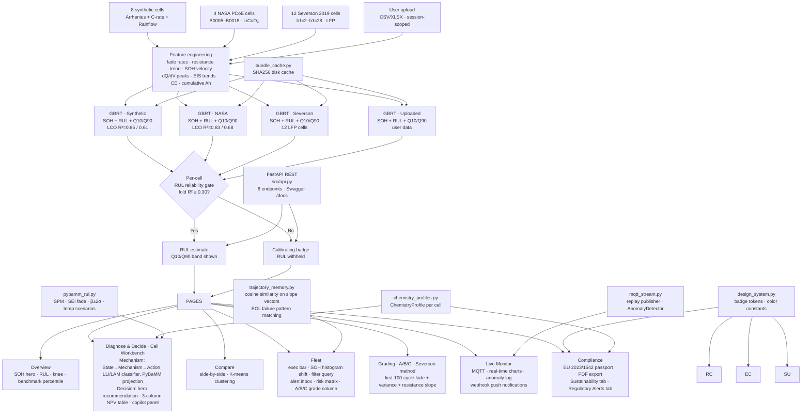

# Project history — the Battery Intelligence Platform

!!! note "What this page is"
    This is the repository's original README, preserved verbatim (not deleted) when the
    project was restructured around the `batlab` research library — it documents real,
    substantial work across dozens of sessions and stays here as the historical record.
    **Some paths and commands below are now stale**: `src/nasa_loader.py`,
    `src/severson_loader.py`, `src/oxford_loader.py`, `src/features.py`, `src/model.py`,
    `src/lco_eval.py`, `src/knee_detection.py`, and `src/dqdv.py` all moved into `batlab/`
    (see the [API reference](api/datasets.md) and [datasets](datasets/index.md) pages for
    their current locations and interfaces). The Streamlit application this page describes
    is still real and still runs — it is now a demo application built on top of the `batlab`
    library rather than the project's primary deliverable. Read the current [home page](index.md)
    and [quickstart notebook](https://github.com/seyedali1996lb-svg/battery-intelligence-platform/blob/master/notebooks/01_quickstart.ipynb)
    for the library itself.

---

# Battery Intelligence Platform (original README)

A battery health monitoring and prediction platform built with scikit-learn and Streamlit, with a React + FastAPI frontend underway. Tracks State of Health (SOH) and predicts Remaining Useful Life (RUL) for lithium-ion cells — validated on real NASA PCoE (LiCoO2), Severson 2019 (LFP), and Oxford Path-Dependent 2020 (NCA) battery aging datasets — with physics-based RUL projection via PyBaMM, live BMS streaming over MQTT with multi-signal anomaly detection, a JWT-authenticated, org-scoped FastAPI REST layer for system integration, and a Copilot (Claude Haiku or template fallback, with TF-IDF/BM25 retrieval over an authored battery-knowledge corpus) that **explains decisions in plain language and never invents a fact outside the validated model outputs — it does not make decisions itself**; the deterministic recommendation engine (`src/recommendations.py`) does that, and the Copilot narrates its output. Real multi-tenancy: every organization signs up, gets its own isolated decisions/cohort-tags/settings/uploaded-fleet data (merged into their own REST API responses too), and invites teammates — not just shared demo-role logins. Role-aware interface (Engineer / Fleet Manager / Executive / Compliance Officer) with a keyword-search sidebar that front-loads 1-2 relevant nav groups per role, 7 pages across 4 workflow groups, failure trajectory memory with a one-click "Go to Decide & Ask" action on every match, proactive webhook notifications (anomaly / fleet digest / trajectory match / passport gap), a virtual pack builder, Victron VRM and Orion BMS connector adapters, and a Circunomics second-life marketplace adapter. A SQLite persistence layer (`src/db.py`) keeps every organization's decision logs, cohort tags, settings, uploaded fleets, and failure-trajectory signatures durable across restarts — portable to Postgres later with no query rewrites, with credential-shaped settings envelope-encrypted at rest. A pytest suite (192 tests, run automatically in CI on every push) covers every pure-logic `src/` module, the API's auth and org-scoping layer, and — via Streamlit's `AppTest` harness — real page-level state-combination regressions (role × data source × page).

**[Live demo →](https://battery-intelligence-platform-sszs92zbkfvfcda3ajtlk7.streamlit.app)**

---

## What it does

Seven pages across four workflow groups (consolidated from 16 in earlier phases):

| Group | Pages | What it covers |
|---|---|---|
| **Analyse** | Overview, Explore | Focal H1 question ("Is X healthy right now?"); SOH hero card, RUL Q10/Q90 with ±σ confidence band, knee detection; Explore page with Compare / Cluster / Cohort radio tabs |
| **EU Passport** | Compliance | EU Battery Regulation 2023/1542 passport (available/estimated fields shown by default); PDF export; Sustainability tab with source-cited CO₂ figures; Regulatory Alerts tab (Art. 14(4) deadline tracker + draft compliance notice) |
| **Operate** | Fleet, Diagnose & Decide, Live Monitor | Fleet exec bar (collapsible) + SOH histogram shift + filter query + Cell Grading radio tab; failure trajectory chip in sidebar; **Diagnose & Decide** — one Cell Workbench merging the former Health and Decide & Ask pages into a view-switching radio (State → Mechanism → Action with LLI/LAM classifier, PyBaMM SPM vs GBRT Model Comparison card / hero recommendation card + 3-column NPV table + inline AI copilot panel) so one cell's diagnosis and decision no longer require two separate page navigations; MQTT live streaming with replay speed selector, broker settings behind expander, IEC 62619 anomaly detection and webhook push |
| **Configure** | Configure | Import Data tab (CSV/XLSX/PKL upload, fresh model training) + Settings tab (EOL threshold, CRM values, webhook config, API key) |

---

## Data sources

Three real-data modes plus user upload — selectable at runtime:

| Mode | Cells | Chemistry | Source |
|---|---|---|---|
| **NASA Research** | B0005 · B0006 · B0007 · B0018 | LiCoO₂ NCA 18650 | NASA PCoE Battery Aging Dataset, Saha & Goebel 2007 |
| **Severson 2019** | 12 LFP cells (b1c2–b1c28) | LFP | Severson et al., Nature Energy 2019, 4 cycle-life bands |
| **Synthetic Fleet** | Cell1–Cell8 | LiCoO₂ | Physics-informed (Arrhenius SEI, C-rate, Rainflow DoD) |
| **My Data** | User upload | Any | CSV/XLSX — session-scoped, trains fresh model |

Severson CSVs (~700 KB, 12 files) are committed to `data/raw/severson/` so Streamlit Cloud loads them instantly without downloading the 115 MB MATLAB source file.

---

## ML pipeline

1. **Feature engineering** (`src/features.py`): fade rate at 10/30/50-cycle windows, fade acceleration, SOH velocity, resistance normalised, resistance trend, temperature rolling mean, **C-rate rolling mean** (10-cy), **composite stress index** (Arrhenius(T) × C-rate^0.7 — same formula as the synthetic degradation model), **DoD proxy** (capacity ratio), dQ/dV peak features, Coulombic Efficiency trend, cumulative Ah/kWh, EIS component trends
2. **Models**: GradientBoostingRegressor (200 trees, depth 4, lr=0.05) — one per data source. Four models per source: SOH, RUL, Q10 quantile, Q90 quantile.
3. **Validation**: Leave-Cell-Out cross-validation. Per-cell reliability floor: fold R² ≥ 0.30 gates RUL display. Below floor → "Calibrating" badge, RUL withheld.
4. **Uncertainty**: Q10/Q90 prediction interval shown as a shaded band on all RUL charts.
5. **Cache**: SHA256 disk cache (`src/bundle_cache.py`) keyed by cell IDs + cycle counts + `FEATURE_VERSION` (currently v9). Invalidates automatically when engineering changes.
6. **SHAP**: TreeExplainer cached via `@st.cache_resource` — recomputes only when data source changes.

---

## Phase build history

| Phase | What was built |
|---|---|
| 1 — Core loop | SOH/RUL GBRT, LCO cross-validation, per-cell reliability gate, Overview/Health/Insights pages |
| 2 — Fleet | Multi-cell SOH ranking, fade rate comparison, honest cross-type RUL copy |
| 3 — Copilot | Template-based AI narration grounded strictly on bundle outputs — no LLM API, no invented numbers |
| 4 — Consequences | Second-life economics: application fit scoring, financial comparison (reuse/recycle/replace), break-even chart, CO₂ snapshot. Every figure badged as Cited estimate or Illustrative |
| 5 — Passport + Reports | EU Battery Regulation 2023/1542 data passport: 20 fields across 5 groups. PDF export via reportlab with disclaimer box and full assumption register |
| 6 — Recommendations | Hero-card decision (Continue / Inspect / Second-Life / Recycle) via dual-signal logic: SOH threshold + fade acceleration ratio. Four-tier confidence system (high / medium / lower / uncertain) |
| 7 — Sustainability | Lifecycle CO₂ chart (3 scenarios), critical materials tracker (Co/Ni/Li), EU 2023/1542 Annex XII recycled-content targets |
| 8 — Design system | `src/design_system.py`: single source of truth for badge HTML, color tokens, state badges, Recommendations metadata |
| 9 — Settings | Per-cell LCO fold R² transparency table, RUL floor preview, data source panel |
| 10 — Advanced features | Resistance component proxy (SEI + charge-transfer trends), formation efficiency, rate capability model, dQ/dV differential capacity |
| 11 — Phase 11 | Knee detection, anomaly flags, SoP%, calendar aging, pack spread, cell grading (A/B/C/D), Compare page, Q10/Q90 confidence band, EU passport CRM fields |
| 12 — Severson integration | h5py-based MATLAB v7.3 parser, 12 LFP cell CSVs extracted and committed, Severson mode routed through full pipeline, SHAP caching, Streamlit Cloud crash fixes |
| 13 — Robustness audit | Full crash audit across all pages; 5 KeyError/ValueError bugs fixed; `build_features()` produces all columns needed by every page; `dqdv.add_dqdv_features()` vectorized (~30× faster) |
| 14 — Credibility audit | Honest labelling: dQ/dV LFP warning; "EIS Impedance Analysis" → "Resistance Component Proxy (simulated)"; Li-S / SSB fake chemistry removed; GDPR banner; Severson provenance corrected |
| 15 — Design review (medium items) | Green token consolidation; startup progress bar; CRM reads from `ChemistryProfile.for_cell()`; 3-tier cache (full bundle → features-only → cold); `ChemistryProfile` class hierarchy |
| 16 — Accessibility + Visual Hierarchy | WCAG AA contrast fix (`#8896a8`, 5.2:1); ARIA roles on hero/metrics/sparklines; Overview metric row cut to 3 primary chips + "Cell Details" expander |
| 17 — Nav restructure + UX | 4 labelled nav groups; "EOL Economics" rename; Passport + Reports merged under Compliance tab; `PAGE_ACTIONS` contextual jump buttons; Fleet cell-ID quick-jump row |
| 18 — Decision support + Scalability + Enterprise | Application Profile selectbox auto-sets EOL threshold; Cost-of-Delay multiplier; Log Decision button with CSV export; `_resample_df()` chart downsampler (max 500 pts); Demo Mode banner |
| 19 — Cross-fleet degradation clustering | K-means on last-cycle feature vectors (SOH, fade, resistance, CE); silhouette-optimised k=2–4; scatter + similar-cell cards on Compare page; Fleet risk matrix "ACT" → "INSPECT / REPLACE" |
| 20 — PyBaMM physics-based RUL projection | SPM single-cycle discharge for nominal capacity (Chen2020/NCA_Kim2011/Marquis2019); SEI fade `SOH(n)=1−β·√n` fitted + projected; Model Comparison card (convergence badge + two-column GBRT vs SPM explainer + per-regime verdict); session-cached |
| 21 — MQTT live BMS streaming | `src/mqtt_stream.py` — replay publisher + subscriber + `AnomalyDetector` (voltage bounds, IEC 62619 temperature, rolling Z-score); Live Monitor page: broker config, real-time Plotly charts, anomaly log with CSV export, 1 s auto-refresh |
| 22 — Expert panel batch 1 (C1–C4, L2–L4, M1, M4–M6, H3, H5) | CSS `:root` spacing/radius/colour tokens; type ramp formalised; `_empty_state()` helper; radar axes → IEC nomenclature; demo banner → corner chip; Fleet as default home; IEC 62619:2022 anomaly flags (`THERMAL_RUNAWAY_PRECURSOR`, `UNDERTEMPERATURE`, `CAPACITY_PLUNGE`); fleet benchmark percentile; Lithium Plating Risk Score (CE dip + consecutive-run classifier, 0–100); PyBaMM `β±2σ` uncertainty band + 15/25/35°C Arrhenius traces; Health page progressive-disclosure tier labels |
| 23 — Expert panel batch 2 (T1, T2, T4, H1, H2, H4, M2) | **Executive Fleet Dashboard** (Fleet Health Index, accelerated-degradation count, CAPEX outlook grid: 3/6/12-month + CO₂ liability); **Proactive Alert Inbox** (critical/high/medium sorted alerts on Fleet page); **LLI vs LAM Classifier** (standalone Health expander — CE slope + fade nonlinearity + resistance rise, works for all chemistries including LFP); **NPV Scenario Planner** (Replace/Wait/Repurpose 5-year NPV); **Data Lineage** (Health expander — formula, source, valid-cycle count per metric) |
| 24 — FastAPI REST layer + Icon system | **`src/api.py`**: 8 REST endpoints — `GET /cells`, `GET /cells/{id}` (latest SOH/RUL/CE/resistance), `/history`, `/rul` (Q10/Q90 + reliability flag), `/lineage`, `GET /fleet/summary`, `GET /fleet/alerts`; Swagger at `/docs`; `Dockerfile.api` for containerised deployment; `fastapi[standard]` + `uvicorn` in requirements. **L1**: emoji stripped from all `.section-header` divs and page `h1` titles for typographic consistency; expander titles retain emoji as category markers |
| 25 — Business surface | **Role selector** in sidebar (Engineer / Fleet Manager / Executive) — Executive role auto-navigates to Executive Summary. **Executive Summary page**: fleet health score (72pt number), KPIs (cells at risk, CAPEX 3/12-month, CO₂ liability), top 5 alerts, recommended actions, PDF export via reportlab. **Business Copilot queries** (Row 3 in Copilot): "What will replacement cost over the next 12 months?" (12-month budget with best/worst case), "What is the business risk in my fleet?" (risk rating + cost exposure), "Should I replace or repurpose these cells?" (cell-specific Replace/Wait/Repurpose decision with NPV framing) — all in plain English, no battery jargon |
| 26 — Structural simplification | **10-page architecture** (down from 16): Recommendations + EOL Economics → **Decision** page; Copilot + Insights → single page with SHAP attribution expander; Fleet + Executive Summary merged (exec bar at top of Fleet); Compliance + Sustainability merged (Sustainability as a tab). **Health page redesigned**: 3 visible sections (State → Mechanism → Action) with inline LLI/LAM classification and recommendation card; all engineering detail gated behind a single "Engineering details" checkbox. **Copilot redesigned**: text input + chip grid replaces 11 buttons in 3 rows; natural-language query matching. **Decision page**: hero recommendation card (Continue/Inspect/Second-Life/Recycle) + 3-column NPV decision grid (Replace / Wait / Repurpose) with ★ Optimal badge — no sliders, no DCF chart. **EU Passport**: "Show unavailable fields" checkbox hides unavailable entries by default; only available/estimated fields shown. |
| 27 — Fleet intelligence + notifications + LLM Copilot | **Fleet SOH histogram shift**: violin distribution at 5 cycle snapshots shows the fleet distribution drifting left over time — the primary fleet-manager signal. **Cell filter query**: SOH ceiling / fade floor / status / source filter bar above the ranking table with live hidden-cell count. **Anomaly webhook**: POST JSON to any URL (Slack, PagerDuty, CMMS) when IEC 62619:2022 flags fire in Live Monitor; HMAC-SHA256 signing optional; test-ping in Settings. **LLM Copilot (Claude Haiku)**: Anthropic API key in Settings activates natural-language responses strictly grounded on bundle values — template answers remain as zero-config fallback; "Claude Haiku" badge in response header when active. **Regulatory alert service**: Art. 14(4) / Art. 70 / Annex XII deadline tracker, per-cell non-compliant / approaching status, auto-drafted compliance notice with download. **Second-life marketplace**: listing card on Decision page when SOH ≤ 85%; "List on Circunomics" / "List on Battery-Lifecycle.com" buttons; demo logs to session state, production would POST to exchange API. **ImportError guard**: `llm_answer` import wrapped in `try/except` so Copilot page loads even on stale deploys. |
| T3 — C-rate + stress index in GBRT model | **Highest-leverage model fix.** Added 3 features to `FEATURE_COLUMNS`: `c_rate_rolling_10cy` (10-cycle smoothed charge/discharge rate), `stress_index` (Arrhenius(T) × C-rate^0.7 — the exact composite aging driver used by the synthetic degradation model, now visible to the predictor), `dod_proxy` (capacity(n)/capacity(0) — cells at partial DoD now distinguishable from aged cells). NASA cells get a protocol-derived `c_rate` constant (2A discharge on ~2 Ah nominal = 1.0C, Saha & Goebel 2007) injected by `nasa_loader.py`. Severson cells gracefully omitted (no per-cycle current in summary data). Cache bumped to v9 — stale bundles auto-invalidate on next start. Effect: RUL predictions for high-stress cells (Cell8: 2C/40°C) tighten; PyBaMM comparison gets a stronger GBRT baseline; Fleet risk and Recommendations reflect actual operating load. |
| Fix — PyPI `copilot` module collision | `src/copilot.py` renamed to `src/battery_copilot.py`. Root cause: `copilot` (v0.1.9) is a real PyPI package; a transitive dependency on Streamlit Cloud installed it, shadowing our local module. `from copilot import build_cell_context` hit the wrong package and raised `ImportError` on every Copilot page load — silently passing locally where the src/ path wins. All 4 import sites in `app/main.py` and `app/_pages/copilot.py` updated; old file removed via `git rm`. |
| B+C — Visual design + Information hierarchy | **B1**: hero value enlarged to 72px/700. **B4**: CSS `:root` design tokens (`--r-chip: 4px`, `--r-card: 8px`, `--r-section: 12px`). **B5**: type ramp formalised (`.t-metric` 32px, `.t-heading` 16px, `.t-body` 13px, `.t-caption` 11px). **B7**: demo mode chip moved to corner with tooltip. **C1**: Mechanism Classifier expander default `expanded=False`; "Advanced diagnostics" section divider groups lower expanders. **C2**: PyBaMM vs GBRT one-liner comparison shown before PyBaMM expander (gap %, colour-coded). **C4**: "Pin as baseline" button on Overview and Health pages (session-state stored, UI placeholder for delta rail). **C6**: NPV winner card rendered prominently (40px value, coloured border, ★ Recommended), alternatives in collapsed expander. |
| F — Engineering Trust & Depth | **F1**: Calibrating badge replaced with progress indicator — shows fold R² percentage toward `RUL_RELIABLE_FLOOR=0.30` (e.g. "Calibrating — 73% to reliability") or cycle-count estimate when R² unavailable. **F2**: ±σ confidence band added to SOH chart — shaded green fill from `soh_pred − σ` to `soh_pred + σ`, computed from test-set residuals, clamped to [0.3%, 8.0%]. **F3**: data lineage added to three key figures: NPV caption cites discount rate assumption (WACC) + energy value (IEA 2024) + replacement cost (BNEF 2024) + repack cost; CO₂ hero tiles each carry a source note beneath (IVL 2019, IEA 2023, Harper/Dunn 2019). |
| A — Navigation & Product Framing | **A1**: "What do you need today?" 3-button task picker (Monitor fleet / Check cell / EU Passport) at top of sidebar — data source selector collapsed into "Data source" expander. **A2**: Role onboarding interstitial on first visit — 3 cards (Engineer / Fleet Manager / Executive), each navigates to the most relevant default page; subsequent visits show "Viewing as: X \| Change" in sidebar with role expander. **A3**: Five focal H1 questions across pages — "Is X healthy right now?" / "What is degrading X?" / "Which cells need attention this week?" / "What should I do with X?" / "Is X EU passport-ready?". **A4**: Persistent trajectory match chip in sidebar — red (≥2 cells) or amber (1 cell) button navigates to Fleet; chip count computed via `trajectory_memory.match_fleet()` on every render. **A5**: Per-cell early-cycle grade (A/B/C, Severson method: first-100-cycle fade rate + capacity variance + resistance slope) added as Grade column in Fleet ranking table; radio switcher on Fleet page to jump to Cell Grading view. **A6**: EU Passport promoted to 2nd nav group (was 3rd). |
| D — AI Decision Intelligence | **D2**: Anomaly diagnosis messages per IEC 62619:2022 type — root cause + immediate action + follow-up guidance rendered inline when an anomaly fires on Live Monitor. **D3**: Copilot free-text routing — typed queries that don't match a chip keyword fall through to a template (or Claude Haiku if API key is set) free-text path; `_last_ask` sentinel prevents re-trigger on re-render. **D4**: ⌘K command palette — `@st.dialog` modal with keyword scoring across 6 pages; `Ctrl+K`/`⌘K` JS listener in sidebar wires keyboard shortcut to the button. **D5**: Epistemic vs aleatoric uncertainty explanation in the 80% RUL interval — wide band in first 60 cycles labelled "epistemic (data sparsity)", wide band with low R² labelled "aleatoric (cell-to-cell variability)", moderate band labelled "natural variation". **D6**: Model confidence history chart — rolling MAE line + fill + 1.5% reliability threshold; "converged / improving / calibrating" verdict in caption. |
| E — New Features (Purely Additive) | **E1**: 12-month SOH forecast on Health page — linear extrapolation from current fade rate, uncertainty cone (±σ), Arrhenius-modelled reduced-C-rate scenario, EOL hline, plain-English summary. **E2**: Fleet what-if scenario planner — C-rate and temperature sliders, per-cell Arrhenius + C-rate^0.7 stress model, 3 output metrics (avg RUL change, replacements avoided in 24 mo, CAPEX impact). **E3**: EU Passport QR code generator (`qrcode[pil]` library) — generates QR linking to REST API `/cells/{id}` with dark background, download button; graceful warning if library absent. **E4**: Decision audit trail — log entries with timestamp, action, confidence, SOH; status lifecycle (Pending → Approved → Completed → Verified); outcome SOH input + delta display replaces simple "Log Decision" button. **E5**: Cell cohort tags (inline in Explore/Cohort tab) + cohort analysis bar chart — groups cells by tag, shows avg SOH per cohort, gap narrative. **E6**: Weekly fleet health digest card — expandable top-of-Fleet card with EOL count, degrading count, accelerating cells, trajectory matches, CAPEX 30-day window. **E7**: Virtual Pack Builder already existed. **E8**: Passport completeness score — progress bar (`n_available + 0.5×n_estimated / n_total`), gap count chip, "Fill N gaps" expander with per-field guidance tooltips. |
| UX/UI + Cross-functional review fixes | **Sidebar**: keyword search field replaces 3-column task picker; quick-access strip (Fleet / Cell / Passport); role display compacted; JS keyboard injection removed. **Pages**: 10 → 7 (Copilot merged into Decide & Ask; Compare + Cluster + Cohort → Explore with radio tabs; Import + Settings → Configure with tabs). **Empty states**: 7 key `st.info()` calls standardised to `_empty_state()`. **Light mode**: CSS expanded from 12 to 50+ rules covering all widget classes, Plotly backgrounds, sidebar overrides. **Charts**: `base_layout()` applied consistently; D6 and E1 fixed. **Section headers**: 8 redundant dividers removed. |
| Simplify + Merge (review items 7 + 8) | **Fleet exec bar**: collapsed by default (`expanded=False`) — engineers get the ranking table immediately. **NPV Planner**: 3 strategy cards + single discount rate slider; energy/replacement cost fixed at IEA/BNEF cited defaults; no cumulative chart. **Health Mechanism**: single classification card (mechanism name + one explanation sentence). **Cohort tagging**: moved inline to Explore/Cohort tab. **Decide & Ask**: inline copilot panel with 4 preset chips + free-text; `page == "copilot"` routes to Decision. |
| Cleanup — model comparison reframe + dead code | **Model Comparison**: PyBaMM expander renamed; inline summary replaced raw gap number with convergence/divergence badge (✓ / ⚡ / ⚠); two-column explainer card added (physics strengths vs data strengths); verdict section renamed "Model Verdict". **Removed**: Scheduled Reports no-op section; `src/calce_loader.py` dead code. **Default data source**: Fleet filter now defaults to NASA only (real curves on first visit). **MQTT broker config**: host/port inputs moved behind collapsed "Broker settings" expander. |
| Codebase audit + main.py split completion | An audit found `app/_pages/` contained 15 files that looked like a finished page-module split but were never actually imported — `main.py` had its own inline duplicate of every page function, and the `_pages/` copies were dead weight from an abandoned refactor. Fixed: deleted 13 truly-orphaned files (kept `login.py`); genuinely extracted **Explore** (`_pages/explore.py`), **Live Monitor** (`_pages/live_monitor.py`), and **Import + Settings** (`_pages/import_page.py`, `_pages/settings.py`) with real imports wired into `main.py` (10,460 → 8,431 lines). Along the way: fixed a live `NameError` crash in the Explore → Cluster tab (`cell_a`/`cell_b` referenced but never defined — now reads the Compare tab's session-state selections); fixed a broken Severson `.pkl` upload path that called a function (`load_severson_batch`) which didn't exist in `src/severson_loader.py`; fixed a `.gitignore` gap that left the 3 GB Severson raw `.mat` file untracked-but-not-ignored. Also shipped: cohort SOH-trajectory chart (bold cohort-average line + thin per-member lines by cycle number, added directly during the Explore extraction); a 4-step guided tour modal (`@st.dialog`, once per session, Skip/Finish, replay button in Settings); light mode flipped to the default theme with a working sidebar toggle (previously fully-built but unreachable — the only toggle lived in an orphaned file). |
| Persistence, pack builder, BMS connector, notifications | **SQLite persistence** (`src/db.py`, SQLAlchemy): decisions, cohort tags, settings (webhook config, EOL threshold, app profile, cost-of-delay multiplier, VRM credentials), upload metadata, and failure-trajectory signatures now survive a full server restart — previously 100% session-state, gone on every reload. Built on SQLite for zero new infrastructure; SQLAlchemy makes a later Postgres move mostly a connection-string change. **Virtual Pack Builder**: new mode in the Explore radio switcher — select 2+ same-source cells, choose series/parallel topology, get pack capacity/resistance (series: min capacity + summed resistance; parallel: summed capacity + parallel resistance formula), bottleneck-cell SOH and capacity-weighted average SOH reported side by side, weakest-cell callout. **BMS connector** (`src/bms_connectors.py`): a Victron VRM adapter targeting the real public API, reshaping results into the app's standard cycle-data schema — no live account exists to test against, but a test call against the real endpoint returned a genuine `401 Unauthorized` (confirming the request shape is correct), handled cleanly with no stack trace. **Proactive webhook alerts** (`src/notifications.py`): the existing IEC-anomaly webhook logic was extracted into a shared `send_webhook()` function and extended with three new event types — `FLEET_DIGEST` (page-load best-effort, once per day, plus a manual "Send digest now" button — session-triggered since this app has no background cron), `TRAJECTORY_MATCH` (fires from the existing Fleet-page match check, deduped per cell per session), `PASSPORT_GAP` (fires when a cell's Passport completeness drops below 60%, deduped per cell per session). **EU DPP JSON-LD export** (`src/passport_export.py`): wraps the existing `build_passport()` dict into a JSON-LD document preserving each field's available/estimated/unavailable provenance tag — third consumer of the same source-of-truth dict, no changes to the visual Passport page. **Upload feature-caching fix**: the upload analysis pipeline rebuilt features from scratch on every run; wired the already-existing (but previously unused) `load_features_cached`/`save_features_cached` from `src/bundle_cache.py` into the upload path, keyed by a content hash of the uploaded data. |
| Test suite + RAG Copilot + Circunomics adapter | **pytest test suite** (`tests/`, 78 tests at the time): unit/integration coverage for every pure-logic `src/` module — features, model, LCO eval, knee detection, trajectory memory, DB persistence, bundle cache, dQ/dV, import adapter, BMS connectors, notifications, passport + passport export. Streamlit page logic (`app/main.py`/`app/_pages/*`) out of scope for this pass — would need Streamlit's `AppTest` harness (added in a later phase, below). **RAG for the Copilot** (`src/battery_knowledge.py` + `src/copilot_retrieval.py`): a 15-document authored battery-domain corpus retrieved via TF-IDF/BM25-style cosine similarity — real retrieval, not keyword-to-template routing — chosen over neural embeddings specifically to avoid adding `torch`/`sentence-transformers` (500 MB+) to the Streamlit Cloud free-tier deploy that has already OOM-crashed once before. Wired into a new `battery_copilot.answer_query()`, the free-text entry point `app/main.py` had imported but which never existed — the root cause of a silent Copilot free-text failure. **Bigger fix found along the way**: `copilot_llm.llm_answer()`'s actual signature matched none of its 3 real call sites in `main.py` (all pass a query label, an already-rendered template string, and an API key) — meaning every LLM-augmented Copilot answer app-wide (main Copilot page, free-text queries, Decide & Ask panel) silently fell back to templates or raised, masked by broad `except` blocks. Rewritten to match the callers' real contract: rephrase an already-grounded template via Claude Haiku, falling back to the template unchanged on any error. **Circunomics adapter** (`src/circunomics_adapter.py`): same documented-but-untested pattern as the BMS connector — Circunomics has no public self-serve API, so this targets the generic REST shape a B2B battery-trading marketplace would expose; wired into a Settings credential field and the Decision page's listing button, with the existing local demo listing kept as the fallback when no key is configured or a submission fails. |
| Real multi-tenancy | `src/db.py` gained `Organization`/`User` tables and an `org_id` column (composite PK for `Setting`/`CellCohortTag`) on all 5 existing persistence tables, via an additive migration that preserves any pre-existing local `data/app.db` rows under a seeded "Demo Org" — the documented demo credentials keep working unchanged. `app/_pages/login.py` rewritten for real bcrypt-hashed DB-backed auth plus self-service "Create organization" signup (the only viable way to add a second org without an external identity provider). Every decision/cohort-tag/setting/trajectory-signature read-write now scopes to the logged-in user's org. The uploaded "My Data" fleet — previously lost on every refresh even though other data was DB-backed — now persists per-org to disk (`data/tenant_bundles/{org_id}.joblib`). Admin-only "invite teammate" panel in Settings. Test suite: 78 → 86 (new cross-org isolation test is the actual acceptance criterion). |
| Oxford NCA reference degradation curves (3rd chemistry) | A 3rd real chemistry — NCA — from the Oxford "Path Dependent Battery Degradation Dataset" (Raj et al. 2020, ODC-ODbL, Group 1: 3 cells), alongside NASA's LiCoO2 and Severson's LFP. The dataset turned out to have only ~14 sparse Reference Performance Test checkpoints per cell (not dense per-cycle data), and its `.mat` files use MATLAB's `table` object (MCOS serialization), which `scipy.io.loadmat` can't read at all — worked around via the `mat-io` package's raw-fallback object properties. Given the sparse sample (14 points × 3 cells), this is shown as a real measured **reference curve** in a new "Reference Datasets" tab in Explore — deliberately not run through the GBRT+LCO predictive pipeline, since that little data would be too thin to honestly leave-cell-out validate a model. `NCAOxfordProfile` added to `src/chemistry_profiles.py`. Test suite: 86 → 91. |
| React + FastAPI frontend (Phase D, start of a multi-session initiative) | `src/api.py` gained JWT auth (`POST /auth/login` using the same `db.get_user_by_username`/`verify_password` the Streamlit login uses) and CORS, gating all 8 existing REST endpoints — genuinely multi-tenant-aware infrastructure now, though it still serves the shared reference-cell fleet rather than each org's own uploaded data (a deferred follow-up). Along the way, exercising the API end-to-end for the first time surfaced two real, pre-existing bugs: `app/main.py`'s `load_everything()` crashed when imported outside a live Streamlit script run (`st.status()` returns `None` in bare-process mode); and `src/api.py`'s `_get_featured_dfs()`/`_get_bundles()` had their tuple-unpacking indices swapped, meaning every single endpoint returned garbage or crashed whenever the API was actually run via `uvicorn`. Both fixed. New `frontend/` (Vite + React + TypeScript, `recharts`, no component library) — a Login view, a Fleet Summary view, and a Cell Detail view with an SOH history chart. Explicitly not feature parity with the 7-page Streamlit app — 1-2 read-only views to start. Test suite: 91 → 105 (new `tests/test_api_auth.py`). |
| Cross-functional product review + fix batch | Ran an elite-panel product/UX/engineering review by actually clicking through the live app (login → Fleet → Overview → Explore → Decide & Ask), not just reading code. Found and fixed 9 issues: a live `TypeError` crash on every Decide & Ask visit for cells under 90% SOH (`application_fit()`'s categorical dict misread as a numeric score); the Fleet page silently dropping every Severson cell from its ranking table while the exec KPI bar above it showed populated stats (`_bundle_for_cell()` had no Severson branch — a systemic audit found 3 more instances of this "stale widget state after a data-source switch" bug class); NASA cells mislabeled "NCA chemistry" in 5 places, contradicting LiCoO2 everywhere else and undercutting the app's own chemistry-honesty positioning; login/signup moved to `st.form()` for atomic submit capture; the guided tour and role-onboarding modal no longer stack on first visit (now governed by a general `_active_first_run_overlay()` sequencing rule instead of a one-off fix); ~40 chart calls' redundant hardcoded dark-theme colors that were silently defeating light mode; a `BADGE_CALIBRATING` design-system constant so the RUL reliability-floor trust signal renders identically everywhere instead of 3 different colors. Follow-on structural work: the Fleet page's executive bar and ranking table were two independent computations of the same stats that could silently diverge — now unified into one `rows` list so this bug class is structurally impossible, not just patched; the NPV assumption disclosure (previously a permanently-visible multi-line caption reading like a legal footnote) moved into a `st.popover()`; the EU Passport export gained a `document_id()` — a deterministic hash pairing a PDF and its JSON-LD companion from the same export action, an audit-trail convenience, not a certification claim. New `tests/test_app_state_combinations.py` (Streamlit `AppTest` harness, real page-level regression tests) found and drove the fix for 2 *more*, previously fully-unknown bugs — both completely masked/unreachable until the Application Fit Scores crash ahead of them in the same page was fixed: `breakeven_curve()`'s SOH range generation produced an empty array for any cell already below its hardcoded floor, and the NPV Scenario Planner used `CELL_NOMINAL_KWH` (a dict keyed by data source) directly in arithmetic instead of indexing it, compounded by `source` never resolving to `"severson"` in the first place. Test suite: 105 → 115. |
| UX density reduction + mechanism merge + CMMS + fleet front door | The last 5 items from the review's remove/simplify/merge/add list. Overview and Decide & Ask pages consolidated secondary panels (fleet benchmark, full trend chart, maintenance calendar, application fit, second-life marketplace, confidence notes) into `st.expander()` blocks, keeping each page's hero answer always visible. The Health page's inline LLI/LAM mechanism classifier extracted into `recommendations.diagnose_mechanism()`, reused as-is on Health and newly surfaced as a compact verdict on Decide & Ask. `src/cmms_adapter.py` — a documented-adapter-pattern CMMS/ERP write-back (no real target system named, per explicit product decision), wired to a Settings credential field and a "Create CMMS ticket" button. `battery_copilot.answer_fleet_query()` — a natural-language "Ask the fleet" bar on the Fleet page, routing to existing fleet-level answer functions with an honest fallback for out-of-scope questions and an explicit reliability caveat on every routed answer. Test suite: 115 → 130. |
| Dead code + shared-helper dedup | `app/sidebar.py` deleted (confirmed zero imports anywhere — same abandoned-refactor pattern as the earlier `_pages/` cleanup). Separately, found `app/main.py` carried ~11 of its own copies of helpers/constants (`base_layout`, `soh_status`, `_md_html`, `_cell_provenance`, `FEATURE_LABELS`, etc.) that already lived in `app/utils.py` and were used by the extracted `_pages/` modules — a bigger duplication than the "just `base_layout()`" note from the earlier review suggested. Diffing before merging found 2 real divergences (`utils.py`'s `FEATURE_LABELS` was missing 3 keys `main.py`'s copy had; `utils.py`'s sparkline SVG had gained proper ARIA attributes `main.py`'s never got) — reconciled both, then deleted `main.py`'s copies in favor of importing from `utils.py`. |
| Pack Builder merge + Orion BMS + secrets encryption + Oxford Groups 2-4 | `app/main.py`'s Fleet page had two separate, redundant pack-builder sections (one a strict subset of the other), plus a third, independently-diverged implementation on Explore's Pack Builder tab — none shared logic or test coverage, and two of the three silently allowed physically-meaningless mixed-chemistry packs. Merged into one `src/pack_builder.py` (unit-tested pack-metric/matching-score math) + `app/utils.py`'s `render_pack_builder()`, combining the best features of all three (cell-matching score, σ-based spread warning, same-source validation). **Orion BMS REST connector** (`src/bms_connectors.py`) added alongside the existing Victron VRM adapter — same documented-pattern-only, no-live-account caveat. **Credential Settings envelope-encrypted at rest**: VRM/Orion/Circunomics/CMMS API keys and the webhook HMAC secret were plaintext in the `settings` table (flagged as a gap during the multi-tenancy phase) — now encrypted via `cryptography`'s Fernet, with legacy plaintext rows still readable (self-healing re-encryption on next write, no migration script needed). **Oxford dataset extended from 3 to all 12 cells** (Groups 2-4) — the per-group procedure-label tables came straight from the dataset's own `Guide_to_Datafiles.pdf` (fetched and transcribed this session); the loader's core parsing was already fully group-agnostic, only the per-cell TPG-index mappings and download URLs needed adding. Test suite: 130 → 152. |
| Full `main.py` split — last 8 pages extracted | The final item from the original codebase-structure review: `main.py` was still an ~8,400-line monolith carrying Overview, Health, Grading, Fleet, Copilot, Consequences, Decision, and Compliance (Passport/Reports/Sustainability/Regulatory Alerts) inline, alongside the 5 pages already extracted in earlier sessions. Mapped via 3 parallel research agents plus a dedicated validation pass, which turned up **3 more confirmed-dead functions** beyond what the research initially found (`page_insights`, `page_recommendations`, `page_executive_summary` — ~1,085 lines total, all zero-call-site leftovers from earlier "merged into X" refactors that never deleted the old body) and a genuinely unreachable router branch. Extracted the 8 real pages into `app/_pages/` across 7 commits, preserving cross-page call dependencies atomically (Fleet imports Grading since Fleet calls it inline; Decision imports Consequences the same way) and replicating the existing dispatcher-owns-its-header pattern from `explore.py`'s `page_compare()` for the new `page_compliance()` tab-bundler. Found and fixed **2 more real, currently-live bugs** while extracting: Overview's "Fleet benchmark" comparison referenced an undefined variable (`selected` instead of the actual parameter `cell_id`), silently swallowed by a bare `except Exception: pass` — meaning that feature had never actually rendered; Health's Lithium Plating Risk color bar referenced `UI_GREEN`/`UI_YELLOW`, defined nowhere in the codebase — a latent `NameError` on that code path. Verified every phase with the full test suite plus, for pages the existing `AppTest` integration suite didn't cover (Health, Grading, Copilot, Compliance), throwaway local `AppTest` smoke scripts confirming each page-key renders with no exception. `main.py`: ~8,400 → ~1,350 lines (an 84% reduction), down to data loading/training, sidebar/dialogs, and the page router. Test suite: 152 passing, unchanged. |
| Org-scoped API, trajectory action, role-aware nav, in-product roadmap, CI pytest | The last 5 items from the product review's remaining-work list. **FastAPI org-scoping**: `src/api.py`'s data-fetching helpers gained an `org_id` param that merges each org's own uploaded fleet on top of the shared reference cells via `bundle_cache.load_tenant_bundle()` — every endpoint is now genuinely multi-tenant, not just auth-gated. Writing the cross-org isolation test caught a real latent bug: `_rul_reliable_for()`'s bundle-selection fallback (`bundles.get("synth", bundles.get("upload", {}))`) always resolved to "synth" whenever that key existed at all, regardless of whether the queried cell was actually in it — a `dict.get`-default-only-fires-on-missing-key mistake — plus the Severson branch that function never had. **Trajectory action button**: the Overview page's trajectory-match card gained a "Go to Decide & Ask →" button, mirroring the Health page's existing navigation pattern. **Role-aware nav**: added a 4th "Compliance Officer" onboarding card — that role already existed in `src/db.py` but had no UI entry point at all, a real gap found during research — and made the sidebar's nav groups role-aware via `st.expander()`, front-loading 1-2 relevant groups per role (Executive/Compliance Officer) while Engineer/Fleet Manager keep everything expanded, unchanged. **In-product roadmap**: the README's Production Readiness Roadmap table now also renders inside Settings → Configure, so a buyer/evaluator using the deployed app sees it without reading the repo. **CI pytest**: `.github/workflows/ci.yml` previously only ran a syntax check and a version-bump warning — it now actually runs the full pytest suite on every push, with a 15-minute job timeout for the slower `AppTest` cases. Verified with throwaway local `AppTest` smoke scripts for the role picker/nav-expander states and the Settings page, neither covered by the existing state-combination suite. Test suite: 152 → 156. |
| CI fix + data-source-branch audit (cross-functional review) | CI's "syntax check" step had failed on every run since the workflow's creation — invisible locally because this dev machine runs Python 3.14 (PEP 701 relaxed f-string grammar) while CI pins 3.11, where `app/_pages/import_page.py`'s escaped-quote f-string is a hard `SyntaxError`; fixed by precomputing the conditional HTML into its own variable, and this is the first commit where CI's pytest step actually ran instead of being skipped. Live-reproduced 3 more instances of the same "missing branch for a newer data source" bug class already found and fixed elsewhere this session: the EU Passport's `build_passport()` had only `is_nasa`/`else` branches, so every Severson/Oxford/uploaded cell reported false "Synthetic Li-ion" chemistry — root-caused via `ChemistryProfile.for_cell()` instead of patched, so a new chemistry can't fall through again; the Fleet page's per-row source classification lacked a Severson branch (`_bundle_for_cell()` had one, the row label didn't), mislabeling all 12 Severson cells "Uploaded" in both the ranking table and the KPI tile; the guided tour's first line hardcoded "NASA PCoE" regardless of the active `data_mode`, stating a false provenance claim to first-time users of a provenance-honesty product. Test suite: 156 → 158. |
| Contradictory-verdict reconciliation (cross-functional review) | Live-reproduced two cases of the same page showing two independently-confident, disagreeing verdicts for one cell. **Overview vs. trajectory match**: a Severson cell's primary model said "657 cycles remaining, reliable" while the Trajectory Match panel said "35-65 cycles remaining, HIGH confidence" — root cause was `trajectory_memory.match()` comparing candidate failure signatures across chemistries (a real LFP cell against synthetic LiCoO2 signatures), which drove a fleet-wide false-positive rate (9 of 12 demo cells flagged); `match()` now restricts candidates to the querying cell's own data source, and a new `reconcile_rul_estimates()` collapses any remaining same-source disagreement beyond a 40% relative threshold into one "Models disagree" card instead of two confident numbers. **Decide & Ask's dueling "Recommended" badges**: the hero card's operational recommendation and the Financial Decision widget's independent NPV-maximizing badge could point at different actions with no acknowledgment; the financial widget now foregrounds the NPV option consistent with the operational headline, downgrading to "Consistent with recommendation" plus an explanatory note (with the true NPV-maximizer preserved in the alternatives expander) when the two genuinely differ. Test suite: 158 → 164. |
| Cell Workbench: merge Health + Decide & Ask | Review finding (UX Design, High severity): the core loop — see cell → understand mechanism → get recommendation → log decision → create ticket — required two separate page navigations for the same cell, the exact surface area that let the two pages' independent computations silently contradict each other (see previous row). New `app/_pages/workbench.py` is a thin view-selecting wrapper, not a rewrite — `page_health()`/`page_decision()` are untouched and still fully tested — mirroring the same in-page-radio convention already used by Fleet's Grading view and Explore's Compare/Cluster/Cohort tabs. The router's `"health"`/`"decision"` page-keys both now land on `page_cell_workbench()`, defaulting the radio to the matching view only when the router key actually changed (so manually browsing the other lens isn't yanked back on an unrelated rerender); every existing "Go to Decide & Ask →" call site needed zero changes since they only ever set `st.session_state.page`. `NAV_GROUPS`'s "Health" and "Decide & Ask" collapse into one "Diagnose & Decide" item under Operate; also deleted `PAGE_ACTIONS` and `NAV_ITEMS`, both confirmed fully dead. Test suite: 164 → 167. |
| Shared card/metric-tile components | Review finding (UI Design, High severity): every card/badge/color in the app is hand-authored HTML through `st.markdown(unsafe_allow_html=True)`, with the identical bordered-card wrapper string independently re-typed 31+ times across 9 files — no single enforced rendering path, which is exactly why bugs like the `UI_GREEN`/`UI_YELLOW` `NameError` and inconsistent light-mode colors kept recurring. Added two primitives to `app/utils.py` rather than one do-everything component: `render_card()` (the generic bordered-card wrapper) and `metric_tile_html()` (the most-repeated inner label/value/sub triplet pattern used across Fleet/Overview/Decide & Ask/Compliance). Migrated Decide & Ask's "Compare alternatives" cards onto both as the first real usage, deleting that file's own hand-rolled copy. New `tests/test_utils.py` — `app/utils.py` had zero direct unit coverage before, relying entirely on the `AppTest` integration suite. Intentionally bounded first step; migrating the remaining ~25 occurrences across 8 more files is flagged as follow-up rather than one large diff. Test suite: 167 → 171. |
| Dead code cleanup — `app/data.py` | Confirmed zero imports anywhere in `app/`, `src/`, or `tests/` (grep for `import data`, `from data import`, `app.data`) — leftover from the same abandoned main.py-splitting refactor as `app/sidebar.py` and the earlier orphaned `_pages/` modules, all already removed. Test suite: 171, unchanged. |
| Mechanism verdict visible to every role | Review finding (Engineering Usability, Medium): the Health page's mechanism (LLI/LAM) verdict lived behind an "Engineering details" checkbox that defaults off for every role except Engineer — Fleet Manager/Executive, the two personas who most need to trust *why* a decision was made, never saw it. Tracing the gate found the always-visible compact card was computing its own drifted inline reimplementation of `diagnose_mechanism()`'s scoring (missing the CE-deficit signal) — a third, previously-unknown instance of the "independent widget, not a synthesized verdict" bug class already fixed elsewhere this session. Both card and deep expander now share one `diagnose_mechanism()` call; the compact card gained a confidence badge. Test suite: 171 → 172. |
| Mechanism-vs-recommendation disagreement caution note | Review finding (Decision Support): `classify()` — the function that actually picks the recommended action — never sees `diagnose_mechanism()`'s LLI/LAM verdict, so a cell recommended a lower-urgency action could still show an accelerating LAM pattern with zero cross-referencing between the two surfaces. New `recommendations.mechanism_corroboration_note()` renders an additive caution line on Decide & Ask's hero card when a lower-urgency action coincides with a Medium+ confidence LAM/Mixed verdict, without changing any action or confidence a cell actually gets — the same low-risk pattern as two earlier reconciliations this session (trajectory-vs-primary RUL, financial-vs-operational). Verified against S-b1c2 (Severson), a real cell where the disagreement occurs. Test suite: 172 → 178. |
| Leave-cell-out sample size surfaced on every RUL number | Review finding (Battery Engineering Accuracy, Critical): NASA (n=4) and Severson (n=12) leave-cell-out cross-validation is barely statistically meaningful on n=4, but that caveat only lived in a Settings-page footnote — no visible caveat on the in-product RUL numbers a technical buyer would actually scrutinize. Overview's hero confidence badge now reads "MODEL · n=4 · R²=X" with a tooltip; the Passport's RUL and SOH-accuracy fields gained the same n=X + thin-population note; Fleet gained one caption naming all three sources' sample sizes. Test suite: 178 → 182. |
| Physics Twin Check — PyBaMM re-fit against streamed telemetry | Review finding (Digital Twin Quality, High severity for Siemens/ABB-class buyers): PyBaMM only ever ran once, offline, against a cell's full historical data (Health page's Model Comparison) — never against telemetry as it streams in. A true continuously re-parameterized physics twin is a multi-month R&D undertaking, not something to fake in one session; chose the bounded, technically real option instead — re-run the same SEI-fade fit (`src/pybamm_rul.py`) against only the cycles received via the live stream so far, throttled to every 15 readings (a full SPM run takes ~2.7s and Live Monitor already reruns every 1s), explicitly labelled "not a live-synced digital twin" so it can't be mistaken for the deeper capability. New Physics Twin Check section on Live Monitor. Test suite: 182 → 184. |
| MQTT telemetry SOH/SOC mislabel | Building the Physics Twin Check surfaced a real, separate honesty bug: `mqtt_stream.py`'s replay publisher read a cell's `soh_pct` column but republished it under the wire key `soc_pct` (State of Charge) — a different metric than State of Health. Live Monitor's metrics strip labelled the value "SOC" to a fleet manager, and the `AnomalyDetector`'s capacity-plunge check (whose own `_CAPACITY_PLUNGE` comment already said "SOH drop > 5%") called its flag "SOC dropped X%" while actually operating on SOH data. Renamed the wire key to `soh_pct` throughout — publisher payload, anomaly detector variables/messages, Live Monitor's metric label/chart/diagnosis text — rather than just patching the display label, since the confusion ran through the schema itself, not one rendering line. New `tests/test_mqtt_stream.py` regression suite. Test suite: 184 → 188. |
| Remaining `is_nasa`/else instances closed (Overview, Decide & Ask NPV, Compliance) | The Passport/Fleet/tour fixes above closed the most visible instances of the "missing branch for a newer data source" bug class, but three more were explicitly flagged as still-open at the time (the two `compliance.py` functions weren't touched when the Passport bug was fixed, since that fix only changed `build_passport()` itself, not every caller's own local `source` variable). Closed here: **Overview's hero source tag** resolved chemistry via `ChemistryProfile.for_cell()` instead of an `is_nasa` check, so a Severson cell no longer shows a nonsensical "Synthetic · Stress Xx baseline" tag with a stress factor that doesn't apply to real measured data. **Decide & Ask's NPV table** and **Compliance's Reports/Sustainability pages** all resolved `source` as `"nasa"`/`"synth"` only, so a Severson cell's second-life financial projection and CO₂/material-recovery figures silently used the synthetic fleet's capacity constant instead of `CELL_NOMINAL_KWH["severson"]` — fixed with the same 3-way branch already correct in `consequences.py`. New `tests/test_compliance_source_labeling.py`. Test suite: 188 → 192. |
| Card-wrapper migration completed (remaining ~25 occurrences) | The shared-component work above migrated only 1 of 9 files as a proof of concept, flagging the rest as follow-up. Completed here: the remaining hand-rolled `background:#1e2a38;border:1px solid #2d3748;...` wrapper string and label/value/sub patterns across `main.py`, `compliance.py`, `explore.py`, `fleet.py`, `health.py`, `import_page.py`, and `settings.py` migrated onto `render_card()`/`metric_tile_html()`, one file per commit, each verified with an `AppTest` smoke check. Health's Degradation Mechanism card needed reconciling with a mechanism-verdict-consistency fix made independently in between (the migration branch forked before that fix landed) — merged to use the shared component *and* the corrected `_mech` dict fields, not the pre-fix variable names. |
| Solar + Storage Sizing (5-phase) | **Phase 1**: a new PV + second-life-battery sizing/payback calculator on the Consequences page (`src/deployment_sizing.py`, `src/pvgis_client.py`) — grid-searches PV size (kWp) x battery count against a monthly energy-balance approximation, using PVGIS (EU Commission public solar API, no key needed) for PV yield so no local irradiance modelling was needed. Paired with 6 cited IEA-sourced entries added to the Copilot's RAG corpus (`src/battery_knowledge.py`), surfaced as an "Industry context" callout via direct id lookup (not generic retrieval, which isn't precise enough for a guaranteed-topical single snippet). **Phase 2** (same session, requested as a full follow-up on every item Phase 1 had flagged out of scope): replaced the monthly approximation with a real HOURLY dispatch simulation (`simulate_hourly_dispatch()`, 8760 hours/year) fed by PVGIS's `seriescalc` endpoint (verified live to return genuine hourly PV power output, not just irradiance) — a live check also caught that PVGIS's hourly timestamps are UTC, not site-local time, requiring a longitude-based approximate correction (`utc_offset_hours()`/`shift_to_local_hours()`) before combining with local-time load/tariff patterns. A Plan-agent design review caught a real bug in the draft dispatch loop (PV-charging and grid-arbitrage-charging could double-count the same hourly power-cap limit) before implementation, and recommended simplifying an over-engineered "track PV-charged vs. arbitrage-charged battery energy separately" idea down to a single SOC float, since the split would have invented a provenance distinction the physics doesn't support. Added standard/custom tariff-of-use models (`build_tariff_hour_arrays()`), a custom-consumption `st.data_editor` input, real-sourced PV/BESS installed-cost assumptions (replacing "Illustrative — not sourced" defaults with live-researched IRENA/Fraunhofer ISE and a 2025 European residential-battery market-price citation), Germany/France feed-in-tariff presets (Italy/Spain deliberately excluded — neither has a single flat per-kWh export rate that can be cited honestly), and multi-doc contextual selection for the Industry context callout. `size_deployment()`'s grid search uses a two-phase coarse-then-refine sizing search (full integer battery-count precision without a full fine sweep, now that each candidate runs a real 8760-hour simulation), hard-capped at 60 candidates; measured end-to-end (mocked PVGIS, `AppTest`) at well under 1 second. **Phase 3** (same session, requested as a further follow-up on every item Phase 2 still flagged as a real limitation): scaled the single-reference-year hourly PV shape to PVGIS's own multi-year climate-average annual total (`scale_hourly_to_multiyear_average()`, one extra cached PVcalc call per unique kWp step, never fatal if it fails — falls back to unscaled data with a logged note); added a user-overridable UTC offset (`utc_offset_override`) alongside the longitude-based default; added a real weekday/weekend daily-load-shape distinction using the reference year's actual calendar (`build_hourly_consumption()`'s `weekend_daily_shape`, day-of-week computed via `datetime.date`); added temperature-aware battery power derating (`temperature_derate_factor()`) using PVGIS's `T2m` ambient-temperature field — already present in the same hourly response, so no extra API call; added a real hourly/smart-meter consumption CSV upload path (`load_hourly_kwh_override`, bypasses the monthly/shape reconstruction entirely) as the most accurate consumption input the tool supports; researched feed-in-tariff presets for 6 more EU markets (Netherlands, Poland, Austria, Italy, Spain, Portugal) and found none with a comparably simple, stable flat per-kWh rate to add — confirming Germany/France were the right scope, not an oversight. Explicitly declined and documented as an out-of-scope limitation: replacing the threshold-heuristic dispatcher with a true LP/MILP optimizer — a different order of engineering investment (new solver dependency, full re-architecture) than the rest of this batch, and in tension with the tool's whole premise as an honest, cited estimate rather than an optimal-control benchmark. Fixed a real test-isolation regression caught while writing Phase 3's own tests: every existing `size_deployment()` test that faked `pv_yield_fn` to avoid the network had started silently hitting the real PVGIS PVcalc endpoint via the new multi-year-scaling call's default `pv_yield_annual_fn` — all fixed to fake both. Test suite: 308 → 324. **Phase 4** (same session, requested as a further follow-up on Phase 3's own remaining-limitations list): investigated PVGIS's dedicated `tmy` (Typical Meteorological Year) endpoint as a fix for "the hourly shape is still one arbitrary reference year" — confirmed live it does NOT support `pvcalculation=1` (silently ignored), returning only raw irradiance/temperature, not PV power; reimplementing irradiance-to-power modelling to use it directly would have reintroduced exactly the PV-physics complexity this whole feature has avoided by leaning on PVGIS's server-side calculation. Built a middle path instead: `build_typical_year_pv_shape()` uses TMY's real global-horizontal-irradiance pattern purely as an hour-to-hour SHAPE proxy, redistributing each PV size's already-fetched real PVcalc monthly kWh totals across hours proportional to that shape — better representative shape AND correct magnitude in one step, with zero new physics reimplemented, available as an opt-in `pv_weather_source="typical_year"` (falls back to the existing single-year path if TMY or the monthly fetch fails). Found a real, more specific citation for temperature derating (a commercial LFP cell's derating documentation, surveyed via EVreporter 2023) and used it to replace the single symmetric illustrative curve with mode-aware charge (near-zero floor at 0°C — most Li-ion chemistries can't meaningfully accept charge below freezing) vs. discharge (gentler floor at -20°C) derating, upgrading `SIZING_ASSUMPTIONS["temp_derate_floor_factor"]`'s label from "Illustrative — not sourced" to "Cited estimate". Added PV install-cost presets by country (Germany/France/Italy/Spain, reusing Phase 2's IRENA/Fraunhofer research) — deliberately left BESS install cost un-localized, since no comparably reliable per-country breakdown was found, rather than fabricating precision the research doesn't support. Added a full candidate-grid table (every PV x battery combination evaluated, not just the winner) and a richer hourly-CSV parser accepting either a bare numeric column or a real two-column timestamp+kWh smart-meter export (resampled to hourly, summing sub-hourly interval reads). Explicitly declined: an automatic holiday calendar for the weekday/weekend load-shape split — would need a new dependency (the `holidays` package) for a comparatively marginal accuracy gain, weighed against this project's repeated Streamlit Community Cloud resource-limit history; the manual weekday/weekend toggle already shipped in Phase 3 remains the more impactful lever. Test suite: 324 → 338. **Phase 5** (same session, requested as a further follow-up on Phase 4's own remaining-limitations list): live-verified PVGIS coverage outside Europe for the first time — found a real bug in the process: the hardcoded single-reference year (2019) only exists in PVGIS-SARAH2's European dataset; a Los Angeles test against PVGIS-NSRDB (the Americas' radiation database) failed outright ("Please enter an integer between 2005 and 2015"), meaning `HOURLY_REFERENCE_YEAR` would have silently broken this feature for any non-European site. Fixed by changing the reference year to 2013 (verified live to return valid 8760-record data across all 3 observed regional databases — SARAH2/Europe, NSRDB/Americas, ERA5/elsewhere). Also investigated a new field noticed in TMY responses, `irradiance_time_offset` — confirmed it's a small sub-hour solar-time correction PVGIS uses internally for its own TMY month-selection, not a usable timezone-hour offset, so the existing longitude-based `utc_offset_hours()` approximation was correctly left in place rather than swapped for something that looked promising but wasn't. Given `pv_weather_source="typical_year"` is both more accurate (real representative shape, not one arbitrary year) and lighter per PV size (a small monthly PVcalc call instead of a large 8760-record seriescalc call) than the original single-year path, flipped it to be size_deployment()'s default (both the function's own default and the UI's default selection) — required auditing every existing test for the same "silently starts hitting the real network under a new default" regression class found twice before, fixing ~10 call sites to explicitly pin `pv_weather_source="single_year"` where that's what they actually test. Found a much better temperature-derating citation (Battery University/Cadex's widely-cited "BU-410: Charging at High and Low Temperatures") with real quantified boundaries — 5-45°C fast-charge window, 0°C no-charge floor, 50°C charge ceiling, -20°C to 60°C discharge range — replacing the rougher EVreporter-only estimate with a named, checkable industry reference (EVreporter kept as a corroborating secondary source). Extended the CSV parser to also try a genuinely header-less two-column format (data starting on row 1, no "timestamp,kWh" header row) as a fallback. Added an NPV-vs-payback scatter chart above the candidate-grid table (feasible/infeasible/winner visually distinguished) so the tradeoff space is visible, not just a sortable table. Added explicit "researched July 2026" staleness dating to the feed-in-tariff and site-region cost presets in the UI, since a cited figure isn't the same as a currently-guaranteed one — Germany's EEG rate in particular keeps declining on a scheduled path. Test suite: 338 → 339. |
| Use-case landing picker (Diagnose / Monitor / Plan) | Product observation: the existing role picker (Engineer/Fleet Manager/Executive/Compliance Officer, `app/main.py`) answers "who are you," but everything the app does is retrospective post-hoc diagnostics, with no equivalent quick entry point for "what are you here to do today" — even though two very differently-shaped use-cases already exist, just buried (Live Monitor's live telemetry view; Solar + Storage Sizing's deployment-planning calculator, nested two `st.expander()`s deep inside Decide & Ask). Explicitly discussed and declined literal "BMS"/"ESS" mode names — this app has no real hardware connection today (`src/bms_connectors.py`'s Victron VRM/Orion Jr2 adapters are documented-API-shape-only, never validated against a live account; Live Monitor's MQTT feed is an honestly-labelled simulation), so badging this as live battery/energy management would oversell what's real. Instead added a new use-case interstitial — "Diagnose a battery" / "Monitor live telemetry" / "Plan a storage deployment" — as a straightforward extension of the existing `_FIRST_RUN_OVERLAYS` sequencing rule (`app/main.py`, originally built to stop the role-picker/guided-tour first-run modals from ever stacking): adding one more flag, `"mode_chosen"`, to that ordered list and one more interstitial block is the entire integration, reusing infrastructure already proven not to collide. Deliberately scoped as a one-time landing choice, not a new persistent state dimension — it only sets the initial `page` (and, for "Plan," pops a one-shot `mode_landing_ess` flag that auto-opens both nested expanders on that single arrival rerun, read in `decision.py`'s outer expander and popped in `consequences.py`'s inner one, since every route to that page funnels through the same `page_consequences()` call) — so it adds zero new combinatorial surface against the existing role x data-source x page state space, a bug class (`data_mode` x role x page) this project has been bitten by more than once. A "↺ Change focus" sidebar button mirrors the existing "↺ Switch role" button, re-triggering just this interstitial. Caught and fixed a real regression while writing tests: the shared `_logged_in_app()` AppTest helper (used by every existing page-level test in `tests/test_app_state_combinations.py` and `tests/test_deployment_sizing_page.py`) didn't set the new `mode_chosen` flag, so with the interstitial newly inserted into the sequence, literally every existing page-level test would have started hitting the new picker screen and `st.stop()`-ing before ever reaching the page under test — fixed by adding the flag to both helpers before any other test ran. README.md gained a "Vision: with real hardware and data" section describing what validating the existing adapters / pointing Live Monitor at a real feed would actually unlock, versus what's simulated today. Test suite: 339 → 344. |
| Experiment registry, Benchmark leaderboard, reproducible replay, cited feature explanations, cross-chemistry study | Closed out the Research Assistant phase's remaining gap: model runs weren't logged anywhere for later comparison, and feature explanations were static prose with no source. **Experiment registry** (`src/experiment_registry.py` + an `ExperimentRun` table in `src/db.py`, same split-ownership pattern as `trajectory_memory.py`/`FailureSignature`): every real GBRT fit — `app/main.py`'s `_train_and_predict()` (every `load_everything()` pipeline) and `import_page.py`'s upload pipeline, the two real training call sites (`_train_on_cells()` turned out to be dead code, zero callers, not instrumented) — logs dataset/feature-set/hyperparams/seed/fold-metrics/git-commit automatically, no manual step. `PLATFORM_ORG_ID` (0) is a reserved sentinel for the shared reference-dataset runs (NASA/synthetic/Severson), mirroring `src/api.py`'s existing shared-reference-cells pattern. **Benchmark page**: new nav item, leaderboard filterable by dataset/chemistry, sortable by any metric (missing values always sort last, never mistaken for the best result), fold-level drill-down. **"Regenerate this report"**: `replay_run()` reuses `batlab.validation.manifest.evaluate_from_manifest()` rather than re-implementing seed/feature-version reproducibility checks, plus `reload_reference_cell_data()` (the 3 built-in datasets are always reproducibly reloadable from checked-in/cached sources, unlike a tenant's uploaded data, which is never persisted past the trained result) — wired into the Cell Workbench and EU Passport Reports via a shared `app/utils.py` helper, with an honest "not available" message instead of a fake replay for uploaded-data runs. **Structured citations**: added `FEATURE_CITATIONS` to `src/battery_knowledge.py` for the 10 keys in `battery_copilot.py`'s `FEATURE_PHYSICS` (the actual static-prose feature explanations — the task description named `FEATURE_LABELS`, which turned out to be just short display strings, not prose), backed by two DOI-verified papers (Birkl et al. 2017, already named without a DOI in `batlab/features/engineering.py`'s own docstring; Vetter et al. 2005) — both DOIs verified via live web search before recording, not recalled from memory, since an incorrect DOI would be a worse credibility failure than none at all. Wired into `answer_prediction_drivers()` and a new Health-page "Why the model predicts this SOH" tooltip section. **Cross-chemistry generalization study**: `run_cross_chemistry_transfer()` fits one GBRT model on an entire training domain (not LCO) and zero-shot evaluates it on a different chemistry, training only on the two domains' common feature columns, refusing rather than reporting a number built on too few shared ones. Ran for real: NASA → Severson gives SOH R²=-34.6, RUL MAE=1351 cycles, RUL R²=-1.14 — a genuinely poor transfer, exactly as `battery_knowledge.py`'s existing why-resistance-scales-differ entry already predicted. NASA → Oxford could not be run as asked: Oxford's dataset (`batlab/datasets/oxford.py`) is checkpoint-indexed with no `cycle_number`/`resistance_ohm`/`temperature_c` at all, so `build_features()` cannot even run on it — substituting `checkpoint_index` for `cycle_number` would misrepresent calendar-time RPT checkpoints as charge/discharge cycle counts (a real methodological error, not a data-density inconvenience) — logged instead via `log_cross_chemistry_unavailable()`, every metric `None`, with the reason in `notes`, visible in the Benchmark leaderboard rather than silently dropped. A new Overview-page badge shows this real transfer error (or the honest "not evaluated" disclosure) next to the existing RUL sample-size honesty badge. Test suite: 344 → 376 (24 new tests across `test_experiment_registry.py`, `test_battery_knowledge.py`, `test_app_state_combinations.py`). |
| Battery Digital Knowledge Graph (Phase 5) | Every other data surface in this platform is flat (one row per cell, one table per feature) with no queryable structure for "this cell's mechanism verdict corroborates this literature claim" or "cells like this one" — and the mechanism-verdict-computed-independently bug class had already been found and fixed twice (Health, then Decide & Ask). **`src/knowledge_graph.py`** (NetworkX `MultiDiGraph`, in-process — thousands of nodes, not billions, so no external graph DB is justified): 6 node types (Cell, Chemistry, Dataset, DegradationMechanism, LiteratureSource, ExperimentRun), 4 edge types (`exhibits`, `derived_from`, `corroborates`, `contradicts`) reused across node pairs rather than growing a type per relationship. `add_edge()` structurally refuses any edge without a `source_fn` (a real, checkable `"module.function"` string) or a `doi` — provenance isn't a convention here, it's enforced at construction time. **Persistence**: `kg_nodes`/`kg_edges` edge-list tables added to `src/db.py` via the same additive `org_id`-scoped migration pattern as the org/user schema; `knowledge_graph.py` owns the domain logic, `db.py` owns storage only (same split as `trajectory_memory.py`/`experiment_registry.py`). **Population**: `build_platform_graph()` — cell→dataset and cell→chemistry via `ChemistryProfile.for_cell()`, cell→mechanism via the existing `recommendations.diagnose_mechanism()` (now called from exactly one place per cell, not three), cell→experiment_run via the already-existing `experiment_registry.leaderboard()`; a `contradicts` edge (cell→its own diagnosed LAM mechanism) reuses `recommendations.mechanism_corroboration_note()`'s existing arbitration check rather than inventing a new one. `app/main.py` builds this once per process via `@st.cache_resource` (mirrors `load_everything()`'s own caching) immediately after `load_everything()`, and snapshots it to `db` under `PLATFORM_ORG_ID`. **Literature ingestion**: all 21 `battery_knowledge.py` corpus documents become LiteratureSource nodes; a small hand-checked `MECHANISM_LITERATURE_CORROBORATION` mapping links each mechanism to the specific documents whose text actually supports its definition or one of `diagnose_mechanism()`'s three real signals — deliberately conservative (`insufficient_data` has no corroborating literature; there's no claim to support). **The actual correctness fix**: Health's compact mechanism card, the Cell Workbench's Decide & Ask view, and the Copilot now all read `get_or_compute_mechanism()` — the same shared exhibits edge — instead of three independent computations; the Copilot previously had *no* mechanism awareness at all (a real gap, not a refactor target), closed with a new `answer_mechanism()` in `battery_copilot.py` and a "mechanism" chip. **"Cells like this one"**: a new Explore view (`_page_related_cells()`) queries `cells_like()` — same chemistry required (cross-chemistry comparison isn't physically meaningful, per `battery_knowledge.py`'s why-resistance-scales-differ entry), ranked by shared mechanism verdict then closest SOH. **Provenance-audit CI gate**: `scripts/audit_knowledge_graph_provenance.py` rebuilds the graph's cheap, deterministic parts (literature + a couple of synthetic cells, no trained models or multi-GB datasets needed) and verifies every edge's `source_fn` still resolves to a real importable attribute via `importlib` — catching the exact "renamed a function, forgot the string pointing at it" drift this project's history has hit before, applied to graph edges instead of Python call sites; wired into `.github/workflows/ci.yml` after the pytest step. `src/experiment_registry.py` (needed for cell→experiment_run edges) turned out to already exist from the Phase 4 close-out session, so that dependency was already satisfied. Test suite: 376 → 409 (33 new tests in `tests/test_knowledge_graph.py`: schema/provenance enforcement, mechanism-edge reuse verified by monkeypatching `diagnose_mechanism()` to raise if called a second time for an already-graphed cell, literature-corroboration mapping integrity, `cells_like()` chemistry filtering, serialization + DB round-trip, org isolation). |

---

## The debugging story (the part that's actually interesting)

**Data leakage, caught.** The first SOH model reported R²=0.96. That number came from a row-level train/test split on a concatenated multi-cell dataset — "test" rows were just the tail of cells the model had already seen. Leave-cell-out validation gives the honest number: R²=0.85 (synthetic) and 0.83 (NASA). Both are real and defensible; the 0.96 was not.

**Per-cell vs dataset-average reliability gate.** The first RUL gate computed one boolean per dataset. B0018 inherited `rul_reliable=True` from the NASA group average (R²=0.68 > floor 0.30) despite its own fold R²=0.22. Fix: `per_cell_rul_reliable = {cell_id: fold_r2 >= floor}` — B0018 now shows "not calibrated" consistently across Overview, Fleet, Copilot, and Recommendations.

**Why two separate models exist.** Training one GBRT on all 12 cells produced R²=−0.49. Synthetic cells have bulk resistance in 0.15–0.40 Ω; NASA cells have EIS electrolyte resistance in 0.04–0.07 Ω. Same feature name, physically incompatible scales. The fix is one model per data source; Fleet ranks by SOH (scale-invariant) not RUL (model-dependent).

**Severson zero-cells bug.** After integrating the Severson dataset, the cloud showed "0 cells · real measured" despite the CSVs being committed. Root cause: `load_cached("severson", {"source": "severson_batch1"})` passed a plain dict as the battery dict. The `_signature()` function iterates `len(cell["cycles"])` over every item — `"severson_batch1"["cycles"]` raises `TypeError`. The outer `try/except` silently caught it and skipped Severson on every boot. Fix: load cells first, then pass the actual `{cell_id: {"cycles": df}}` dict to `load_cached` so the SHA256 signature is computed correctly.

**Streamlit Cloud OOM kill from a 115 MB download.** The first Severson integration auto-downloaded the MATLAB batch file at startup. On Streamlit Cloud (free tier, ~512 MB RAM) this blocked for 2+ minutes then got OOM-killed. Fix: added an `any_cached()` guard — the loader only runs if local CSVs exist. The 12 extracted CSVs (~700 KB) are committed to the repo so cloud always has them.

**MATLAB v7.3 format.** `scipy.io.loadmat` only handles MATLAB v5. Severson Batch 1 is v7.3 (HDF5-based). Error: "Please use HDF reader for matlab v7.3 files, e.g. h5py." Fix: full rewrite using `h5py`. MATLAB struct arrays in HDF5 are `(N, 1)` datasets of object references; `batch["summary"][idx, 0]` dereferences cell `b1cN` at 0-based index `N-1`.

**Severson resistance zero-division.** Severson cycle 1 stores `resistance_ohm=0.0` as a missing-data marker. `initial_r = df["resistance_ohm"].iloc[0]` was 0. Division produced all-inf `resistance_normalized` → `get_model_matrix()` dropped all rows → "Training dataset is empty." Fix: use `df["resistance_ohm"][df["resistance_ohm"] > 0].iloc[0]` as the reference — first non-zero value.

**Assumption transparency audit.** The Consequences page was the first to show financial figures not derived from the model. Three provenance gaps caught in audit: (1) repack cost deducted from the reuse card without its own badge showing; (2) a CO₂ recycling credit (`co2 × 0.15`) had no badge despite being a hardcoded literature factor; (3) a datasheet cell capacity spec was labelled with the same green "Validated" badge as pipeline-tested outputs — wrong, because "validated" in this platform means LCO-tested by the pipeline, not datasheet-authoritative. All three fixed; the distinction is now the point, not a limitation.

**PyPI package name collision masked by local path resolution.** The Copilot page crashed on Streamlit Cloud with `ImportError: cannot import name 'build_cell_context' from 'copilot'` — but worked fine locally. Root cause: `copilot` (v0.1.9) is a real PyPI package. On Streamlit Cloud a transitive dependency pulled it in; Python's import resolution found the installed package before `src/copilot.py`. `from copilot import build_cell_context` hit the wrong module every time. Locally, `src/` is on `sys.path` first so the local file wins — making the bug invisible in development. The initial hypothesis (missing `llm_answer` export) was wrong; wrapping the import in `try/except` confirmed the failure was on `build_cell_context` itself. Fix: renamed `src/copilot.py` → `src/battery_copilot.py`; an obscure package name is sufficient protection, no `__init__.py` games needed.

**Silent zero from a wrong column name.** The Consequences page read fade rate as `latest.get("fade_30_mah_cy", 0.0)` — but the actual column is `fade_rate_30cy`. The `.get()` default silently returned 0.0 on every render. Every application-fit score and fade-rate display was wrong for weeks. Caught only when Phase 5 passport forced a careful read of the actual DataFrame schema.

**Three Plotly 6 errors in one page.** (1) `legend` and `title` as kwargs through `**base_layout()` — Plotly 6 strict validation rejects them. (2) `yaxis=dict(titlefont=dict(...))` — `titlefont` removed in Plotly 6. (3) Stale `.pyc` on Streamlit Cloud serving old code after adding a new ASSUMPTIONS key. All three in separate commits so the traceback history is clean. `base_layout()` now has an explicit comment blocking the legend/title kwarg pattern.

**Columns missing from Severson cells.** `data_loader.enrich_cycles()` adds `capacity_fade_ah`, `soh_rolling_avg`, `is_eol`, `capacity_fade_rate`, and `cumulative_days`. Synthetic and NASA cells go through that function; Severson cells load from CSVs and go straight into `build_features()`, bypassing it entirely. Pages hard-accessed these columns and crashed on every Severson cell switch. Fix: `build_features()` now computes all five as fallbacks when the column isn't already present.

**`dqdv.add_dqdv_features()` Python row loop.** The original implementation called `df.apply(axis=1)` — a Python-level loop — running `extract_dqdv_features()` once per cycle row. For Severson's 12 cells × ~1177 cycles each, that's ~14,000 Python calls. Rewritten with NumPy broadcasting: compute the OCV derivative once on a `(200,)` array, broadcast across `(n_rows, 200)`. Feature engineering time dropped from ~30 s to <1 s.

**dQ/dV simulation on LFP cells.** The dQ/dV expander ran the LiCoO₂ OCV polynomial on every cell regardless of chemistry. LFP has a flat ≈3.2 V plateau — no distinct dQ/dV peak exists. Applying a LiCoO₂ model to LFP data produces a physically meaningless peak artifact. Fix: check `cell_id.startswith("S-")` and replace the chart with an explicit warning explaining why the simulation is inapplicable for LFP.

**"EIS Impedance Analysis" was not EIS.** The expander labelled "EIS Impedance Analysis" decomposed DC resistance into SEI and charge-transfer components using a circuit model fit to synthetic resistance trends — not an actual electrochemical impedance spectrum. Renamed to "Resistance Component Proxy (simulated)."

**Li-S / SSB chemistry selector was a fake feature.** A selectbox let users choose Li-S or SSB. Selecting either ran the same LiCoO₂ GBRT model regardless — only the visualisation changed. A user selecting Li-S got SOH and RUL numbers from a model trained on LiCoO₂ data with no warning. Removed entirely. Chemistry is now a read-only label derived from the active data source.

**Severson cells labelled SYNTHETIC.** `_cell_provenance()` returned `"measured"` only for `NASA_CELL_IDS` and fell through to `"synthetic"` for everything else. Severson cells (real LFP measurements from a Nature Energy paper) displayed `"○ SYNTHETIC — no physical measurements underlie any value"`. Fix: both provenance functions now check `cell_id.startswith("S-")` alongside the NASA check.

**Unguarded column accesses found in audit.** Six unsafe patterns identified: `latest["resistance_ohm"]` in the sidebar alert loop; dot-notation `df.fade_rate_50cy`; unguarded `df_a["resistance_ohm"]` in Compare page; `min()` over a potentially empty generator in Fleet spread chart. All six fixed — resistance metrics show "N/A" when the column is absent, charts show info messages instead of crashing.

---

## Architecture



---

## Tech stack

- **Model**: GradientBoostingRegressor (scikit-learn) — one instance per data source, four models each (SOH, RUL, Q10, Q90)
- **Validation**: Leave-cell-out cross-validation; `RUL_RELIABLE_FLOOR = 0.30` gates display per cell
- **Uncertainty**: Q10/Q90 quantile regression intervals on all RUL charts
- **Explainability**: SHAP TreeExplainer, cached per data source via `@st.cache_resource`; attribution bar chart in Copilot page expander
- **Data — real**: NASA PCoE B0005–B0018 (LiCoO₂ 18650, 24°C, 2A) + Severson 2019 batch 1 (LFP, 4 cycle-life bands, Nature Energy)
- **Data — synthetic**: 8 cells with stress variation (T, C-rate, DoD) via Arrhenius SEI, power-law C-rate factor, Rainflow DoD scaling
- **Feature engineering**: `src/features.py` — 20-column feature matrix (`FEATURE_VERSION` v9) including fade rates, SOH velocity, resistance trend, temperature, C-rate rolling mean, composite stress index (Arrhenius × C-rate^0.7), DoD proxy, dQ/dV peaks, Coulombic Efficiency, SoP%
- **Dashboard**: Streamlit + Plotly dark theme — all pages in `app/main.py`
- **Cache**: `src/bundle_cache.py` — SHA256 keyed by cell IDs + cycle counts + `FEATURE_VERSION`; joblib compression level 3; two tiers: full bundle + separate features cache so model retrains skip feature engineering
- **Chemistry profiles**: `src/chemistry_profiles.py` — `ChemistryProfile.for_cell(cell_id)` factory dispatches to `LFPSeversonProfile` / `LiCoO2NASAProfile` / `LiCoO2SyntheticProfile` / `UserDefinedProfile`; each subclass owns CRM fields and health section list
- **Physics-based RUL**: `src/pybamm_rul.py` — PyBaMM SPM single-cycle discharge sets nominal capacity; SEI growth equation `SOH(n) = 1 − β·√n` fitted + projected; `β±2σ` uncertainty band; temperature scenarios at 15/25/35°C via Arrhenius correction `β(T)=β₀·exp(−Ea/RT)`, Ea=50 kJ/mol
- **Degradation mechanism classifier**: CE slope + fade nonlinearity (linear vs quadratic) + resistance rise rate → LLI vs LAM verdict with confidence indicator; works for all chemistries
- **Degradation clustering**: K-means on last-cycle feature vectors (SOH, fade rate, resistance, CE); silhouette-optimised k=2–4; shown on Compare page
- **MQTT streaming**: `src/mqtt_stream.py` — `paho-mqtt` publisher/subscriber + `AnomalyDetector` (voltage bounds, IEC 62619:2022 temperature limits, rolling Z-score window=20); replay publisher replays historical cell data as live telemetry
- **IEC 62619:2022 safety limits**: `UNDERTEMPERATURE` (−20°C), `THERMAL_RUNAWAY_PRECURSOR` (5°C/step, §8.2), `TEMP_RATE_HIGH` (2°C/step warning), `CAPACITY_PLUNGE` (>5% SOH drop per reading)
- **Executive dashboard**: Fleet Health Index, accelerated-degradation count, CAPEX grid (3/6/12-month horizons + CO₂ liability), proactive alert inbox (critical/high/medium severity)
- **NPV scenario planner**: 3-strategy comparison (Replace Now / Wait to EOL / Repurpose) over 5-year horizon with adjustable discount rate, energy price, and replacement cost
- **FastAPI REST layer**: `src/api.py` — 8 endpoints exposing validated bundle data, gated behind JWT bearer-token auth (`POST /auth/login`, same `src/db.py` Organization/User model as the Streamlit login); org-scoped — each endpoint merges the logged-in org's own uploaded ("My Data") fleet on top of the shared reference cells via `bundle_cache.load_tenant_bundle()`, with a cross-org isolation test as the acceptance criterion; Swagger UI at `/docs`; `Dockerfile.api` for containerised deployment; `fastapi[standard]` + `uvicorn` + `PyJWT`
- **React frontend (proof-of-concept, frozen)**: `frontend/` — Vite + React + TypeScript, `recharts`; Login, Fleet Summary, and Cell Detail views calling the FastAPI layer directly. A design review flagged this as an ambiguous "3-view skeleton next to a 7-page product" and asked for an explicit decision rather than organic parallel growth — **decision: Streamlit stays primary, this stays frozen as a demonstration that the REST API works end to end**, not developed toward feature parity; see `frontend/README.md`
- **Failure trajectory memory**: `src/trajectory_memory.py` — cosine similarity on normalised slope vectors (scale-invariant trend signatures over `WINDOW_CYCLES=50` pre-EOL); `SIMILARITY_THRESHOLD=0.65`; fleet-wide `match_fleet()` drives the sidebar warning chip and Fleet page flags
- **Role onboarding**: first-visit 4-card interstitial (Engineer / Fleet Manager / Executive / Compliance Officer); role stored in `st.session_state["user_role"]`; sidebar nav groups front-load 1-2 relevant groups per role via `st.expander()` (Executive/Compliance Officer → Operate/EU Passport expanded, rest collapsed but still reachable; Engineer/Fleet Manager see everything expanded, unchanged)
- **SOH confidence band**: ±σ shaded fill on SOH chart; σ from test-set residuals (`soh_pct − soh_pred`), clamped to [0.3%, 8.0%] — visualises model uncertainty without overstating precision
- **Copilot**: Template narration (`src/battery_copilot.py`) + optional Claude Haiku LLM pass (API key in Settings); every sentence traces to a bundle value; `llm_answer()` is a transparent rephrasing wrapper — template output is the fallback when no key is set or the API call fails
- **Copilot RAG**: `src/battery_knowledge.py` (15 authored documents) + `src/copilot_retrieval.py` (TF-IDF cosine similarity) — free-text queries (`answer_query()`) are grounded in the cell's own bundle values and augmented with retrieved background on the relevant concept (IEC 62619, LLI/LAM, dQ/dV, second-life criteria, dataset methodology, etc.)
- **EOL Economics**: Literature-grounded assumption layer — 8 financial/environmental figures, each sourced or flagged as engineering judgment, badged at render time
- **Design system**: `src/design_system.py` — single source of truth for badge HTML, color tokens, Recommendations metadata; CSS `:root` tokens (`--sp-1`–`--sp-4`, `--r-chip`, `--r-card`); WCAG AA contrast throughout (`#8896a8`, 5.2:1 on `#1a202c`)
- **Compliance**: EU Battery Regulation 2023/1542 field structure (`src/passport.py`) — single source consumed by both Passport page and PDF
- **Reports**: PDF via reportlab — disclaimer box, color-coded tables, assumption register; download button on Compliance page
- **Machine-readable DPP export**: `src/passport_export.py` — JSON-LD document wrapping `build_passport()`'s existing dict, preserving field-level provenance tags; download button on the Passport page
- **Persistence**: `src/db.py` — SQLAlchemy against a local SQLite file (`data/app.db`, gitignored); tables for decisions, cohort tags, settings (key-value), upload metadata, and failure-trajectory signatures. Shared fleet-team state (the app's 4 logins are shared demo-role accounts, not per-user), no `user_id` scoping needed
- **Virtual Pack Builder**: series/parallel N-cell simulation in the Explore radio switcher — pack capacity/resistance, bottleneck-cell SOH vs capacity-weighted average SOH, single-data-source validation (capacity/resistance scales aren't comparable across NASA/Severson/synthetic)
- **BMS connector**: `src/bms_connectors.py` — Victron VRM adapter (public API shape, user-supplied credentials only, never hardcoded); reshapes results into the standard cycle-data schema so a connector's output can feed the existing upload pipeline unchanged
- **Proactive notifications**: `src/notifications.py` — shared `send_webhook()` (HMAC-SHA256 signed) used by IEC anomaly alerts, `FLEET_DIGEST` (daily, page-load-triggered best-effort), `TRAJECTORY_MATCH`, and `PASSPORT_GAP` (both deduped per cell per session)
- **Second-life marketplace**: `src/circunomics_adapter.py` — Circunomics listing adapter (partner API key in Settings, generic REST shape since no public API docs exist); falls back to the local demo listing when unconfigured or on submission failure
- **Testing**: `tests/` — 192 pytest tests covering every pure-logic `src/` module (features, model, LCO eval, knee detection, trajectory memory, DB, bundle cache, dQ/dV, import adapter, BMS connectors, notifications, passport + export, API auth, MQTT stream/anomaly detector, `app/utils.py` helpers) plus `test_app_state_combinations.py` — real page-level regression tests via Streamlit's `AppTest` harness, specifically for role × data source × page combination bugs that pure-logic unit tests can't catch (see `tests/README.md`)

---

## Production Readiness Roadmap

This platform runs as a portfolio demo with intentional constraints. The table below documents the credible path to production deployment.

| Gap | Demo behaviour | Production path |
|-----|---------------|-----------------|
| **Authentication** | Real DB-backed auth (`src/db.py`'s `User`/`Organization` models, bcrypt-hashed passwords) — self-service org signup, admin-invites-teammate. Session cookies/JWT are demo-grade (see REST API row) | OAuth2 via Okta/LDAP for enterprise SSO; rotate the demo-grade JWT secret via a real secrets manager |
| **Multi-tenancy** | Real per-org data isolation — every DB table scoped by `org_id`, uploaded fleets persisted per-org to disk. Shared reference-cell data (NASA/Severson/synthetic/Oxford) is intentionally global, identical for every org | PostgreSQL row-level security as an additional isolation layer; per-org rate limiting |
| **Upload persistence** | Decision logs, cohort tags, settings, trajectory signatures, and uploaded cell DataFrames/model bundles all persist per-org (SQLite + `data/tenant_bundles/{org_id}.joblib`) across restarts | PostgreSQL in cloud for concurrent multi-user access at scale |
| **Real BMS integration** | `src/bms_connectors.py` has Victron VRM and Orion Jr2 adapters, both targeting the real public/documented API shapes — untested against a live account, credential UI in Settings | User supplies real VRM/Orion credentials to validate end-to-end |
| **Second-life marketplace** | `src/circunomics_adapter.py` targets the generic REST shape a B2B marketplace API would expose — Circunomics has no public self-serve API docs, untested against a live partner account, credential UI in Settings | User supplies a real Circunomics partner API key to validate end-to-end and adjust the request shape to match their actual docs |
| **Solar + Storage Sizing** | PVGIS (EU Commission public solar API, no key required) provides real hourly PV yield. Default weather source is "typical year" — PVGIS's TMY irradiance pattern shapes real PVcalc monthly totals across hours (TMY has no PV-power calculation of its own, confirmed live, so this is a shape proxy, not a physics reimplementation); a single-reference-year mode (year 2013, verified live valid across PVGIS's European/Americas/rest-of-world radiation databases) remains available and is the automatic fallback if TMY is unavailable. `simulate_hourly_dispatch()` is a documented threshold heuristic with mode-aware (charge vs. discharge) temperature-based power derating cited to Battery University/Cadex's BU-410 industry reference — a true LP/MILP optimizer was considered and explicitly declined as a different order of engineering investment than this tool's honest-estimate premise warrants. Timezone defaults to a longitude estimate but is user-overridable; weekday/weekend load shape is supported (a full holiday calendar was considered and explicitly declined — new dependency for marginal gain); consumption can be a real hourly/smart-meter CSV upload (bare numeric column or timestamp+kWh with or without a header row, sub-hourly readings resampled) instead of any preset shape; PV install cost has country presets (Germany/France/Italy/Spain, explicitly dated as a point-in-time research snapshot in the UI); every evaluated PV x battery candidate — not just the winner — is visible in both a scatter chart and a results table | Install-cost assumptions (PV €/kWp; BESS €/kWh remains EU-wide, no reliable per-country breakdown found) are cited market averages, not vendor quotes, and will drift out of date — replace with current quotes for any production use; a true LP/MILP dispatcher remains the main precision gap if ever needed beyond a sizing estimate |
| **REST API** | `src/api.py` — 8 endpoints, Swagger UI, Dockerfile, JWT bearer-token auth gating every data endpoint. Secret is `os.environ.get("JWT_SECRET", "dev-only-insecure-secret...")` — a demo-grade fallback, same honesty pattern as the Anthropic key below | Set a real `JWT_SECRET` via a secrets manager in any non-local deployment; deploy via `Dockerfile.api` to Cloud Run / ECS |
| **Credential storage** | Credential-shaped Settings (VRM/Orion/Circunomics/CMMS API keys, webhook HMAC secret) are envelope-encrypted at rest with `cryptography`'s Fernet (`src/db.py`). Key is `os.environ.get("SETTINGS_ENCRYPTION_KEY", "<dev-only fallback>")` — same demo-grade-secret honesty pattern as `JWT_SECRET` | Set a real `SETTINGS_ENCRYPTION_KEY` via a secrets manager in any non-local deployment; rotate it with a re-encryption migration if ever changed |
| **React frontend scope** | `frontend/` is a deliberately frozen proof-of-concept (3 views, no routing/state library) demonstrating `src/api.py`'s REST layer works end to end — not developed toward feature parity with the 7-page Streamlit app, which remains the primary product. A design review flagged the risk of two disconnected, unequally-complete UIs and asked for an explicit decision rather than organic parallel growth | If a real API-first frontend is ever commissioned, treat it as a resourced initiative from scratch (routing, state management, the other 6 pages), not a continuation of these 3 views |
| **Scheduled reports** | UI configuration only (no-op in demo) | Wire to APScheduler / Celery worker; SMTP for delivery; S3 for PDF storage |
| **MQTT production** | Connects to public test.mosquitto.org broker | Point `MQTT_HOST` / `MQTT_PORT` at BMS broker; add TLS + broker auth credentials |
| **RBAC** | Role-aware navigation and onboarding (Engineer / Fleet Manager / Executive / Compliance Officer), no server-side write-action gating yet | Enforce role-based write permissions on Decision/CMMS-ticket actions server-side, not just UI defaults |
| **Audit logging** | `audit.py` logs page views to local CSV | Forward to structured log store (Datadog / CloudWatch); immutable audit trail per EU 2023/1542 |
| **Model retraining** | Blocking call on server start | Background worker (Celery / APScheduler); re-train nightly on new uploads, push updated bundle |
| **Scalability** | All cells loaded into RAM as full DataFrames — realistic ceiling is the low thousands of cells, not a real fleet's tens of thousands+. A design review correctly flagged this as the actual scaling constraint (ahead of anything fixable by more code organization); it's a real data-layer migration, not started | Per-cell lazy load from Parquet/SQLite; summary metrics pre-computed and cached |
| **Secrets management** | Anthropic API key in `.streamlit/secrets.toml` | AWS Secrets Manager / GCP Secret Manager; never in source |
| **CI/CD** | GitHub Actions: syntax check + pytest suite on every push | Add Docker build → deploy to Cloud Run or ECS |

Estimated effort to reach internal-fleet MVP: 3–4 sprints (auth + persistence + MQTT production broker + Docker deployment pipeline).

---

## Deliberate scope limits

- **No unified cross-source RUL model**: requires cells with diverse operating conditions at the same resistance scale. NASA cells were all tested identically (24°C, 2A) — the only variation is manufacturing spread, not the T/C-rate/DoD needed to make a combined resistance signal meaningful. Gate documented in Settings.
- **The Copilot explains decisions in plain language; it does not make decisions.** This is deliberate, not a limitation to apologize for. Template narration enforces the reliability gate mechanically — an LLM given free rein could generate confident text for a "Calibrating" cell even when told not to. Claude Haiku (optional, API key in Settings) only rephrases an already-computed, already-gated template for clarity; it is instructed not to add any fact or number the template doesn't already contain, and falls back to the raw template on any error. The "Ask the fleet" bar (Fleet page) is the same pattern — keyword-routed to grounded answer functions plus TF-IDF retrieval for unmatched questions, never open-ended generation. **Where the real intelligence budget goes instead**: the deterministic recommendation engine (`src/recommendations.py` — `classify()`, `diagnose_mechanism()`), the model-disagreement arbitration layer (`src/trajectory_memory.py`'s `reconcile_rul_estimates()`, `mechanism_corroboration_note()`), and multi-signal statistical anomaly detection (`src/mqtt_stream.py` — rolling Z-score per channel plus a combined cross-signal score, not static thresholds alone). A buyer asking "what does the AI actually do here that a report template couldn't" should get this answer, not a vague one.
- **No regulatory compliance claim**: the platform demonstrates EU 2023/1542 field structure with honest coverage. Real compliance requires manufacturer identity records, accredited carbon audits, and notified-body sign-off that a portfolio project cannot provide. The gap acknowledgment is the point.
- **No aggregated sustainability score**: a single green metric mixing lifecycle CO₂, material recovery, and regulatory alignment would aggregate figures with very different confidence levels. Individual labelled figures are more honest than any index.
- **RUL floor hardcoded**: the Settings page shows a read-only preview. Adjusting the reliability threshold is a model calibration decision that belongs in git history, not a runtime toggle.
- **File-level cleanliness isn't the same as a settled architecture**: the `main.py` monolith split (~8,400 → ~1,350 lines) is real, good hygiene, but a design review correctly flagged the risk of reading that as more progress on the underlying platform ceiling than it is. The Streamlit rerun model, RAM-resident DataFrames, and SQLite are unchanged by that refactor — the code organization is now good enough to support a real framework/data-layer migration *if that decision gets made*, not evidence the decision is already settled.
- **No NASA → Oxford cross-chemistry transfer evaluation**: requested, investigated, and declined for a real technical reason rather than skipped quietly. Oxford's Path-Dependent Degradation Dataset is checkpoint-indexed (~14 RPT checkpoints/cell across calendar time, `batlab/datasets/oxford.py`) with no `cycle_number`, `resistance_ohm`, or `temperature_c` column at all — `build_features()` hard-requires `cycle_number` and most of the trained model's feature columns are raw resistance/temperature quantities Oxford's schema cannot supply even approximately. Substituting `checkpoint_index` for `cycle_number` would silently misrepresent calendar-time RPT checkpoints as charge/discharge cycle counts (different real cycle counts per group's 1-day vs. 2-day cycling protocol) — a real methodological error, not a data-density inconvenience a bigger sample would fix. Logged honestly instead via `experiment_registry.log_cross_chemistry_unavailable()`: every metric `None`, the reason in `notes`, visible in the Benchmark leaderboard. The valid NASA → Severson study ran for real (see Phase build history).

---

## Run locally

```bash
pip install -r requirements.txt
streamlit run app/main.py
```

NASA and Severson cell CSVs are pre-committed to `data/raw/`. The Severson source MATLAB file (115 MB) is gitignored — to re-extract locally:

```bash
python src/severson_loader.py
```

The NASA raw `.mat` files and ZIP are also gitignored (22 MB); re-download with:

```bash
python src/nasa_loader.py
```

**FastAPI REST layer** (separate process, optional):

```bash
uvicorn src.api:app --reload --port 8000
# Swagger UI → http://localhost:8000/docs
```

Every data endpoint requires a bearer token — `POST /auth/login` with the same credentials as the Streamlit login (e.g. `engineer` / `battery` for the Demo Org).

Or via Docker:

```bash
docker build -f Dockerfile.api -t battery-api .
docker run -p 8000:8000 battery-api
```

**React frontend** (`frontend/`, separate process, optional — needs the FastAPI layer running first):

```bash
cd frontend
npm install
npm run dev
# → http://localhost:5173
```

Reads `VITE_API_BASE_URL` (see `frontend/.env.example`), defaulting to `http://localhost:8000`.

**Tests**:

```bash
python -m pytest tests/ -v
```
